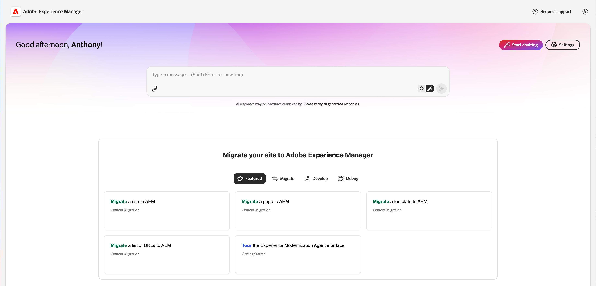
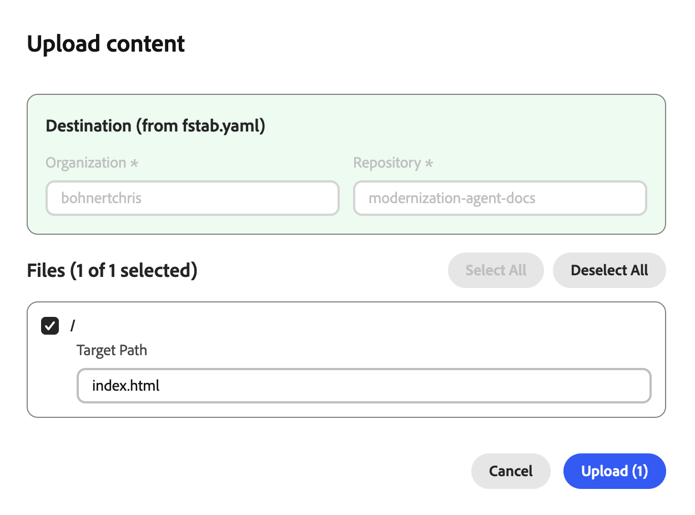

# Experience Modernization コンソール {#console-reference}

Experience Modernization Console のインターフェイスと機能のリファレンスガイド

>[!NOTE]
>
>Experience Modernization Console の使用に関心がある場合は、アクセスをリクエストして、スムーズなオンボーディングエクスペリエンスを確保できます。

## 概要 {#overview}

Experience Modernization Console は、Edge Delivery Services用に AI を利用してホストされる開発環境で、[`aemcoder.adobe.io` では web インターフェイスとして公開されています。](https://aemcoder.adobe.io) GitHub プロジェクトに接続すると、追加のセットアップやローカル環境の設定を行わずに、自然言語での変更を促すプロンプトをすぐに開始できます。

>[!TIP]
>
>コンソールをすぐに使い始める場合は、ドキュメント [Experience Modernization Agent 使用の手引き &#x200B;](/help/ai-in-aem/agents/brand-experience/modernization/getting-started.md) を参照してください。

## 機能 {#capabilities}

コンソールのコア機能：

* エージェントとそのスキルを使用したインタラクティブチャットパネル
* 変更内容をすぐに視覚的にフィードバックできるライブAEMプレビュー
* コンテンツファイルブラウザーと Markdown ビューア
* [&#x200B; ドキュメントオーサリング &#x200B;](https://da.live) を使用したコンテンツ同期
* 行われた変更を確認するためのコードブラウザーと差分ビューア
* 変更からプルリクエストを作成できる GitHub 統合

開発者は、船を完全に制御し続ける。 コンソールを通じて行われるすべての変更は、デプロイメント前に確認と承認が必要で、ガバナンス、ブランドの一貫性、セキュリティを確保します。

## ナビゲーション {#navigation}

[`aemcoder.adobe.io` でコンソールにログインすると &#x200B;](https://aemcoder.adobe.io) コンソールのホーム画面に到達します。

### メニューバー {#menu-bar}

上部のメニューバーには、次の機能があります。

* 左側のサイドパネルの詳細を展開したり折りたたんだりするための **開くメニュー** ボタン
* ダークモードに切り替えてコンソールからサインアウトするための右側の **アカウント** ボタン

### 左サイドバー {#sidebar}

左側のサイドバーを使用すると、コンソールの重要なビューにすばやくアクセスできます。

* **[ホームビュー](#home-view)** （家のアイコン） – コンソールを使用するための開始点
* **[コンテンツ表示](#content-view)** （ファイルアイコン） – インポートしたコンテンツ
* **[コードビュー](#code-view)** （`</>` アイコン） – 作業中のサイトのコード
* **[設定表示](#settings-view)** （歯車アイコン） – コンソールの設定

## ホームビュー {#home-view}

**ホーム** ビューは、コンソールを使用するための開始点になります。

* 上部には、コンソールのリクエストを行うための [&#x200B; プロンプト入力 &#x200B;](#prompt-input) があります。
* プロンプトパネルの下には、プロジェクトを開始するためのプロンプトが推奨されています。

### プロンプト入力 {#prompt-input}

プロンプト入力は、AI とやり取りするためのコントロールを提供します。

* **計画/実行モード** （電球アイコンと自動選択アイコン）：計画モードと実行モードをそれぞれ切り替えます
   * **プランモード**:AI がリクエストを分析し、変更を加えることなくアプローチの概要を説明します。これは、コミット前に戦略を理解するのに役立ちます。
   * **実行モード**:AI が計画を実行し、実際のファイルを変更します。
* **ファイルを添付** （ペーパークリップアイコン）：追加のコンテキスト（リファレンスデザイン、スクリーンショット、仕様など）のプロンプトにファイルをアップロードして添付します。

## コンテンツ表示 {#content-view}

**コンテンツ表示** には、コンテンツを参照およびプレビューするためのツールが用意されています。 デフォルトでは、ビューは左から右の 3 つのパネルに分割されています。

* コンソールとプロジェクトを操作するためのプロンプトパネル
* コンテンツファイルの概要のファイルブラウザー（このパネルを山形アイコンで表示するように切り替えます）
* ファイルブラウザーで選択されたコンテンツを視覚化するプレビューパネル

### チャットパネル {#chat-panel}

チャットパネルを使用すると、エクスペリエンス最新化エージェントとの会話を表示して続行できます。 チャットパネルには、チャットメッセージ履歴と、コンソールの追加リクエストを行うための [&#x200B; プロンプト入力 &#x200B;](#prompt-input) が含まれています。

* **チャット アクション**
   * **チャットをクリア**：これにより会話がリセットされ、AI のコンテキストウィンドウがクリアされます。 前の会話に関係なく新しいタスクを開始する場合は、このオプションを使用します。
   * **チャットをダウンロード**：会話履歴を Markdown ファイルとしてダウンロードします。

### プレビューパネル {#preview-panel}

プレビューパネルには、最大 4 つのモードが用意されています。

* **プレビュー** （ドキュメントと虫眼鏡アイコン）を選択して、レンダリングされたHTML コンテンツを表示します
   * **レスポンシブビュー**：レンダリングしたHTML コンテンツをデスクトップ、タブレットまたはモバイル表示で表示します
   * **デザインモード** （絵筆アイコン）：追加のコンテキストを求めるプロンプトにページの要素を追加します
* **ドキュメント表示** （ドキュメントアイコン）に、基になるドキュメントオーサリングのコンテンツ構造をそれぞれ表示します
* **マークダウンビュー（AEM オーサリング）** （コードアイコン）基になるマークダウンコンテンツ構造を表示します
* **JCR XML ビュー（AEM オーサリング）** （データアイコン）：結果の JCR XML コンテンツ構造を表示します

**プレビューを更新** アイコンをクリックすると、いつでもプレビューパネルを更新できます。

**削除** ボタンは、選択したページをワークスペースから削除します。 プレビューまたは公開済みのコンテンツは削除されません。

「**エラー**」ボタン（AEM オーサリング）をクリックすると、選択したページのエラーを表示するモーダルウィンドウが開きます。

**コンテンツをアップロード** ボタンをクリックすると、AEMにファイルをアップロードするためのモーダルウィンドウが開きます。

* プロジェクトに **ファイルがある場合、「** 組織 **および** リポジトリ `fstab.yaml` フィールドは事前入力されます
* ファイル選択で編集可能なターゲットパスを提供
* JCR （ユニバーサルエディター用）へのアップロードはサポートされていません

## コードビュー {#code-view}

**コードビュー** には、コードを参照したりコードの変更を管理したりするためのツールが用意されています。 ビューは、左から右の 3 つのパネルに分割されます。

* コンソールとプロジェクトを操作するためのチャットパネル
* ファイルブラウザー：コードファイルまたは変更内容の概要
* ファイルブラウザーで選択したコードファイルまたは変更を表示するためのプレビューパネル

プレビューパネルには、次の 2 つの異なるモードがあります。

* **Workspace ファイル**：現在のワークスペースでコード ファイルを参照します
   * **チャットに追加** ボタンを使用して、ファイルをコンテキストのチャットパネルに追加します。
* プロジェクトの作業で作成されたファイル変更の差分を表示する **Git Changes**
   * `+` アイコンをクリックして、変更したファイルをステージングします
   * 変更したファイルを破棄するには、矢印アイコンをクリック

**情報** アイコンには、現在接続されている GitHub アカウントとプロジェクトが一覧表示されます。

**GitHub アクション** メニュー（右上）は、リポジトリ操作を提供します。

* **接続/再接続**:GitHub OAuth を開始します
* **リポジトリを切り替え**：ワークスペースを別のリポジトリに置き換えます。 コミットされていない作業はすべて失われます。
* **ブランチを切り替え**：同じリポジトリ内のブランチを切り替えます
* **同期**：リモートオリジンから最新の変更を取り込みます
* **プッシュ**：ワークスペースの変更を GitHub にプッシュするモーダルを開きます
* **ログアウト**:GitHub から切断します

変更をプッシュする場合は、まずステージングされた変更をプッシュに含める必要があります。 プッシュする場合は、新しい PR を作成するか、現在のブランチに直接プッシュするかを選択できます

## 設定ビュー {#settings-view}

設定ビューでは、コンソールの基本設定を管理できます。

* **プロジェクト** ライブラリ URL のカスタマイズなど、プロジェクト設定を表示および編集できます。
* **サポート** AEM サポートチームにヘルプをリクエストできます。
* **資格情報** を使用すると、Figma の個人用アクセストークンを指定できます。これにより、[&#x200B; コンソールからプロジェクトのデザインブロックにアクセスできます。](/help/ai-in-aem/agents/brand-experience/modernization/prompting-guide.md#figma-block-migration)
   * トークンには次の読み取り専用スコープが必要です：
      * `file_content:read`
      * `file_metadata:read`
      * `library_assets:read`
      * `library_content:read`
      * `team_library_content:read`
      * `file_dev_resources:read`
      * `projects:read`
   * [&#x200B; 個人アクセストークンの設定について詳しくは、Figma のドキュメントを参照してください &#x200B;](https://help.figma.com/hc/en-us/articles/8085703771159-Manage-personal-access-tokens)。
* **ワークスペースをリセット** すると、コンソールが開始状態に戻り、プッシュまたはアップロード解除された変更がすべて失われます。
