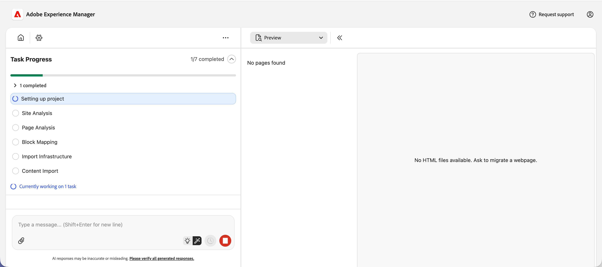

# Experience Modernization Agent for AEM オーサリングプロジェクトの基本を学ぶ {#getting-started-aem-authoring}

ユニバーサルエディターを使用したAEM オーサリングプロジェクトの場合、Experience Modernization Agent の準備は、標準のEdge Delivery フローとは異なります。 このドキュメントでは、これらのセットアップの違いについて説明します。 以下の手順を実行したら、メインの [Experience Modernization Agent の使用の手引き &#x200B;](getting-started.md) に従います。

## Edge Delivery Services プロジェクトリポジトリの作成 {#create-repo}

1. [`aem-block-collection-xwalk`](https://github.com/adobe-rnd/aem-block-collection-xwalk) リポジトリを（標準のEdge Delivery Services ボイラープレートではなく）テンプレートとして使用します。
1. [&#x200B; ユニバーサルエディターのチュートリアル &#x200B;](https://www.aem.live/developer/ue-tutorial) に従って、リポジトリを設定します。
   * AEMでサイトの作成を求められたら、停止します。
1. `paths.json` を削除し、この変更を `main` にコミットします。
1. [AEM コードコネクタ &#x200B;](https://github.com/apps/aem-code-connector/installations/select_target) アプリをリポジトリに追加します。
   * これにより、コンソールでコードを検査できます。

## AEMで新しいサイトを作成します {#create-site}

1. AEM Sites コンソールで、**作成**/**テンプレートからのサイト** を選択します。
1. **Edge Delivery Services テンプレートを使用したAEM サイト** を選択します。
   * リストに表示されない場合は、 [&#x200B; テンプレートをインストールします &#x200B;](https://github.com/adobe-rnd/aem-boilerplate-xwalk/releases)。
1. サイトの **名前** （タイトルではなく）を指定されたとおりに保持します。
   * サイト名は一意の ID として使用されます。
   * タイトルを変更して表示することもできます。
1. 「**作成**」をクリックします。
   * Sites ページにリダイレクトされます。
   * 新しいサイトがすぐに表示されない場合は、ページを更新します。
1. [&#x200B; リポジトリの設定 &#x200B;](#create-repo) 時にまだ行っていない場合は、AEM ホスト、Git オーナー、Git リポジトリを指すよ `fstab.yaml` に更新し、それらの変更を `main` にコミットします。
   * 手順については、[&#x200B; コンテンツソースの設定 &#x200B;](/help/implementing/cloud-manager/edge-delivery/configure-content-source.md) を参照してください。

## 標準の「はじめに」の手順を続行します {#continue}

上記の手順が完了したら、標準の「はじめる前に」ガイドに進んで、コンテンツの移行を開始できます。

標準ガイドの次の手順に従います。

1. [Edge Delivery GitHub リポジトリの準備](/help/ai-in-aem/agents/brand-experience/modernization/getting-started.md#prepare-repo)
1. [Experience Modernization Console を開く](/help/ai-in-aem/agents/brand-experience/modernization/getting-started.md#open-console)
1. [GitHub リポジトリへの接続](/help/ai-in-aem/agents/brand-experience/modernization/getting-started.md#connect-repo)
1. [プロンプトの開始](/help/ai-in-aem/agents/brand-experience/modernization/getting-started.md#start-prompting)

これらの手順を完了してコンテンツを移行したら、次の手順に進みます。

## コンテンツを検証 {#validate-content}

プレビューパネルで選択したページのコンテンツを検証します。 エラーが発生した場合は、「**エラー**」ボタンをクリックすると表示されます。
エラーを修正するには、エージェントとのチャット会話を続けます。 **チャットに追加** 機能を使用して、ページ、パーサーファイル、またはトランスフォーマファイルの特定の要素に対する修正をターゲットにします。

## コンテンツのアップロード {#upload-content}

コンテンツをAEMにアップロードするには：

1. **コンテンツ** ビューにいることを確認し、右上の **コンテンツをアップロード** ボタンをクリックします。
1. **コンテンツパッケージを作成** ダイアログで、パッケージに含めるページを選択します。
   * オプションで **パッケージ名** を入力します（空のままにした場合はデフォルトでサイト名になります）。
   * リストを管理するには、「**すべてを選択**」、「**選択をクリア**」、「**すべてを展開**」または「**すべてを折りたたむ**」を使用します。
1. **パッケージを作成** をクリックします。

   

1. パッケージが作成されると、**コンテンツパッケージをアップロード** ダイアログにパッケージの準備が整ったことが表示されます。
   1. **パッケージをダウンロード** してローカルに保存するか、アップロードに進むことができます。
   1. **AEMにアップロード** で、**AEM サイト**&#x200B;**AEM ホスト** （プロジェクト設定から事前入力）を確認します。
      * 必要に応じて、画像を含める場合は **画像をアップロード** をオンのままにします。
   1. **AEMにアップロード** をクリックします。

   

1. ダイアログでは、ページやアセットがAEMに送信されると、アップロードの進行状況が表示されます。 アップロードが完了すると、成功メッセージとアップロードログが表示されます。 **閉じる** をクリックしてダイアログを閉じます。

   

読み込まれたコンテンツは、現在AEMにあります。 メインの入門ガイドの [&#x200B; プッシュコードの変更 &#x200B;](getting-started.md#push-code-changes) を続行します。

## その他のリソース {#additional-resources}

* [Experience Modernization Agent の概要 &#x200B;](getting-started.md) - コンソール、プロンプト、アップロード、プレビューを含む完全なワークフロー
* [Experience Modernization Console](console.md) - コンソールリファレンス
* [&#x200B; ユニバーサルエディターチュートリアル &#x200B;](https://www.aem.live/developer/ue-tutorial) - AEM オーサリングとユニバーサルエディタープロジェクトの設定
* [`aem-block-collection-xwalk`](https://github.com/adobe-rnd/aem-block-collection-xwalk) - AEM オーサリングおよびユニバーサルエディタープロジェクト用のテンプレートリポジトリ
