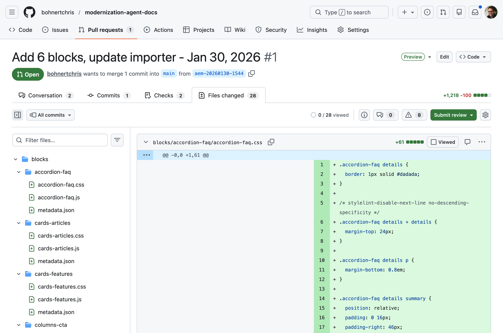

# Experience Modernization Agentの概要 {#getting-started}

Experience Modernization AgentとExperience Modernization Consoleの使用を開始するための最初の手順について説明します。

>[!NOTE]
>
>Experience Modernization Consoleの使用に関心がある場合は、アカウントマネージャーを通じてアクセスをリクエストし、スムーズなオンボーディングエクスペリエンスを実現できます。

## Edge Delivery GitHub リポジトリの準備 {#prepare-repo}

>[!NOTE]
>
>AEM Sitesとユニバーサルエディターを使用する場合 [AEM Sites/ユニバーサルエディターの基本を学ぶ](/help/ai-in-aem/agents/brand-experience/modernization/getting-started-aem-authoring.md)の設定手順に従います。

1. Experience Modernization Consoleで使用する[Edge Delivery Services](/help/edge/overview.md) リポジトリを選択します。
   * これは、既存のEdge Delivery Services プロジェクトにすることも、[開発者チュートリアル ](https://www.aem.live/developer/tutorial)に従って、[ ボイラープレートリポジトリを使用して新しいプロジェクトを作成することもできます。](https://github.com/adobe/aem-boilerplate)
1. [AEM Code Connector](https://github.com/apps/aem-code-connector)がリポジトリにインストールされていることを確認します。
   * これにより、コンソールでコードを検査できます。
1. [AEM Code Sync GitHub アプリ ](https://github.com/apps/aem-code-sync)がリポジトリにインストールされていることを確認します。
   * これにより、Edge Delivery Servicesでコードを同期できるようになります。
   * リポジトリがチュートリアルに基づいている場合、この手順はすでに完了しています。

## Experience Modernization Consoleを開きます {#open-console}

1. [`aemcoder.adobe.io`.](https://aemcoder.adobe.io)に移動します
1. Adobe IDでログインします。

## GitHub リポジトリへの接続 {#connect-repo}

コンソールでは、初めてログインしたときにリポジトリの入力を求めるメッセージが表示されます。

1. 「**リポジトリを接続**」をクリックします。
1. これにより、新しいブラウザータブでAEM Code Connector アプリが開きます。 「**AEM Code Connectorの認証**」をクリックします。
1. コンソールに戻り、サイトのプレビューURLを指定します。 プレビューURLは、サイト内の任意のドキュメントをプレビューするか、ブランチ、サイト名、組織から作成することで取得できます。 システムは関連するGithub プロジェクトを自動的に取得します。場合によっては、github座標を提供するように求められることもあります。
   
1. **既存のワークスペースを置換**&#x200B;するように求められた場合は、**ワークスペースを置換**をクリックします。
   

これでGitHub プロジェクトがコンソールに接続され、ホーム画面に表示されます。

## プロンプトを開始 {#start-prompting}

コンソールでコードにアクセスできるようになったので、プロンプトを開始する準備が整いました。

1. サイトのコンテンツを読み込むことができます。
   * 「ページ `https://wknd-trendsetters.site`を移行します。」
1. これにより、サイトのコンテンツがインポートされます。
   * コンソールは、関心の分離を監視し、コンテンツとプレゼンテーションを個別に処理します。
   * サイトのコンテンツを最初に読み込むのに、数分かかることがあります。
   * コンソールは、作業を開始する際に、計画された手順の概要を含む継続的なフィードバックを表示します。
     
1. サイトが読み込まれると、**Workspace** パネルにページが表示されます。 ページを選択して、右側のパネルでプレビューします。
   
1. コンテンツが用意できたので、同じソースからスタイルを読み込むようにプロンプトを表示できます。
   * 「一般スタイルを`https://wknd-trendsetters.site`から読み込む」
1. 最初のコンテンツの読み込みと同様に、読み込みには数分かかる場合があり、コンソールはリクエストを処理し、スタイルを読み込むときにフィードバックを提供します。 タスクが完了したら、右側のパネルで「**プレビューを更新**」をクリックして、スタイル設定されたコンテンツを表示します。
   

これで、コンテンツとスタイルの両方がコンソールに読み込まれました。

>[!TIP]
>
>[担当者にプロンプトを入力する方法とそのスキルに関する詳細なアイデアについては、プロンプト ガイド ](/help/ai-in-aem/agents/brand-experience/modernization/prompting-guide.md)を参照してください。

## コンテンツのアップロード {#upload-content}

>[!TIP]
>
>AEM Sitesとユニバーサルエディターのプロジェクトを使用している場合、AEMへのコンテンツのアップロードの動作は若干異なります。 具体的なアップロード手順については、[AEM Sites/ユニバーサルエディタープロジェクト向けExperience Modernization Agentの概要](/help/ai-in-aem/agents/brand-experience/modernization/getting-started-aem-authoring.md#upload-content)を参照してください。

コンテンツを[Document Authoring](https://da.live)にアップロードするには：

1. **コンテンツ** ビューであることを確認し、右上の「**コンテンツをアップロード**」ボタンをクリックします。
   * デフォルトでは、コンソールに入ると&#x200B;**コンテンツ**&#x200B;表示になります。
   * ビューは、コンソールの左側に沿ったサイドバーに強調表示されたアイコンで示されます。
1. **コンテンツをアップロード** ダイアログが開き、宛先の組織とリポジトリが`fstab.yaml`から事前入力されています。
   * 接続されているリポジトリに`fstab.yaml`が存在しない場合は、**組織**&#x200B;と&#x200B;**リポジトリ**&#x200B;を手動で入力する必要があります。
   * ボイラープレートを使用した場合は、`fstab.yaml`が提供されます。
1. アップロードするファイルを選択し、**アップロード**をクリックします。
   
1. コンソールには、「**アップロード**」ボタンがグレー表示され、アップロードプロセスが示されます。
   
1. 完了すると、コンソールの下部に通知が表示されます。
   

Document Authoringでアップロードされたコンテンツにアクセスするには、アップロード完了時に通知の&#x200B;**AEMで表示**&#x200B;をクリックするか、`https://da.live/#/{organization}/{repository}`に移動します。

読み込んだコンテンツがドキュメントのオーサリングに追加されました。

## プッシュコードの変更 {#push-code-changes}

コードに加えた変更に満足したら、GitHub リポジトリにプッシュできます。

1. **コード** ビュー（`</>` アイコン、左側のサイドバー）に切り替え、次に&#x200B;**Git Changes** タブ（右上のブランチアイコン）に切り替えます。
   
1. 変更されたファイルのリストで、一部のファイルがトラッキングされていない状態で表示される場合は、`+` ボタンをクリックしてステージングします。
1. 右上の「**GitHub actions**」ボタンをクリックし、ドロップダウンから「**プッシュ**」を選択します。
1. **変更をプッシュ** ダイアログで、変更を新しいPR （デフォルト）または現在のブランチにプッシュすることを選択し、**確認**&#x200B;をクリックしてプッシュします。
   * 少しでも疑問を感じたら、現在のブランチにプッシュして、問題をスムーズに進めることができます。
1. 完了すると、コンソールの下部に通知が表示されます。
   を表示

GitHubのプッシュされた変更に直接アクセスする場合は、プッシュが完了したら、通知の「**PR**&#x200B;を表示」をクリックします。

GitHub コード

コードはGitHubにあります。

## サイトをプレビュー {#preview-site}

プレビュー環境で変更を表示するには：

1. ドキュメント作成に戻ります。
   * コンテンツをアップロードした後、**AEMで表示**&#x200B;をクリックした後に開いたブラウザータブで、まだ開いている可能性があります。
   * または`https://da.live/#/{organization}/{repository}`に移動します
1. 以前にAEMにアップロードしたページの1つを開きます。
1. 紙面アイコン（右上）をクリックし、**プレビュー**を選択します。
   

おめでとうございます。移行したコンテンツとスタイルは、AEM プレビュー環境で公開されます。

コードを`main`以外のブランチにプッシュした場合、Document Authoringから開いたプレビューにはスタイルが表示されません。 プレビューのURLを更新してブランチに変更すると、スタイルを確認できます。

## トラブルシューティング {#troubleshooting}

### ・IP アドレスの許可リストに加える {#allowlist-ip-addresses}

サイトがファイアウォールやアクセス制限の内側にある場合は、バックエンドサービスがサイトをスクレイピングできるように、次のIP アドレスを許可リストに加えるできます。

* `34.228.136.112`
* `54.90.51.39`
* `3.224.194.242`

## その他のリソース {#additional-resources}

Experience Modernization Agentとそのコンソールを引き続き検索する場合は、次のドキュメントが役立つ可能性があります。

* [Experience Modernization Console](/help/ai-in-aem/agents/brand-experience/modernization/console.md) - コンソールの詳細、ビュー、オプション、機能
* [Experience Modernization Agentのプロンプトガイド ](/help/ai-in-aem/agents/brand-experience/modernization/prompting-guide.md) - エージェントをプロンプトする方法とそのスキルの活用方法に関するアイデア
* [Edge Delivery Services開発者向けチュートリアル ](https://www.aem.live/developer/tutorial) - AEMおよびEdge Delivery Services プロジェクトを初めて使用する場合に役立ちます
* [ ドキュメント オーサリング ](https://da.live) - コンテンツ管理のドキュメント オーサリングを初めて使用する場合に役立ちます
