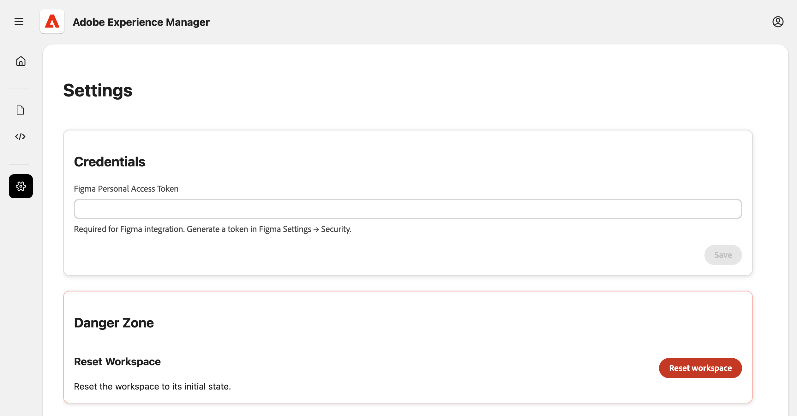

# Experience Modernization コンソール {#console-reference}

Experience Modernization Console のインターフェイスと機能のリファレンスガイド

>[!NOTE]
>
>Experience Modernization Console の使用に関心がある場合は、アクセスをリクエストして、スムーズなオンボーディングエクスペリエンスを確保できます。

## 概要 {#overview}

Experience Modernization Console は、Edge Delivery Services用に AI を利用してホストされる開発環境で、[`aemcoder.adobe.io` では web インターフェイスとして公開されています。](https://aemcoder.adobe.io) GitHub プロジェクトに接続すると、追加のセットアップやローカル環境の設定を行わずに、自然言語での変更を促すプロンプトをすぐに開始できます。

>[!TIP]
>
>コンソールをすぐに使い始める場合は、ドキュメント [Experience Modernization Agent 使用の手引き &#x200B;](/help/ai-in-aem/agents/modernization/getting-started.md) を参照してください。

## 機能 {#capabilities}

コンソールのコア機能：

* エージェントとそのスキルを使用したインタラクティブチャットパネル
* 変更内容をすぐに視覚的にフィードバックできるライブAEMプレビュー
* コンテンツファイルブラウザーと Markdown ビューア
* [&#x200B; ドキュメントオーサリング &#x200B;](https://da.live) を使用したコンテンツ同期
* 行われた変更を確認するためのコードブラウザーと差分ビューア
* 変更からプルリクエストを作成できる GitHub 統合

開発者は、船を完全に制御し続ける。 コンソールを通じて行われるすべての変更は、デプロイメント前に確認と承認が必要で、ガバナンス、ブランドの一貫性、セキュリティを確保します。

## ナビゲーション {#navigation}

[`aemcoder.adobe.io` でコンソールにログインすると &#x200B;](https://aemcoder.adobe.io) コンソールのホーム画面に到達します。

### メニューバー {#menu-bar}

上部のメニューバーには、次の機能があります。

* 左側のサイドパネルの詳細を展開したり折りたたんだりするための **開くメニュー** ボタン
* ダークモードに切り替えてコンソールからサインアウトするための右側の **アカウント** ボタン

### 左サイドバー {#sidebar}

左側のサイドバーを使用すると、コンソールの重要なビューにすばやくアクセスできます。

* **[ホームビュー](#home-view)** （家のアイコン） – コンソールを使用するための開始点
* **[コンテンツ表示](#content-view)** （ファイルアイコン） – インポートしたコンテンツ
* **[コードビュー](#code-view)** （`</>` アイコン） – 作業中のサイトのコード
* **[設定表示](#settings-view)** （歯車アイコン） – コンソールの設定

## ホームビュー {#home-view}

**ホーム** ビューは、コンソールを使用するための開始点になります。

* 上部には、コンソールのリクエストを行うための [&#x200B; プロンプトパネル &#x200B;](#prompt-panel) があります。
* プロンプトパネルの下には、プロジェクトを開始するために使用するプロンプトが推奨されています。

### プロンプトパネル {#prompt-panel}

プロンプトパネルには、AI とやり取りするためのコントロールが用意されています。

* **計画/実行モード** （電球アイコンと自動選択アイコン）：計画モードと実行モードをそれぞれ切り替えます
   * **プランモード**:AI がリクエストを分析し、変更を加えることなくアプローチの概要を説明します。これは、コミット前に戦略を理解するのに役立ちます。
   * **実行モード**:AI が計画を実行し、実際のファイルを変更します。
* **ファイルを添付** （ペーパークリップアイコン）：追加のコンテキスト（リファレンスデザイン、スクリーンショット、仕様など）のプロンプトにファイルをアップロードして添付します。
* **設定** （歯車アイコン）:AI からの確認質問をスキップする場合に選択します
* **チャットをクリア**：これにより会話がリセットされ、AI のコンテキストウィンドウがクリアされます。 前の会話に関係なく新しいタスクを開始する場合は、このオプションを使用します。

## コンテンツ表示 {#content-view}

**コンテンツ表示** には、コンテンツを参照およびプレビューするためのツールが用意されています。 デフォルトでは、ビューは左から右の 3 つのパネルに分割されています。

* コンソールとプロジェクトを操作するためのプロンプトパネル
* コンテンツファイルの概要のファイルブラウザー（このパネルを山形アイコンで表示するように切り替えます）
* ファイルブラウザーで選択されたコンテンツを視覚化するプレビューパネル

プレビューパネルには、次の 3 つのモードがあります。

* **プレビュー** （ドキュメントと虫眼鏡アイコン）を選択して、レンダリングされたHTML コンテンツを表示します
* **HTML表示** （ドキュメントアイコン）：基になるドキュメントオーサリングコンテンツ構造をそれぞれ表示します
* **デザインモード** （絵筆アイコン）：プロンプトのコンテキストとなるページの要素を選択します

**プレビューを更新** アイコンをクリックすると、いつでもプレビューパネルを更新できます。

**コンテンツをアップロード** ボタンをクリックすると、AEM ドキュメントオーサリングにファイルをアップロードするためのモーダルウィンドウが開きます。

* プロジェクトに **ファイルがある場合、「** 組織 **および** リポジトリ `fstab.yaml` フィールドは事前入力されます
* ファイル選択で編集可能なターゲットパスを提供
* JCR （ユニバーサルエディター用）へのアップロードはサポートされていません

## コードビュー {#code-view}

**コードビュー** には、コードを参照したりコードの変更を管理したりするためのツールが用意されています。 ビューは、左から右の 3 つのパネルに分割されます。

* コンソールとプロジェクトを操作するためのプロンプトパネル
* ファイルブラウザー：コードファイルまたは変更内容の概要
* ファイル一覧で選択したコードファイルまたは差分を表示するためのプレビューパネル

プレビューパネルには、次の 2 つの異なるモードがあります。

* **Workspace ファイル**：現在のワークスペースのコードファイルを参照します
* プロジェクトの作業で作成されたファイル変更の差分を表示する **Git Changes**
   * `+` アイコンをクリックして、変更したファイルをステージングします
   * 変更したファイルを破棄するには、矢印アイコンをクリック

**情報** アイコンには、現在接続されている GitHub アカウントとプロジェクトが一覧表示されます。

**GitHub アクション** メニュー（右上）は、リポジトリ操作を提供します。

* **接続/再接続**:GitHub OAuth を開始します
* **リポジトリを切り替え**：ワークスペースを別のリポジトリに置き換えます。 コミットされていない作業はすべて失われます。
* **ブランチを切り替え**：同じリポジトリ内のブランチを切り替えます
* **同期**：リモートオリジンから最新の変更を取り込みます
* **プッシュ**：ワークスペースの変更を GitHub にプッシュするモーダルを開きます
* **ログアウト**:GitHub から切断します

変更をプッシュする場合は、まずステージングされた変更をプッシュに含める必要があります。 プッシュする場合は、新しい PR を作成するか、現在のブランチに直接プッシュするかを選択できます

## 設定ビュー {#settings-view}

設定ビューでは、コンソールの基本設定を管理できます。

* **資格情報** を使用すると、Figma の個人用アクセストークンを指定でき、コンソールからプロジェクトのデザインブロックにアクセスできるようになります。
* **ワークスペースをリセット** すると、コンソールが開始状態に戻り、プッシュまたはアップロード解除された変更がすべて失われます。
