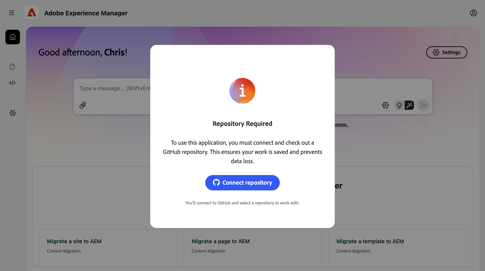
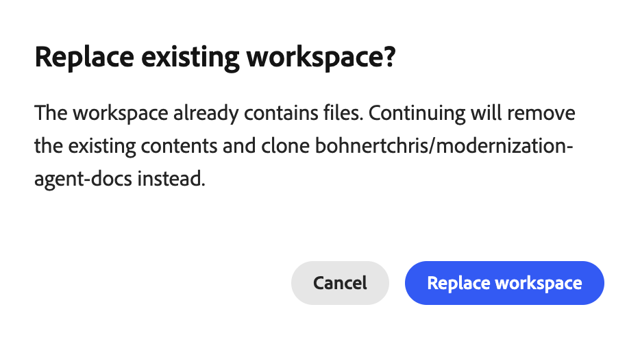
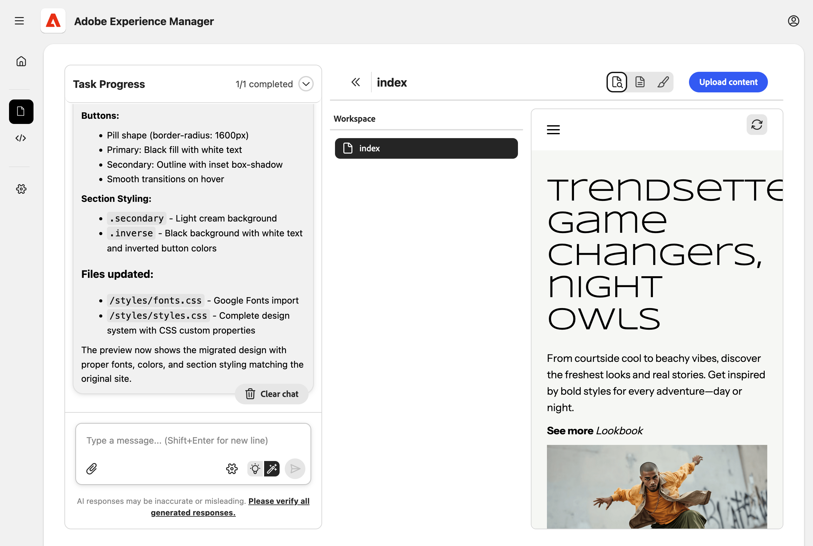
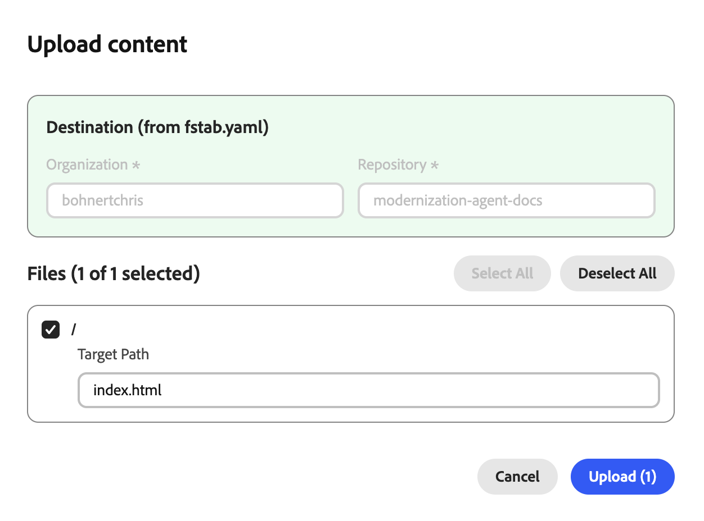
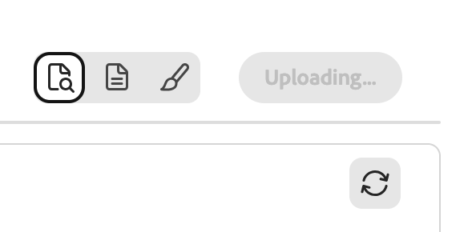
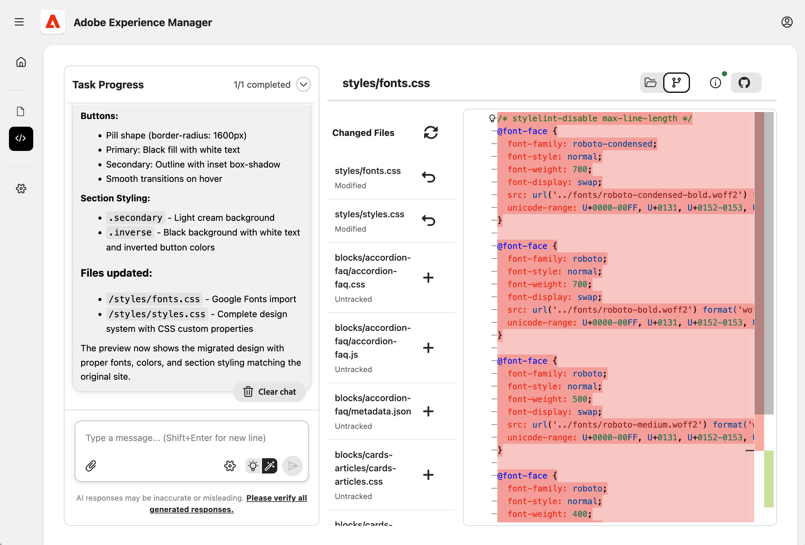
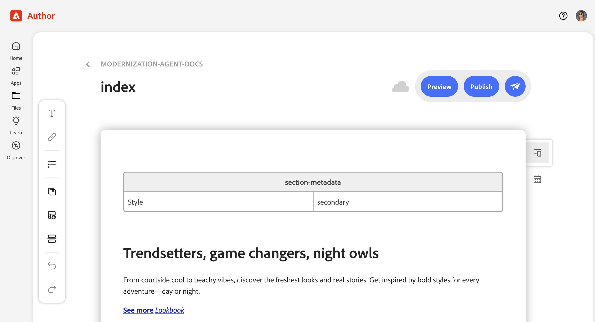

# Experience Modernization Agent の概要 {#getting-started}

Experience Modernization Console を使用して、Experience Modernization Agent ですばやく生産性を上げるための最初の手順について説明します。

>[!NOTE]
>
>Experience Modernization Console の使用に関心がある場合は、アクセスをリクエストして、スムーズなオンボーディングエクスペリエンスを確保できます。

## Edge Delivery GitHub リポジトリの準備 {#prepare-repo}

1. Experience Modernization Console で使用する [Edge Delivery Services](/help/edge/overview.md) リポジトリを選択します。
   * これは、既存のEdge Delivery Services プロジェクトでも、[boilerplate リポジトリを使用して &#x200B;](https://www.aem.live/developer/tutorial) 開発者向けチュートリアル [&#x200B; に従って新しいプロジェクトを作成 &#x200B;](https://github.com/adobe/aem-boilerplate) ることもできます。
1. [AEMY GitHub アプリ &#x200B;](https://github.com/apps/aem-aemy) がリポジトリにインストールされていることを確認します。
   * これにより、コンソールでコードを検査できます。
1. [AEM コード同期 GitHub アプリ &#x200B;](https://github.com/apps/aem-code-sync) がリポジトリにインストールされていることを確認します。
   * これにより、Edge Delivery Servicesでコードを同期できます。
   * リポジトリがチュートリアルに基づいている場合、この手順は既に完了しています。

## Experience Modernization Console を開く {#open-console}

1. [`aemcoder.adobe.io`.](https://aemcoder.adobe.io) に移動します。
1. Adobe IDでログインします。

## GitHub リポジトリへの接続 {#connect-repo}

最初にログインすると、コンソールでリポジトリの入力を求められます。

1. **リポジトリを接続** をクリックします。
1. これにより、新しいブラウザータブで AEMY アプリが開きます。 **AEM AEMY を認証** をクリックします。
1. コンソールに戻り、「**所有者**」、「**リポジトリ**」、「**ブランチ選択** を選択し、「**ワークスペースにチェックアウト**」をクリックします。
   
1. **既存のワークスペースを置換** するように求めるプロンプトが表示されたら、「**ワークスペースを置換**」をクリックします。
   

これで、GitHub プロジェクトがコンソールに接続され、ホーム画面が表示されます。

## プロンプトの開始 {#start-prompting}

コンソールからコードにアクセスできるようになったので、プロンプトを開始する準備が整いました。

1. 開始するには、サイトのコンテンツを読み込みます。
   * &quot;ページ `https://wknd-trendsetters.site` を移行します。&quot;
1. これにより、サイトのコンテンツが読み込まれます。
   * コンソールは、関心の分離を監視し、コンテンツとプレゼンテーションを個別に処理します。
   * サイトのコンテンツの最初の読み込みには数分かかる場合があります。
   * コンソールには、作業を開始する際に、予定されている手順の概要を含む継続的なフィードバックが表示されます。
     
1. サイトが読み込まれると、**Workspace** パネルにページが表示されます。 ページを選択すると、右側のパネルでプレビューできます。
   
1. これでコンテンツが用意できたので、同じソースからスタイルを読み込むかどうかを確認するプロンプトを表示できます。
   * 「`https://wknd-trendsetters.site` から一般的なスタイルをインポートします。」
1. 初期コンテンツの読み込み時と同様に、読み込みに数分かかる場合があります。リクエストが処理され、スタイルが読み込まれると、コンソールからフィードバックが表示されます。 タスクが完了したら、右側のパネルで **プレビューを更新** をクリックして、スタイル設定されたコンテンツを表示します。
   

これで、コンテンツとスタイルの両方がコンソールに読み込まれました。

## コンテンツのアップロード {#upload-content}

コンテンツを [&#x200B; ドキュメントオーサリング &#x200B;](https://da.live) にアップロードするには：

1. **コンテンツ** ビューにいることを確認し、右上の **コンテンツをアップロード** ボタンをクリックします。
   * デフォルトでは、コンソールに入ると **コンテンツ** 表示になります。
   * ビューは、コンソールの左側のサイドバーでハイライト表示されたアイコンで示されます。
1. **コンテンツをアップロード** ダイアログが開き、宛先組織とリポジトリが `fstab.yaml` から事前入力されます。
   * 接続したリポジトリに `fstab.yaml` が存在しない場合は、**組織** と **リポジトリ** を手動で入力する必要があります。
   * ボイラープレートを使用した場合は、`fstab.yaml` が表示されます。
1. アップロードするファイルを選択し、「**アップロード**」をクリックします。
   
1. コンソールの「**アップロード**」ボタンがグレー表示され、アップロードプロセスが示されます。
   
1. 完了すると、通知がコンソールの下部に表示されます。
   

ドキュメントオーサリングでアップロードされたコンテンツにアクセスするには、必要に応じて、アップロード完了時の通知で **AEMで表示** をクリックするか、`https://da.live/#/{organization}/{repository}` に移動します。

読み込まれたコンテンツは、ドキュメントのオーサリングに表示されます。

## コード変更のプッシュ {#push-code-changes}

コードに加えた変更に満足したら、それらを GitHub リポジトリにプッシュできます。

1. **コード** ビュー（左側のサイドバーの `</>` アイコン）に切り替えて、「**Git の変更**」タブ（右上のブランチアイコン）に切り替えます。
   
1. 変更されたファイルの一覧で、追跡対象外として表示されるファイルがある場合は、[`+`] ボタンをクリックしてファイルをステージングします。
1. 右上の「**GitHub アクション**」ボタンをクリックし、ドロップダウンから「**プッシュ**」を選択します。
1. **変更をプッシュ** ダイアログで、変更を新しい PR （デフォルト）または現在のブランチにプッシュすることを選択し、**確認** をクリックしてプッシュします。
   * 不明な場合は、現在のブランチにプッシュして、物事をシンプルに保つことができます。
1. 完了すると、通知がコンソールの下部に表示されます。
   

GitHub でプッシュされた変更に直接アクセスする場合は、プッシュが完了したら、通知の **PR を表示** をクリックします。

コードは GitHub に格納されています。

## サイトのプレビュー {#preview-site}

プレビュー環境で変更を表示するには：

1. ドキュメントオーサリングに戻ります。
   * コンテンツをアップロードした後に **AEMで表示** をクリックすると、開いたブラウザータブで引き続き開いている場合があります。
   * または `https://da.live/#/{organization}/{repository}` に移動します。
1. 以前にAEMにアップロードしたページの 1 つを開きます。
1. 紙面アイコン（右上）をクリックし、「**プレビュー**」を選択します。
   

おめでとうございます。移行したコンテンツとスタイルは、AEM プレビュー環境に移行されました。

コードを `main` 以外のブランチにプッシュした場合、ドキュメントオーサリングから開いたプレビューには、スタイルは表示されません。 プレビューの URL を更新してブランチに変更すると、スタイルを確認できます。

## その他のリソース {#additional-resources}

次のドキュメントは、Experience Modernization Agent とそのコンソールを引き続き参照する際に役立つ場合があります。

* [Experience Modernization Console](/help/ai-in-aem/agents/modernization/console.md) - コンソールの詳細、表示、オプションおよび機能
* [Edge Delivery Services開発者向けチュートリアル &#x200B;](https://www.aem.live/developer/tutorial) - AEMおよびEdge Delivery Services プロジェクトを初めて使用する場合に役立ちます
* [&#x200B; ドキュメントオーサリング &#x200B;](https://da.live) - コンテンツ管理用のドキュメントオーサリングを初めて使用する場合に役立ちます。
