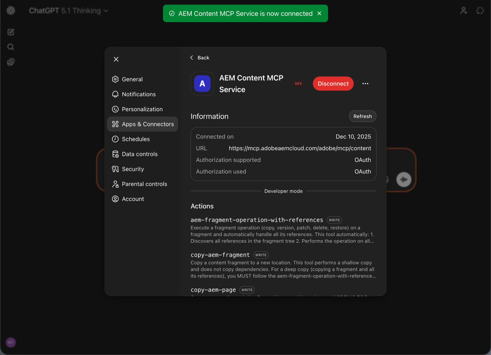

# AEM MCP を使用した OpenAI ChatGPT の設定 {#setup-chatgpt}

OpenAI ChatGPT をAEMの MCP サーバーに接続するには、次の手順に従います。

* MCP 接続またはツールが設定されている領域に、1 つ以上のAEM MCP サーバー URL を追加します。
* 接続をトリガーし、リダイレクトされたらAdobe IDでログインする。
* チャットでは、プロンプトで設定済みのAEM ツールを参照します。例：

  ```
  "Using the configured AEM MCP tools, list all sites in the author environment."
  ```





