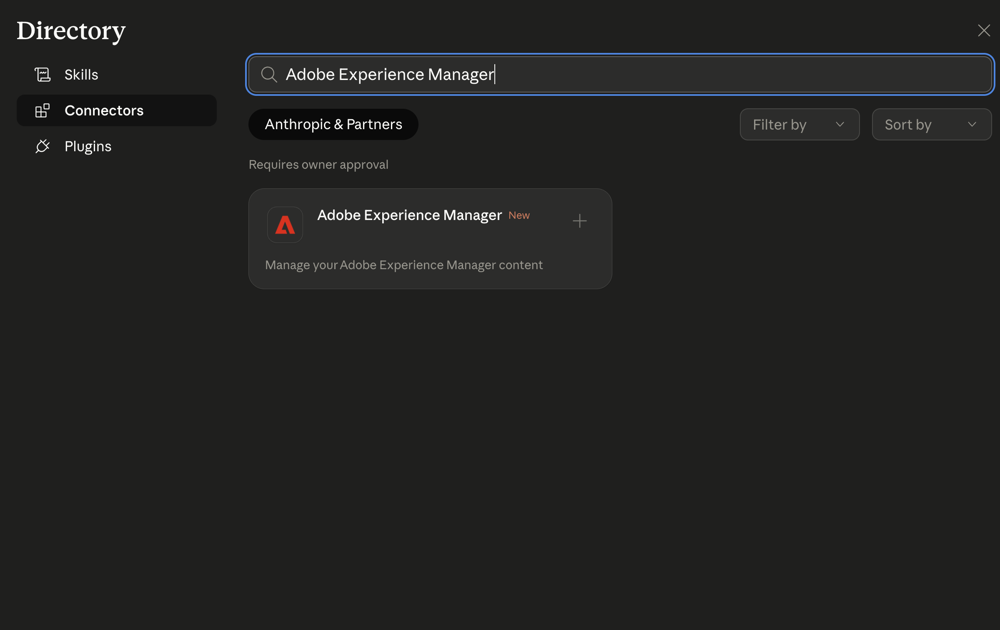

# AEM MCPでのAnthropic Claudeの設定 {#setup-claude}

Anthropic CloudをAEMのMCP サーバーに接続するには、次の手順に従います。

* ClaudeのMCP設定で、1つ以上のAEM MCP サーバーURLを登録します。
* Adobe ログインフローを実行します。
* オプションで、設定領域の特定のツールに対して自動確認を有効にします。 このオプションは、検索操作または読み取り専用操作に使用することをお勧めします。
* 会話を開始する前に、MCP サーバーが選択されていることを確認します。
* ClaudeにAEM関連のタスクを実行するように依頼します。 Claudeは、プロンプトに基づいて、MCP サーバーが公開するAEM ツールを選択します。

AEM MCP用にClaudeを設定するには、次の手順に従います。

>[!NOTE]
>
>Claude ユーザーインターフェイスは変更される可能性があり、決定的ではありません。 これらの手順は例示の目的で使用します。

1. Claude web アプリの左下隅にあるアカウントメニューを開き、**設定**&#x200B;を選択して設定領域を開きます。

   

1. 設定サイドバーで、**コネクタ**&#x200B;を選択します。 コネクタ ページで、**カスタムコネクタを追加**&#x200B;を選択して、カスタム MCP エンドポイントを登録します。

   カスタムコネクタを追加した設定の

1. **カスタムコネクタを追加** ダイアログで、表示名（**AEM Content MCP Service**&#x200B;など）とAEM MCP サーバーのURLを入力し、**Add**&#x200B;を選択します。 展開に追加オプションが必要な場合にのみ&#x200B;**詳細設定**&#x200B;を使用してください。

   

1. コネクタリストで、カスタムコネクタエントリ（**CUSTOM** ラベルが表示されています）を見つけ、**Connect**&#x200B;を選択してログインし、コネクタをClaude アカウントにリンクします。

   AEM Content MCP Service用にConnectが選択された

1. コネクタがURLを含むリストに表示されたら、**AEM Content MCP Service**&#x200B;の横にある&#x200B;**Configure**&#x200B;を選択して、コネクタの詳細を開き、セットアップを続行します。

   AEM Content MCP Service用にConfigureが選択された

1. **ツールの権限** ページで、デフォルト値（**Needs approval**&#x200B;など）を確認し、各AEM ツールを&#x200B;**Always allow**、**Ask for permission**、または&#x200B;**Never allow**&#x200B;にセキュリティポリシーに従って設定します。

   

1. 会話を開きます。 メッセージフィールドの左側にある「ツールとモデル」メニュー（スライダーアイコン）を選択し、「コネクタ」で「**AEM Content MCP Service**」を有効にし、プロンプトを入力して、ClaudeがそのチャットにMCP ツールを使用できるようにします。

   

## Adobe Experience Manager Claude Connector {#aem-claude-connector}

**Adobe Experience Manager Cloud Connector**&#x200B;をインストールするには、Claudeで&#x200B;**Settings** > **Connectors**&#x200B;を開きます。 また、[https://claude.ai/settings/connectors](https://claude.ai/settings/connectors)でコネクタ ページを直接開くこともできます。 コネクターは、AEM ワークフロー用のツールのセットを公開するMCP サーバーを登録します。

