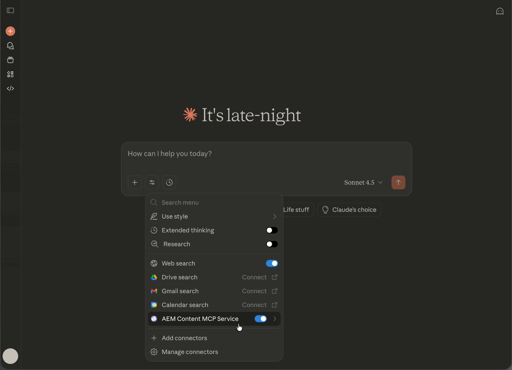

# AEM MCP を使用した人類間衝突の設定 {#setup-claude}

次の手順に従って、Anthropic Cloud をAEMの MCP サーバーに接続します。

* Claude の MCP 設定で、1 つ以上のAEM MCP サーバー URL を登録します。
* Adobeのログインフローを完了します。
* オプションで、設定領域で特定のツールの自動確認を有効にします。 検索または読み取り専用操作には、このオプションをお勧めします。
* 会話を開始する前に、MCP サーバーが選択されていることを確認します。
* AEM関連のタスクを実行するように Claude に依頼します。 Claude は、プロンプトに基づいて、MCP サーバーによって公開されるAEM ツールを選択します。

