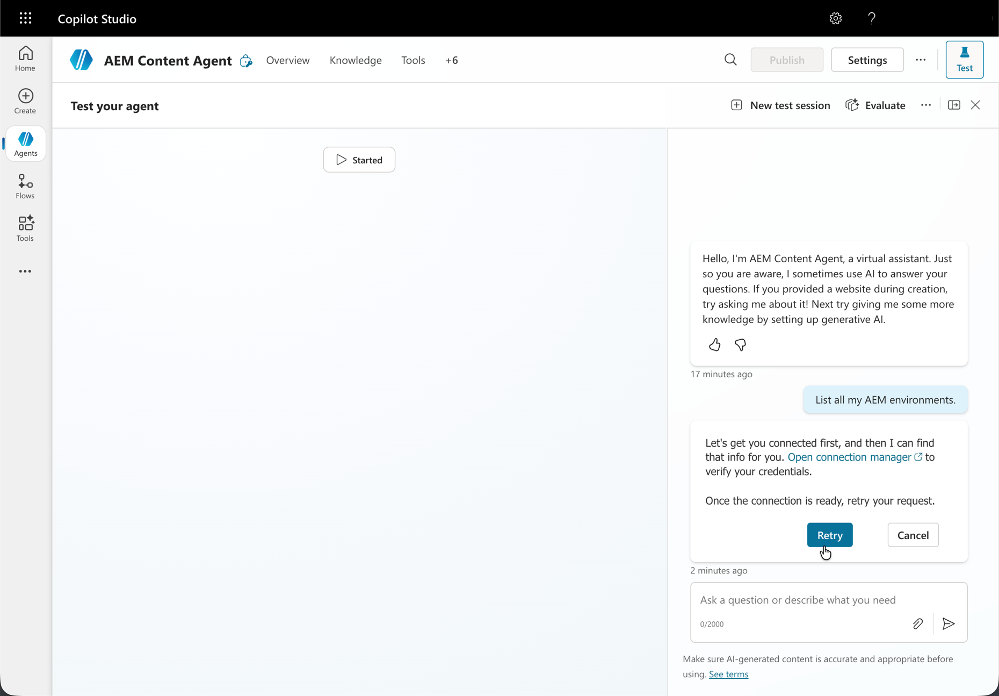

# AEM MCP を使用したMicrosoft Copilot Studio のセットアップ {#setup-microsoft-copilot-studio}

次の手順に従って、Microsoft Copilot Studio をAEMの MCP サーバーに接続します。

* エージェントを新規作成します。
* ツールセクションに移動して、「**ツールを追加**」をクリックします。
* 既存のツールを選択するか、新しいツールを作成します。
* 1 つ以上のAEM MCP サーバーの URL を指す新しい MCP ツールを設定します。
* 接続を確立します。この接続は、エージェント間で共有または専用にすることができます。
* リダイレクトされたら、Adobe IDを使用してログインします。
* 必要に応じて、自動確認モードを有効にするか、すべてのツールインタラクションについてエンドユーザーの確認を要求します。
* エージェントをテストするときは、接続マネージャーを開いてセッションに接続を割り当ててから、**再試行** キーを押します。

。

