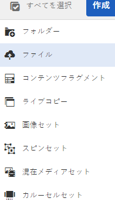
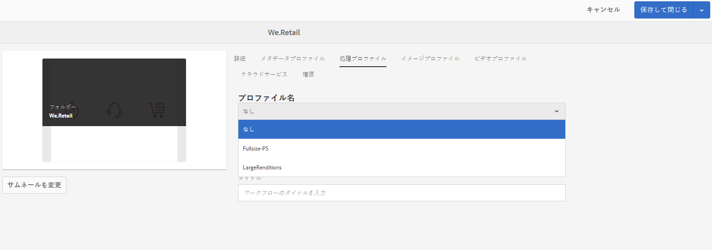

# Adobe Experience Manager へのデジタルアセットの追加 {#add-assets-to-experience-manager}

[!DNL Adobe Experience Manager] は、アップロードされたデジタルファイルのバイナリコンテンツを、リッチメタデータ、スマートタグ、レンディションおよびその他のデジタルアセット管理（DAM）サービスで強化します。You can upload various types of files, such as images, documents, and raw image files, from your local folder or a network drive to [!DNL Experience Manager Assets].

アップロード方法は多数用意されています。最も一般的に使用されるブラウザーのアップロードに加えて、Experience Managerリポジトリにアセットを追加する方法は他にもあります。例えば、AdobeアセットリンクやExperience Managerデスクトップアプリ、アップロードや取り込みスクリプト、Experience Manager拡張子として追加される自動取り込みの統合です。

ここでは、エンドユーザー向けのアップロード方法に焦点を当て、Adobe Experience Manager API および SDK を使用したアセットアップロードおよび取り込みの技術的側面について説明する記事へのリンクを示します。

Adobe Experience Manager では任意のバイナリファイルをアップロードおよび管理できますが、最もよく使用されるファイル形式については、メタデータ抽出やプレビュー／レンディション生成などの追加サービスもサポートされています。詳しくは、[サポートされているファイル形式](file-format-support.md)を参照してください。

アップロードしたアセットに対して追加の処理をおこなうように選択することもできます。アセットのアップロード先のフォルダーに様々なアセット処理プロファイルを設定して、特定のメタデータ、レンディションまたは画像処理サービスを追加することができます。詳しくは、この後の[追加処理](#additional-processing)を参照してください。

>[!NOTE]
>
>Adobe Experience Manager as a Cloud Service では、直接バイナリアップロードという新しいアセットアップロード方法を利用します。デフォルトでは、Experience Managerユーザーインターフェイス、Adobeアセットリンク、Experience Managerデスクトップアプリなど、初期設定の製品機能とクライアントによってサポートされ、エンドユーザーに対して透過的です。
>
>ユーザー側の技術チームでカスタマイズまたは拡張されるアップロードコードでは、新しいアップロード API およびプロトコルを使用する必要があります。

## アセットのアップロード {#upload-assets}

ファイル（または複数のファイル）をアップロードするには、デスクトップでファイルを選択し、ユーザーインターフェイス（Webブラウザー）上で出力先フォルダーにドラッグします。 または、ユーザーインターフェイスからアップロードを開始することもできます。

1. In the [!DNL Assets] user interface, navigate to the location where you want to add digital assets.
1. アセットをアップロードするには、以下のいずれかの操作をおこないます。

   * ツールバーの「**[!UICONTROL 作成]**」アイコンをタップします。次に、メニューで「**[!UICONTROL ファイル]**」をタップします。表示されたダイアログで、必要に応じてファイル名を変更できます。
   * In a browser that supports HTML5, drag the assets directly on the [!DNL Assets] user interface. ファイル名を変更するためのダイアログは表示されません。

   

   複数のファイルを選択するには、ファイル選択ダイアログで、Ctrl キーまたは Command キーを押しながらアセットを選択します。iPad を使用している場合、一度に選択できるファイルは 1 つだけです。

<!-- #ENGCHECK do we support pausing? I couldn't get pause to show with 1.5GB upload.... If not, this should be removed#

   You can pause the uploading of large assets (greater than 500 MB) and resume it later from the same page. Tap the **[!UICONTROL Pause]** icon beside progress bar that appears when an upload starts.

   

   The size above which an asset is considered a large asset is configurable. For example, you can configure the system to consider assets above 1000 MB (instead of 500 MB) as large assets. In this case, **[!UICONTROL Pause]** appears on the progress bar when assets of size greater than 1000 MB are uploaded.

   The Pause button does not show if a file greater than 1000 MB is uploaded with a file less than 1000 MB. However, if you cancel the less than 1000 MB file upload, the **[!UICONTROL Pause]** button appears.

   To modify the size limit, configure the `chunkUploadMinFileSize` property of the `fileupload`node in the CRX repository.

   When you click the **[!UICONTROL Pause]** icon, it toggles to a **[!UICONTROL Play]** icon. To resume uploading, click the **[!UICONTROL Play]** icon.

   
-->

1. 進行中のアップロードをキャンセルするには、進行状況バーの横にある閉じるボタン（「`X`」）をクリックします。When you cancel the upload operation, [!DNL Assets] deletes the partially uploaded portion of the asset.

   If you cancel the upload operation before the files are uploaded, [!DNL Assets] stops uploading the current file and refreshes the content. ただし、既にアップロードされているファイルは削除されません。

<!-- #ENGCHECK do we support pausing? I couldn't get pause to show with 1.5GB upload.... If not, this should be removed#
   The ability to resume uploading is especially helpful in low-bandwidth scenarios and network glitches, where it takes a long time to upload a large asset. You can pause the upload operation and continue later when the situation improves. When you resume, uploading starts from the point where you paused it.
-->

<!-- #ENGCHECK assuming this is not relevant? remove after confirming#
   During the upload operation, [!DNL Experience Manager] saves the portions of the asset being uploaded as chunks of data in the CRX repository. When the upload completes, [!DNL Experience Manager] consolidates these chunks into a single block of data in the repository.

   To configure the cleanup task for the unfinished chunk upload jobs, go to `https://[aem_server]:[port]/system/console/configMgr/org.apache.sling.servlets.post.impl.helper.ChunkCleanUpTask`.
-->

1. The upload progress dialog in [!DNL Assets] displays the count of successfully uploaded files and the files that failed to upload.

さらに、Assets ユーザーインターフェイスには、アップロードした最新のアセットまたは最初に作成したフォルダーが表示されます。

>[!NOTE]
>
>To upload nested folder hierarchies to AEM, see [bulk upload assets](#bulk-upload).

<!-- #ENGCHECK I'm assuming this is no longer relevant.... If yes, this should be removed#

### Serial uploads {#serialuploads}

Uploading numerous assets in bulk consumes significant I/O resources, which may adversely impact the performance of [!DNL Assets]. In particular, if you have a slow internet connection, the time to upload drastically increases due to a spike in disk I/O. Moreover, your web browser may introduce additional restrictions to the number of POST requests [!DNL Assets] can handle for concurrent asset uploads. As a result, the upload operation fails or terminate prematurely. In other words, [!DNL Assets] may miss some files while ingesting a bunch of files or altogether fail to ingest any file.

To overcome this situation, [!DNL Assets] ingests one asset at a time (serial upload) during a bulk upload operation, instead of the concurrently ingesting all the assets.

Serial uploading of assets is enabled by default. To disable the feature and allow concurrent uploading, overlay the `fileupload` node in Crx-de and set the value of the `parallelUploads` property to `true`.

### Streamed uploads {#streamed-uploads}

If you upload many assets to [!DNL Experience Manager], the I/O requests to server increase drastically, which reduces the upload efficiency and can even cause some upload task to time out. [!DNL Assets] supports streamed uploading of assets. Streamed uploading reduces the disk I/O during the upload operation by avoiding asset storage in a temporary folder on the server before copying it to the repository. Instead, the data is transferred directly to the repository. This way, the time to upload large assets and the possibility of timeouts is reduced. Streamed upload is enabled by default in [!DNL Assets].

>[!NOTE]
>
>Streaming upload is disabled for [!DNL Experience Manager] running on JEE server with servlet-api version lower than 3.1.
-->

### アセットが既に存在する場合のアップロードの処理 {#handling-upload-existing-file}

アセットのアップロード先に既に存在するアセットと同じ名前のアセットをアップロードすると、警告ダイアログが表示されます。

既存のアセットを置き換えるか、別のバージョンを作成するか、アップロードする新しいアセットの名前を変更して両方のアセットを残すかを選択できます。既存のアセットを置き換えると、アセットのメタデータと、既存のアセットに対して以前におこなった変更内容（注釈、切り抜きなど）は削除されます。両方のアセットを保持することを選択した場合は、新しいアセットの名前に数字の `1` が付きます。

>[!NOTE]
>
>[!UICONTROL 名前の競合]ダイアログで「**[!UICONTROL 置換]**」を選択すると、新しいアセットのアセット ID が再生成されます。この ID は以前のアセットの ID とは異なります。
>
>アセットインサイトによる Adobe Analytics でのインプレッション数やクリック数の追跡が有効になっている場合は、再生成されたアセット ID により、Analytics から取得したアセットのデータが無効になります。

重複アセットを保持するに [!DNL Assets]は、「 **[!UICONTROL 保持]**」をクリックします。 アップロードした重複アセットを削除するには、「**[!UICONTROL 削除]**」をタップまたはクリックします。

### ファイル名の処理と禁止文字 {#filename-handling}

[!DNL Experience Manager Assets] では、ファイル名に禁止文字が含まれるアセットをアップロードできません。If you try to upload an asset with file name containing a disallowed character or more, [!DNL Assets] displays a warning message and stops the upload until you remove these characters or upload with an allowed name.

組織固有のファイル命名規則に合うように、[!UICONTROL アセットをアップロード]ダイアログでは、アップロードするファイルに長い名前を指定できます。

ただし、以下の文字（スペース区切りリスト）はサポートされていません。

* アセットファイル名に含めてはいけない文字：`* / : [ \\ ] | # % { } ? &`
* アセットフォルダー名に含めてはいけない文字：`* / : [ \\ ] | # % { } ? \" . ^ ; + & \t`

## アセットの一括アップロード {#bulk-upload}

多数のファイルをアップロードする場合、特に、ディスク上のネストされたフォルダー階層にファイルが存在する場合は、次の方法を使用できます。

* [アセットアップロード API](developer-reference-material-apis.md#asset-upload-technical) を利用するカスタムアップロードスクリプトまたはツールを使用する。このようなカスタムツールでは、必要に応じて、アセットの処理（メタデータの翻訳やファイル名の変更など）を追加できます。
* [Adobe Experience Manager デスクトップアプリケーション](https://docs.adobe.com/content/help/ja-JP/experience-manager-desktop-app/using/using.html)を使用して、ネストされたフォルダー階層をアップロードする。

>[!NOTE]
>
>セットアップした Adobe Experience Manager にデプロイする際に、他のシステムからのコンテンツ移行の一環として一括アップロードをおこなう場合は、使用するツールの入念な計画、検討、選択が必要です。コンテンツ移行方法のガイダンスについては、[デプロイメントガイド](/help/implementing/deploying/overview.md)を参照してください。

## デスクトップクライアントを使用したアセットのアップロード {#upload-assets-desktop-clients}

Adobe Experience Manager では、Web ブラウザーユーザーインターフェイスに加えて、デスクトップ上の他のクライアントもサポートしています。Web ブラウザーを使用しなくても、これらのクライアントでアップロード操作をおこなうことができます。

* [Adobe Asset Link](https://helpx.adobe.com/jp/enterprise/using/adobe-asset-link.html)[!DNL Experience Manager] を使用すると、Adobe Photoshop、Adobe Illustrator、Adobe InDesign の各デスクトップアプリケーションで 内のアセットにアクセスできます。You can upload the currently open document into [!DNL Experience Manager] directly from Adobe Asset Link user interface from within these desktop applications.
* [Adobe Experience Manager デスクトップアプリケーション](https://docs.adobe.com/content/help/ja-JP/experience-manager-desktop-app/using/using.html)を利用すると、アセットのファイルタイプやアセットを操作するネイティブアプリケーションによらず、デスクトップ上でアセットを簡単に操作できます。ブラウザーアップロードではフラットなファイルリストのアップロードのみサポートしているので、ネストされたフォルダー階層内のファイルをローカルファイルシステムからアップロードできると非常に便利です。

## 追加処理 {#additional-processing}

アップロードしたアセットに対して追加の処理をおこなうには、アセットのアップロード先のフォルダーに対するアセット処理プロファイルを使用できます。これらは、**[!UICONTROL フォルダーのプロパティ]**&#x200B;ダイアログで使用できます。

次のプロファイルがあります。

* [メタデータプロファイル](metadata-profiles.md)：フォルダーにアップロードされたアセットにデフォルトのメタデータプロパティを適用できます。
* [処理プロファイル](asset-microservices-configure-and-use.md) ：デフォルトで可能な数を超えるレンディションを生成できます。

また、現在の環境で Dynamic Media が有効になっている場合は、次のプロファイルも使用できます。

* [Dynamic Media イメージプロファイル](dynamic-media/image-profiles.md)を使用すると、アップロードしたアセットに、特定の切り抜き（**[!UICONTROL スマート切り抜き]**&#x200B;およびピクセル切り抜き）やシャープの設定を適用できます。
* [Dynamic Media ビデオプロファイル](dynamic-media/video-profiles.md)を使用すると、特定のビデオエンコーディングプロファイル（解像度、形式、パラメーター）を適用できます。

>[!NOTE]
>
>アセットに対する Dynamic Media の切り抜きなどの操作は非破壊的です。つまり、アップロードした元の内容は変更されず、代わりに、アセットの配信時におこなわれる切り抜きやメディア変換のパラメーターが提供されます。

処理プロファイルが割り当てられているフォルダーの場合、プロファイル名がカード表示のサムネールに表示されます。リスト表示では、プロファイル名が「**[!UICONTROL 処理プロファイル]**」に表示されます。

## API を使用したアセットのアップロードまたは取り込み {#upload-using-apis}

アップロード API およびプロトコルの技術的詳細、およびオープンソース SDK とサンプルクライアントへのリンクについては、開発者向けリファレンスの[アセットアップロード](developer-reference-material-apis.md#asset-upload-technical)に関する節に記載されています。

>[!MORELIKETHIS]
>
>* [Adobe Experience Manager デスクトップアプリケーション](https://docs.adobe.com/content/help/ja-JP/experience-manager-desktop-app/using/introduction.html)
>* [Adobe Asset Link](https://www.adobe.com/jp/creativecloud/business/enterprise/adobe-asset-link.html)
>* [Adobe Asset Link のドキュメント](https://helpx.adobe.com/jp/enterprise/using/adobe-asset-link.html)
>* [アセットのアップロードに関するテクニカルリファレンス](developer-reference-material-apis.md#asset-upload-technical)

