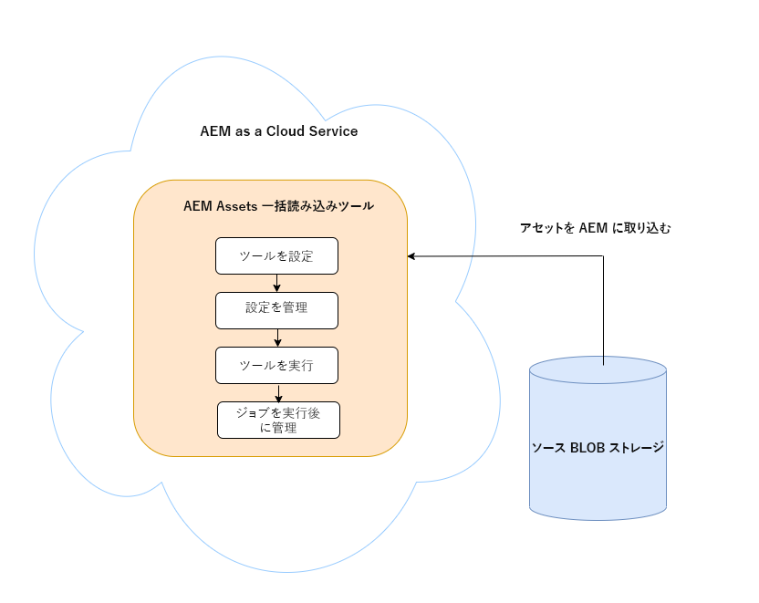
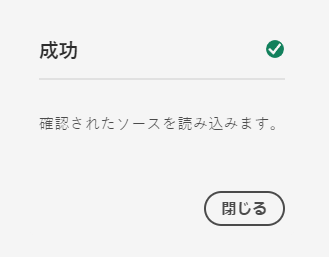
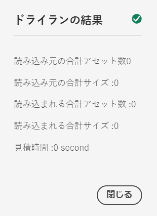
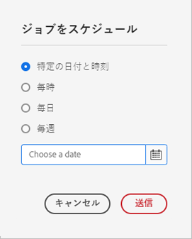
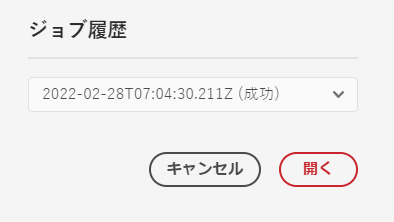

# [!DNL Adobe Experience Manager] as a [!DNL Cloud Service] [!DNL Assets] へのデジタルアセットの追加 {#add-assets-to-experience-manager}

[!DNL Adobe Experience Manager Assets] は、様々な種類のデジタルアセットを様々なソースから受け取ります。バイナリと作成されたレンディションを格納し、様々なワークフローや [!DNL Adobe Sensei] サービスを使用してアセット処理を実行し、様々な面にわたる多数のチャネルを通じて配布できます。

[!DNL Adobe Experience Manager] は、アップロードされたデジタルファイルのバイナリコンテンツを、リッチメタデータ、スマートタグ、レンディションおよびその他のデジタルアセット管理（DAM）サービスで強化します。画像、ドキュメント、生の画像ファイルなど、様々な種類のファイルを、ローカルフォルダーまたはネットワークドライブから [!DNL Experience Manager Assets] にアップロードできます。

最も一般的に使用されるブラウザーのアップロードに加えて、[!DNL Experience Manager] リポジトリにアセットを追加する他の方法も存在します。これらの他の方法には、Adobe Asset Link や [!DNL Experience Manager] デスクトップアプリなどのデスクトップクライアント、顧客が作成するアップロードおよび取り込みスクリプト、[!DNL Experience Manager] 拡張機能として追加された自動取り込み統合が含まれます。

[!DNL Experience Manager] では任意のバイナリファイルをアップロードおよび管理できますが、最もよく使用されるファイル形式については、メタデータ抽出やプレビュー／レンディション生成などの追加サービスもサポートされています。詳しくは、[サポートされているファイル形式](file-format-support.md)を参照してください。

アップロードしたアセットに対して追加の処理を行うように選択することもできます。アセットがアップロードされるフォルダーにいくつかのアセット処理プロファイルを設定して、特定のメタデータ、レンディションまたは画像処理サービスを追加することができます。[アップロード時のアセットの処理](#process-when-uploaded)を参照してください。

[!DNL Assets] では、次のアップロード方法を提供しています。使用する前に、アップロードオプションの使用事例と適用性を理解することをお勧めします。

| アップロード方法 | 用途 | メインユーザー |
|---------------------|----------------|-----------------|
| [Assets コンソールユーザーインターフェイス](#upload-assets) | 不定期アップロード、操作の容易さ、ファインダーアップロード。多くのアセットをアップロードするために使用しないでください。 | すべてのユーザー |
| [アップロード API](#upload-using-apis) | アップロード中の動的な決定。 | デベロッパー |
| [[!DNL Experience Manager] デスクトップアプリケーション](https://experienceleague.adobe.com/docs/experience-manager-desktop-app/using/using.html?lang=ja) | 容量の少ないアセットの取り込み（移行は除く）。 | 管理者、マーケター |
| [[!DNL Adobe Asset Link]](https://helpx.adobe.com/jp/enterprise/using/adobe-asset-link.html) | クリエイティブやマーケターが、サポートされる [!DNL Creative Cloud] デスクトップアプリ内でアセットを操作する場合に役立ちます。 | クリエイティブ、マーケター |
| [アセット一括取得ツール](#asset-bulk-ingestor) | 大規模な移行や、不定期に行われる一括取得に推奨。サポートされるデータストアに対してのみ。 | 管理者、デベロッパー |

## アセットのアップロード {#upload-assets}

<!-- #ENGCHECK do we support pausing? I couldn't get pause to show with 1.5GB upload.... If not, this should be removed#

   You can pause the uploading of large assets (greater than 500 MB) and resume it later from the same page. Select the **[!UICONTROL Pause]** icon beside progress bar that appears when an upload starts.

   The size above which an asset is considered a large asset is configurable. For example, you can configure the system to consider assets above 1000 MB (instead of 500 MB) as large assets. In this case, **[!UICONTROL Pause]** appears on the progress bar when assets of size greater than 1000 MB are uploaded.

   The [!UICONTROL Pause] option does not show if a file greater than 1000 MB is uploaded with a file less than 1000 MB. However, if you cancel the less than 1000 MB file upload, the **[!UICONTROL Pause]** option appears.

   To modify the size limit, configure the `chunkUploadMinFileSize` property of the `fileupload` node in the CRX repository.

   When you click the **[!UICONTROL Pause]** icon, it toggles to a **[!UICONTROL Play]** icon. To resume uploading, click **[!UICONTROL Play]** option.
-->

<!-- #ENGCHECK do we support pausing? I couldn't get pause to show with 1.5GB upload.... If not, this should be removed#
   The ability to resume uploading is especially helpful in low-bandwidth scenarios and network glitches, where it takes a long time to upload a large asset. You can pause the upload operation and continue later when the situation improves. When you resume, uploading starts from the point where you paused it.
-->

<!-- #ENGCHECK assuming this is not relevant? remove after confirming#
   During the upload operation, [!DNL Experience Manager] saves the portions of the asset being uploaded as chunks of data in the CRX repository. When the upload completes, [!DNL Experience Manager] consolidates these chunks into a single block of data in the repository.

   To configure the cleanup task for the unfinished chunk upload jobs, go to `https://[aem_server]:[port]/system/console/configMgr/org.apache.sling.servlets.post.impl.helper.ChunkCleanUpTask`.
-->

ファイル（または複数のファイル）をアップロードするには、デスクトップ上でファイルを選択して、ユーザーインターフェイス（web ブラウザー）内の目的のフォルダーにドラッグします。または、ユーザーインターフェイスからアップロードを開始することもできます。

>[!IMPORTANT]
>
>ファイル名が 100 文字を超える Experience Manager にアップロードするアセットを Dynamic Media で使用する場合、アセットの名前が短縮されます。
>
>ファイル名の最初の 100 文字は、そのまま使用されます。残りの文字は、英数字の文字列に置き換えられます。この名前変更方法により、Dynamic Media でアセットを使用する際に一意の名前が付けられます。また、Dynamic Media で許可されるアセットファイル名の最大長に対応することも目的としています。


1. [!DNL Assets] ユーザーインターフェイスで、デジタルアセットを追加する場所に移動します。
1. アセットをアップロードするには、以下のいずれかの操作を行います。

   * ツールバーで、**[!UICONTROL 作成]**／**[!UICONTROL ファイル]**&#x200B;をクリックします。表示されたダイアログで、必要に応じてファイル名を変更できます。
   * HTML5 をサポートするブラウザーで、アセットを [!DNL Assets] ユーザーインターフェイスに直接ドラッグします。ファイル名を変更するためのダイアログは表示されません。

   

   複数のファイルを選択するには、ファイル選択ダイアログで、 `Ctrl` または `Command` キーを押しながらアセットを選択します。iPad を使用している場合、一度に選択できるファイルは 1 つだけです。

1. 進行中のアップロードをキャンセルするには、進行状況バーの横にある閉じるボタン（「`X`」）をクリックします。アップロード処理をキャンセルすると、[!DNL Assets] はアセットのアップロード済みの部分を削除します。ファイルがアップロードされる前にアップロード操作をキャンセルすると、[!DNL Assets] が現在のファイルのアップロードを停止し、コンテンツを更新します。ただし、既にアップロードされているファイルは削除されません。

1. [!DNL Assets] のアップロード進行状況ダイアログには、アップロードが成功したファイルと失敗したファイルの数が表示されます。さらに、[!DNL Assets] ユーザーインターフェイスには、アップロードした最新のアセットまたは最初に作成したフォルダーが表示されます。

>[!NOTE]
>
>ネストされたフォルダー階層をアップロードする方法については、[アセットの一括アップロード](#bulk-upload)を参照してください。

<!-- #ENGCHECK I'm assuming this is no longer relevant.... If yes, this should be removed#

### Serial uploads {#serialuploads}

Uploading numerous assets in bulk consumes significant I/O resources, which may adversely impact the performance of [!DNL Assets]. In particular, if you have a slow internet connection, the time to upload drastically increases due to a spike in disk I/O. Moreover, your web browser may introduce additional restrictions to the number of POST requests [!DNL Assets] can handle for concurrent asset uploads. As a result, the upload operation fails or terminate prematurely. In other words, [!DNL Assets] may miss some files while ingesting a bunch of files or altogether fail to ingest any file.

To overcome this situation, [!DNL Assets] ingests one asset at a time (serial upload) during a bulk upload operation, instead of the concurrently ingesting all the assets.

Serial uploading of assets is enabled by default. To disable the feature and allow concurrent uploading, overlay the `fileupload` node in CRX-DE and set the value of the `parallelUploads` property to `true`.

### Streamed uploads {#streamed-uploads}

If you upload many assets to [!DNL Experience Manager], the I/O requests to server increase drastically, which reduces the upload efficiency and can even cause some upload task to time out. [!DNL Assets] supports streamed uploading of assets. Streamed uploading reduces the disk I/O during the upload operation by avoiding asset storage in a temporary folder on the server before copying it to the repository. Instead, the data is transferred directly to the repository. This way, the time to upload large assets and the possibility of timeouts is reduced. Streamed upload is enabled by default in [!DNL Assets].

>[!NOTE]
>
>Streaming upload is disabled for [!DNL Experience Manager] running on JEE server with servlet-api version lower than 3.1.
-->

### 既存のアセットのアップロードの処理 {#handling-upload-existing-file}

既存のアセットと同じパス（同じ名前と同じ場所）を持つアセットをアップロードできます。ただし、次のオプションを含む警告ダイアログが表示されます。

* 既存アセットの置換：既存のアセットを置き換えると、アセットのメタデータと、既存のアセットに対して以前に行った変更内容（注釈、切り抜きなど）は削除されます。

  >[!NOTE]
  >
  >アセットを置き換えるオプションは、アセットがロックされているかチェックアウトされている場合は使用できません。

* 別のバージョンの作成：既存のアセットの新しいバージョンがリポジトリーに作成されます。[!UICONTROL タイムライン]に 2 つのバージョンを表示することができ、必要に応じて、以前の既存バージョンに戻すことができます。
* 両方を保存：両方のアセットを保存することを選択した場合、新しいアセットの名前が変更されます。

[!DNL Assets] で重複アセットを保持するには、「**[!UICONTROL 保持]**」をクリックします。アップロードした重複アセットを削除するには、「**[!UICONTROL 削除]**」をクリックします。

### ファイル名の処理と禁止文字 {#filename-handling}

[!DNL Experience Manager Assets] では、ファイル名に禁止文字が含まれるアセットをアップロードできません。ファイル名に禁止文字が含まれるアセットをアップロードしようとすると、[!DNL Assets] に警告メッセージが表示され、これらの文字を削除するか使用可能な名前でアップロードするまでアップロードが停止されます。

組織固有のファイル命名規則に合うように、[!UICONTROL アセットをアップロード]ダイアログでは、アップロードするファイルに長い名前を指定できます。以下の文字（のスペース区切りリスト）はサポートされていません。

* アセット名で無効な文字：`* / : [ \\ ] | # % { } ? &`
* アセットフォルダー名で無効な文字：`* / : [ \\ ] | # % { } ? \" . ^ ; + & \t`

## アセットの一括アップロード {#bulk-upload}

一括アセット取得機能を使用すると、多数のアセットを効率的に処理できます。ただし、大規模な取得は、ファイルの大量ダンプやカジュアルな移行のためだけではありません。大規模な取得をビジネス目的に役立ち効率的な意味のあるプロジェクトにするためには、移行を計画し、アセット組織をキュレートしてください。すべての取得は異なるため、一般化するのではなく、リポジトリーの構成やビジネスニーズに応じた要素を計算に入れます。次に、一括取得の計画と実行に関する包括的な提案を示します。

* アセットのキュレーション：DAM に必要でないアセットを削除します。未使用、未サポート、または重複するアセットの削除を検討してください。このようなハウスキーピングにより、転送されるデータや取得されるアセットの量が減り、取得時間が短縮されます。
* アセットの整理：ファイルサイズ、ファイル形式、使用例、優先度など、論理的な順序でコンテンツを編成することを検討してください。一般に、サイズが大きく複雑なファイルは、より多くの処理が必要になります。サイズの大きいファイルは、ファイルサイズフィルターオプション（以下で説明）を使用して個別に取得することも検討できます。
* 分割の調整：取得を複数の一括取得プロジェクトに分割することを検討してください。これにより、コンテンツを迅速に表示し、必要に応じて取得を更新できます。例えば、処理負荷の高いアセットをピーク以外の時間帯に取得したり、複数のチャンクに分けて徐々に取得したりすることができます。ただし、それほど処理を行う必要のない、小さくシンプルなアセットは一度に取得することができます。

アップロードするファイル数を増やすには、次のいずれかの方法を使用します。[使用例とメソッド](#upload-methods-comparison)も参照してください。

* [アセットアップロード API](developer-reference-material-apis.md#asset-upload)：必要に応じて、API を活用したカスタムアップロードスクリプトまたはツールを使用して、アセットの処理（メタデータの翻訳やファイル名の変更など）を追加します。
* [[!DNL Experience Manager] デスクトップアプリ](https://experienceleague.adobe.com/docs/experience-manager-desktop-app/using/using.html?lang=ja)：ローカルファイルシステムからアセットをアップロードするクリエイティブの専門家やマーケターに役立ちます。ローカルで使用可能なネストされたフォルダーをアップロードするために使用します。
* [一括取得ツール](#asset-bulk-ingestor)：大量のアセットを取得する場合、不定期に取得するためや [!DNL Experience Manager] をデプロイ時に最初に取得するために使用します。

### アセット一括読み込みツール {#asset-bulk-ingestor}

このツールは、Azure または S3 データストアからのアセットの大規模な取り込みに使用する目的で管理者グループにのみ提供されます。設定と取り込みの手順を紹介するビデオを参照してください。

>[!VIDEO](https://video.tv.adobe.com/v/341389/?quality=12&learn=on&captions=jpn)

次の図は、データストアから Experience Manager にアセットを取り込む際の様々な段階を示しています。



**前提条件**

この機能を使用するには、Azure または AWS の外部ストレージアカウントまたはバケットが必要です。

>[!NOTE]
>
>ストレージアカウントコンテナまたはバケットをプライベートとして作成し、許可されたリクエストからのみ接続を受け入れます。ただし、入力ネットワーク接続に関する追加の制限はサポートされていません。

>[!NOTE]
>
>外部ストレージアカウントには、一括読み込みツールとは異なるファイル名またはフォルダー名のルールが設定されている場合があります。使用できない名前やエスケープされた名前について詳しくは、[一括読み込み時のファイル名の処理](#filename-handling-bulkimport)を参照してください。


### 一括読み込みツールを設定 {#configure-bulk-ingestor-tool}

一括読み込みツールを設定するには、次の手順に従います。

1. **[!UICONTROL ツール]**／**[!UICONTROL Assets]**／**[!UICONTROL 一括取得]**&#x200B;に移動します。「**[!UICONTROL 作成]**」オプションを選択します。

1. 「**[!UICONTROL タイトル]**」フィールドで一括読み込み設定のタイトルを指定します。

1. 「**[!UICONTROL ソースを読み込み]**」ドロップダウンリストからデータソースのタイプを選択します。

1. データソースとの接続を作成するための値を指定します。例えば、データソースとして **Azure Blob Storage** を選択した場合は、Azure ストレージアカウント、Azure BLOB コンテナ、Azure アクセスキーの値を指定します。

1. ドロップダウンリストから必要な認証モードを選択します。 **Azure アクセスキー**&#x200B;を使用すると Azure ストレージアカウントに完全にアクセスできますが、 **Azure SAS トークン**&#x200B;を使用すると、管理者は権限と有効期限ポリシーを使用してトークンの機能を制限することができます。

1. 「**[!UICONTROL ソースフォルダー]**」フィールドでデータソースのアセットを含むルートフォルダーの名前を指定します。

1. （オプション）アセットの最小ファイルサイズを MB 単位で指定して、「**[!UICONTROL 最小サイズでフィルター]**」フィールドの取り込みプロセスにアセットを含めます。

1. （オプション）アセットの最大ファイルサイズを MB 単位で指定して、「**[!UICONTROL 最大サイズでフィルター]**」フィールドの取り込みプロセスにアセットを含めます。

1. （オプション）「**[!UICONTROL MIME タイプを除外]**」フィールドで、取り込みから除外する MIME タイプのコンマ区切りリストを指定します。（例：`image/jpeg, image/.*, video/mp4`）。[サポートされるすべてのファイル形式](/help/assets/file-format-support.md)を参照してください。

1.  「**[!UICONTROL MIME タイプを含める]**」フィールドで、取り込みから含める MIME タイプのコンマ区切りリストを指定します。[サポートされるすべてのファイル形式](/help/assets/file-format-support.md)を参照してください。

1. ファイルが [!DNL Experience Manager] に読み込まれた後、ソースデータストアから元のファイルを削除するには、「**[!UICONTROL 読み込み後にソースファイルを削除]**」オプションを選択します。

1. 「**[!UICONTROL 読み込みモード]**」を選択します。「**スキップ**」、「**置換**」または「**バージョンを作成**」を選択します。スキップモードがデフォルトです。このモードでは、アセットが既に存在する場合は、取得をスキップします。[バージョンオプションの置換と作成](#handling-upload-existing-file)の意味を参照してください。

1. 「**[!UICONTROL アセットのターゲットフォルダー]**」フィールドを使用して、アセットの読み込み先となる DAM 内の場所を定義するパスを指定します。例：`/content/dam/imported_assets`

1. （オプション）「**[!UICONTROL メタデータファイル]**」フィールドに、CSV 形式で読み込むメタデータファイルを指定します。ソース BLOB の場所で CSV ファイルを指定し、一括読み込みツールの設定時にパスを参照します。このフィールドで参照される CSV ファイル形式は、[アセットメタデータの一括読み込みと書き出し](https://experienceleague.adobe.com/docs/experience-manager-cloud-service/content/assets/admin/metadata-import-export.html?lang=ja)を実行する場合の CSV ファイル形式と同じです。「**読み込み後にソースファイルを削除**」オプションを選択した場合は、「**除外**」または「**MIME タイプを含める**」または「**パス／ファイルでフィルター**」フィールドを使用して CSV ファイルをフィルタリングします。正規表現を使用して、これらのフィールドの CSV ファイルをフィルタリングできます。

1. 「**[!UICONTROL 保存]**」をクリックして、設定を保存します。

### 一括読み込みツールの設定を管理 {#manage-bulk-import-configuration}

一括読み込みツールの設定を作成した後は、Experience Manager インスタンスにアセットを一括取り込みする前に、設定を評価するタスクを実行できます。一括読み込みツールの設定を管理するために使用可能なオプションを表示するには、**[!UICONTROL ツール]**／**[!UICONTROL Assets]**／**[!UICONTROL 一括読み込み]**&#x200B;で利用可能な設定を選択します。

### 設定を編集します。 {#edit-configuration}

設定の詳細を編集するには、設定を選択し、「**[!UICONTROL 編集]**」をクリックします。編集操作の実行中は、設定のタイトルとデータソースの読み込みを編集することはできません。

### 設定を削除 {#delete-configuration}

設定を選択し、「**[!UICONTROL 削除]**」をクリックして一括読み込み設定を削除します。

### データソースへの接続を検証 {#validate-connection}

データソースへの接続を検証するには、設定を選択し、次に、「**[!UICONTROL 確認]**」をクリックします。接続に成功すると、Experience Manager に次のメッセージが表示されます。



### 一括読み込みジョブのテスト実行を呼び出す {#invoke-test-run-bulk-import}

設定を選択し、「**[!UICONTROL ドライラン]**」をクリックして、一括読み込みジョブのテスト実行を呼び出します。Experience Manager には、一括読み込みジョブに関する次の詳細が表示されます。



### 一括読み込み時のファイル名の処理 {#filename-handling-bulkimport}

アセットやフォルダーを一括で読み込む場合、[!DNL Experience Manager Assets] は、インポートソースに存在する情報の構造全体を読み込みます。[!DNL Experience Manager] は、アセット名とフォルダー名に含まれる特殊文字に対する組み込みルールに従うので、これらのファイル名のサニタイズが必要になります。フォルダー名とアセット名の両方について、ユーザーが定義したタイトルは変更されず、`jcr:title` に保存されます。

一括読み込み時に、[!DNL Experience Manager] は、既存のフォルダーを探してアセットやフォルダーの再読み込みを避けると共に、読み込みが行われる親フォルダーに適用されるサニタイズルールを検証します。親フォルダーにサニタイズルールが適用される場合、インポートソースにも同じルールが適用されます。新規読み込みの場合、アセットやフォルダーのファイル名を管理するために、次のサニタイズルールが適用されます。

**一括読み込みで使用できない名前**

次の文字は、ファイル名およびフォルダー名で使用できません。

* 制御文字および私用文字（0x00～0x1F、\u0081、\uE000）
* ドット（.）で終わるファイル名またはフォルダー名

これらの条件に一致する名前を持つファイルまたはフォルダーは、読み込みプロセス中にスキップされ、失敗とマークされます。

**一括読み込みでのアセット名の処理**

アセットのファイル名の場合、JCR の名前とパスは、`JcrUtil.escapeIllegalJcrChars` API を使用してサニタイズされます。

* Unicode 文字は変更されません。
* 特殊文字を URL エスケープコードに置き換えます。例えば、`new%asset.png` は `new%25asset.png` に更新されます。

  ```
                  URL escape code   
  
  "               %22
  %               %25
  '               %27
  *               %2A
  /               %2F
  :               %3A
  [               %5B
  \n              %0A
  \r              %0D
  \t              %09
  ]               %5D
  |               %7C
  ```

**一括読み込みでのフォルダー名の処理**

フォルダーのファイル名の場合、JCR の名前とパスは、`DamUtil.getSanitizedFolderName` API を使用してサニタイズされます。

* 大文字は小文字に変換されます。
* Unicode 文字は変更されません。
* 特殊文字をダッシュ（「-」）に置き換えます。例えば、`new folder` は `new-folder` に更新されます。

  ```
  "                           
  #                         
  %                           
  &                          
  *                           
  +                          
  .                           
  :                           
  ;                          
  ?                          
  [                           
  ]                           
  ^                         
  {                         
  }                         
  |                           
  /         It is used for split folder in cloud storage and is pre-handled, no conversion here.
  \         Not allowed in Azure, allowed in AWS.
  \t
  space     It is the space character.
  ```

<!-- 
[!DNL Experience Manager Assets] manages the forbidden characters in the filenames while you upload assets or folders. [!DNL Experience Manager] updates only the node names in the DAM repository. However, the `title` of the asset or folder remains unchanged.

Following are the file naming conventions that are applied while uploading assets or folders in [!DNL Experience Manager Assets]:

| Characters &Dagger; | When occurring in file names | When occurring in folder names | Example |
|---|---|---|---|
| `. / : [ ] | *` | Replaced with `-` (hyphen). | Replaced with `-` (hyphen). A `.` (dot) in the filename extension is retained as is. | Replaced with `-` (hyphen). | `myimage.jpg` remains as is and `my.image.jpg` changes to `my-image.jpg`. |
| `% ; # , + ? ^ { } "` and whitespaces | Whitespaces are retained | Replaced with `-` (hyphen). | `My Folder.` changes to `my-folder-`. |
| `# % { } ? & .` | Replaced with `-` (hyphen). | NA. | `#My New File.` changes to `-My New File-`. |
| Uppercase characters | Casing is retained as is. | Changed to lowercase characters. | `My New Folder` changes to `my-new-folder`. |
| Lppercase characters | Casing is retained as is. | Casing is retained as is. | NA. |

&Dagger; The list of characters is a whitespace-separated list.
-->

#### 1 回限りの一括読み込みまたは繰り返しの一括読み込みのスケジュール設定 {#schedule-bulk-import}

1 回限りの一括読み込みまたは繰り返しの一括読み込みをスケジュール設定するには、次の手順に従います。

1. 一括読み込み設定を作成します。
1. 設定を選択し、ツールバーの「**[!UICONTROL スケジュール]**」を選択します。
1. 1 回限りの取得を設定するか、1 時間ごと、1 日ごと、または 1 週間ごとのスケジュールを設定します。「**[!UICONTROL 送信]**」をクリックします。

   


#### Assets のターゲットフォルダーを表示 {#view-assets-target-folder}

一括読み込みジョブの実行後にアセットが読み込まれる Assets のターゲット場所を表示するには、設定を選択して、「**[!UICONTROL アセットを表示]**」をクリックします。

#### 一括読み込みツールの実行 {#run-bulk-import-tool}

[一括読み込みツールを設定](#configure-bulk-ingestor-tool)し、オプションで[一括読み込みツールの設定を管理](#manage-bulk-import-configuration)した後、設定ジョブを実行してアセットの一括取得を開始できます。

一括読み込みプロセスを開始するには、**[!UICONTROL ツール]**／**[!UICONTROL Assets]**／**[!UICONTROL 一括読み込み]**&#x200B;に移動し、「[一括読み込み設定](#configure-bulk-ingestor-tool)」を選択して、「**[!UICONTROL 実行]**」をクリックします。もう一度「**[!UICONTROL 実行]**」をクリックして確認します。

Experience Manager は、ジョブのステータスを「**処理中**」、およびジョブが正常に完了すると「**成功**」に更新します。読み込んだアセットを Experience Manager で表示するには、「**アセットを表示**」をクリックします。

ジョブの進行中に、設定を選択し、「**停止**」をクリックして一括取得プロセスを停止することもできます。もう一度「**実行**」をクリックして、プロセスを再開します。「**ドライラン**」をクリックして、まだ読み込みが保留されているアセットの詳細を確認することもできます。

#### 実行後のジョブの管理 {#manage-jobs-after-execution}

Experience Manager では、一括読み込みジョブの履歴を確認できます。ジョブ履歴は、ジョブ、ジョブ作成者、ログのステータスと、開始日時、作成日時、完了日時などのその他の詳細で構成されます。

設定のジョブ履歴にアクセスするには、設定を選択し、「**[!UICONTROL ジョブ履歴]**」をクリックします。ジョブを選択し、「**開く**」をクリックします。



Experience Manager は、ジョブ履歴を表示します。一括読み込みジョブの履歴ページで、「**削除**」をクリックして、一括読み込み設定用のジョブを削除します。


## デスクトップクライアントを使用したアセットのアップロード {#upload-assets-desktop-clients}

[!DNL Experience Manager] では、web ブラウザーユーザーインターフェイスに加えて、デスクトップ上の他のクライアントもサポートしています。Web ブラウザーを使用しなくても、これらのクライアントでアップロード操作を行うことができます。

* [[!DNL Adobe Asset Link]](https://helpx.adobe.com/jp/enterprise/using/adobe-asset-link.html) を使用すると、Adobe Photoshop、Adobe Illustrator、Adobe InDesign の各デスクトップアプリケーションで [!DNL Experience Manager] 内のアセットにアクセスできます。これらのデスクトップアプリケーション内から、現在開いているドキュメントを Adobe Asset Link ユーザーインターフェイスを通じて直接 [!DNL Experience Manager] にアップロードできます。
* [[!DNL Experience Manager] Adobe デスクトップアプリケーション](https://experienceleague.adobe.com/docs/experience-manager-desktop-app/using/using.html?lang=ja)を利用すると、アセットのファイルタイプやアセットを操作するネイティブアプリケーションによらず、デスクトップ上でアセットを簡単に操作できます。ブラウザーアップロードではフラットなファイルリストのアップロードのみサポートしているので、ネストされたフォルダー階層内のファイルをローカルファイルシステムからアップロードする際に便利です。

## アップロード時にアセットを処理 {#process-when-uploaded}

アップロードされたアセットに対して追加の処理を行うには、アップロードフォルダーに処理プロファイルを適用できます。プロファイルは、**[!UICONTROL 内のフォルダーの]**&#x200B;プロパティ[!DNL Assets]ページで入手できます。拡張子のないデジタルアセットや誤った拡張子のデジタルアセットは、希望どおりには処理されません。例えば、そのようなアセットをアップロードすると、何も発生しないか、誤った処理プロファイルがアセットに適用されることがあります。それでも、ユーザーは DAM にバイナリファイルを保存できます。


次のタブがあります。

* [メタデータプロファイル](metadata-profiles.md)：フォルダーにアップロードされたアセットにデフォルトのメタデータプロパティを適用できます。
* [処理プロファイル](asset-microservices-configure-and-use.md)：デフォルトで可能な数より多いレンディションを生成できます。

また、デプロイメントで [!DNL Dynamic Media] が有効になっている場合は、次のタブを使用できます。

* [[!DNL Dynamic Media] イメージプロファイル](dynamic-media/image-profiles.md)を使用すると、アップロードしたアセットに、特定の切り抜き（**[!UICONTROL スマート切り抜き]**&#x200B;およびピクセル切り抜き）やシャープの設定を適用できます。
* [[!DNL Dynamic Media] ビデオプロファイル](dynamic-media/video-profiles.md)を使用すると、特定のビデオエンコーディングプロファイル（解像度、形式、パラメーター）を適用できます。

>[!NOTE]
>
>[!DNL Dynamic Media] のアセットに対する切り抜きやその他の操作は非破壊的です。つまり、アップロードされた元の内容は変更されません。代わりに、アセットを配信する際に切り抜きや変換を行うパラメーターが提供されます。

処理プロファイルが割り当てられているフォルダーの場合、プロファイル名がカード表示のサムネールに表示されます。リスト表示では、プロファイル名が「**[!UICONTROL 処理プロファイル]**」に表示されます。

## API を使用したアセットのアップロードまたは取り込み {#upload-using-apis}

アップロード API およびプロトコルの技術的詳細、およびオープンソース SDK とサンプルクライアントへのリンクについては、開発者向けリファレンスの[アセットアップロード](developer-reference-material-apis.md#asset-upload)に関する節に記載されています。

## ヒント、ベストプラクティス、制限事項 {#tips-limitations}

* 直接バイナリアップロードは、アセットをアップロードする新しい方法です。[!DNL Experience Manager] ユーザーインターフェイス、[!DNL Adobe Asset Link]、[!DNL Experience Manager] デスクトップアプリケーションなど、製品の機能とクライアントでは、この機能がデフォルトでサポートされています。ユーザー側の技術チームでカスタマイズまたは拡張されるカスタムコードでは、新しいアップロード API およびプロトコルを使用する必要があります。

* アドビでは、[!DNL Experience Manager Assets] の各フォルダーに追加するアセットは 1,000 個以下にすることをお勧めします。1,000 個以上追加しようとすると、次のような警告メッセージが表示される場合があります。「このディレクトリには 1,000 個以上の項目が含まれています。アップロードや新しいフォルダーの作成が遅れる場合があります。」フォルダーにアセットをさらに追加することもできますが、そのようなフォルダーへのナビゲーション速度の低下など、パフォーマンスに関するイシューが発生する場合があります。

* [!UICONTROL 名前の競合]ダイアログで「**[!UICONTROL 置換]**」を選択すると、新しいアセットのアセット ID が再生成されます。この ID は以前のアセットの ID とは異なります。[アセットインサイト](/help/assets/assets-insights.md)による [!DNL Adobe Analytics] でのインプレッション数やクリック数の追跡が有効になっている場合は、再生成されたアセット ID により、[!DNL Analytics] から取得したアセットのデータが無効になります。

* 一部のアップロード方法では、ファイル名に[禁止文字](#filename-handling)が含まれるアセットをアップロードしないようにする必要があります。文字は `-` 記号に置き換えられます。

* ブラウザーを使用したアセットのアップロードでは、フラットなファイルリストのみがサポートされ、ネストされたフォルダー階層はサポートされていません。ネストされたフォルダー内のすべてのアセットをアップロードするには、[デスクトップアプリケーション](#upload-assets-desktop-clients)を使用することを検討してください。

* 一括読み込みメソッドでは、フォルダー構造全体がデータソースに存在するとおりに読み込まれます。ただし、[!DNL Experience Manager] では空でないフォルダーのみが作成されます。


<!-- TBD: Link to file name handling in DA docs when it is documented. 
-->

**関連情報**

* [アセットを翻訳](translate-assets.md)
* [Assets HTTP API](mac-api-assets.md)
* [AEM Assets as a Cloud Service でサポートされているファイル形式](file-format-support.md)
* [アセットを検索](search-assets.md)
* [接続されたアセット](use-assets-across-connected-assets-instances.md)
* [アセットレポート](asset-reports.md)
* [メタデータスキーマ](metadata-schemas.md)
* [アセットをダウンロード](download-assets-from-aem.md)
* [メタデータを管理](manage-metadata.md)
* [検索ファセット](search-facets.md)
* [コレクションを管理](manage-collections.md)
* [メタデータの一括読み込み](metadata-import-export.md)
* [AEM および Dynamic Media へのアセットの公開](/help/assets/publish-assets-to-aem-and-dm.md)

>[!MORELIKETHIS]
>
>* [[!DNL Adobe Experience Manager] デスクトップアプリケーション](https://experienceleague.adobe.com/docs/experience-manager-desktop-app/using/introduction.html?lang=ja)
>* [ [!DNL Adobe Asset Link] について](https://www.adobe.com/jp/creativecloud/business/enterprise/adobe-asset-link.html)
>* [[!DNL Adobe Asset Link] 詳細を見る](https://helpx.adobe.com/jp/enterprise/using/adobe-asset-link.html)
>* [アセットのアップロードに関するテクニカルリファレンス](developer-reference-material-apis.md#asset-upload)
