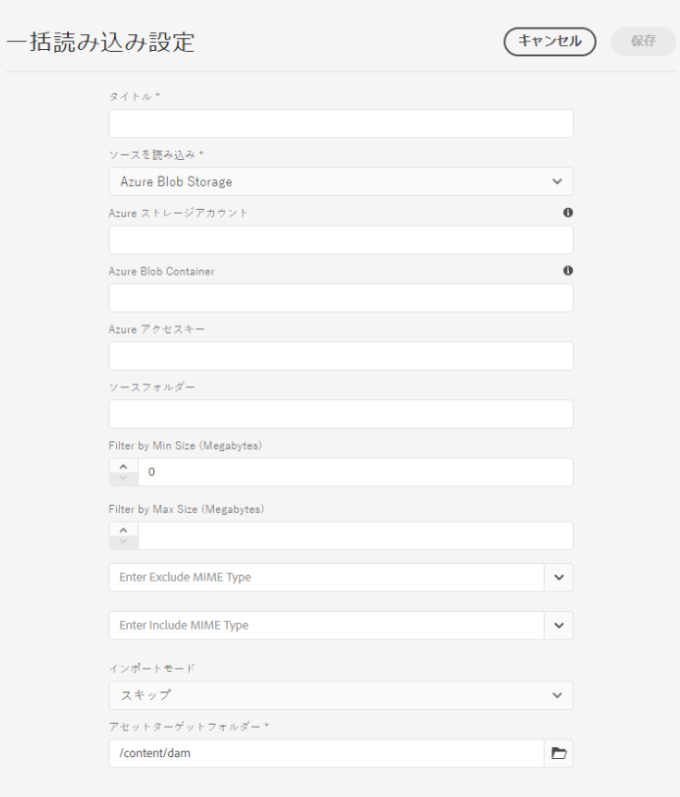
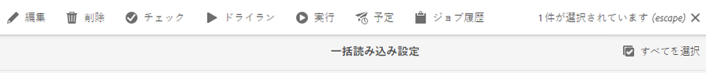

# [!DNL Adobe Experience Manager] as a [!DNL Cloud Service] [!DNL Assets]へのデジタルアセットの追加  {#add-assets-to-experience-manager}

[!DNL Adobe Experience Manager Assets] は、様々な種類のデジタルアセットを様々なソースから受け取ります。バイナリと作成されたレンディションを格納し、様々なワークフローや [!DNL Adobe Sensei] サービスを使用してアセット処理を実行し、様々な面にわたる多数のチャネルを通じて配布できます。

[!DNL Adobe Experience Manager] は、アップロードされたデジタルファイルのバイナリコンテンツを、リッチメタデータ、スマートタグ、レンディションおよびその他のデジタルアセット管理（DAM）サービスで強化します。画像、ドキュメント、生の画像ファイルなど、様々な種類のファイルを、ローカルフォルダーまたはネットワークドライブから [!DNL Experience Manager Assets] にアップロードできます。

最もよく使用されるブラウザーアップロードに加えて、他の方法でも [!DNL Experience Manager] リポジトリーにアセットを追加することができます。Adobe Asset Link や [!DNL Experience Manager] デスクトップアプリケーションなどのデスクトップクライアント、ユーザーが作成するアップロードおよび取り込みスクリプト、[!DNL Experience Manager] 拡張機能として追加されている自動取り込み統合などです。

[!DNL Experience Manager] では任意のバイナリファイルをアップロードおよび管理できますが、最もよく使用されるファイル形式については、メタデータ抽出やプレビュー／レンディション生成などの追加サービスもサポートされています。詳しくは、[サポートされているファイル形式](file-format-support.md)を参照してください。

アップロードしたアセットに対して追加の処理をおこなうように選択することもできます。アセットのアップロード先のフォルダーに様々なアセット処理プロファイルを設定して、特定のメタデータ、レンディションまたは画像処理サービスを追加することができます。「[アップロード時のアセットの処理](#process-when-uploaded)」を参照してください。

[!DNL Assets] では、次のアップロード方法を使用できます。使用する前に、アップロードオプションの使用事例と適用性を理解することをお勧めします。

| アップロード方法 | 用途 | メインユーザー |
|---------------------|----------------|-----------------|
| [Assets コンソールユーザーインターフェイス](#upload-assets) | 不定期アップロード、操作の容易さ、ファインダーアップロード。大量のアセットをアップロードする場合は、使用しないでください。 | すべてのユーザー |
| [アップロード API](#upload-using-apis) | アップロード中の動的な決定。 | デベロッパー |
| [[!DNL Experience Manager] デスクトップアプリケーション](https://experienceleague.adobe.com/docs/experience-manager-desktop-app/using/using.html?lang=ja) | 容量の少ないアセットの取り込み（移行は除く）。 | 管理者、マーケター |
| [[!DNL Adobe Asset Link]](https://helpx.adobe.com/jp/enterprise/admin-guide.html/enterprise/using/adobe-asset-link.ug.html) | クリエイティブやマーケターが、サポートされる [!DNL Creative Cloud] デスクトップアプリ内でアセットを操作する場合に役立ちます。 | クリエイティブ、マーケター |
| [アセット一括取得ツール](#asset-bulk-ingestor) | 大規模な移行や、不定期に行われる一括取得に推奨。サポートされるデータストアに対してのみ。 | 管理者、デベロッパー |

## アセットのアップロード {#upload-assets}

<!-- #ENGCHECK do we support pausing? I couldn't get pause to show with 1.5GB upload.... If not, this should be removed#

   You can pause the uploading of large assets (greater than 500 MB) and resume it later from the same page. Tap the **[!UICONTROL Pause]** icon beside progress bar that appears when an upload starts.

   The size above which an asset is considered a large asset is configurable. For example, you can configure the system to consider assets above 1000 MB (instead of 500 MB) as large assets. In this case, **[!UICONTROL Pause]** appears on the progress bar when assets of size greater than 1000 MB are uploaded.

   The [!UICONTROL Pause] option does not show if a file greater than 1000 MB is uploaded with a file less than 1000 MB. However, if you cancel the less than 1000 MB file upload, the **[!UICONTROL Pause]** option appears.

   To modify the size limit, configure the `chunkUploadMinFileSize` property of the `fileupload` node in the CRX repository.

   When you click the **[!UICONTROL Pause]** icon, it toggles to a **[!UICONTROL Play]** icon. To resume uploading, click **[!UICONTROL Play]** option.
-->

<!-- #ENGCHECK do we support pausing? I couldn't get pause to show with 1.5GB upload.... If not, this should be removed#
   The ability to resume uploading is especially helpful in low-bandwidth scenarios and network glitches, where it takes a long time to upload a large asset. You can pause the upload operation and continue later when the situation improves. When you resume, uploading starts from the point where you paused it.
-->

<!-- #ENGCHECK assuming this is not relevant? remove after confirming#
   During the upload operation, [!DNL Experience Manager] saves the portions of the asset being uploaded as chunks of data in the CRX repository. When the upload completes, [!DNL Experience Manager] consolidates these chunks into a single block of data in the repository.

   To configure the cleanup task for the unfinished chunk upload jobs, go to `https://[aem_server]:[port]/system/console/configMgr/org.apache.sling.servlets.post.impl.helper.ChunkCleanUpTask`.
-->

ファイル（または複数のファイル）をアップロードするには、デスクトップ上でファイルを選択して、ユーザーインターフェイス（Web ブラウザー）内の目的のフォルダーにドラッグします。または、ユーザーインターフェイスからアップロードを開始することもできます。

1. [!DNL Assets] ユーザーインターフェイスで、デジタルアセットを追加する場所に移動します。
1. アセットをアップロードするには、以下のいずれかの操作をおこないます。

   * ツールバーで、**[!UICONTROL 作成]**／**[!UICONTROL ファイル]**&#x200B;をクリックします。表示されたダイアログで、必要に応じてファイル名を変更できます。
   * HTML5 をサポートするブラウザーで、アセットを [!DNL Assets] ユーザーインターフェイスに直接ドラッグします。ファイル名を変更するためのダイアログは表示されません。

   

   複数のファイルを選択するには、ファイル選択ダイアログで、 `Ctrl` または `Command` キーを押しながらアセットを選択します。iPad を使用している場合、一度に選択できるファイルは 1 つだけです。

1. 進行中のアップロードをキャンセルするには、進行状況バーの横にある閉じるボタン（「`X`」）をクリックします。アップロード処理をキャンセルすると、[!DNL Assets] はアセットのアップロード済みの部分を削除します。ファイルがアップロードされる前にアップロード操作をキャンセルすると、[!DNL Assets] が現在のファイルのアップロードを停止し、コンテンツを更新します。ただし、既にアップロードされているファイルは削除されません。

1. [!DNL Assets] のアップロード進行状況ダイアログには、アップロードが成功したファイルと失敗したファイルの数が表示されます。さらに、[!DNL Assets] ユーザーインターフェイスには、アップロードした最新のアセットまたは最初に作成したフォルダーが表示されます。

>[!NOTE]
>
>ネストされたフォルダー階層をアップロードする方法については、[アセットの一括アップロード](#bulk-upload)を参照してください。

<!-- #ENGCHECK I'm assuming this is no longer relevant.... If yes, this should be removed#

### Serial uploads {#serialuploads}

Uploading numerous assets in bulk consumes significant I/O resources, which may adversely impact the performance of [!DNL Assets]. In particular, if you have a slow internet connection, the time to upload drastically increases due to a spike in disk I/O. Moreover, your web browser may introduce additional restrictions to the number of POST requests [!DNL Assets] can handle for concurrent asset uploads. As a result, the upload operation fails or terminate prematurely. In other words, [!DNL Assets] may miss some files while ingesting a bunch of files or altogether fail to ingest any file.

To overcome this situation, [!DNL Assets] ingests one asset at a time (serial upload) during a bulk upload operation, instead of the concurrently ingesting all the assets.

Serial uploading of assets is enabled by default. To disable the feature and allow concurrent uploading, overlay the `fileupload` node in CRX-DE and set the value of the `parallelUploads` property to `true`.

### Streamed uploads {#streamed-uploads}

If you upload many assets to [!DNL Experience Manager], the I/O requests to server increase drastically, which reduces the upload efficiency and can even cause some upload task to time out. [!DNL Assets] supports streamed uploading of assets. Streamed uploading reduces the disk I/O during the upload operation by avoiding asset storage in a temporary folder on the server before copying it to the repository. Instead, the data is transferred directly to the repository. This way, the time to upload large assets and the possibility of timeouts is reduced. Streamed upload is enabled by default in [!DNL Assets].

>[!NOTE]
>
>Streaming upload is disabled for [!DNL Experience Manager] running on JEE server with servlet-api version lower than 3.1.
-->

### アセットが既に存在する場合のアップロードの処理 {#handling-upload-existing-file}

既存のアセットと同じパス（同じ名前と同じ場所）を持つアセットをアップロードできます。ただし、次のオプションを含む警告ダイアログが表示されます。

* 既存アセットの置換：既存のアセットを置き換えると、アセットのメタデータと、既存のアセットに対して以前におこなった変更内容（注釈、切り抜きなど）は削除されます。
* 別のバージョンの作成：既存のアセットの新しいバージョンがリポジトリに作成されます。[!UICONTROL タイムライン]に 2 つのバージョンを表示でき、必要に応じて、以前のバージョンに戻すことができます。
* 両方を保存：両方のアセットを保存することを選択した場合、新しいアセットの名前が変更されます。

[!DNL Assets] で重複アセットを保持するには、「**[!UICONTROL 保持]**」をクリックします。アップロードした重複アセットを削除するには、「**[!UICONTROL 削除]**」をクリックします。

### ファイル名の処理と禁止文字 {#filename-handling}

[!DNL Experience Manager Assets] は、ファイル名に禁止文字が含まれるアセットのアップロードの阻止を試みます。ファイル名に禁止文字が含まれるアセットをアップロードしようとすると、[!DNL Assets] に警告メッセージが表示され、これらの文字を削除するか使用可能な名前でアップロードするまでアップロードが停止されます。

組織固有のファイル命名規則に合うように、[!UICONTROL アセットをアップロード]ダイアログでは、アップロードするファイルに長い名前を指定できます。以下の文字（スペース区切りリスト）はサポートされません。

* アセットファイル名で無効な文字 `* / : [ \\ ] | # % { } ? &` 
* アセットフォルダー名で無効な文字 `* / : [ \\ ] | # % { } ? \" . ^ ; + & \t` 

## アセットの一括アップロード {#bulk-upload}

一括アセット取得機能を使用すると、多数のアセットを効率的に処理できます。ただし、大規模な取得は、ファイルの大量ダンプやカジュアルな移行のためだけではありません。大規模な取得をビジネス目的に役立ち効率的な意味のあるプロジェクトにするためには、移行を計画し、アセット組織をキュレートしてください。すべての取得は異なるため、一般化するのではなく、リポジトリーの構成やビジネスニーズに応じた要素を計算に入れます。次に、一括取得の計画と実行に関する包括的な提案を示します。

* アセットのキュレーション：DAM に必要でないアセットを削除します。未使用、未サポート、または重複するアセットの削除を検討してください。これにより、転送されるデータや取得されるアセットの量が減り、取得時間が短縮されます。
* アセットの整理：ファイルサイズ、ファイル形式、使用例、優先度など、論理的な順序でコンテンツを編成することを検討してください。一般に、サイズが大きく複雑なファイルは、より多くの処理が必要になります。サイズの大きいファイルは、ファイルサイズフィルターオプション（以下で説明）を使用して個別に取得することも検討できます。
* 分割の調整：取得を複数の一括取得プロジェクトに分割することを検討してください。これにより、コンテンツを迅速に表示し、必要に応じて取り込みを更新できます。 例えば、処理負荷の高いアセットをピーク以外の時間帯に取得したり、複数のチャンクに分けて徐々に取得したりすることができます。ただし、それほど処理をおこなう必要のない、小さくシンプルなアセットは一度に取得することができます。

アップロードするファイル数を増やすには、次のいずれかの方法を使用します。[使用例とメソッド](#upload-methods-comparison)も参照してください。

* [アセットアップロード API](developer-reference-material-apis.md#asset-upload)：必要に応じて、API を利用したカスタムアップロードスクリプトまたはツールを使用して、アセットの処理（メタデータの翻訳やファイル名の変更など）を追加します。
* [[!DNL Experience Manager] デスクトップアプリ](https://experienceleague.adobe.com/docs/experience-manager-desktop-app/using/using.html)：ローカルファイルシステムからアセットをアップロードするクリエイティブの専門家やマーケターに役立ちます。ローカルで使用可能なネストされたフォルダーをアップロードするために使用します。
* [一括取得ツール](#asset-bulk-ingestor)：大量のアセットを取得する場合、不定期に取得するためや [!DNL Experience Manager] をデプロイ時に最初に取得するために使用します。

### アセット一括取得ツール {#asset-bulk-ingestor}

このツールは、Azure または S3 データストアからのアセットの大規模な取得に使用する管理者グループに対してのみ提供されます。設定と取得のビデオウォークスルーを参照してください。

>[!VIDEO](https://video.tv.adobe.com/v/329680/?quality=12&learn=on)

ツールを設定するには、次の手順に従います。

1. **[!UICONTROL ツール]**／**[!UICONTROL Assets]**／**[!UICONTROL 一括取得]**&#x200B;に移動します。「**[!UICONTROL 作成]**」オプションを選択します。

1. [!UICONTROL 一括読み込み設定]ページで、必要な値を入力します。

   * [!UICONTROL タイトル]：内容のわかるタイトルにします。
   * [!UICONTROL ソースを読み込み]：適用するデータソースを選択します。
   * [!UICONTROL 最小サイズでフィルター]：アセットの最小ファイルサイズを MB 単位で指定します。
   * [!UICONTROL 最大サイズでフィルター]：アセットの最大ファイルサイズを MB 単位で指定します。
   * [!UICONTROL MIME タイプを除外]：取得から除外する MIME タイプのコンマ区切りリスト。例：`image/jpeg, image/.*, video/mp4`
   * [!UICONTROL MIME タイプを含める]:インジェストに含める MIME タイプのコンマ区切りリスト。[サポートされるすべてのファイル形式](/help/assets/file-format-support.md)を参照してください。
   * [!UICONTROL インポートモード]：「スキップ」、「置換」または「バージョンを作成」を選択します。スキップモードがデフォルトです。このモードでは、アセットが既に存在する場合は、取得をスキップします。[バージョンオプションの置換と作成](#handling-upload-existing-file)の意味を参照してください。
   * [!UICONTROL アセットターゲットフォルダー]：アセットを取得する DAM 内の取得フォルダー。例：`/content/dam/imported_assets`

1. 作成した取得ツール設定を削除、変更、実行したり、さらに作業をおこなったりできます。一括インポート取得ツール設定を選択すると、ツールバーで次のオプションを使用できます。

   * [!UICONTROL 編集]：選択した設定を編集します。
   * [!UICONTROL 削除]：
選択した設定を削除します。
   * [!UICONTROL チェック]：データストアへの接続を検証します。
   * [!UICONTROL 模擬実行]：一括取得のテスト実行を呼び出します。
   * [!UICONTROL 実行]：選択した設定を実行します。
   * [!UICONTROL 停止]：アクティブな設定を終了します。
   * [!UICONTROL スケジュール]：アセットを取得するための 1 回限りのスケジュールまたは定期的なスケジュールを設定します。
   * [!UICONTROL ジョブのステータス]：進行中のインポートジョブで使用された場合、または完了したジョブで使用された場合の構成のステータスを表示します。
   * [!UICONTROL ジョブ履歴]：ジョブの以前のインスタンス。
   * [!UICONTROL アセット表示]：ターゲットフォルダーが存在する場合は、表示します。

   

1 回限りのまたは繰り返しの一括読み込みをスケジュールするには、次の手順に従います。

1. 一括読み込み設定を作成します。
1. 設定を選択し、ツールバーの「**[!UICONTROL スケジュール]**」を選択します。
1. 1 回限りの取得を設定するか、1 時間ごと、1 日ごと、または 1 週間ごとのスケジュールを設定します。「**[!UICONTROL 送信]**」をクリックします。

   

## デスクトップクライアントを使用したアセットのアップロード {#upload-assets-desktop-clients}

[!DNL Experience Manager] では、Web ブラウザーユーザーインターフェイスに加えて、デスクトップ上の他のクライアントもサポートしています。Web ブラウザーを使用しなくても、これらのクライアントでアップロード操作をおこなうことができます。

* [[!DNL Adobe Asset Link]](https://helpx.adobe.com/jp/enterprise/using/adobe-asset-link.html) を使用すると、Adobe Photoshop、Adobe Illustrator、Adobe InDesign の各デスクトップアプリケーションで [!DNL Experience Manager] 内のアセットにアクセスできます。これらのデスクトップアプリケーション内から、現在開いているドキュメントを Adobe Asset Link ユーザーインターフェイスを通じて直接 [!DNL Experience Manager] にアップロードできます。
* [[!DNL Experience Manager] Adobe デスクトップアプリケーション](https://experienceleague.adobe.com/docs/experience-manager-desktop-app/using/using.html)を利用すると、アセットのファイルタイプやアセットを操作するネイティブアプリケーションによらず、デスクトップ上でアセットを簡単に操作できます。ブラウザーアップロードではフラットなファイルリストのアップロードのみサポートしているので、ネストされたフォルダー階層内のファイルをローカルファイルシステムからアップロードできると非常に便利です。

## アップロード時にアセットを処理 {#process-when-uploaded}

アップロードされたアセットに対して追加の処理をおこなうために、アップロードフォルダーに処理プロファイルを適用できます。プロファイルは、**[!UICONTROL 内のフォルダーの]**&#x200B;プロパティ[!DNL Assets]ページで入手できます。拡張子のないデジタルアセットや誤った拡張子のデジタルアセットは、希望どおりには処理されません。例えば、そのようなアセットをアップロードすると、何も発生しないか、誤った処理プロファイルがアセットに適用されることがあります。それでも、ユーザーは DAM にバイナリファイルを保存できます。

次のタブがあります。

* [メタデータプロファイル](metadata-profiles.md)：フォルダーにアップロードされたアセットにデフォルトのメタデータプロパティを適用できます。
* [処理プロファイル](asset-microservices-configure-and-use.md)：デフォルトで可能な数より多いレンディションを生成できます。

また、デプロイメントで [!DNL Dynamic Media] が有効になっている場合は、次のタブを使用できます。

* [[!DNL Dynamic Media] イメージプロファイル](dynamic-media/image-profiles.md)を使用すると、アップロードしたアセットに、特定の切り抜き（**[!UICONTROL スマート切り抜き]**&#x200B;およびピクセル切り抜き）やシャープの設定を適用できます。
* [[!DNL Dynamic Media] ビデオプロファイル](dynamic-media/video-profiles.md)を使用すると、特定のビデオエンコーディングプロファイル（解像度、形式、パラメーター）を適用できます。

>[!NOTE]
>
>[!DNL Dynamic Media] のアセットに対する切り抜きやその他の操作は非破壊的です。つまり、アップロードされた元の内容は変更されません。代わりに、アセットを配信する際に切り抜きや変換をおこなうパラメーターが提供されます。

処理プロファイルが割り当てられているフォルダーの場合、プロファイル名がカード表示のサムネールに表示されます。リスト表示では、プロファイル名が「**[!UICONTROL 処理プロファイル]**」に表示されます。

## API を使用したアセットのアップロードまたは取り込み {#upload-using-apis}

アップロード API およびプロトコルの技術的詳細、およびオープンソース SDK とサンプルクライアントへのリンクについては、開発者向けリファレンスの[アセットアップロード](developer-reference-material-apis.md#asset-upload)に関する節に記載されています。

## ヒント、ベストプラクティス、制限事項 {#tips-limitations}

* 直接バイナリアップロードは、アセットをアップロードする新しい方法です。[!DNL Experience Manager] ユーザーインターフェイス、[!DNL Adobe Asset Link]、[!DNL Experience Manager] デスクトップアプリケーションなど、製品の機能とクライアントでは、この機能がデフォルトでサポートされています。ユーザー側の技術チームでカスタマイズまたは拡張されるカスタムコードでは、新しいアップロード API およびプロトコルを使用する必要があります。

* アドビでは、[!DNL Experience Manager Assets] の各フォルダーに追加するアセットは 1,000 個以下にすることをお勧めします。フォルダーにアセットをさらに追加することもできますが、フォルダーへの移動速度の低下など、パフォーマンスの問題が発生する可能性があります。

* [!UICONTROL 名前の競合]ダイアログで「**[!UICONTROL 置換]**」を選択すると、新しいアセットのアセット ID が再生成されます。この ID は以前のアセットの ID とは異なります。[アセットインサイト](/help/assets/assets-insights.md)で[!DNL Adobe Analytics]を使用したインプレッション数またはクリック数の追跡が有効になっている場合、再生成されたアセットIDは、[!DNL Analytics]上のアセットに対して取り込まれたデータを無効化します。

* 一部のアップロード方法では、ファイル名に[禁止文字](#filename-handling)が含まれるアセットをアップロードしないようにする必要があります。文字は `-` 記号に置き換えられます。

* ブラウザーを使用したアセットのアップロードでは、フラットなファイルリストのみがサポートされ、ネストされたフォルダー階層はサポートされていません。ネストされたフォルダー内のすべてのアセットをアップロードするには、[デスクトップアプリケーション](#upload-assets-desktop-clients)を使用することを検討してください。

<!-- TBD: Link to file name handling in DA docs when it is documented. 
-->

>[!MORELIKETHIS]
>
>* [[!DNL Adobe Experience Manager] デスクトップアプリケーション](https://experienceleague.adobe.com/docs/experience-manager-desktop-app/using/introduction.html?lang=ja)
>* [ [!DNL Adobe Asset Link] について](https://www.adobe.com/jp/creativecloud/business/enterprise/adobe-asset-link.html)
>* [[!DNL Adobe Asset Link] 詳細を見る](https://helpx.adobe.com/enterprise/using/adobe-asset-link.html)
>* [アセットのアップロードに関するテクニカルリファレンス](developer-reference-material-apis.md#asset-upload)

