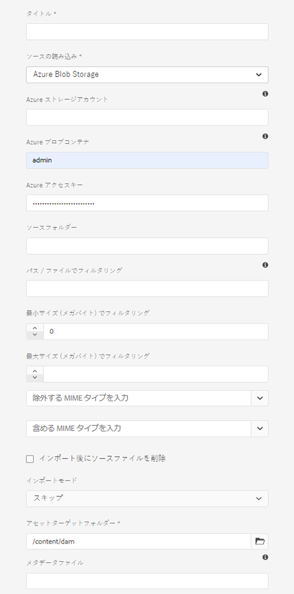

# Adobe Experience Manager へのデジタルアセットの追加 {#add-assets-to-experience-manager}

[!DNL Adobe Experience Manager] は、アップロードされたデジタルファイルのバイナリコンテンツを、リッチメタデータ、スマートタグ、レンディションおよびその他のデジタルアセット管理（DAM）サービスで強化します。画像、ドキュメント、生の画像ファイルなど、様々な種類のファイルを、ローカルフォルダーまたはネットワークドライブから [!DNL Experience Manager Assets] にアップロードできます。

アップロード方法は多数用意されています。最もよく使用されるブラウザーアップロードに加えて、他の方法でも Adobe Experience Manager リポジトリにアセットを追加することができます。Adobe Asset Link や Adobe Experience Manager デスクトップアプリケーションなどのデスクトップクライアント、ユーザーが作成するアップロードおよび取り込みスクリプト、Experience Manager 拡張機能として追加されている自動取り込み統合などです。

ここでは、エンドユーザー向けのアップロード方法に焦点を当て、Adobe Experience Manager API および SDK を使用したアセットアップロードおよび取り込みの技術的側面について説明する記事へのリンクを示します。

Adobe Experience Manager では任意のバイナリファイルをアップロードおよび管理できますが、最もよく使用されるファイル形式については、メタデータ抽出やプレビュー／レンディション生成などの追加サービスもサポートされています。詳しくは、[サポートされているファイル形式](file-format-support.md)を参照してください。

アップロードしたアセットに対して追加の処理をおこなうように選択することもできます。アセットのアップロード先のフォルダーに様々なアセット処理プロファイルを設定して、特定のメタデータ、レンディションまたは画像処理サービスを追加することができます。[アップロード時にアセットを処理](#process-when-uploaded)を参照してください。

>[!NOTE]
>
>[!DNL Cloud Service]としてのExperience Managerでは、新しいアセットのアップロード方法（直接バイナリアップロード）を利用します。 この方法は、Experience Manager ユーザーインターフェイス、Adobe Asset Link、Experience Manager デスクトップアプリケーションなどの標準の製品機能やクライアントでデフォルトでサポートされているので、エンドユーザーがそれを意識することはありません。
>
>ユーザー側の技術チームでカスタマイズまたは拡張されるアップロードコードでは、新しいアップロード API およびプロトコルを使用する必要があります。

[!DNL Cloud Service]としてのアセットには、次のアップロード方法が用意されています。 Adobeでは、使用する前に、アップロードオプションの使用事例と適用性を理解することをお勧めします。

| アップロード方法 | 用途? | プライマリの人物 |
|---------------------|----------------|-----------------|
| [アセットコンソールユーザーインターフェイス](#upload-assets) | 時折アップロード、プレスアンドドラッグの容易さ、ファインダーのアップロード。 大量のアセットをアップロードする場合は、を使用しないでください。 | すべてのユーザー |
| [アップロードAPI](#upload-using-apis) | アップロード中の動的な決定。 | デベロッパー |
| [[!DNL Experience Manager] デスクトップアプリ](https://experienceleague.adobe.com/docs/experience-manager-desktop-app/using/using.html) | 容量の少ないアセットの取り込み（移行の場合）。 | マーケター、管理者 |
| [Adobe Asset Link](https://helpx.adobe.com/enterprise/admin-guide.html/enterprise/using/adobe-asset-link.ug.html) | クリエイティブやマーケターが、サポートされる[!DNL Creative Cloud]デスクトップアプリ内でアセットを操作する場合に役立ちます。 | クリエイティブ、マーケティング担当者 |
| [アセット一括インジェスタ](#asset-bulk-ingestor) | 大規模な移行や、時折行われるバルクインジメンションに推奨。 サポートされるデータストアに対してのみ。 | 管理者、開発者 |

## アセットのアップロード {#upload-assets}

<!-- #ENGCHECK do we support pausing? I couldn't get pause to show with 1.5GB upload.... If not, this should be removed#

   You can pause the uploading of large assets (greater than 500 MB) and resume it later from the same page. Tap the **[!UICONTROL Pause]** icon beside progress bar that appears when an upload starts.

   

   The size above which an asset is considered a large asset is configurable. For example, you can configure the system to consider assets above 1000 MB (instead of 500 MB) as large assets. In this case, **[!UICONTROL Pause]** appears on the progress bar when assets of size greater than 1000 MB are uploaded.

   The Pause button does not show if a file greater than 1000 MB is uploaded with a file less than 1000 MB. However, if you cancel the less than 1000 MB file upload, the **[!UICONTROL Pause]** button appears.

   To modify the size limit, configure the `chunkUploadMinFileSize` property of the `fileupload`node in the CRX repository.

   When you click the **[!UICONTROL Pause]** icon, it toggles to a **[!UICONTROL Play]** icon. To resume uploading, click the **[!UICONTROL Play]** icon.

   
-->

<!-- #ENGCHECK do we support pausing? I couldn't get pause to show with 1.5GB upload.... If not, this should be removed#
   The ability to resume uploading is especially helpful in low-bandwidth scenarios and network glitches, where it takes a long time to upload a large asset. You can pause the upload operation and continue later when the situation improves. When you resume, uploading starts from the point where you paused it.
-->

<!-- #ENGCHECK assuming this is not relevant? remove after confirming#
   During the upload operation, [!DNL Experience Manager] saves the portions of the asset being uploaded as chunks of data in the CRX repository. When the upload completes, [!DNL Experience Manager] consolidates these chunks into a single block of data in the repository.

   To configure the cleanup task for the unfinished chunk upload jobs, go to `https://[aem_server]:[port]/system/console/configMgr/org.apache.sling.servlets.post.impl.helper.ChunkCleanUpTask`.
-->

ファイル（または複数のファイル）をアップロードするには、デスクトップ上でファイルを選択して、ユーザーインターフェイス（Web ブラウザー）内の目的のフォルダーにドラッグします。または、ユーザーインターフェイスからアップロードを開始することもできます。

1. [!DNL Assets] ユーザーインターフェイスで、デジタルアセットを追加する場所に移動します。
1. アセットをアップロードするには、以下のいずれかの操作をおこないます。

   * ツールバーで、**[!UICONTROL 作成]**/**[!UICONTROL ファイル]**&#x200B;をクリックします。 表示されたダイアログで、必要に応じてファイル名を変更できます。
   * HTML5 をサポートするブラウザーで、アセットを [!DNL Assets] ユーザーインターフェイスに直接ドラッグします。ファイル名を変更するためのダイアログは表示されません。

   

   複数のファイルを選択するには、`Ctrl`または`Command`キーを選択し、ファイル選択ダイアログでアセットを選択します。 iPad を使用している場合、一度に選択できるファイルは 1 つだけです。

1. 進行中のアップロードをキャンセルするには、進行状況バーの横にある閉じるボタン（「`X`」）をクリックします。アップロード処理をキャンセルすると、[!DNL Assets] はアセットのアップロード済みの部分を削除します。ファイルのアップロード前にアップロード操作をキャンセルすると、[!DNL Assets]は現在のファイルのアップロードを停止し、コンテンツを更新します。 ただし、既にアップロードされているファイルは削除されません。

1. [!DNL Assets] のアップロード進行状況ダイアログには、アップロードが成功したファイルと失敗したファイルの数が表示されます。さらに、[!DNL Assets]ユーザーインターフェイスには、アップロードした最新のアセットまたは最初に作成したフォルダーが表示されます。

>[!NOTE]
>
>ネストされたフォルダー階層をアップロードする方法については、[アセットの一括アップロード](#bulk-upload)を参照してください。

<!-- #ENGCHECK I'm assuming this is no longer relevant.... If yes, this should be removed#

### Serial uploads {#serialuploads}

Uploading numerous assets in bulk consumes significant I/O resources, which may adversely impact the performance of [!DNL Assets]. In particular, if you have a slow internet connection, the time to upload drastically increases due to a spike in disk I/O. Moreover, your web browser may introduce additional restrictions to the number of POST requests [!DNL Assets] can handle for concurrent asset uploads. As a result, the upload operation fails or terminate prematurely. In other words, [!DNL Assets] may miss some files while ingesting a bunch of files or altogether fail to ingest any file.

To overcome this situation, [!DNL Assets] ingests one asset at a time (serial upload) during a bulk upload operation, instead of the concurrently ingesting all the assets.

Serial uploading of assets is enabled by default. To disable the feature and allow concurrent uploading, overlay the `fileupload` node in Crx-de and set the value of the `parallelUploads` property to `true`.

### Streamed uploads {#streamed-uploads}

If you upload many assets to [!DNL Experience Manager], the I/O requests to server increase drastically, which reduces the upload efficiency and can even cause some upload task to time out. [!DNL Assets] supports streamed uploading of assets. Streamed uploading reduces the disk I/O during the upload operation by avoiding asset storage in a temporary folder on the server before copying it to the repository. Instead, the data is transferred directly to the repository. This way, the time to upload large assets and the possibility of timeouts is reduced. Streamed upload is enabled by default in [!DNL Assets].

>[!NOTE]
>
>Streaming upload is disabled for [!DNL Experience Manager] running on JEE server with servlet-api version lower than 3.1.
-->

### アセットが既に存在する場合のアップロードの処理 {#handling-upload-existing-file}

既存のアセットと同じパス（同じ名前と同じ場所）を持つアセットをアップロードできます。 ただし、次のオプションを含む警告ダイアログが表示されます。

* 既存のアセットを置き換える：既存のアセットを置き換える場合、アセットのメタデータと、既存のアセットに対して行った以前の変更（注釈、切り抜きなど）はすべて削除されます。
* 別のバージョンを作成する：既存のアセットの新しいバージョンがリポジトリに作成されます。 [!UICONTROL タイムライン]に2つのバージョンを表示でき、必要に応じて、以前のバージョンに戻すことができます。
* 両方を保持：両方のアセットを保持する場合、新しいアセットの名前は名前に`1`を付けて変更されます。

>[!NOTE]
>
>[!UICONTROL 名前の競合]ダイアログで「**[!UICONTROL 置換]**」を選択すると、新しいアセットのアセット ID が再生成されます。この ID は以前のアセットの ID とは異なります。
>
>[!DNL Adobe Analytics]を使用してインプレッション数またはクリック数の追跡をアセットインサイトで有効にしている場合、再生成されたアセットIDは、[!DNL Analytics]上のアセットに対してキャプチャされたデータを無効にします。

[!DNL Assets] で重複アセットを保持するには、「**[!UICONTROL 保持]**」をクリックします。アップロードした重複アセットを削除するには、「**[!UICONTROL 削除]**」をタップまたはクリックします。

### ファイル名の処理と禁止文字 {#filename-handling}

[!DNL Experience Manager Assets] では、ファイル名に使用禁止文字を含むアセットをアップロードできないようにします。ファイル名に禁止文字が含まれるアセットをアップロードしようとすると、[!DNL Assets] に警告メッセージが表示され、これらの文字を削除するか使用可能な名前でアップロードするまでアップロードが停止されます。一部のアップロード方法では、ファイル名に使用できない文字を含むアセットのアップロードが中止されませんが、文字が`-`に置き換えられます。

組織固有のファイル命名規則に合うように、[!UICONTROL アセットをアップロード]ダイアログでは、アップロードするファイルに長い名前を指定できます。以下の文字（スペース区切りリスト）はサポートされません。

* アセットファイル名`* / : [ \\ ] | # % { } ? &`に無効な文字があります
* アセットフォルダ名`* / : [ \\ ] | # % { } ? \" . ^ ; + & \t`に無効な文字があります

## アセットの一括アップロード {#bulk-upload}

バルクアセット取り込み機能を使用すると、何千ものアセットを効率的に処理できます。 ただし、大規模な取り込みは、ファイルの大量ダンプやブラインドマイグレーションだけではありません。 これは、ビジネスの目的を果たし、アセットの計画と管理を行う重要なプロジェクトとなり、より効率的に取り込むことができます。 すべてのインジェンションは同じではなく、一般化を行うには、高度なリポジトリ構成とビジネスニーズを考慮する必要があります。 次に、バルクインジェストの計画と実行に関する包括的な提案を示します。

* アセットのキュレーション：DAMに必要でないアセットを削除します。 未使用、古い、または重複アセットの削除を検討。 これにより、転送されるデータや取り込まれるアセットの量が減り、取り込み時間が短縮されます。
* アセットを整理する：ファイルサイズ、ファイル形式、使用例、優先度など、論理的な順序でコンテンツを編成することを検討します。 一般に、大きな複雑なファイルは、より多くの処理が必要になります。 大きいファイルは、ファイルサイズフィルタオプション（以下で説明）を使用して個別に取り込むことも検討できます。
* 分離を調整：取り込みを複数のバルク取り込みプロジェクトに分割することを検討します。 これにより、コンテンツを迅速に表示し、必要に応じてインジェストを更新できます。 例えば、処理負荷の高いアセットをピークでない時間帯に取り込んだり、複数のチャンクに分けて徐々に取り込んだりすることができます。 ただし、1回の操作でそれほど処理を行う必要のない、より小さく、シンプルなアセットを取り込むことができます。

アップロードするファイル数を増やすには、次のいずれかの方法を使用します。 [使用例とメソッド](#upload-methods-comparison)も参照してください

* [アセットアップロードAPI](developer-reference-material-apis.md#asset-upload-technical):必要に応じて、APIを利用したカスタムアップロードスクリプトまたはツールを使用して、アセットの処理（メタデータの翻訳やファイル名の変更など）を追加します。
* [Experience Managerデスクトップアプリ](https://experienceleague.adobe.com/docs/experience-manager-desktop-app/using/using.html):ローカルファイルシステムからアセットをアップロードするクリエイティブプロフェッショナルやマーケターに役立ちます。これを使用して、ローカルで使用可能なネストされたフォルダーをアップロードします。
* [一括取り込みツール](#asset-bulk-ingestor):大量のアセットを取り込む場合、場合によっては取り込むため、デプロイ時には最初に取り込むために使用 [!DNL Experience Manager]します。

### アセットバルクインジェスタツール{#asset-bulk-ingestor}

このツールは、AzureまたはS3データストアからのアセットの大規模な取り込みに使用する管理者グループに対してのみ提供されます。

ツールを設定するには、次の手順に従います。

1. **[!UICONTROL ツール]** > **[!UICONTROL アセット]** > **[!UICONTROL 一括読み込み]**&#x200B;に移動します。 「**[!UICONTROL 作成]**」オプションを選択します。

1. [!UICONTROL 一括インポート設定]ページで、必要な値を入力します。

   * [!UICONTROL タイトル]:説明的なタイトル。
   * [!UICONTROL インポート元]:適用するデータソースを選択します。
   * [!UICONTROL 最小サイズでフィルター]:アセットの最小ファイルサイズをMB単位で指定します。
   * [!UICONTROL 最大サイズでフィルタ]:アセットの最大ファイルサイズをMB単位で指定します。
   * [!UICONTROL Mimeタイプを除外]:インジェストから除外するMIMEタイプのコンマ区切りリスト。例： `image/jpeg, image/.*, video/mp4`
   * [!UICONTROL Mimeタイプを含める]:インジェストに含めるMIMEタイプのコンマ区切りリスト。[サポートされるすべてのファイル形式](/help/assets/file-format-support.md)を参照してください。
   * [!UICONTROL 読み込みモード]:「スキップ」、「置換」または「バージョンを作成」を選択します。スキップモードがデフォルトです。このモードでは、アセットが既に存在する場合は、取り込みをスキップします。 [replace and create version options](#handling-upload-existing-file)の意味を参照してください。
   * [!UICONTROL Assetsターゲットフォルダ]:アセットを読み込むDAM内の読み込みフォルダー。例：`/content/dam/imported_assets`

1. 作成したインジェスタ構成を削除、変更、実行したり、さらに作業を行ったりできます。 一括インポートインジェスタ構成を選択すると、ツールバーで次のオプションを使用できます。

   * [!UICONTROL 編集]:選択した設定を編集します。
   * [!UICONTROL 削除]:選択した設定を削除します。
   * [!UICONTROL チェック]:データストアへの接続を検証します。
   * [!UICONTROL ドライ作動]:一括取り込みのテスト実行を呼び出します。
   * [!UICONTROL 実行]:選択した設定を実行します。
   * [!UICONTROL 停止]:アクティブな構成を終了します。
   * [!UICONTROL ジョブのステータス]:進行中のインポートジョブで使用された場合、または完了したジョブで使用された場合の構成のステータスを表示します。
   * [!UICONTROL 表示アセット]:ターゲットフォルダーが存在する場合は、表示します。

>[!NOTE]
>
>セットアップした Adobe Experience Manager にデプロイする際に、他のシステムからのコンテンツ移行の一環として一括アップロードをおこなう場合は、使用するツールの入念な計画、検討、選択が必要です。コンテンツ移行方法のガイダンスについては、[デプロイメントガイド](/help/implementing/deploying/overview.md)を参照してください。

## デスクトップクライアントを使用したアセットのアップロード {#upload-assets-desktop-clients}

Adobe Experience Manager では、Web ブラウザーユーザーインターフェイスに加えて、デスクトップ上の他のクライアントもサポートしています。Web ブラウザーを使用しなくても、これらのクライアントでアップロード操作をおこなうことができます。

* [Adobe Asset Link](https://helpx.adobe.com/jp/enterprise/using/adobe-asset-link.html) を使用すると、Adobe Photoshop、Adobe Illustrator、Adobe InDesign の各デスクトップアプリケーションで [!DNL Experience Manager] 内のアセットにアクセスできます。これらのデスクトップアプリケーション内から、現在開いているドキュメントを Adobe Asset Link ユーザーインターフェイスを通じて直接 [!DNL Experience Manager] にアップロードできます。
* [Adobe Experience Manager デスクトップアプリケーション](https://experienceleague.adobe.com/docs/experience-manager-desktop-app/using/using.html)を利用すると、アセットのファイルタイプやアセットを操作するネイティブアプリケーションによらず、デスクトップ上でアセットを簡単に操作できます。ブラウザーアップロードではフラットなファイルリストのアップロードのみサポートしているので、ネストされたフォルダー階層内のファイルをローカルファイルシステムからアップロードできると非常に便利です。

## アップロード時にアセットを処理{#process-when-uploaded}

アップロードされたアセットに対して追加の処理を行うために、アップロードフォルダーに処理プロファイルを適用できます。 プロファイルーは、[!DNL Assets]内のフォルダーの&#x200B;**[!UICONTROL プロパティ]**&#x200B;ページで入手できます。

次のタブを使用できます。

* [メタデータプロファイル](metadata-profiles.md)：フォルダーにアップロードされたアセットにデフォルトのメタデータプロパティを適用できます。
* [処理プロファイル](asset-microservices-configure-and-use.md)：デフォルトで可能な数より多いレンディションを生成できます。

また、デプロイメントで[!DNL Dynamic Media]が有効になっている場合は、次のタブを使用できます。

* [Dynamic Media イメージプロファイル](dynamic-media/image-profiles.md)を使用すると、アップロードしたアセットに、特定の切り抜き（**[!UICONTROL スマート切り抜き]**&#x200B;およびピクセル切り抜き）やシャープの設定を適用できます。
* [Dynamic Media ビデオプロファイル](dynamic-media/video-profiles.md)を使用すると、特定のビデオエンコーディングプロファイル（解像度、形式、パラメーター）を適用できます。

>[!NOTE]
>
>アセットに対する Dynamic Media の切り抜きなどの操作は非破壊的です。つまり、アップロードした元の内容は変更されず、代わりに、アセットの配信時におこなわれる切り抜きやメディア変換のパラメーターが提供されます。

処理プロファイルが割り当てられているフォルダーの場合、プロファイル名がカード表示のサムネールに表示されます。リスト表示では、プロファイル名が「**[!UICONTROL 処理プロファイル]**」に表示されます。

## API を使用したアセットのアップロードまたは取り込み {#upload-using-apis}

アップロード API およびプロトコルの技術的詳細、およびオープンソース SDK とサンプルクライアントへのリンクについては、開発者向けリファレンスの[アセットアップロード](developer-reference-material-apis.md#asset-upload-technical)に関する節に記載されています。

>[!MORELIKETHIS]
>
>* [Adobe Experience Manager デスクトップアプリケーション](https://experienceleague.adobe.com/docs/experience-manager-desktop-app/using/introduction.html)
>* [Adobe Asset Link について](https://www.adobe.com/jp/creativecloud/business/enterprise/adobe-asset-link.html)
>* [Adobe Asset Link のドキュメント](https://helpx.adobe.com/enterprise/using/adobe-asset-link.html)
>* [アセットのアップロードに関するテクニカルリファレンス](developer-reference-material-apis.md#asset-upload-technical)

