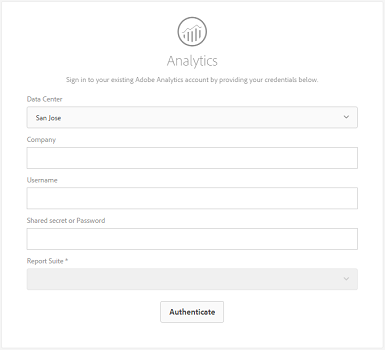

# Adobe Experience Managerへのデジタルアセットの追加 {#add-assets-to-experience-manager}

デジタルファイルをAdobe Experience Managerにアップロードすると、リッチメタデータ、スマートタグ、レンディション、その他のDigital Asset Management(DAM)サービスを使用して、ファイルのバイナリコンテンツが強化されます。 様々な種類のファイル（画像、PDFファイル、RAWファイルなど）をローカルフォルダーまたはネットワークドライブからExperience Manager Assetsにアップロードできます。

多数のアップロード方法が用意されています。 最も一般的に使用されるブラウザーのアップロードに加えて、Adobe Asset linkやExperience Managerデスクトップアプリケーションなどのデスクトップクライアント、ユーザーが作成するアップロードおよび取り込みスクリプト、AEM拡張機能として追加する自動取り込み統合など、Experience Managerリポジトリへのアセットの追加方法もあります。

ここでは、エンドユーザー向けのアップロード方法に焦点を当て、Experience Manager APIおよびSDKを使用したアセットのアップロードと取り込みの技術的側面を説明する記事へのリンクを提供します。

Experience Managerで任意のバイナリファイルをアップロードおよび管理できますが、メタデータ抽出やプレビュー/レンディションの生成など、他のサービスに対するサポートが最も一般的なファイル形式です。 詳しくは、サポ [ートされるファイル形式](file-format-support.md) を参照してください。

アップロードしたアセットに対して追加の処理を行うように選択することもできます。 アセットのアップロード先のフォルダーに、特定のメタデータ、レンディションまたは画像処理サービスを追加するために、複数のアセット処理プロファイルを設定できます。 詳しく [は、](#additional-processing) 「追加処理」を参照してください。

> [!NOTE]
>
> クラウドサービスとしてのExperience Managerは、アセットを直接バイナリアップロードする新しい方法を利用します。 デフォルトでは、AEMユーザーインターフェイス、Adobe Asset Link、AEMデスクトップアプリケーションなど、初期設定の製品機能とクライアントによってサポートされ、エンドユーザーに対して透過的です。
>
> お客様のテクニカルチームがカスタマイズまたは拡張するアップロードコードは、新しいアップロードAPIとプロトコルを使用する必要があります。

## Upload assets {#upload-assets}

ファイル（または複数のファイル）をアップロードするには、デスクトップ上でファイルを選択し、ユーザーインターフェイス（Webブラウザー）に目的のフォルダーにドラッグ&amp;ドロップします。 または、ユーザインターフェイスからアップロードを開始できます。

1. アセットユーザーインターフェイスで、デジタルアセットを追加する場所に移動します。
1. アセットをアップロードするには、以下のいずれかの操作をおこないます。

   * On the toolbar, tap the **[!UICONTROL Create]** icon. 次に、メニューで「**[!UICONTROL ファイル]**」をタップします。表示されたダイアログで、必要に応じてファイル名を変更できます。
   * HTML5をサポートするブラウザーで、アセットをアセットユーザーインターフェイスに直接ドラッグします。 ファイル名を変更するためのダイアログは表示されません。
   

   複数のファイルを選択するには、CtrlキーまたはCommandキーを押しながら、ファイル選択ダイアログでアセットを選択します。 iPadを使用する場合は、一度に1つのファイルのみを選択できます。

<!-- #ENGCHECK do we support pausing? I couldn't get pause to show with 1.5GB upload.... If not, this should be removed#

   You can pause the uploading of large assets (greater than 500 MB) and resume it later from the same page. Tap the **[!UICONTROL Pause]** icon beside progress bar that appears when an upload starts.

   

   The size above which an asset is considered a large asset is configurable. For example, you can configure the system to consider assets above 1000 MB (instead of 500 MB) as large assets. In this case, **[!UICONTROL Pause]** appears on the progress bar when assets of size greater than 1000 MB are uploaded.

   The Pause button does not show if a file greater than 1000 MB is uploaded with a file less than 1000 MB. However, if you cancel the less than 1000 MB file upload, the **[!UICONTROL Pause]** button appears.

   To modify the size limit, configure the `chunkUploadMinFileSize` property of the `fileupload`node in the CRX repository.

   When you click the **[!UICONTROL Pause]** icon, it toggles to a **[!UICONTROL Play]** icon. To resume uploading, click the **[!UICONTROL Play]** icon.

   
-->

1. To cancel an ongoing upload, click close (`X`) next to the progress bar. アップロード操作をキャンセルすると、AEM Assetsはアセットの部分的にアップロードされた部分を削除します。

   ファイルがアップロードされる前にアップロード操作をキャンセルすると、AEM Assets が現在のファイルのアップロードを停止し、コンテンツを更新します。ただし、既にアップロードされているファイルは削除されません。

<!-- #ENGCHECK do we support pausing? I couldn't get pause to show with 1.5GB upload.... If not, this should be removed#
   The ability to resume uploading is especially helpful in low-bandwidth scenarios and network glitches, where it takes a long time to upload a large asset. You can pause the upload operation and continue later when the situation improves. When you resume, uploading starts from the point where you paused it.
-->

<!-- #ENGCHECK assuming this is not relevant? please remove after confirming#
   During the upload operation, AEM saves the portions of the asset being uploaded as chunks of data in the CRX repository. When the upload completes, AEM consolidates these chunks into a single block of data in the repository.

   To configure the cleanup task for the unfinished chunk upload jobs, go to `https://[aem_server]:[port]/system/console/configMgr/org.apache.sling.servlets.post.impl.helper.ChunkCleanUpTask`.
-->

1. AEM Assets のアップロード進行状況ダイアログには、アップロードが成功したファイルと失敗したファイルの数が表示されます。

さらに、Assets ユーザーインターフェイスには、アップロードした最新のアセットまたは最初に作成したフォルダーが表示されます。

> [!NOTE]
>
> ネストされたフォルダー階層をAEMにアップロードする必要がある場合は、アセットの一括アッ [プロードを参照してください](#bulk-upload)

<!-- #ENGCHECK I'm assuming this is no longer relevant.... If yes, this should be removed#

### Serial uploads {#serialuploads}

Uploading numerous assets in bulk consumes significant I/O resources, which may adversely impact the performance of your AEM Assets instance. In particular, if you have a slow internet connection, the time to upload drastically increases due to a spike in disk I/O. Moreover, your web browser may introduce additional restrictions to the number of POST requests AEM Assets can handle for concurrent asset uploads. As a result, the upload operation fails or terminate prematurely. In other words, AEM assets may miss some files while ingesting a bunch of files or altogether fail to ingest any file.

To overcome this situation, AEM Assets ingests one asset at a time (serial upload) during a bulk upload operation, instead of the concurrently ingesting all the assets.

Serial uploading of assets is enabled by default. To disable the feature and allow concurrent uploading, overlay the `fileupload` node in Crx-de and set the value of the `parallelUploads` property to `true`.

### Streamed uploads {#streamed-uploads}

If you upload many assets to AEM, the I/O requests to server increase drastically, which reduces the upload efficiency and can even cause some upload task to time out. AEM Assets supports streamed uploading of assets. Streamed uploading reduces the disk I/O during the upload operation by avoiding asset storage in a temporary folder on the server before copying it to the repository. Instead, the data is transferred directly to the repository. This way, the time to upload large assets and the possibility of timeouts is reduced. Streamed upload is enabled by default in AEM Assets.

>[!NOTE]
>
>Streaming upload is disabled for AEM running on JEE server with servlet-api version lower than 3.1.
-->

### アセットが既に存在する場合のアップロードの処理 {#handling-upload-existing-file}

アセットのアップロード先に既に存在するアセットと同じ名前のアセットをアップロードすると、警告ダイアログが表示されます。

既存のアセットを置き換えるか、別のバージョンを作成するか、アップロードする新しいアセットの名前を変更して両方のアセットを残すかを選択できます。既存のアセットを置き換えると、そのアセットのメタデータと、既存のアセットに対して行った以前の変更（注釈、切り抜きなど）が削除されます。 If you choose to keep both assets, the new asset is renamed with the number `1` appended to its name.

>[!NOTE]
>
>When you select **[!UICONTROL Replace]** in the [!UICONTROL Name Conflict] dialog, the asset ID is regenerated for the new asset. この ID は以前のアセットの ID とは異なります。
>
>アセットインサイトがAdobe Analyticsでインプレッション数/クリック数の追跡を有効にしている場合、再生成されたアセットIDは、Analyticsでアセットに対して取得されたデータを無効にします。

AEM Assetsで重複したアセットを保持するには、「保持」をタップまたはクリック **[!UICONTROL します]**。 アップロードした重複アセットを削除するには、「削除」をタップまたはクリ **[!UICONTROL ックしま]**&#x200B;す。

### ファイル名の処理と禁止文字 {#filename-handling}

AEM Assetsでは、ファイル名に使用できない文字を使用してアセットをアップロードすることはできません。 不許可の文字を含むファイル名を持つアセットをアップロードしようとすると、AEM Assetsは警告メッセージを表示し、これらの文字を削除するか、許可された名前を持つアップロードを行うまでアップロードを停止します。

To suit specific file naming conventions for your organization, the [!UICONTROL Upload Assets] dialog lets you specify long names for the files that you upload.

ただし、以下の文字（スペース区切りリスト）はサポートされません。

* asset file name must not contain `* / : [ \\ ] | # % { } ? &`
* asset folder name must not contain `* / : [ \\ ] | # % { } ? \" . ^ ; + & \t`

## Bulk upload of assets {#bulk-upload}

多数のファイルをアップロードする場合、特にディスク上のネストされたフォルダ階層に存在する場合は、次の方法を使用できます。

* アセットアップロードAPIを利用するカスタムアップロードスクリプ [トまたはツールを使用](developer-reference-material-apis.md#asset-upload-technical)。 このようなカスタムツールを使用すると、必要に応じて、アセットの処理（メタデータの翻訳やファイル名の変更など）を追加できます。
* ネストされた [フォルダー階層をアップロードするには](https://docs.adobe.com/content/help/en/experience-manager-desktop-app/using/using.html) 、Experience Managerデスクトップアプリを使用します。

> [!NOTE]
>
> Experience Managerを設定してデプロイする際に、他のシステムからのコンテンツ移行の一環として一括アップロードを行う場合は、ツールの入念な計画、考慮、選択が必要です。 コンテンツ移行 [方法のガイダンスは](/help/implementing/deploying/overview.md) 、『導入ガイド』を参照してください。

## デスクトップクライアントを使用したアセットのアップロード {#upload-assets-desktop-clients}

Experience Managerは、Webブラウザーのユーザーインターフェイスに加えて、デスクトップ上の他のクライアントもサポートします。 また、Webブラウザーにアクセスしなくても、アップロード操作を行うことができます。

* [Adobe Asset linkを使用すると](https://helpx.adobe.com/enterprise/using/adobe-asset-link.html) 、Adobe Photoshop、Adobe IllustratorおよびAdobe inDesignデスクトップアプリケーションでAEMからアセットにアクセスできます。 現在開いているドキュメントは、これらのデスクトップアプリケーション内からAdobe Asset Linkユーザーインターフェイスから直接AEMにアップロードできます。
* [Experience Managerデスクトップアプリケーションは](https://docs.adobe.com/content/help/en/experience-manager-desktop-app/using/using.html) 、ファイルタイプやアセットを扱うネイティブアプリケーションに依存せず、デスクトップ上でアセットを簡単に操作できるようにします。 ブラウザーのアップロードではフラットファイルリストのアップロードのみがサポートされるので、ローカルファイルシステムからネストされたフォルダ階層にファイルをアップロードすると特に便利です。

## 追加処理 {#additional-processing}

アップロードされたアセットに対して追加の処理を行うには、アセットがアップロードされるフォルダー上のアセット処理プロファイルを使用できます。 これらは、[フォルダのプロパティ]ダイアログ **[!UICONTROL で使用できます]** 。

次のプロファイルを使用できます。

* [メタデータプロファイル](metadata-profiles.md) 。このプロファイルを使用して、フォルダーにアップロードされたアセットに初期設定のメタデータプロパティを適用できます
* [処理プロファイルを使用すると](asset-microservices-configure-and-use.md#processing-profiles) 、デフォルトの処理に加えて、レンディションの処理を適用し、レンディションを生成できます

また、お使いの環境でダイナミックメディアが有効になっている場合は、次の手順を実行します。

* [画像プロファイル](dynamic-media/image-profiles.md) を使用すると&#x200B;**[!UICONTROL 、特定の切り抜き(スマート切り抜き]** 、ピクセル切り抜き)とシャープの設定を、アップロードしたアセットに適用できます
* [ビデオプロファイル](dynamic-media/video-profiles.md) （解像度、形式、パラメーター）を使用して、特定のビデオエンコーディングプロファイルを適用できます。

> [!NOTE]
>
> ダイナミックメディアの切り抜きやアセットに対するその他の操作は、非破壊的です。つまり、アップロードされた元の内容は変更されず、アセットの配信時に行われる切り抜きやメディア変換のパラメーターが提供されます

処理プロファイルが割り当てられているフォルダーの場合、プロファイル名がカード表示のサムネールに表示されます。リスト表示では、プロファイル名が「**[!UICONTROL 処理プロファイル]**」に表示されます。

## APIを使用したアセットのアップロードまたは取り込み {#upload-using-apis}

アップロードAPIとプロトコルの技術的な詳細、およびオープンソースSDKとサンプルクライアントへのリンクは、開発者向けリファレンスの [アセット](developer-reference-material-apis.md#asset-upload-technical) ・アップロードの節に記載されています。

>[!MORELIKETHIS]
>
>* [Adobe Experience Manager デスクトップアプリケーション](https://docs.adobe.com/content/help/en/experience-manager-desktop-app/using/introduction.html)
>* [Adobe Asset Link](https://www.adobe.com/creativecloud/business/enterprise/adobe-asset-link.html)
>* [Adobe Asset linkドキュメント](https://helpx.adobe.com/enterprise/using/adobe-asset-link.html)
>* [アセットのアップロードに関するテクニカルリファレンス](developer-reference-material-apis.md#asset-upload-technical)

