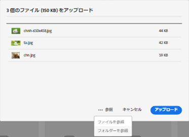
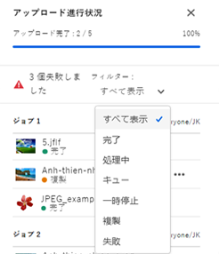
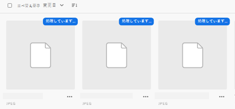
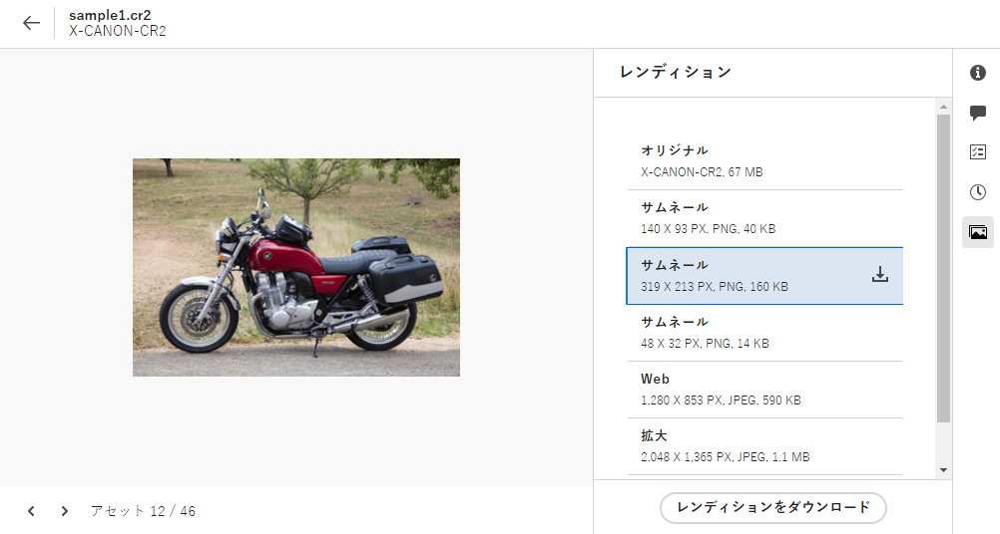
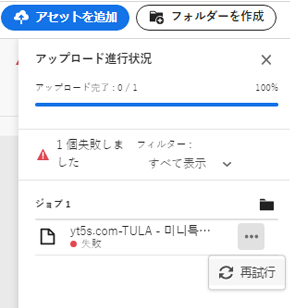
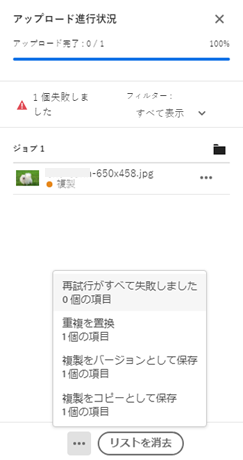

# アセットのアップロード {#add-assets}

操作対象となる新しいアセットを追加するには、ローカルファイルシステムからアセットをアップロードします。<!-- TBD: Many of the [common file formats are supported](/help/assets/supported-file-formats-assets-view.md). -->

次の方法を使用して、1 つ以上のアセットまたはアセットを含んだフォルダーをアップロードできます。

* ユーザーインターフェイス上でアセットまたはフォルダーをドラッグし、画面の指示に従って操作します。
* ツールバーの「**[!UICONTROL アセットを追加]**」オプションをクリックし、ファイルをいくつかアップロードダイアログに追加します。

<!-- TBD: Update this GIF
 -->

上記の方法のいずれかを使用して、フォルダーの作成後にアセットをアップロードできます。空のフォルダーを作成するには、ツールバーの「**[!UICONTROL フォルダーを作成]**」をクリックします。[!DNL Assets view] は強力なフルテキスト検索機能を提供しますが、フォルダーを使用してアセットを適切に整理することもできます。

ファイルを選択すると、確認ダイアログが表示され、さらにファイルを追加したり、既に選択したファイルを削除したりできます。選択した宛先にファイルを追加するには、「**[!UICONTROL ファイルを参照]**」をクリックし、「**[!UICONTROL ファイルを参照]**」または「**[!UICONTROL フォルダーを参照]**」を選択します。同じフォルダーまたは別のフォルダーから、さらにファイルまたはフォルダーを追加します。

すべてのファイルがキューに入ったら、「**[!UICONTROL アップロード]**」をクリックします。

*図：選択したアセットをアップロードする前にキューにアセットを追加またはキューからアセットを削除可能*

>[!TIP]
>
>フォルダー構造をアセットビューにアップロードする場合、フォルダー構造を含んだ .ZIP ファイルを作成する必要はなく、フォルダー構造を直接アップロードできます。アセットビューにアップロードされた .ZIP ファイルは 1 つの ZIP アセットとして保存され、アップロード後に自動的には抽出されません。

## アップロードの進行状況とステータスの表示 {#upload-progress}

多数のアセットまたはネストしたフォルダーを [!DNL Assets view] にアップロードする場合、アセットの重複やネットワークの問題など、様々な理由で一部のアセットのアップロードに失敗することがあります。

アップロードの進行状況を追跡するには、ツールバーの「**[!UICONTROL アップロードの進行状況]**」オプションをクリックします。すべてのアセットのアップロードの進行状況がパネルに表示されます。

アップロードの進行状況またはステータスに基づいてアセットのサブセットを表示するには、**[!UICONTROL アップロードの進行状況]**&#x200B;サイドバーのフィルターを使用します。様々なフィルターがあり、それぞれ、すべてのアセット、完了したアップロード、進行中のアップロード、キューに入れられたアップロード対象アセット、一時停止したアップロード、重複したアセット、アップロードに失敗したアセットの表示に使用されます。

*図：アップロードのステータスまたは進行状況に基づく、アップロードしようとしたアセットのフィルタリング*

アセットがアップロードされると、[!DNL Assets view] はすぐにそれらのアセットを処理してサムネールを生成し、メタデータを処理します。アセットの数が多いと、処理に時間がかかります。サムネールが表示されず、プレースホルダーサムネールに処理メッセージが表示される場合は、数分後にフォルダーを再度確認してください。処理時に [!DNL Assets view] は特に、レンディションを生成し、スマートタグを追加して、検索用にアセット詳細のインデックスを作成します。

*図：アップロードされたアセットが処理されているタイルに表示される処理中ステータス*

## アセットレンディション {#renditions}

[!DNL Assets view] は、アップロードされたアセットをほぼリアルタイムで処理し、サポートされている多くのファイルタイプに対して、レンディションを生成します。画像用に作成されたレンディションは、アップロードされた画像のサイズが変更されたバージョンです。アセットだけでなく、レンディションもダウンロードして、適切なバージョンを使用できます。[アセットをプレビュー](/help/assets/navigate-assets-view.md#preview-assets)すると、アセットのすべてのレンディションを表示できます。

*図：レンディションの表示とダウンロード*

## 失敗したアップロードの管理 {#resolve-upload-fails}

サポートされているアセットのアップロードが何らかの理由で失敗した場合は、[!UICONTROL アップロードの進行状況]ウィンドウの「**[!UICONTROL 再試行]**」をクリックします。

*図：サポートされているファイルのアップロードが何らかの理由で失敗した場合の再試行*

重複したアセットをアップロードしようとしても、アップロードを明示的に確認するまで、アセットはアップロードされません。最初、重複したアセットは、アップロードの失敗としてマークされます。これを解決するには、バージョンの作成、既存アセットの置き換えと削除、アセット名の変更による複製コピーの作成のいずれかを行うだけです。このようなエラーは、1 アセットずつ解決することも、失敗したすべての重複に対して一括で解決することもできます。

*図：デフォルトでアップロードに失敗した重複アセットについて、1 アセットずつ問題を解決*

*図：デフォルトでアップロードに失敗した重複アセットについて、すべてのアセットの問題を一度に解決*

>[!TIP]
>
>[!DNL Creative Cloud] デスクトップアプリケーション内から直接 DAM リポジトリにアセットをアップロードできます。
<!--TBD
See how [[!DNL Assets view] integrates with [!DNL Adobe Asset Link]](/help/assets/integration-assets-view.md).
-->

## アセットまたはフォルダーの削除 {#delete-assets}

不要になった個々のアセットやフォルダーを削除できます。アセットまたはフォルダーを削除するには、次のいずれかを行います。

* アセットまたはフォルダーのサムネールで使用できるオプションを使用します。

  

  *図：アセットタイルまたはフォルダータイルでファイルやフォルダーに使用できるアクション*

* アセットまたはフォルダーを選択し、ツールバーの&#x200B;**[!UICONTROL 削除]**&#x200B;アイコン（）をクリックします。

## 次の手順 {#next-steps}

* [ビデオを視聴してアセットビューへのアセットのアップロードを学ぶ](https://experienceleague.adobe.com/docs/experience-manager-learn/assets-essentials/basics/creating.html?lang=ja)

* アセットビューユーザーインターフェイスの[!UICONTROL フィードバック]オプションを使用して製品フィードバックを提供する

* 右側のサイドバーにある「[!UICONTROL このページを編集]」（）または「[!UICONTROL 問題を記録] 」（）を使用してドキュメントに関するフィードバックを提供する

* [カスタマーケア](https://experienceleague.adobe.com/ja?support-solution=General&lang=ja#support)に問い合わせる
