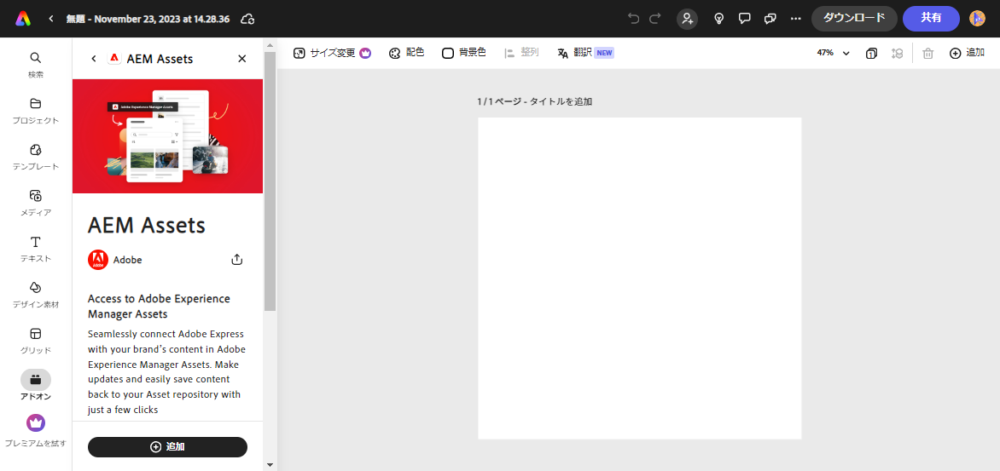
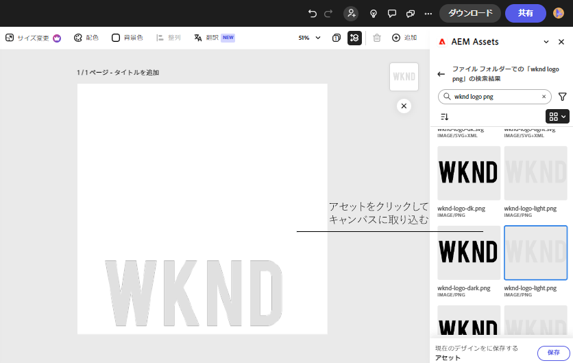
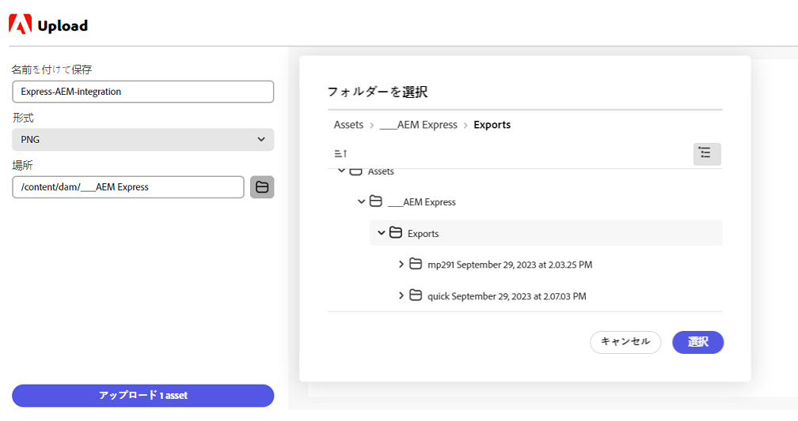

# Adobe Express 向けの AEM Assets アドオン {#assets-addon-adobe-express}

Adobe Express 向けの AEM Assets アドオンを使用すると、Adobe Express ユーザーインターフェイス内から AEM Assets に保存されているアセットに直接アクセスできます。AEM Assets で管理するコンテンツを Express キャンバスに配置し、新しいコンテンツや編集したコンテンツを AEM Assets リポジトリに保存できます。アドオンには、次のような主なメリットがあります。

* AEM での新しいアセットの編集と保存によるコンテンツの再利用の向上

* 新しいアセットを作成したり、既存のアセットの新しいバージョンを作成したりする際の全体的な時間と労力の削減

## 前提条件 {#prerequisites}

AEM Assets 内の Adobe Express と 1 つ以上の環境にアクセスする権限。環境は、Assets as a Cloud Service または Assets Essentials 内の任意のリポジトリでも構いません。

## Adobe Express への AEM Assets アドオンの追加 {#access-assets-addon}

次の手順を実行して、AEM Assets アドオンを Adobe Express に追加します。

1. Adobe Express web アプリケーションを開きます。

1. 新しいテンプレートまたはプロジェクトを読み込むか、アセットを作成して、新しい空のキャンバスを開きます。

1. 左側のナビゲーションウィンドウで「**[!UICONTROL アドオン]**」をクリックします。

1. 「[!UICONTROL アドオン]」セクションの上部にある検索バーで「**[!UICONTROL AEM Assets]**」を指定し、「AEM Assets アドオン」をクリックします。

   

1. 「**[!UICONTROL 追加]**」をクリックします。アドオンは「**[!UICONTROL アドオン]**」セクションのリストに表示されます。もう一度アドオンをクリックすると、右側のナビゲーションウィンドウにコンテンツが表示されます。アドオンには、アクセス権が付与されたリポジトリのリストとルートレベルで使用可能なアセットおよびフォルダーのリストが表示されます。

   検索バーを使用して、キャンバスで使用する必要があるアセットを検索します。

   

   A. AEM Assets リポジトリを選択します。B. 検索バーを使用してアセットを検索します。C. アセットを昇順または降順で並べ替えます。D. 選択した場所でアセットおよびフォルダーが使用可能になります。E. AEM Assets に変更を保存します。

## Adobe Express エディターでの AEM Assets の使用 {#use-aem-assets-in-express}

Adobe Express に AEM Assets アドオンを追加した後、Express キャンバス内の AEM Assets リポジトリに保存されている PNG 画像および JPEG 画像を使用し始めることができます。適切なフォルダーに移動し、アセットをクリックしてキャンバスに含めます。

## AEM Assets での Adobe Express プロジェクトの保存 {#save-express-projects-in-assets}

Express キャンバスに適切な変更を組み込んだ後、AEM Assets リポジトリに保存できます。

1. 「**[!UICONTROL 保存]**」をクリックして、**[!UICONTROL アップロード]**&#x200B;ダイアログを開きます。
1. アセットの名前と形式を指定します。キャンバスのコンテンツは、PNG 形式または JPEG 形式で保存できます。

1. 「**[!UICONTROL 場所]**」フィールドの横にあるフォルダーアイコンをクリックして、アセットを保存する必要がある場所に移動し、「**[!UICONTROL 選択]**」をクリックします。フォルダーの名前が「**[!UICONTROL 場所]**」フィールドに表示されます。

1. 「**[!UICONTROL アップロード]**」をクリックして、AEM Assets にアセットをアップロードします。

   
