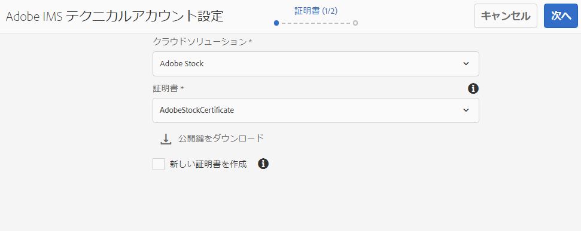
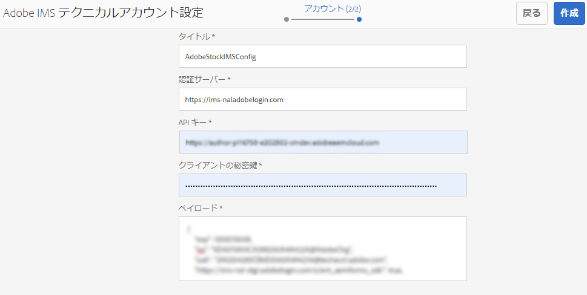
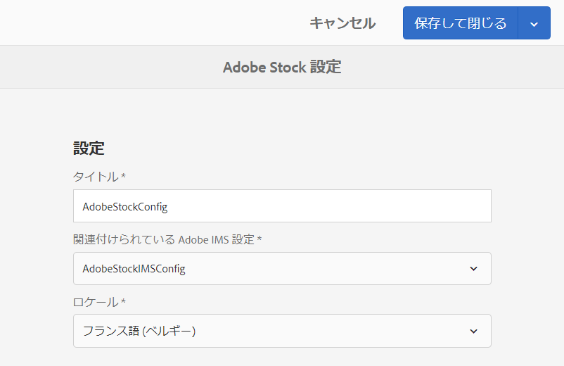
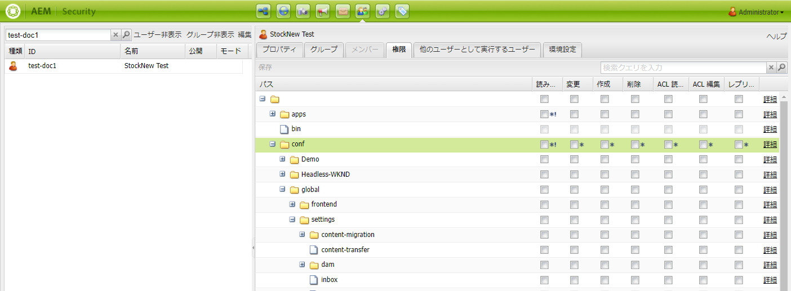
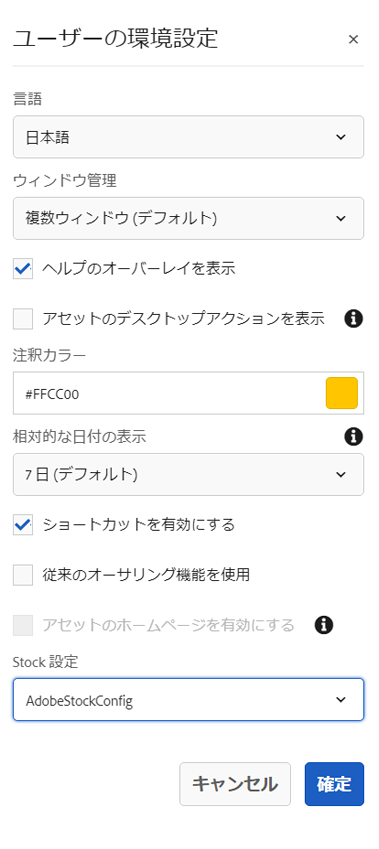
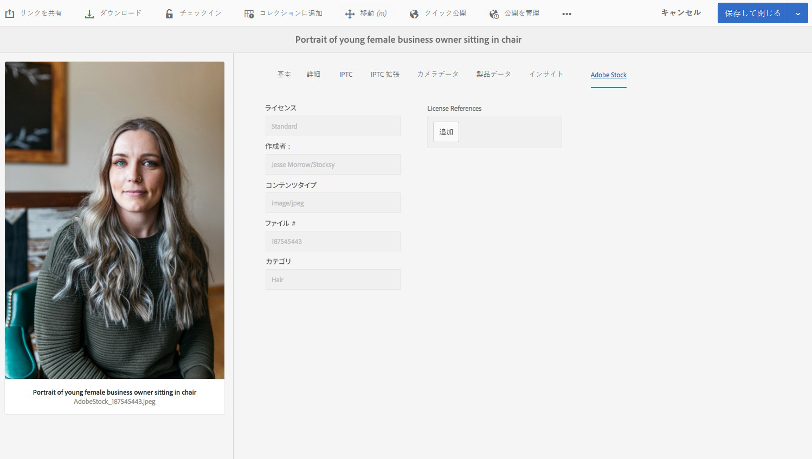
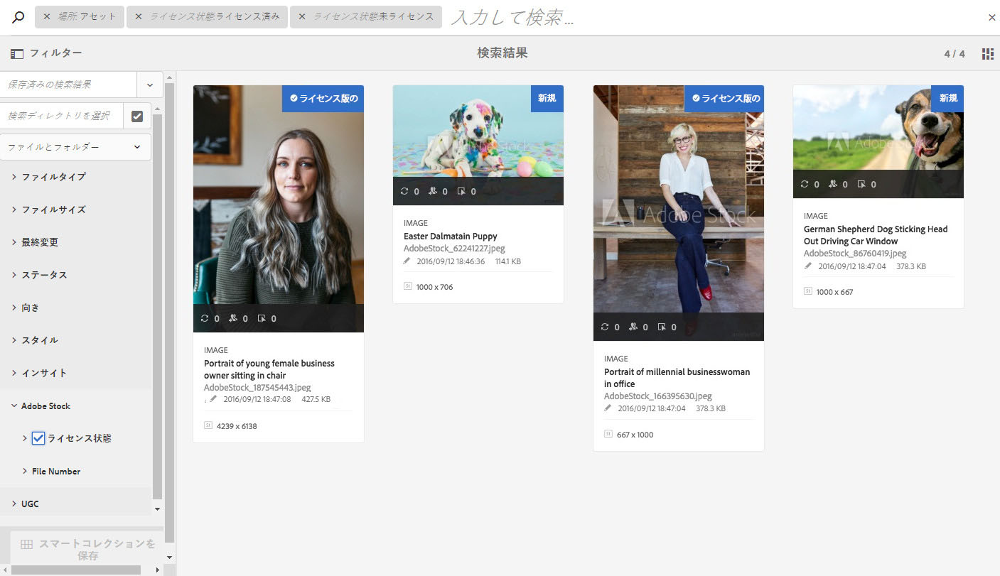
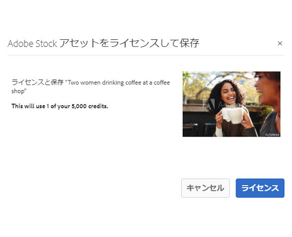

# [!DNL Adobe Experience Manager Assets] での [!DNL Adobe Stock] アセットの使用 {#use-adobe-stock-assets-in-aem-assets}

<table>
    <tr>
        <td>
            <i>新規</i> <a href="/help/assets/dynamic-media/dm-prime-ultimate.md"><b>Dynamic Media Prime と Ultimate</b></a>
        </td>
        <td>
            <i>新規</i> <a href="/help/assets/assets-ultimate-overview.md"><b>AEM Assets Ultimate</b></a>
        </td>
        <td>
            <i>新規</i> <a href="/help/assets/integrate-aem-assets-edge-delivery-services.md"><b>AEM Assets と Edge Delivery Services の統合</b></a>
        </td>
        <td>
            <i>新規</i> <a href="/help/assets/aem-assets-view-ui-extensibility.md"><b>UI 拡張機能</b></a>
        </td>
          <td>
            <i>新規</i> <a href="/help/assets/dynamic-media/enable-dynamic-media-prime-and-ultimate.md"><b>Dynamic Media Prime と Ultimate の有効化</b></a>
        </td>
    </tr>
    <tr>
        <td>
            <a href="/help/assets/search-best-practices.md"><b>検索のベストプラクティス</b></a>
        </td>
        <td>
            <a href="/help/assets/metadata-best-practices.md"><b>メタデータのベストプラクティス</b></a>
        </td>
        <td>
            <a href="/help/assets/product-overview.md"><b>コンテンツハブ</b></a>
        </td>
        <td>
            <a href="/help/assets/dynamic-media-open-apis-overview.md"><b>OpenAPI 機能を備えた Dynamic Media</b></a>
        </td>
        <td>
            <a href="https://developer.adobe.com/experience-cloud/experience-manager-apis/"><b>AEM Assets 開発者向けドキュメント</b></a>
        </td>
    </tr>
</table>

| バージョン | 記事リンク |
| -------- | ---------------------------- |
| AEM 6.5 | [ここをクリックしてください](https://experienceleague.adobe.com/docs/experience-manager-65/assets/using/aem-assets-adobe-stock.html?lang=ja) |
| AEM as a Cloud Service | この記事 |

[!DNL Adobe Stock] サービスは、あらゆるクリエイティブプロジェクトに使用できる、適切にキュレーションされ、著作権使用料が不要で質の高い何百万点もの写真、ベクター、イラスト、ビデオ、テンプレートおよび 3D アセットを提供します。

[!DNL Adobe Stock] エンタープライズ版の場合は、デフォルトで、組織全体での共有権限が含まれます。組織のユーザーがアセットのライセンスを取得すると、組織の他のユーザーがこのアセットを識別、ダウンロード、使用できるようになります。再度ライセンスを取得する必要はありません。組織でアセットのライセンスを取得すると、そのアセットの使用権限が永続的に有効になります。

[!DNL Adobe Stock] エンタープライズ版プランと [!DNL Experience Manager Assets] を統合すると、[!DNL Experience Manager] の強力なアセット管理機能を使用して、ライセンスを取得したアセットをクリエイティブプロジェクトやマーケティングプロジェクトに幅広く活用できます。[!DNL Experience Manager] ユーザーは、[!DNL Experience Manager] に保存されている Adobe Stock アセットの検索、プレビューおよびライセンス取得を、[!DNL Experience Manager] インターフェイスから画面を切り替えることなく、すばやく実行できます。

## [!DNL Experience Manager] と [!DNL Adobe Stock] を統合するための前提条件 {#integrate-aem-and-adobe-stock}

[!DNL Experience Manager Assets] を使用すると、ユーザーは [!DNL Experience Manager] から直接、[!DNL Adobe Stock] アセットの検索、プレビュー、保存、ライセンス取得を実行できます。

この統合を有効にするには、次の要件を満たします。

* 実行中の [!DNL Experience Manager Assets] as a [!DNL Cloud Service] インスタンス。
* エンタープライズ [!DNL Adobe Stock] プラン。
* デフォルトの Stock 製品プロファイルに [!DNL Admin Console] する権限を持つユーザー。
* [!DNL Adobe Developer Console] で統合を作成するための [!DNL Developer Access profile] への権限を持つユーザー。

[!DNL Adobe Stock] エンタープライズ版プラン

* [!DNL Adobe Stock] （Experience Managerと統合された Stock）製品を使用するための権利付与
* Stock の使用権が購入されていることを [!DNL Adobe Admin Console] にクレジットします。
* [!DNL Adobe Admin Console] 内からのクレジットとライセンスのグローバルな管理を有効にします。

権利付与において、[!DNL Adobe Stock] のデフォルトの製品プロファイルは [!DNL Admin Console] に存在します。複数のプロファイルを作成でき、これらのプロファイルによって、誰が Stock アセットのライセンスを取得できるかが決まります。製品プロファイルに直接アクセスできるユーザーは、[https://stock.adobe.com/jp](https://stock.adobe.com/jp/) にアクセスして、Stock アセットのライセンスを取得できます。一方、Developer Access を使用して統合（API）を作成する方法もあります。この統合により、[!DNL Experience Manager Assets] と [!DNL Adobe Stock] 間の通信が認証されます。

<!--
### Create an IMS configuration {#create-an-ims-configuration}

1. In the [!DNL Experience Manager] user interface, navigate to **[!UICONTROL Tools]** > **[!UICONTROL Security]** > **[!UICONTROL Adobe IMS Configurations]**. Click **[!UICONTROL Create]** and select **[!UICONTROL Cloud Solution]** > **[!UICONTROL Adobe Stock]**.
1. Either reuse an existing certificate or select **[!UICONTROL Create new certificate]**.
1. Click **[!UICONTROL Create certificate]**. Once created, download the public key. Click **[!UICONTROL Next]**. Leave the [!UICONTROL Adobe IMS Technical Account Configuration] screen open to provide the required values shortly.
1. Access [Adobe Developer Console](https://console.adobe.io). Ensure that your account has administrator permissions for the organization for which the integration is required.
1. Click **[!UICONTROL Create new project]** and click **[!UICONTROL Add API]**. Select **[!UICONTROL Adobe Stock]** from the list of APIs that are available to you. Select [!UICONTROL OAUTH 2.0 Web].
1. Provide **[!UICONTROL Default redirect URI]** and **[!UICONTROL Redirect URI pattern]** values. Click **[!UICONTROL Save configured API]**. Copy the generated ID and secret.
1. In [!UICONTROL Adobe IMS Technical Account Configuration] screen, provide the values in the boxes titled **[!UICONTROL Title]**, **[!UICONTROL Authorization Server]**, **[!UICONTROL API Key]**, **[!UICONTROL Client Secret]**, and **[!UICONTROL Payload]**. For detailed information about these values, see [JWT authentication quick start](https://www.adobe.io/authentication/auth-methods.html#!AdobeDocs/adobeio-auth/master/JWT/JWT.md).
-->

<!-- 
TBD: Update the URL to update the terminology when AIO team updates their documentation URL. Logged issue github.com/AdobeDocs/adobeio-auth/issues/63.
-->

<!--
### Create [!DNL Adobe Stock] configuration in [!DNL Experience Manager] {#create-adobe-stock-configuration-in-aem}

1. In the [!DNL Experience Manager], navigate to **[!UICONTROL Tools]** > **[!UICONTROL Cloud Services]** > **[!UICONTROL Adobe Stock]**.
1. Click **[!UICONTROL Create]** to create a configuration and associate it with your existing IMS Configuration. Select `PROD` as the environment parameter.
1. In **[!UICONTROL Licensed Assets Path]** field, leave a location as is. Do not change the location where you want to store the [!DNL Adobe Stock] assets.
1. Complete creation by adding all the required properties. Click **[!UICONTROL Save & Close]**.
1. Add [!DNL Experience Manager] users or groups, who can license the assets.

>[!NOTE]
>
>If there are multiple [!DNL Adobe Stock] configurations, select the desired configuration in User Preferences panel. To access the panel from Experience Manager home page, click the user icon and then click **[!UICONTROL User Preferences]** > **[!UICONTROL Stock Configuration]**.
-->

## [!DNL Experience Manager] と [!DNL Adobe Stock] の統合  {#integrate-adobe-stock-with-aem-assets}

開発者は、次の手順を実行して [!DNL Adobe Experience Manager] と [!DNL Adobe Stock] を統合します。

<!--
1. [Obtain public certificate](#public-certificate)
   
   In [!DNL Experience Manager], create an IMS account and generate a public certificate (public key).

1. [Create service account (JWT) connection](#createnewintegration) 
   
   In [!DNL Adobe Developer Console], create a project for your [!DNL Adobe Stock] organization. Under the project, configure an API using the public key to create a service account (JWT) connection. Get the service account credentials and JWT payload information.

1. [Configure IMS account](#create-ims-account-configuration)

   In [!DNL Experience Manager], configure the IMS account using the service account credentials and JWT payload.

1. [Configure cloud service](#configure-the-cloud-service)

   In [!DNL Experience Manager], configure an [!DNL Adobe Stock] cloud service using the IMS account.

### Create an IMS configuration {#create-an-ims-configuration}

The IMS configuration authenticates your [!DNL Experience Manager Assets] author instance with the [!DNL Adobe Stock] entitlement. 

IMS configuration includes two steps:

* [Obtain public certificate](#public-certificate) 
* [Configure IMS account](#create-ims-account-configuration)

### Obtain public certificate {#public-certificate}

The public key (certificate) authenticates your product profile in Adobe Developer Console.

1. Log in to your [!DNL Experience Manager Assets] cloud instance.

1. From the **[!UICONTROL Tools]** panel, navigate to **[!UICONTROL Security]** > **[!UICONTROL Adobe IMS Configurations]**.

1. In Adobe IMS Configurations page, click **[!UICONTROL Create]**. The **[!UICONTROL Adobe IMS Technical Account Configuration]** page opens. 

1. In the **[!UICONTROL Certificate]** tab, select **[!UICONTROL Adobe Stock]** from the **[!UICONTROL Cloud Solution]** drop-down list.  

1. You can create a certificate or reuse an existing certificate for the configuration. 

   To create a certificate, select the **[!UICONTROL Create new certificate]** check box and specify an **alias** for the public key. The alias serves as name of the public key. 

1. Click **[!UICONTROL Create certificate]**. Then, click **[!UICONTROL OK]** to generate the public key.

1. Click the **[!UICONTROL Download Public Key]** icon and save the public key (.crt) file on your machine. The public key is used later to configure API for your Brand Portal tenant and generate service account credentials in Adobe Developer Console.

   Click **[!UICONTROL Next]**.

   

1. In the **Account** tab, Adobe IMS account is created which requires the service account credentials.

   Open a new tab and [create a service account (JWT) connection in Adobe Developer Console](#createnewintegration). 

### Create service account (JWT) connection {#createnewintegration}

In Adobe Developer Console, projects and APIs are configured at organization level. Configuring an API creates a service account (JWT) connection. There are two methods to configure API, by generating a key pair (private and public keys) or by uploading a public key. In this example, the service account credentials are generated by uploading the public key.

To generate the service account credentials and JWT payload:

1. Log in to Adobe Developer Console with system administrator privileges. The default URL is [https://www.adobe.com/go/devs_console_ui](https://www.adobe.com/go/devs_console_ui).

   Ensure that you have selected the correct IMS organization (Stock entitlement) from the drop-down (organization) list.

1. Click **[!UICONTROL Create new project]**. A blank project with a system-generated name is created for your organization. 

   Click **[!UICONTROL Edit project]**. Update the **[!UICONTROL Project Title]** and **[!UICONTROL Description]**, and then click **[!UICONTROL Save]**.
   
1. In the **[!UICONTROL Project overview]** tab, click **[!UICONTROL Add API]**.

1. In the **[!UICONTROL Add an API window]**, select **[!UICONTROL Adobe Stock]**. Click **[!UICONTROL Next]**. 

1. In the **[!UICONTROL Configure API]** window, select **[!UICONTROL Service Account (JWT)]** authentication. Click **[!UICONTROL Next]**.

   

1. Click **[!UICONTROL Upload your public key]**. Click **[!UICONTROL Select a File]** and upload the public key (.crt file) that you have downloaded in the [obtain public certificate](#public-certificate) section. Click **[!UICONTROL Next]**.

1. Verify the public key and click **[!UICONTROL Next]**.

1. Select the default **[!UICONTROL Adobe Stock]** product profile and click **[!UICONTROL Save configured API]**. 

1. Once the API is configured, you are redirected to the API overview page. From the left navigation under **[!UICONTROL Credentials]**, click the **[!UICONTROL Service Account (JWT)]** option. Here, you can view the credentials and perform actions such as generate JWT tokens, copy credential details, and retrieve client secret.

1. From the **[!UICONTROL Client Credentials]** tab, copy the **[!UICONTROL client ID]**. 

   Click **[!UICONTROL Retrieve Client Secret]** and copy the **[!UICONTROL client secret]**.

   

1. Navigate to the **[!UICONTROL Generate JWT]** tab and copy the **[!UICONTROL JWT Payload]** information. 

You can now use the client ID (API key), client secret, and JWT payload to [configure the IMS account](#create-ims-account-configuration) in [!DNL Experience Manager Assets].

### Configure IMS account {#create-ims-account-configuration}

You must have the [certificate](#public-certificate) and [service account (JWT) credentials](#createnewintegration) to configure the IMS account.

To configure the IMS account: 

1. Open the IMS Configuration and navigate to the **[!UICONTROL Account]** tab. You kept the page open while [obtaining the public certificate](#public-certificate).

1. Specify a **[!UICONTROL Title]** for the IMS account.

   In the **[!UICONTROL Authorization Server]** field, enter the URL: [https://ims-na1.adobelogin.com/](https://ims-na1.adobelogin.com/).  

   Enter the client ID in the **[!UICONTROL API key]** field, **[!UICONTROL Client Secret]**, and **[!UICONTROL Payload]** (JWT payload) that you have copied while [creating the service account (JWT) connection](#createnewintegration).

1. Click **[!UICONTROL Create]**. An IMS account configuration is created. 

   
   
1. Select the IMS account configuration and click **[!UICONTROL Check Health]**.

   Click **[!UICONTROL Check]** in the dialog box. On successful configuration, a message appears that the *Token is retrieved successfully*.

   
-->

1. [ [!DNL Developer Console] の場所でプログラムを設定します。](#set-up-a-program-in-developer-console)
1. [オーサーインスタンスへの設  [!DNL AEM]  の追加](#add-configuration-in-the-aem-author-instance)

### [!DNL Developer Console] でのプログラムの設定 {#set-up-a-program-in-developer-console}

[!DNL Developer Console] でプログラムを設定するには、次の手順を実行します。
1. [[!DNL Adobe Developer Console]](https://developer.adobe.com/console/14431/user/servicesandapis) に移動し、組織にログインします。
1. **[!UICONTROL プロジェクト]** ダッシュボードで使用可能な **[!UICONTROL 新規プロジェクトを作成]** を選択します。
   
1. 「**[!UICONTROL プロジェクトに追加]**」をクリックし、「**[!UICONTROL API]**」を選択します。
1. 「**[!UICONTROL Adobe Stock]**」を選択し、「**[!UICONTROL 次へ]** をクリックします。
1. **[!UICONTROL 資格情報名]** を指定し、「**[!UICONTROL OAuth サーバー間]**」が選択されていることを確認して、「**[!UICONTROL 次へ]**」をクリックします。
1. **[!UICONTROL AEM Assets]** **[!UICONTROL 製品プロファイル]** を選択し、「**[!UICONTROL 設定済み API を保存]**」をクリックします。 プロジェクトでプロジェクトが作成されたことを確認する成功メッセージが [!DNL Developer Console] 示されます。 プロジェクトのダッシュボードが開き、上部にプロジェクト名、{API ]**の下に]** 0}Adobe Stock ]****[!UICONTROL 、{ 製品プロファイル **[!UICONTROL の下に**[!UICONTROL  AEM Assets ]**、{ 接続された資格情報]** の下に **[!UICONTROL OAuth サーバー間]****[!UICONTROL 資格情報カードが表示されます。**[!UICONTROL 
   
1. **[!UICONTROL OAuth サーバー間]** 資格情報カードを選択すると **[!UICONTROL 資格情報の詳細]** が表示されます。 **[!UICONTROL クライアント ID]**、**[!UICONTROL クライアントシークレット]**、**[!UICONTROL 範囲]**、**[!UICONTROL 資格情報名]**、**[!UICONTROL テクニカルアカウント ID]**、**[!UICONTROL 組織 ID]** など、プロジェクトの [!DNL OAuth Server-to-Server] しい資格情報詳細を使用して、[AEM オーサーインスタンスに設定を追加 ](#add-configuration-in-the-aem-author-instance) します。
   

### [!DNL AEM] オーサーインスタンスへの設定の追加 {#add-configuration-in-the-aem-author-instance}

[!DNL AEM] オーサーインスタンスに設定を追加するには、次の手順を実行します。

1. [オーサーインスタンス  [!DNL Adobe Stock IMS configuration]  の新しい  [!DNL AEM]  定](#set-up-adobe-stock-ims-configuration-in-aem-author-instance)
1. [接続先のクラウド設定を追加しま  [!DNL Adobe Stock]。](#add-cloud-configuration-to-connect-adobe-stock)

#### [!DNL AEM author] インスタンスでの新しい [!DNL Adobe Stock IMS configuration] の設定 {#set-up-adobe-stock-ims-configuration-in-aem-author-instance}

[!DNL AEM] オーサーインスタンスに新しい [!DNL Adobe Stock IMS configuration] をセットアップするには、次の手順を実行します。
1. [!DNL AEM] オーサーインスタンスに移動します。
1.  をクリックし、「**[!UICONTROL セキュリティ]** を選択して、「**[!UICONTROL Adobe IMS設定]**」を選択します。
1. **[!UICONTROL 作成]** をクリックして、新しい IMS 設定を作成します。 **[!UICONTROL Adobe IMSテクニカルアカウント設定]** ページには、「**[!UICONTROL クラウドソリューション]**」、「**[!UICONTROL タイトル]**」、「**[!UICONTROL 認証サーバー]**」、「**[!UICONTROL クライアント ID]**」、「**[!UICONTROL クライアントシークレット]**」、「**[!UICONTROL 範囲]**」、「**[!UICONTROL 組織 ID]** などの複数のフィールドが表示されます。 これらのフィールドに詳細を指定するには、次の手順に従います。
   * **[!UICONTROL クラウドソリューション]**: **[!UICONTROL Adobe Stock]** を選択します。
   * **[!UICONTROL タイトル]**：この統合の名前を指定します
   * **[!UICONTROL 認証サーバー]**: [https://ims-na1.adobelogin.com/](https://ims-na1.adobelogin.com/) を認証サーバーとして追加します。
   * **[!UICONTROL クライアント ID]**：プロジェクトダッシュボードに移動し、左側のウィンドウで使用可能な **[!UICONTROL OAuth サーバー間]** オプションをクリックして、**[!UICONTROL 資格情報の詳細]** を選択します。**[!UICONTROL クライアント ID]** をコピーし、ここに貼り付けます（[ 手順 7](#set-up-a-program-in-developer-console) を参照）。

   * **[!UICONTROL クライアント秘密鍵]**：プロジェクトダッシュボードに移動し、左側のパネルで使用可能な **[!UICONTROL OAuth サーバー間]** オプションをクリックして、「**[!UICONTROL 資格情報の詳細]**」を選択し、「**[!UICONTROL クライアント秘密鍵を取得]**」をクリックします。**[!UICONTROL クライアント秘密鍵]** をコピーし、ここに貼り付けます（[ 手順 7](#set-up-a-program-in-developer-console) を参照）。

   * **[!UICONTROL 範囲]**：プロジェクトダッシュボードに移動し、左側のパネルで使用可能な **[!UICONTROL OAuth サーバー間]** オプションをクリックして、「**[!UICONTROL 資格情報の詳細]**」を選択し、**[!UICONTROL 範囲]** をコピーして、ここに貼り付けます（[ 手順 7](#set-up-a-program-in-developer-console) を参照）。

   * **[!UICONTROL 組織 ID]**：プロジェクトダッシュボードに移動し、左側のパネルで使用可能な **[!UICONTROL OAuth サーバー間]** オプションをクリックして、「**[!UICONTROL 資格情報の詳細]**」を選択し、**[!UICONTROL 組織 ID]** をコピーして、ここに貼り付けます（[ 手順 7](#set-up-a-program-in-developer-console) を参照）。
     
1. **[!UICONTROL 作成]** をクリックすると、**[!UICONTROL Adobe IMS設定]** ページが開き、作成した [!DNL Adobe Stock] 統合が表示されます。

#### [!DNL Adobe Stock] に接続するためのクラウド設定を追加します。 {#add-cloud-configuration-to-connect-adobe-stock}

以下の手順を実行して、[!DNL Adobe Stock] に接続するクラウド設定を追加します。

1. [!DNL AEM author] インスタンスに移動します。
1.  をクリックし、「**[!UICONTROL Cloud Services]**」を選択します。次に、**[!UICONTROL Adobe Stock]** を参照して選択します。
   
1. **[!UICONTROL 作成]** をクリックすると、**[!UICONTROL Adobe Stock設定]** ページに複数のフィールドが表示されます。 これらのフィールドに詳細を指定するには、次の手順に従います。
   * **[!UICONTROL タイトル]**: **[!UICONTROL Adobe IMSテクニカルアカウント設定]** ページ（[ 手順 3](#set-up-adobe-stock-ims-configuration-in-aem-author-instance) を参照）に移動し、タイトルをコピーして、ここに貼り付けます。
   * **[!UICONTROL 関連するAdobe IMS設定]**：作成した [!DNL Adobe Stock] 統合を選択します。
   * **[!UICONTROL ロケール]**:**[!UICONTROL 英語（米国）]** を選択します。
1. 「**[!UICONTROL 保存して閉じる]**」をクリックします。
   

<!--
### Configure cloud service {#configure-the-cloud-service}

To configure the [!DNL Adobe Stock] cloud service:

1. In the [!DNL Experience Manager] user interface, navigate to **[!UICONTROL Tools]** > **[!UICONTROL Cloud Services]** > **[!UICONTROL Adobe Stock]**.

1. In the [!DNL Adobe Stock Configurations] page, click **[!UICONTROL Create]**.

1. Specify a **[!UICONTROL Title]** for the cloud configuration. 

   Select the IMS configuration that you have created while [configuring the IMS account](#create-ims-account-configuration).

   Select your locale from the drop-down list.

   

1. Click **[!UICONTROL Save & Close]**. 
-->
お使いの[!DNL Experience Manager Assets]オーサーインスタンスは、[!DNL Adobe Stock] に統合されています。複数の [!DNL Adobe Stock] 設定（例えばロケールベースの設定など）を作成できます。これで、[!DNL Experience Manager] ユーザーインターフェイスの中から [!DNL Adobe Stock] アセットにアクセス、検索およびライセンス付与ができます。

>[!NOTE]
>
>統合の現段階で、[!DNL Adobe Stock] アセットへのアクセス、Stock アセットの検索（オムニサーチによる）および[!DNL Adobe Stock] アセットへのライセンス付与が許可されるのは、管理者のみです。
>
>管理者は、[!DNL Adobe Stock] Cloud Service に別のユーザーまたはグループを追加したり、[!DNL Experience Manager] で管理者以外のユーザーに Stock 設定にアクセスする権限を付与できます。

1. ユーザーまたはグループを追加するには、[!DNL Adobe Stock]クラウド設定を選択し、「**[!UICONTROL プロパティ]**」をクリックします。

1. Adobe Stock 設定にアクセスする権限を割り当てられたユーザーまたはグループを検索して追加します。詳しくは、[ユーザーグループへの権限の割り当て](#assign-permissions-to-group)を参照してください。

## ユーザーグループへの権限の割り当て {#assign-permissions-to-group}

管理者は、ユーザーグループを作成し、特定のユーザーやグループに対して、[!DNL Adobe Stock] Cloud Service へのアクセス権を付与することができます。

ユーザーが Adobe Stock アセットを検索し、ライセンスを付与する場合は、次の権限が必要になります。

* 次のパスを設定します。 `/conf/global/settings/stock`
* 権限： `jcr:read`
* 権限タイプ: `Allow`

ユーザーグループを作成したり、既存のユーザーグループに権限を割り当てることができます。権限は、[!DNL Experience Manager Assets] インターフェイスまたは [!DNL User Admin] コンソールを使用して割り当てられます。

**[!DNL Experience Manager] からユーザーグループにアクセスを許可するには：**

1. [!DNL Experience Manager] ユーザーインターフェイスで、**[!UICONTROL ツール]**／**[!UICONTROL セキュリティ]**／**[!UICONTROL グループ]**&#x200B;に移動します。[!DNL Adobe Stock] のユーザーグループを作成します。

1. **[!UICONTROL ツール]**／**[!UICONTROL セキュリティ]**／**[!UICONTROL 権限]**&#x200B;に移動します。

1. 左側のパネルでユーザーグループを検索し、Adobe Stock の新規の&#x200B;**[!UICONTROL アクセス制御エントリ（ACE）]**&#x200B;を追加します。

   * 次のパスを設定します。 `/conf/global/settings/stock`
   * 権限： `jcr:read`
   * 権限タイプ：`Allow`

   「**[!UICONTROL 追加]**」をクリックします。

   

1. **[!UICONTROL ツール]**／**[!UICONTROL クラウドサービス]**／ **[!UICONTROL Adobe Stock]** に移動します。[!DNL Adobe Stock] クラウド設定を選択し、「**[!UICONTROL プロパティ]**」をクリックします。

1. 作成したユーザーグループを [!DNL Adobe Stock] 設定に追加します。「**[!UICONTROL 保存して閉じる]**」をクリックします。

   

**[!DNL User Admin Console] からユーザーにアクセスを提供する：**

1. [!DNL Experience Manager] ユーザー Admin Console を開きます。デフォルトの URL は `http://localhost:4502/userdamin` です。

1. 左側のパネルで、`user_id` または `name` を入力して、ユーザーを検索します。ダブルクリックして、ユーザープロパティを開きます。

1. 「**[!UICONTROL 権限]**」タブに移動し、[!DNL Adobe Stock] クラウド設定の `read` 権限を許可します。`/conf/global/settings/stock`

   >[!CAUTION]
   >
   >クラウド設定が許可されていない場合、ユーザーは [!DNL Experience Manager] インターフェイスで **[!UICONTROL Assets]** のみアクセスできます。
   >
   >[!UICONTROL Assets] および [!DNL Adobe Stock] アセットへのアクセスを許可するには、クラウド設定がユーザーに許可されていることを確認します。

1. 「**[!UICONTROL 保存]**」をクリックして、権限を更新します。

   

1. ユーザーまたはグループを [!DNL Adobe Stock] クラウド設定に追加します。

## Adobe Stock Assets へのアクセス {#access-stock-assets}

管理者以外のユーザーが [!DNL Adobe Stock] クラウド設定の権限がある場合、[!DNL Experience Manager] インターフェイスから [!DNL Adobe Stock] アセットの検索やライセンスの取得ができます。

ユーザーは、[!DNL Adobe Stock] アセットへのアクセス前に [!DNL Adobe Stock] クラウド設定をアクティベートする追加のステップを行う必要があります。これは 1 回限りのアクティビティです。ユーザーが複数の [!DNL Adobe Stock] クラウド設定に対する権限が割り当てられている場合、ユーザーは&#x200B;**[!UICONTROL ユーザーの環境設定]**&#x200B;から必要な設定を選択することができます。

[!DNL Adobe Stock] クラウド設定をアクティベートするには、次の操作を実行します。

1. [!DNL Experience Manager] にログインします。

1. 右上隅のユーザーアイコンをクリックし、「**[!UICONTROL 環境設定]**」をクリックします。**[!UICONTROL ユーザー管理]**&#x200B;ウィンドウが開きます。

1. ドロップダウンリストから目的の&#x200B;**[!UICONTROL 在庫設定]**&#x200B;を選択し、「**[!UICONTROL 承諾]**」をクリックして設定をアクティベートします。

   

1. **[!UICONTROL Assets]** ／ **[!UICONTROL Adobe Stock]** に移動します。[!DNL Adobe Stock] アセットの表示、検索、ライセンスの取得が可能になりました。

次の表では、[!DNL Adobe Stock] アセットにアクセスする際のユーザー権限の仕組みについて説明します。

| ユーザー | グループ | 権限 | ユーザーの環境設定で Stock 設定を受け入れる | Assets にアクセス | Adobe Stock にアクセス |
| --- | --- | --- | --- | --- | --- |
| admin | 該当なし | すべて | 該当なし | はい | はい |
| test-doc1 | DAM ユーザー | /conf/global/settings/stock/cloud-config | はい | はい | はい |
| test-doc1 | DAM ユーザー | /conf/global/settings/stock/cloud-config | いいえ | エラー：データの読み込みに失敗しました | 不可 |
| test-doc1 | DAM ユーザー | **許可**：/conf/global/settings/stock **拒否**：/cloud-config | Stock 設定が表示されません | はい | いいえ |

## [!DNL Adobe Stock] での [!DNL Experience Manager] アセットの使用と管理  {#usemanage}

この機能を使用すると、[!DNL Experience Manager Assets] で [!DNL Adobe Stock] アセットを操作できます。[!DNL Experience Manager] のユーザーインターフェイス内から [!DNL Adobe Stock] アセットを検索し、必要なアセットのライセンスを取得できます。

[!DNL Experience Manager] 内で [!DNL Adobe Stock] アセットのライセンスを取得すると、そのアセットを通常のアセットと同様に使用および管理できます。ユーザーは [!DNL Experience Manager] 内でアセットの検索およびプレビュー、アセットのコピーおよび公開、[!DNL Brand Portal] でのアセットの共有、[!DNL Experience Manager] デスクトップアプリケーション経由でのアセットのアクセスおよび使用を行うことができます。

![[!DNL Adobe Experience Manager] Workspace から [!DNL Adobe Stock] アセットを検索して結果を絞り込む](assets/adobe-stock-search-results-workspace.png)

**A.** [!DNL Adobe Stock] ID が指定されているアセットと類似しているアセットを検索します。**B.** 選択した形状や向きと一致するアセットを検索します。**C.** サポートされているアセットタイプのいずれかを検索します。**D.** フィルターウィンドウを開く／折りたたみます。**E.** 選択したアセットのライセンスを取得して [!DNL Experience Manager] に保存します。**F.** アセットを透かし付きで [!DNL Experience Manager] に保存します。**G.** 選択したアセットと類似したアセットを [!DNL Adobe Stock] の web サイトで調べます。**H.** 選択したアセットを [!DNL Adobe Stock] の web サイトに表示します。**I.** 検索結果から選択したアセットの数。**J.** カード表示とリスト表示を切り替えます。

### アセットの検索 {#find-assets}

[!DNL Experience Manager] ユーザーは、[!DNL Experience Manager] と [!DNL Adobe Stock] の両方でアセットを検索できます。検索場所を [!DNL Adobe Stock] に限定しない場合は、[!DNL Experience Manager] と [!DNL Adobe Stock] からの検索結果が表示されます。

* [!DNL Adobe Stock] アセットを検索するには、**[!UICONTROL ナビゲーション]**／**[!UICONTROL アセット]**／**[!UICONTROL Adobe Stock を検索]**&#x200B;をクリックします。

* [!DNL Adobe Stock] と [!DNL Experience Manager Assets] にまたがるアセットを検索するには、「」をクリックします。

また、アセットを選択するには、検索バーに「`Location: Adobe Stock`」と入力します。[!DNL Adobe Stock][!DNL Experience Manager] は、検索されたアセットに対する高度なフィルタリング機能を備えており、サポートされているアセットのタイプや画像の向き、ライセンスの状態などのフィルターを使用して、必要なアセットをすばやく見つけることができます。

>[!NOTE]
>
>[!DNL Adobe Stock] から検索されたアセットは [!DNL Experience Manager] に表示されます。[アセットを保存](/help/assets/aem-assets-adobe-stock.md#saveassets)するか、[アセットにライセンスを付与して保存](/help/assets/aem-assets-adobe-stock.md#licenseassets)した後でないと、[!DNL Adobe Stock] アセットを取得して [!DNL Experience Manager] リポジトリーに保存することはできません。既に [!DNL Experience Manager] に保存されているアセットが表示され、参照やアクセスが簡単にできるようにハイライトされます。また、[!DNL Stock] アセットは、ソースが [!DNL Stock] であることを示すいくつかの追加メタデータとともに保存されます。

![[!DNL Experience Manager] の検索フィルターと、検索結果内でハイライトされている [!DNL Adobe Stock] アセット](assets/aem-search-filters2.jpg)

### 必要なアセットの保存と表示 {#saveassets}

[!DNL Experience Manager] に保存するアセットを選択します。上部ツールバーの「[!UICONTROL 保存]」をクリックし、アセットの名前と保存場所を指定します。ライセンスが不要なアセットはローカルに透かし付きで保存されます。

アセットの検索を次回実行すると、保存済みのアセットは、[!DNL Experience Manager Assets] で使用可能であることを示すバッジ付きでハイライトされます。

>[!NOTE]
>
>最近追加されたアセットには、ライセンスが許諾されていることを示すバッジではなく、新しいアセットであることを示すバッジが表示されます。

### アセットのライセンス取得 {#licenseassets}

[!DNL Adobe Stock] エンタープライズプランの割り当てを使用することで、[!DNL Adobe Stock] アセットのライセンスを取得できます。ライセンスを許諾されたアセットは透かしなしで保存され、[!DNL Experience Manager Assets] で検索することも使用することも可能になります。

![[!DNL Adobe Stock] アセットのライセンスを取得して [!DNL Experience Manager Assets]](assets/aem-stock_licenseandsave.jpg) に保存するダイアログ

### メタデータおよびアセットプロパティへのアクセス {#access-metadata-and-asset-properties}

メタデータ（[!DNL Experience Manager] に保存されているアセットの [!DNL Adobe Stock] メタデータプロパティを含む）にアクセスしてプレビューし、アセットの&#x200B;**[!UICONTROL ライセンス参照]**&#x200B;を追加できます。ただし、ライセンス参照の更新は [!DNL Experience Manager] と [!DNL Adobe Stock] Web サイトの間で同期されません。

ユーザーは、ライセンスを許諾されたアセットとライセンスを許諾されていないアセットの両方を表示できます。

## 既知の制限事項 {#known-limitations}

* **ユーザーのライセンスを制限する機能が正しく機能しない**：Stock 設定に対する `read` 権限を持つすべてのユーザーは、[!DNL Adobe Stock] アセットを検索してライセンスを取得できます。

* **管理者以外のユーザーは、[!DNL Adobe Stock] クラウド設定を手動でアクティベートする必要がある**：**[!UICONTROL ユーザー環境設定]**&#x200B;ウィンドウで、**[!UICONTROL Stock 設定]**&#x200B;に [!DNL Adobe Stock] クラウド設定は有効になっていますが、管理者以外のユーザーには機能しません。ユーザーは、「**[!UICONTROL 同意する]**」ボタンをクリックして、Stock 設定をアクティベートする必要があります。この手順がない場合、システムは **[!UICONTROL Assets]** にアクセスする際にエラーメッセージを反映します。

* **編集画像の警告が表示されない**：画像のライセンスを取得する場合、ユーザーは画像が「編集のみ使用」かどうか確認できません。管理者は誤用を防ぐために、Admin Console から編集用アセットへのアクセスをオフにできます。

* **間違ったライセンスの種類が表示される**：[!DNL Experience Manager] で、アセットに対して正しくないライセンスタイプが表示される可能性があります。[!DNL Adobe Stock] Web サイトにログインすると、ライセンスタイプを確認できます。

* **参照フィールドとメタデータが同期されない**：ユーザーがライセンス参照フィールドを更新すると、そのライセンス参照情報は [!DNL Experience Manager] で更新されますが、[!DNL Adobe Stock] Web サイト上では更新されません。同様に、[!DNL Adobe Stock] Web サイトで参照フィールドを更新すると、更新情報が [!DNL Experience Manager] には反映されません。

<!--
## Use and manage [!DNL Adobe Stock] assets in [!DNL Experience Manager] {#usemanage}

Using this capability, organizations users can work using [!DNL Adobe Stock] assets in [!DNL Experience Manager Assets]. From within the [!DNL Experience Manager] user interface, users can search [!DNL Adobe Stock] assets and license the required assets.

Once an [!DNL Adobe Stock] asset is licensed in [!DNL Experience Manager], it can be used and managed like a typical asset. In [!DNL Experience Manager], the users can search and preview the assets; copy and publish the assets; share the assets on [!DNL Brand Portal]; access and use the assets via [!DNL Experience Manager] desktop app; and so on.
-->

<!--  

*Figure: Search for [!DNL Adobe Stock] assets and filter results from your [!DNL Experience Manager] interface.*

**A.** Search assets similar to the assets whose [!DNL Adobe Stock] ID is provided. **B.** Search assets that match your selection of shape or orientation. **C.** Search for one of more supported asset types **D.** Open or collapse the filters pane **E.** License and save the selected asset in [!DNL Experience Manager] **F.** Save the asset in [!DNL Experience Manager] with watermark **G.** Explore assets on [!DNL Adobe Stock] website that are similar to the selected asset **H.** View the selected assets on [!DNL Adobe Stock] website **I.** Number of selected assets from the search results **J.** Switch between Card view and List view -->

<!--
### Find assets {#find-assets}

Your [!DNL Experience Manager] users, can search for assets in both, [!DNL Experience Manager] and [!DNL Adobe Stock]. When the search location is not limited to [!DNL Adobe Stock], the search results from [!DNL Experience Manager] and [!DNL Adobe Stock] are displayed.

* To search for [!DNL Adobe Stock] assets, click **[!UICONTROL Navigation]** > **[!UICONTROL Assets]** > **[!UICONTROL Search Adobe Stock]**.

* To search for assets across [!DNL Adobe Stock] and [!DNL Experience Manager Assets], click search .

Alternatively, start typing `Location: Adobe Stock` in the search bar to select [!DNL Adobe Stock] assets. [!DNL Experience Manager] offers advanced filtering capabilities on the searched assets, allowing users to quickly zero-in on the required assets using filters, such as types of supported assets, image orientation, and licensed state.

>[!NOTE]
>
>Assets searched from [!DNL Adobe Stock] are just displayed in [!DNL Experience Manager]. [!DNL Adobe Stock] assets are fetched and stored in [!DNL Experience Manager] repository only after a user either [saves an asset](/help/assets/aem-assets-adobe-stock.md#saveassets) or [licenses and saves an asset](/help/assets/aem-assets-adobe-stock.md#licenseassets). Assets that are already stored in [!DNL Experience Manager] are displayed and highlighted for ease of reference and access. Also, the [!DNL Stock] assets are saved with some additional metadata to indicate the source as [!DNL Stock].

*Figure: Search filters in [!DNL Experience Manager] and highlighted [!DNL Adobe Stock] assets in search results.*

### Save and view the required assets {#saveassets}

Select an asset that you want to save in [!DNL Experience Manager]. Click [!UICONTROL Save] in the toolbar at the top and provide the name and location of the asset. The unlicensed assets are saved locally with a watermark.

Next time when you search for assets, the saved assets are highlighted with a badge, to indicate that such assets are available in [!DNL Experience Manager Assets].

>[!NOTE]
>
>The recently added assets display a New badge instead of Licensed badge.

### License assets {#licenseassets}

Users can license [!DNL Adobe Stock] assets by using the quota of their [!DNL Adobe Stock] enterprise plan. When you license an asset, it is saved without a watermark and is available for searching and using in [!DNL Experience Manager Assets].

*Figure: Dialog to license and save [!DNL Adobe Stock] assets in [!DNL Experience Manager Assets].*

### Access metadata and asset properties {#access-metadata-and-asset-properties}

Users can access and preview the metadata, including the [!DNL Adobe Stock] metadata properties for the assets saved in [!DNL Experience Manager], and add **[!UICONTROL License References]** for an asset. However, the updates to license reference are not synced between [!DNL Experience Manager] and [!DNL Adobe Stock] website.

Users can see the properties for both, licensed and unlicensed assets.

*Figure: View and access metadata and license references of saved assets.*

## Known limitations {#known-limitations}

* **Editorial image warning is not displayed**: When licensing an image, users cannot check if an image is Editorial Use Only. To prevent possible misuse, the administrators can turn off the access to editorial assets from the Admin Console.

* **Wrong license type is displayed**: It is possible that an incorrect license type is displayed in [!DNL Experience Manager] for an asset. Users can log into the [!DNL Adobe Stock] website to see the license type.

* **Reference fields and metadata are not synced**: When a user updates a license reference field, the license reference information is updated in [!DNL Experience Manager] but not on the [!DNL Adobe Stock] website. Similarly, if the user updates the reference fields on the [!DNL Adobe Stock] website, the updates are not synchronized in [!DNL Experience Manager].
-->

**関連情報**

* [アセットを翻訳](translate-assets.md)
* [Assets HTTP API](mac-api-assets.md)
* [AEM Assets as a Cloud Service でサポートされているファイル形式](file-format-support.md)
* [アセットを検索](search-assets.md)
* [接続されたアセット](use-assets-across-connected-assets-instances.md)
* [アセットレポート](asset-reports.md)
* [メタデータスキーマ](metadata-schemas.md)
* [アセットをダウンロード](download-assets-from-aem.md)
* [メタデータを管理](manage-metadata.md)
* [検索ファセット](search-facets.md)
* [コレクションを管理](manage-collections.md)
* [メタデータの一括読み込み](metadata-import-export.md)
* [AEM および Dynamic Media へのアセットの公開](/help/assets/publish-assets-to-aem-and-dm.md)

>[!MORELIKETHIS]
>
>* [Experience Manager Assets での Adobe Stock アセットの使用について説明するビデオチュートリアル](https://experienceleague.adobe.com/docs/experience-manager-learn/assets/creative-workflows/adobe-stock.html?lang=ja)
>* [Adobe Stock エンタープライズプランのヘルプ](https://helpx.adobe.com/jp/enterprise/using/adobe-stock-enterprise.html)
>* [Adobe Stock の FAQ](https://helpx.adobe.com/jp/stock/faq.html)
