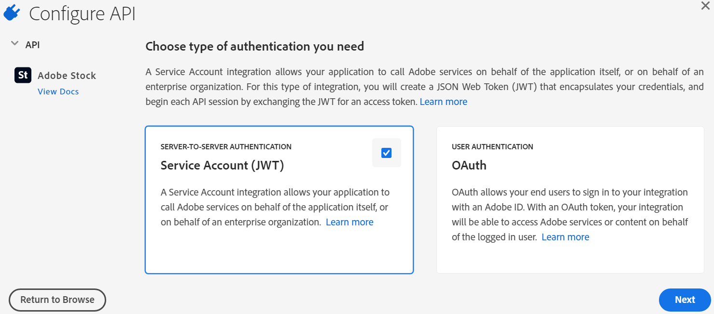

# [!DNL Adobe Experience Manager Assets] での [!DNL Adobe Stock] アセットの使用 {#use-adobe-stock-assets-in-aem-assets}

[!DNL Adobe Stock] サービスは、デザイナーや企業があらゆるクリエイティブなプロジェクトに使用できる、何百万点もの高品質で厳選されたロイヤリティーフリーの写真、ベクター、イラスト、ビデオ、テンプレート、3D アセットへのアクセスを提供します。

エンタープライズ向けの [!DNL Adobe Stock] には、デフォルトで、組織全体での共有権が含まれます。組織のユーザーがアセットのライセンスを取得すると、組織の他のユーザーがこのアセットを識別、ダウンロード、使用できるようになります。再度ライセンスを取得する必要はありません。アセットが組織でライセンスされると、そのアセットを使用する権限は永続的になります。

[!DNL Adobe Stock] エンタープライズプランと [!DNL Experience Manager Assets] を統合すると、 [!DNL Experience Manager] の強力なアセット管理機能を使用して、ライセンスが必要なアセットをクリエイティブプロジェクトやマーケティングプロジェクトに幅広く活用できるようになります。[!DNL Experience Manager] ユーザーは、[!DNL Experience Manager] に保存されている Adobe Stock アセットの検索、プレビューおよびライセンスの取得を、[!DNL Experience Manager] インターフェイスから離れることなくすばやく実行できます。

## [!DNL Experience Manager] と [!DNL Adobe Stock] の統合 {#integrate-aem-and-adobe-stock}

[!DNL Experience Manager Assets] を使用すると、ユーザーは [!DNL Experience Manager] から直接 [!DNL Adobe Stock] アセットを検索、プレビュー、保存、ライセンス付与できるようになります。

**前提条件**

統合には次の要件が必要です。

* 実行中の [!DNL Experience Manager Assets] as a [!DNL Cloud Service] インスタンス
* [エンタープライズ [!DNL Adobe Stock] プラン](https://stockenterprise.adobe.com/)
* Admin Console でデフォルトの Stock 製品プロファイルに対する権限を持つユーザー
* Adobe 開発者コンソールで統合を作成するための Developer Access プロファイルに対する権限を持つユーザー

エンタープライズ [!DNL Adobe Stock] プランは：

* [!DNL Adobe Stock]（Experience Manager に接続されている Stock）の製品使用権を提供します
* Stock の使用権が購入されていることを [!DNL Adobe Admin Console] にクレジットします
* Stock の使用権があるサービスアカウント（JWT）を [!DNL Adobe Developer Console] で認証できるようにします
* [!DNL Adobe Admin Console] でクレジットとライセンスをグローバルに管理できるようになります

使用権内で、[!DNL Adobe Stock] のデフォルトの製品プロファイルが [!DNL Admin Console] に存在します。複数のプロファイルを作成でき、これらのプロファイルによって、誰が Stock アセットのライセンスを取得できるかが決まります。製品プロファイルに直接アクセスできるユーザーは、[https://stock.adobe.com/jp](https://stock.adobe.com/jp) にアクセスして、Stock アセットのライセンスを取得できます。一方、Developer Access を使用して統合（API）を作成する方法もあります。この統合により、[!DNL Experience Manager Assets] と [!DNL Adobe Stock] 間の通信が認証されます。

>[!NOTE]
>
>Stock サービスアカウント（JWT）認証には、エンタープライズ Stock 使用権が付属しています。
>
>この統合では、エンタープライズ Stock 使用権の OAuth 認証をサポートしていません。

<!--
### Create an IMS configuration {#create-an-ims-configuration}

1. In the [!DNL Experience Manager] user interface, navigate to **[!UICONTROL Tools]** > **[!UICONTROL Security]** > **[!UICONTROL Adobe IMS Configurations]**. Click **[!UICONTROL Create]** and select **[!UICONTROL Cloud Solution]** > **[!UICONTROL Adobe Stock]**.
1. Either reuse an existing certificate or select **[!UICONTROL Create new certificate]**.
1. Click **[!UICONTROL Create certificate]**. Once created, download the public key. Click **[!UICONTROL Next]**. Leave the [!UICONTROL Adobe IMS Technical Account Configuration] screen open to provide the required values shortly.
1. Access [Adobe Developer Console](https://console.adobe.io). Ensure that your account has administrator permissions for the organization for which the integration is required.
1. Click **[!UICONTROL Create new project]** and click **[!UICONTROL Add API]**. Select **[!UICONTROL Adobe Stock]** from the list of APIs that are available to you. Select [!UICONTROL OAUTH 2.0 Web].
1. Provide **[!UICONTROL Default redirect URI]** and **[!UICONTROL Redirect URI pattern]** values. Click **[!UICONTROL Save configured API]**. Copy the generated ID and secret.
1. In [!UICONTROL Adobe IMS Technical Account Configuration] screen, provide the values in the boxes titled **[!UICONTROL Title]**, **[!UICONTROL Authorization Server]**, **[!UICONTROL API Key]**, **[!UICONTROL Client Secret]**, and **[!UICONTROL Payload]**. For detailed information about these values, see [JWT authentication quick start](https://www.adobe.io/authentication/auth-methods.html#!AdobeDocs/adobeio-auth/master/JWT/JWT.md).

-->
<!-- TBD: Update the URL to update the terminology when AIO team updates their documentation URL. Logged issue github.com/AdobeDocs/adobeio-auth/issues/63.
-->

<!--
### Create [!DNL Adobe Stock] configuration in [!DNL Experience Manager] {#create-adobe-stock-configuration-in-aem}

1. In the [!DNL Experience Manager], navigate to **[!UICONTROL Tools]** > **[!UICONTROL Cloud Services]** > **[!UICONTROL Adobe Stock]**.
1. Click **[!UICONTROL Create]** to create a configuration and associate it with your existing IMS Configuration. Select `PROD` as the environment parameter.
1. In **[!UICONTROL Licensed Assets Path]** field, leave a location as is. Do not change the location where you want to store the [!DNL Adobe Stock] assets.
1. Complete creation by adding all the required properties. Click **[!UICONTROL Save & Close]**.
1. Add [!DNL Experience Manager] users or groups, who can license the assets.

>[!NOTE]
>
>If there are multiple [!DNL Adobe Stock] configurations, select the desired configuration in User Preferences panel. To access the panel from Experience Manager home page, click the user icon and then click **[!UICONTROL User Preferences]** > **[!UICONTROL Stock Configuration]**.

-->

## [!DNL Experience Manager] と [!DNL Adobe Stock] の統合手順 {#integration-steps}

[!DNL Experience Manager] と [!DNL Adobe Stock] を統合するには、次の手順をこの順序で実行します。

1. [公開証明書の取得](#public-certificate)

   [!DNL Experience Manager] で、IMS アカウントを作成し、公開証明書（公開鍵）を生成します。

1. [サービスアカウント（JWT）接続を作成](#createnewintegration)

   [!DNL Adobe Developer Console] で、 [!DNL Adobe Stock] 組織のプロジェクトを作成します。そのプロジェクトで、公開鍵で API を設定して、サービスアカウント（JWT）接続を作成します。サービスアカウント資格情報と JWT ペイロード情報を取得します。

1. [IMS アカウントの設定](#create-ims-account-configuration)

   [!DNL Experience Manager] で、サービスアカウント資格情報と JWT ペイロードを使用して IMS アカウントを設定します。

1. [Cloud Service の設定](#configure-the-cloud-service)

   [!DNL Experience Manager] で、IMS アカウントを使用して [!DNL Adobe Stock] Cloud Service を設定します。

### IMS 設定の作成 {#create-an-ims-configuration}

IMS 設定は、[!DNL Adobe Stock] 使用権のある [!DNL Experience Manager Assets] のオーサーインスタンスを認証します。

IMS 設定には、次の 2 つの手順が含まれます。

* [公開証明書の取得](#public-certificate)
* [IMS アカウントの設定](#create-ims-account-configuration)

### 公開証明書の取得 {#public-certificate}

公開鍵（証明書）は、Adobe 開発者コンソールでプロファイルを認証します。

1. [!DNL Experience Manager Assets] クラウドインスタンスにログインします。

1. **[!UICONTROL ツール]**&#x200B;パネルで、**[!UICONTROL セキュリティ]**／**[!UICONTROL Adobe IMS 設定]**&#x200B;に移動します。

1. Adobe IMS 設定ページで、「**[!UICONTROL 作成]**」をクリックします。**[!UICONTROL Adobe IMS テクニカルアカウント設定]** ページが開きます。

1. 「**[!UICONTROL 証明書]**」タブで、 **[!UICONTROL クラウドソリューション]** ドロップダウンリストから「**[!UICONTROL Adobe Stock]**」を選択します。

1. 証明書を作成するか、既存の証明書を設定に再利用できます。

   証明書を作成するには、「**[!UICONTROL 新しい証明書を作成]**」チェックボックスをオンにして、公開鍵の **エイリアス** を指定します。ここで入力したエイリアスが、公開鍵になります。

1. 「**[!UICONTROL 証明書を作成]**」をクリックします。「**[!UICONTROL OK]**」をクリックして公開証明書を生成します。

1. 「**[!UICONTROL 公開鍵をダウンロード]**」アイコンをクリックして、公開鍵（.crt）ファイルをご利用のマシンに保存します。この公開鍵は、Brand Portal テナントの API を設定し、Adobe 開発者コンソールでサービスアカウント資格情報を生成するために後で使用します。

   「**[!UICONTROL 次へ]**」をクリックします。

   

1. 「**アカウント**」タブで、サービスアカウントの資格情報を必要とする Adobe IMS アカウントが作成されます。

   新しいタブを開いて、 [Adobe 開発者コンソールでサービスアカウント（JWT）接続を作成](#createnewintegration) します。

### サービスアカウント（JWT）接続を作成 {#createnewintegration}

Adobe 開発者コンソールで、プロジェクトと API は組織レベルで設定されます。API を設定すると、サービスアカウント（JWT）接続が作成されます。API を設定するには、キーペア（秘密鍵と公開鍵）を生成する方法と、公開鍵をアップロードする方法の 2 とおりがあります。この例では、サービスアカウント資格情報は公開鍵をアップロードすることで生成されます。

サービスアカウント資格情報と JWT ペイロードを生成するには：

1. システム管理者権限で Adobe 開発者コンソールにログインします。デフォルトの URL は [https://www.adobe.com/go/devs_console_ui](https://www.adobe.com/go/devs_console_ui) です。

   ドロップダウン（組織）リストから正しい IMS 組織（Stock 使用権限）が選択されていることを確認します。

1. 「**[!UICONTROL 新規プロジェクトを作成]**」をクリックします。システムで生成された名前を持つ空のプロジェクトが組織に対して作成されます。

   「**[!UICONTROL プロジェクトを編集]**」をクリックします。**[!UICONTROL プロジェクトタイトル]** と **[!UICONTROL 説明]** を更新し、「**[!UICONTROL 保存]**」をクリックします。

1. 「**[!UICONTROL プロジェクトの概要]**」タブで、「**[!UICONTROL API を追加]**」をクリックします。

1. 「**[!UICONTROL API ウィンドウを追加]**」で、「**[!UICONTROL Adobe Stock]**」を選択します。「**[!UICONTROL 次へ]**」をクリックします。

1. **[!UICONTROL API の設定]** ウィンドウで、 **[!UICONTROL サービスアカウント（JWT）]** 認証を選択します。「**[!UICONTROL 次へ]**」をクリックします。

   

1. 「**[!UICONTROL 公開鍵をアップロード]**」をクリックします。次に、「**[!UICONTROL ファイルを選択]**」をクリックし、 [公開証明書の取得](#public-certificate) の節でダウンロードした公開鍵（.crt ファイル）をアップロードします。「**[!UICONTROL 次へ]**」をクリックします。

1. 公開鍵を確認し、「**[!UICONTROL 次へ]**」をクリックします。

1. デフォルトの **[!UICONTROL Adobe Stock]** 製品プロファイルを選択し、「**[!UICONTROL 設定済み API を保存]**」をクリックします。

1. API が設定されると、API の概要ページにリダイレクトされます。左側のナビゲーションツリーで「**[!UICONTROL 資格情報]**」の下の「**[!UICONTROL サービスアカウント（JWT）]**」オプションをクリックします。ここでは、資格情報を表示し、JWT トークンの生成、資格情報の詳細のコピー、クライアントの秘密鍵の取得などのアクションを実行できます。

1. 「**[!UICONTROL クライアント資格情報]**」タブから、**[!UICONTROL クライアント ID]** をコピーします。

   「**[!UICONTROL クライアント秘密鍵を取得]**」をクリックし、**[!UICONTROL クライアントの秘密鍵]**&#x200B;をコピーします。

   

1. 「**[!UICONTROL JWT を生成]**」タブに移動し、 **[!UICONTROL JWT ペイロード]** 情報をコピーします。

これで、クライアント ID（API キー）、クライアントの秘密鍵、JWT ペイロードを使用して、[!DNL Experience Manager Assets] で [IMS アカウントを設定](#create-ims-account-configuration) できるようになりました。

### IMS アカウントの設定 {#create-ims-account-configuration}

IMS アカウントを設定するには、 [証明書](#public-certificate) と [サービスアカウント（JWT）資格情報](#createnewintegration) が必要です。

IMS アカウントを設定するには：

1. IMS 設定を開き、「**[!UICONTROL アカウント]**」タブに移動します。[公開証明書の取得](#public-certificate)中も、ページは開いたままになっています。

1. IMS アカウントの&#x200B;**[!UICONTROL タイトル]**&#x200B;を指定します。

   「**[!UICONTROL 認証サーバー]**」フィールドで、URL「[https://ims-na1.adobelogin.com/](https://ims-na1.adobelogin.com/)」を入力します。

   [サービスアカウント（JWT）接続の作成](#createnewintegration) 時にコピーした、「**[!UICONTROL API キー]**」フィールド、 **[!UICONTROL クライアントの秘密鍵]**、 **[!UICONTROL ペイロード]** （JWT ペイロード）にクライアント ID を入力します。

1. 「**[!UICONTROL 作成]**」をクリックします。IMS アカウント設定が作成されます。

   

1. その IMS アカウント設定を選択し、「**[!UICONTROL 正常性をチェック]**」をクリックします。

   ダイアログボックスの「**[!UICONTROL チェック]**」をクリックします。正常に設定されると、*トークンが正常に取得されました*&#x200B;というメッセージが表示されます。

   

### Cloud Service の設定 {#configure-the-cloud-service}

[!DNL Adobe Stock] Cloud Service を設定するには：

1. [!DNL Experience Manager] ユーザーインターフェイスで、**[!UICONTROL ツール]**／**[!UICONTROL Cloud Services]**／**[!UICONTROL Adobe Stock]** に移動します。

1. [!DNL Adobe Stock Configurations] メニューで、「**[!UICONTROL 作成]**」をクリックします。

1. クラウド設定の **[!UICONTROL タイトル]** を指定します。

   [IMS アカウントの設定](#create-ims-account-configuration) 時に作成した IMS 設定を選択します。

   ドロップダウンリストからロケールを選択します。

   

1. 「**[!UICONTROL 保存して閉じる]**」をクリックします。

   これで、[!DNL Experience Manager Assets] オーサーインスタンスが [!DNL Adobe Stock] と統合されました。複数の [!DNL Adobe Stock] 設定（ロケールベースの設定など）を作成できます。 これで、[!DNL Experience Manager] ユーザーインターフェイス内から [!DNL Adobe Stock] アセットにアクセスし、検索して、ライセンスを取得できます。

   

   >[!NOTE]
   >
   >統合のこの段階では、管理者のみが [!DNL Adobe Stock] アセットにアクセスし、Stock アセットを検索し（オムニサーチを使用）、[!DNL Adobe Stock] アセットのライセンスを取得できます。
   >
   >管理者はさらにユーザーまたはグループを [!DNL Adobe Stock] Cloud Service に追加し、[!DNL Experience Manager] のこれらの管理者以外のユーザーに Stock 設定にアクセスするための権限を付与することができます。

1. ユーザーまたはグループを追加するには、[!DNL Adobe Stock] クラウド設定を選択し、「**[!UICONTROL プロパティ]**」をクリックします。

1. Adobe Stock設定へのアクセス権を割り当てたユーザーまたはグループを検索して追加します。[ユーザーグループに権限を割り当て](#assign-permissions-to-group) を参照してください。

## ユーザーグループに権限を割り当て {#assign-permissions-to-group}

管理者は、ユーザーグループを作成し、特定のユーザーまたはグループに [!DNL Adobe Stock] Cloud Service にアクセスするための権限を付与することができます。

Adobe Stock アセットの検索とライセンス取得に必要な権限は次のとおりです。

* `/conf/global/settings/stock` パスを設定します。
* 権限：`jcr:read`
* 権限タイプ：`Allow`

ユーザーグループを作成したり、既存のユーザーグループに権限を割り当てたりできます。権限は、[!DNL Experience Manager Assets] インターフェイスまたは [!DNL User Admin] コンソールから割り当てることができます。

**からユーザーグループへのアクセスを提供するには [!DNL Experience Manager]：**

1. [!DNL Experience Manager] ユーザーインターフェイスで、**[!UICONTROL ツール]**／**[!UICONTROL セキュリティ]**／**[!UICONTROL グループ]** に移動します。[!DNL Adobe Stock] のユーザーグループを作成します。

1. **[!UICONTROL ツール]**／**[!UICONTROL セキュリティ]**／**[!UICONTROL 権限]**&#x200B;に移動します。

1. 左側のパネルでユーザーグループを検索し、Adobe Stock の新しい **[!UICONTROL アクセス制御エントリ（ACE）]** を追加します。

   * `/conf/global/settings/stock` パスを設定します。
   * 権限：`jcr:read`
   * 権限タイプ：`Allow`

   「**[!UICONTROL 追加]**」をクリックします。

   

1. **[!UICONTROL ツール]**／**[!UICONTROL Cloud Services]**／**[!UICONTROL Adobe Stock]** に移動します。[!DNL Adobe Stock] クラウド設定を選択し、「**[!UICONTROL プロパティ]**」をクリックします。

1. 新しく作成したユーザーグループを [!DNL Adobe Stock] 設定に追加します。「**[!UICONTROL 保存して閉じる]**」をクリックします。

   

**からユーザーにアクセスを提供するには [!DNL User Admin Console]：**

1. [!DNL Experience Manager] ユーザーの Admin Console を開きます。デフォルトの URL は `http://localhost:4502/userdamin` です。

1. 左側のパネルで、`user_id` または `name` と入力してユーザーを検索します。ダブルクリックしてユーザープロパティを開きます。

1. 「**[!UICONTROL 権限]**」タブに移動し、[!DNL Adobe Stock] クラウド設定：`/conf/global/settings/stock` の `read` 権限を許可します。

   >[!CAUTION]
   >
   >クラウド設定が許可されていない場合、ユーザーは [!DNL Experience Manager] インターフェイスで **[!UICONTROL Assets]** にのみアクセスできます。
   >
   >[!UICONTROL Assets] および [!DNL Adobe Stock] アセットへのアクセスを許可するには、ユーザーにクラウド設定が許可されていることを確認してください。

1. 「**[!UICONTROL 保存]**」をクリックして権限を更新します。

   

1. ユーザーまたはグループを [!DNL Adobe Stock] クラウド設定に追加します。

## Adobe Stock アセットへのアクセス {#access-stock-assets}

管理者以外のユーザーが [!DNL Adobe Stock] クラウド設定への権限を持っている場合は、[!DNL Experience Manager] インターフェイスから [!DNL Adobe Stock] アセットを検索してライセンスを取得できます。

ユーザーは、[!DNL Adobe Stock] アセットにアクセスする前に、[!DNL Adobe Stock] クラウド設定を有効にする追加の手順を実行する必要があります。これは 1 回限りのアクティビティです。ユーザーに複数の [!DNL Adobe Stock] クラウド設定に対する権限が割り当てられている場合、ユーザーは **[!UICONTROL ユーザーの環境設定]** から目的の設定を選択できます。

[!DNL Adobe Stock] クラウド設定を有効にするには： 

1. [!DNL Experience Manager] にログインします。

1. 右上隅にあるユーザーアイコンをクリックしてから、「**[!UICONTROL 環境設定]**」をクリックします。**[!UICONTROL ユーザーの環境設定]** ウィンドウが開きます。

1. ドロップダウンリストから目的の「**[!UICONTROL Stock 設定]**」を選択し、「**[!UICONTROL 同意する]**」をクリックして設定を有効にします。

   

1. **[!UICONTROL Assets]**／**[!UICONTROL Adobe Stock]** に移動します。[!DNL Adobe Stock] アセットを表示し、検索して、ライセンス付与できるようになりました。

次の表では、[!DNL Adobe Stock] アセットにアクセスする際のユーザー権限の仕組みを説明しています。

| ユーザー | グループ | 権限 | ユーザーの環境設定で Stock 設定を受け入れる | Assets にアクセス | Adobe Stock にアクセス |
| --- | --- | --- | --- | --- | --- |
| admin | 該当なし | すべて | 該当なし | はい | はい |
| test-doc1 | DAM ユーザー | /conf/global/settings/stock/cloud-config | はい | はい | はい |
| test-doc1 | DAM ユーザー | /conf/global/settings/stock/cloud-config | いいえ | エラー：データの読み込みに失敗しました | いいえ |
| test-doc1 | DAM ユーザー | **許可**：/conf/global/settings/stock **拒否**：/cloud-config | Stock 設定が表示されません | はい | いいえ |

## [!DNL Adobe Stock] での [!DNL Experience Manager] アセットの使用と管理  {#usemanage}

この機能を使用すると、[!DNL Experience Manager Assets] で [!DNL Adobe Stock] アセットを操作できます。[!DNL Experience Manager] のユーザーインターフェイス内から [!DNL Adobe Stock] アセットを検索し、必要なアセットのライセンスを取得できます。

[!DNL Experience Manager] 内で [!DNL Adobe Stock] アセットのライセンスを取得すると、そのアセットを通常のアセットと同様に使用および管理できます。ユーザーは [!DNL Experience Manager] 内でアセットの検索およびプレビュー、アセットのコピーおよび公開、[!DNL Brand Portal] でのアセットの共有、[!DNL Experience Manager] デスクトップアプリケーション経由でのアセットのアクセスおよび使用を行うことができます。

![[!DNL Adobe Experience Manager] Workspace から [!DNL Adobe Stock] アセットを検索して結果を絞り込む](assets/adobe-stock-search-results-workspace.png)

**A.** 指定された [!DNL Adobe Stock] ID のアセットと類似しているアセットを検索します。**B.** 選択した形状や向きと一致するアセットを検索します。**C.** サポートされているアセットタイプのいずれかを検索します。**D.** フィルターウィンドウを開く／折りたたみます。**E.** 選択したアセットのライセンスを取得して [!DNL Experience Manager] に保存します。**F.** アセットを透かし付きで [!DNL Experience Manager] に保存します。**G.** 選択したアセットと類似したアセットを [!DNL Adobe Stock] web サイトで調べます。**H.** 選択したアセットを [!DNL Adobe Stock] web サイトに表示します。**I.** 検索結果から選択したアセットの数。**J.** カード表示とリスト表示を切り替えます。

### アセットの検索 {#find-assets}

[!DNL Experience Manager] ユーザーは、[!DNL Experience Manager] と [!DNL Adobe Stock] の両方でアセットを検索できます。検索場所を [!DNL Adobe Stock] に限定しない場合は、[!DNL Experience Manager] と [!DNL Adobe Stock] からの検索結果が表示されます。

* [!DNL Adobe Stock] アセットを検索するには、**[!UICONTROL ナビゲーション]**／**[!UICONTROL アセット]**／**[!UICONTROL Adobe Stock を検索]**&#x200B;をクリックします。

* [!DNL Adobe Stock] と [!DNL Experience Manager Assets] にまたがるアセットを検索するには、「」をクリックします。

また、アセットを選択するには、検索バーに「`Location: Adobe Stock`」と入力します。[!DNL Adobe Stock][!DNL Experience Manager] は、検索されたアセットに対する高度なフィルタリング機能を備えており、サポートされているアセットのタイプや画像の向き、ライセンスの状態などのフィルターを使用して、必要なアセットをすばやく見つけることができます。

>[!NOTE]
>
>[!DNL Adobe Stock] から検索されたアセットは [!DNL Experience Manager] に表示されます。[アセットを保存](/help/assets/aem-assets-adobe-stock.md#saveassets)するか、[アセットにライセンスを付与して保存](/help/assets/aem-assets-adobe-stock.md#licenseassets)した後でないと、[!DNL Adobe Stock] アセットを取得して [!DNL Experience Manager] リポジトリーに保存することはできません。既に [!DNL Experience Manager] に保存されているアセットが表示され、参照やアクセスが簡単にできるようにハイライトされます。また、[!DNL Stock] アセットは、ソースが [!DNL Stock] であることを示すいくつかの追加メタデータとともに保存されます。

![[!DNL Experience Manager] の検索フィルターと、検索結果内でハイライトされている [!DNL Adobe Stock] アセット](assets/aem-search-filters2.jpg)

### 必要なアセットの保存と表示 {#saveassets}

[!DNL Experience Manager] に保存するアセットを選択します。上部ツールバーの「[!UICONTROL 保存]」をクリックし、アセットの名前と保存場所を指定します。ライセンスが不要なアセットはローカルに透かし付きで保存されます。

アセットの検索を次回実行すると、保存済みのアセットは、[!DNL Experience Manager Assets] で使用可能であることを示すバッジ付きでハイライトされます。

>[!NOTE]
>
>最近追加されたアセットには、ライセンスが許諾されていることを示すバッジではなく、新しいアセットであることを示すバッジが表示されます。

### アセットのライセンス取得 {#licenseassets}

[!DNL Adobe Stock] エンタープライズプランの割り当てを使用することで、[!DNL Adobe Stock] アセットのライセンスを取得できます。ライセンスを許諾されたアセットは透かしなしで保存され、[!DNL Experience Manager Assets] で検索することも使用することも可能になります。

![[!DNL Experience Manager Assets]](assets/aem-stock_licenseandsave.jpg) で [!DNL Adobe Stock] アセットのライセンスを取得して保存するダイアログ。

### メタデータおよびアセットプロパティへのアクセス {#access-metadata-and-asset-properties}

メタデータ（[!DNL Experience Manager] に保存されているアセットの [!DNL Adobe Stock] メタデータプロパティを含む）にアクセスしてプレビューし、アセットの&#x200B;**[!UICONTROL ライセンス参照]**&#x200B;を追加できます。ただし、ライセンス参照の更新は [!DNL Experience Manager] と [!DNL Adobe Stock] Web サイトの間で同期されません。

ユーザーは、ライセンスを許諾されたアセットとライセンスを許諾されていないアセットの両方を表示できます。

## 既知の制限事項 {#known-limitations}

* **ユーザーのライセンスを制限する機能が正しく機能しない**：Stock 設定に対する `read` 権限を持つすべてのユーザーは、[!DNL Adobe Stock] アセットを検索してライセンスを取得できます。

* **管理者以外のユーザーは、[!DNL Adobe Stock] クラウド構成を手動でアクティブ化する必要がある**：**[!UICONTROL ユーザーの環境設定]** ウィンドウの **[!UICONTROL Stock 設定]** には、 [!DNL Adobe Stock] クラウド構成が有効と表示されますが、管理者以外のユーザーには機能しません。ユーザーは、「**[!UICONTROL 同意する]**」ボタンをクリックして、Stock 設定をアクティブにする必要があります。この手順がない場合、システムは **[!UICONTROL Assets]** へのアクセスに関するエラーメッセージを反映します。

* **編集画像の警告が表示されない**：画像のライセンスを取得する場合、ユーザーは画像が「編集のみ使用」かどうか確認できません。管理者は誤用を防ぐために、Admin Console から編集用アセットへのアクセスをオフにできます。

* **間違ったライセンスの種類が表示される**：[!DNL Experience Manager] で、アセットに対して正しくないライセンスタイプが表示される可能性があります。[!DNL Adobe Stock] Web サイトにログインすると、ライセンスタイプを確認できます。

* **参照フィールドとメタデータが同期されない**：ユーザーがライセンス参照フィールドを更新すると、そのライセンス参照情報は [!DNL Experience Manager] で更新されますが、[!DNL Adobe Stock] Web サイト上では更新されません。同様に、[!DNL Adobe Stock] Web サイトで参照フィールドを更新すると、更新情報が [!DNL Experience Manager] には反映されません。

<!--
## Use and manage [!DNL Adobe Stock] assets in [!DNL Experience Manager] {#usemanage}

Using this capability, organizations users can work using [!DNL Adobe Stock] assets in [!DNL Experience Manager Assets]. From within the [!DNL Experience Manager] user interface, users can search [!DNL Adobe Stock] assets and license the required assets.

Once an [!DNL Adobe Stock] asset is licensed in [!DNL Experience Manager], it can be used and managed like a typical asset. In [!DNL Experience Manager], the users can search and preview the assets; copy and publish the assets; share the assets on [!DNL Brand Portal]; access and use the assets via [!DNL Experience Manager] desktop app; and so on.
-->

<!--  

*Figure: Search for [!DNL Adobe Stock] assets and filter results from your [!DNL Experience Manager] interface.*

**A.** Search assets similar to the assets whose [!DNL Adobe Stock] ID is provided. **B.** Search assets that match your selection of shape or orientation. **C.** Search for one of more supported asset types **D.** Open or collapse the filters pane **E.** License and save the selected asset in [!DNL Experience Manager] **F.** Save the asset in [!DNL Experience Manager] with watermark **G.** Explore assets on [!DNL Adobe Stock] website that are similar to the selected asset **H.** View the selected assets on [!DNL Adobe Stock] website **I.** Number of selected assets from the search results **J.** Switch between Card view and List view -->

<!--
### Find assets {#find-assets}

Your [!DNL Experience Manager] users, can search for assets in both, [!DNL Experience Manager] and [!DNL Adobe Stock]. When the search location is not limited to [!DNL Adobe Stock], the search results from [!DNL Experience Manager] and [!DNL Adobe Stock] are displayed.

* To search for [!DNL Adobe Stock] assets, click **[!UICONTROL Navigation]** > **[!UICONTROL Assets]** > **[!UICONTROL Search Adobe Stock]**.

* To search for assets across [!DNL Adobe Stock] and [!DNL Experience Manager Assets], click search .

Alternatively, start typing `Location: Adobe Stock` in the search bar to select [!DNL Adobe Stock] assets. [!DNL Experience Manager] offers advanced filtering capabilities on the searched assets, allowing users to quickly zero-in on the required assets using filters, such as types of supported assets, image orientation, and licensed state.

>[!NOTE]
>
>Assets searched from [!DNL Adobe Stock] are just displayed in [!DNL Experience Manager]. [!DNL Adobe Stock] assets are fetched and stored in [!DNL Experience Manager] repository only after a user either [saves an asset](/help/assets/aem-assets-adobe-stock.md#saveassets) or [licenses and saves an asset](/help/assets/aem-assets-adobe-stock.md#licenseassets). Assets that are already stored in [!DNL Experience Manager] are displayed and highlighted for ease of reference and access. Also, the [!DNL Stock] assets are saved with some additional metadata to indicate the source as [!DNL Stock].

*Figure: Search filters in [!DNL Experience Manager] and highlighted [!DNL Adobe Stock] assets in search results.*

### Save and view the required assets {#saveassets}

Select an asset that you want to save in [!DNL Experience Manager]. Click [!UICONTROL Save] in the toolbar at the top and provide the name and location of the asset. The unlicensed assets are saved locally with a watermark.

Next time when you search for assets, the saved assets are highlighted with a badge, to indicate that such assets are available in [!DNL Experience Manager Assets].

>[!NOTE]
>
>The recently added assets display a New badge instead of Licensed badge.

### License assets {#licenseassets}

Users can license [!DNL Adobe Stock] assets by using the quota of their [!DNL Adobe Stock] enterprise plan. When you license an asset, it is saved without a watermark and is available for searching and using in [!DNL Experience Manager Assets].

*Figure: Dialog to license and save [!DNL Adobe Stock] assets in [!DNL Experience Manager Assets].*

### Access metadata and asset properties {#access-metadata-and-asset-properties}

Users can access and preview the metadata, including the [!DNL Adobe Stock] metadata properties for the assets saved in [!DNL Experience Manager], and add **[!UICONTROL License References]** for an asset. However, the updates to license reference are not synced between [!DNL Experience Manager] and [!DNL Adobe Stock] website.

Users can see the properties for both, licensed and unlicensed assets.

*Figure: View and access metadata and license references of saved assets.*

## Known limitations {#known-limitations}

* **Editorial image warning is not displayed**: When licensing an image, users cannot check if an image is Editorial Use Only. To prevent possible misuse, the administrators can turn off the access to editorial assets from the Admin Console.

* **Wrong license type is displayed**: It is possible that an incorrect license type is displayed in [!DNL Experience Manager] for an asset. Users can log into the [!DNL Adobe Stock] website to see the license type.

* **Reference fields and metadata are not synced**: When a user updates a license reference field, the license reference information is updated in [!DNL Experience Manager] but not on the [!DNL Adobe Stock] website. Similarly, if the user updates the reference fields on the [!DNL Adobe Stock] website, the updates are not synchronized in [!DNL Experience Manager].
-->

>[!MORELIKETHIS]
>
>* [Experience Manager Assets での Adobe Stock アセットの使用について説明するビデオチュートリアル](https://experienceleague.adobe.com/docs/experience-manager-learn/assets/creative-workflows/adobe-stock.html?lang=ja)
>* [Adobe Stock エンタープライズプランのヘルプ](https://helpx.adobe.com/jp/enterprise/using/adobe-stock-enterprise.html)
>* [Adobe Stock の FAQ](https://helpx.adobe.com/jp/stock/faq.html)

