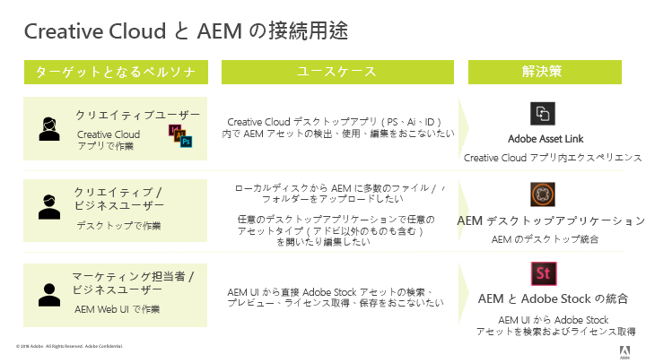

# AEM and Creative Cloud integration best practices {#aem-and-creative-cloud-integration-best-practices}

Adobe Experience Manager（AEM）Assets は、Adobe Creative Cloud と統合できるデジタルアセット管理（DAM）ソリューションです。DAM ユーザーがクリエイティブチームと協力してコンテンツ作成プロセスでのコラボレーションを効率化できるようにサポートします。

Adobe Creative Cloud は、デジタルアセットの作成を支援するソリューションとサービスのエコシステムをクリエイティブチームに提供します。これには、デスクトップおよびモバイルアプリケーション、デスクトップ同期や Web エクスペリエンスを備えたストレージなどのクラウドサービス、および Adobe Stock などのマーケットプレイスが含まれます。

ユースケースに基づいてデスクトップとエンタープライズクラスの DAM の間で選択すべき統合や、つながるワークフローに関連するベストプラクティスについては、このドキュメントで説明します。

>[!NOTE]
>
>AEM／Creative Cloud フォルダー共有機能は廃止されたので、以下では扱われなくなりました。AEM で管理されたアセットへのアクセス権をクリエイティブユーザーに与える方法としては、Adobe Asset Link や AEM Desktop App などの新しい機能をお勧めします。

## クリエイティブプロフェッショナル、マーケティング担当者、DAM ユーザーのコラボレーションニーズ {#collaboration-need-of-creatives-marketers-and-dam-users}

| 要件 | 使用事例   | 関係するサーフェス |
|---|---|---|
| デスクトップ上でクリエイティブプロフェッショナル向けのエクスペリエンスを簡素化する | クリエイティブプロフェッショナル（より広い意味では、ネイティブアセット作成アプリケーションで作業しているデスクトップユーザー）向けに、DAM（AEM Assets）で管理されるアセットへのアクセスを効率化します。変更の検出、使用（開く）、編集、AEM への保存のほか、新しいファイルのアップロードを容易にわかりやすくおこなえる方法が必要です。 | Windows または Mac デスクトップ、Creative Cloud アプリ |
| すぐに使用できる高品質なアセットを Adobe Stock から提供する | マーケティング担当者は、アセットの調達と検出を支援することでコンテンツ作成プロセスの促進に貢献します。クリエイティブプロフェッショナルは、承認されたアセットをクリエイティブツール内から直接使用します。 | AEM Assets、Adobe Stock マーケットプレイス、メタデータフィールド |
| 組織でアセットを配布および共有する | 社内部門／支店および外部のパートナー、ディストリビューター、代理店は、親組織で共有されている承認済みアセットを使用します。組織では、作成したアセットを安全かつシームレスに共有して幅広く再利用したいと考えています。 | Brand Portal、Asset Share Commons |

## コラボレーションニーズをサポートするアドビ製品／サービス {#adobe-offerings-to-support-the-collaboration-need}

| 関係するユーザーに対する価値提案 | アドビ製品／サービス | 関係するサーフェス |
|---|---|---|
| クリエイティブユーザーは、Creative Cloud アプリを使用したまま、AEM からアセットを検出し、それらを開いて使用したり、編集して変更を AEM にアップロードするほか、新しいファイルを AEM にアップロードします。 | [Adobe Asset Link](https://helpx.adobe.com/enterprise/using/adobe-asset-link.html) | Photoshop、Illustrator、InDesign |
| ビジネスユーザーは、アセットを開いて使用する作業、AEMに対する変更の編集とアップロード、デスクトップ環境からAEMへの新しいファイルのアップロードを簡単に行うことができます。 汎用の統合を使用して、アドビ以外のアセットも含め、あらゆるアセットタイプをネイティブデスクトップアプリケーションで開きます。 | [AEM Desktop App](https://docs.adobe.com/content/help/en/experience-manager-desktop-app/using/using.html) | Windows および Mac デスクトップ上の AEM Desktop App |
| マーケティング担当者とビジネスユーザーは、AEM 内から Adobe Stock アセットの検出、プレビュー、ライセンス取得と保存、管理をおこなえます。ライセンスを取得し保存したアセットは、限定された Adobe Stock メタデータを提供してガバナンスの強化に役立ちます。 | [Experience ManagerとAdobe stockの統合](aem-assets-adobe-stock.md) | AEM Web インターフェイス |

ここでは、主に、コラボレーションニーズの最初の 2 つの側面に焦点を当てます。アセットの大規模な配布と調達については、ユースケースとして簡単に説明します。そのようなニーズに対するソリューションとしては、Adobe Brand Portal または Asset Share Commons を検討してください。[AEM Assets Brand Portalなどの代替ソリューション、](https://helpx.adobe.com/experience-manager/brand-portal/user-guide.html)Asset Share Commons [Compons Components,](https://adobe-marketing-cloud.github.io/asset-share-commons/) Link Share, [AEM Assets](share-assets.md)Web Web Assets  Reviewedは、特定の要件に基づいて確認する必要があります。

使用する機能の決定

### ユースケースとアドビソリューションの対応関係 {#mapping-of-use-cases-and-adobe-solutions}

| 使用事例   | Adobe Asset Link | AEM デスクトップアプリケーション | 備考または代替方法 |
|----------------------------------------------------------|-----------------------------------------------------------------------------------|--------------------------------------------------------------------|------------------------------------------------------------------------------------------------------------------------------------------|
| 検出 - AEM フォルダーを参照する | はい | AEM Web UI およびデスクトップアクション | ネットワーク共有を参照する場合は、アセットのバイナリファイルをダウンロードしないように、サムネールをオフにします。 |
| 検出 - AEM コレクションにアクセスする | はい | AEM Web UI およびデスクトップアクション |  |
| 検出 - AEM からアセットを検索する | はい | AEM Web UI およびデスクトップアクション |  |
| 使用 - アセットを開く | はい | 対応 - 任意のアプリに対して | [Webインターフェイスまたは](/help/assets/manage-digital-assets.md#previewing-assets) Finderから開く |
| 使用 - AEM からドキュメント内にアセットを配置する | 対応 - 埋め込み | 対応 - リンクまたは埋め込み | AEM Desktop App では、ローカルファイルシステム上のファイルとしてアセットにアクセスできます。ネイティブアプリでは、これらのリンクはローカルパスで表されます。 |
| 編集 - 編集用に開く | 対応 - チェックアウトアクション | 対応 - 「開く」アクション（ネットワーク共有内） | [AALでのチェックアウトは](https://helpx.adobe.com/enterprise/using/manage-assets-using-adobe-asset-link.html) 、アセットをユーザーのCreative cloudストレージアカウント（Creative cloudアプリケーションによって同期）にデフォルトで保存します。 |
| 編集 - AEM の外部で作業する | はい — デスクトップに同期されたユーザーのCreative cloudストレージアカウントで利用可能なアセット。 | はい |  |
| 編集 - 変更をアップロードする | 対応 - [チェックインアクション](https://helpx.adobe.com/enterprise/using/manage-assets-using-adobe-asset-link.html)（オプションコメント付き） | はい |  |
| アップロード - 単一ファイル | 対応 - 現在のアクティブなドキュメントをアップロードします | はい | [Webインターフェイスを使用したアップロード](/help/assets/manage-digital-assets.md#uploading-assets) |
| アップロード - 複数ファイル／階層フォルダー構造 | いいえ | はい | [Webインターフェイスを介したアップロード](/help/assets/manage-digital-assets.md#uploading-assets);カスタムスクリプティングまたはツール |
| その他 - ユーザーとログイン | Creative Cloud デスクトップアプリにログインした Creative Cloud ユーザーが認識されます（SSO） | AEM ユーザー／ログイン | 両方のソリューションのユーザーが AEM ユーザークォータに対してカウントされます。 |
| その他 - ネットワークとアクセス | ネットワークを介してユーザーのデスクトップから AEM デプロイメントにアクセスできる必要があります | ネットワークを介してユーザーのデスクトップから AEM デプロイメントにアクセスできる必要があります | Adobe Asset Link はネットワークプロキシ環境を共有しません。 |

<!-- Removing this row from table as migration guide is not yet final.
| Misc - Migrate large number of assets | No | No | [Migration Guide](/help/assets/assets-migration-guide.md) |
-->

アセット配布ユースケースをサポートするには、他のソリューションを考慮に入れる必要があります。

* [AEM Assets Brand Portal](https://helpx.adobe.com/experience-manager/brand-portal/user-guide.html) （設定可能なSaaSアドオンをAEM Assetsに追加してアセットを公開）。

* カスタムソリューションは [Asset Share Commons](https://adobe-marketing-cloud.github.io/asset-share-commons/) のコードベースに基づいて作成される。
* AEM [リンク共有](/help/assets/share-assets.md)：リンクを使用してアドホックでアセットを共有する。
* [AEM Assets Web インターフェイス](/help/assets/manage-digital-assets.md)：外部ユーザーが AEM にアクセスできるようにする、アクセスAEM アクセス制御の設定で保護されている外部関係者向けのエリア。必要な IT／ネットワーク設定の調整機能が備わっている。

## 主な概念とユースケース {#key-concepts-and-use-cases}

### よく使用される用語 {#glossary-of-common-terms}

* **** 進行中または制作中の作業(WIP):アセットのライフサイクルの段階の1つで、アセットに複数の変更が加えられ、通常、より広範なチームと共有する準備が整っていません。
* **** クリエイティブなアセット：様々なチームと共有する準備ができているアセット、またはクリエイティブチームがマーケティングチームやLOBチームとの共有用に選択/承認したアセット。

* **アセット承認：** 既に DAM にアップロードされているアセットに対して実行される承認プロセス。通常、ブランド承認および法的承認などが含まれます。
* **最終アセット：**&#x200B;すべての  承認/メタデータのタグ付けを行い、様々なチームが使用できる状態になっています。 このようなアセットは DAM に保存され、すべてのユーザー（またはすべての関係者）が使用できるようになっています。マーケティングチャネルで使用したり、クリエイティブチームがデザインの作成に使用したりできます。

* **アセットの小規模な**  更新/変更：デジタルアセットに対する迅速で小さな変更。 多くの場合、リタッチ作業や小規模な編集の要求、アセットレビューまたは承認に対応するためにおこなわれます（例えば、再配置、テキストサイズの変更、彩度／明るさ、色などの調整）。
* **アセットの大規模な**  更新/変更：大量の作業が必要なデジタルアセットの変更、および長期間の作業が必要な場合があります。 通常は複数の変更が含まれます。アセットは、更新中、複数回保存する必要があります。アセットの大規模な更新により、ほとんどの場合、アセットのステージは WIP になります。
* **DAM：**&#x200B;デジタルアセット管理。このドキュメントでは、特に断りのない限り、Adobe Experience Manager（AEM）Assets と同義です。
* **クリエイティブユーザー：** Creative Cloud のアプリケーションとサービスを使用してデジタルアセットを作成するクリエイティブプロフェッショナル。クリエイティブチームに所属し、Creative Cloud を使用するが、デジタルアセットの作成はおこなわないメンバー（クリエイティブディレクターやクリエイティブチームマネージャーなど）を含む場合もあります。
* **** DAMユーザー：DAMシステムの一般的なユーザー。 組織によっては、マーケティング分野のユーザーもマーケティング以外の分野のユーザーも含まれます（例えば、事業部門（LOB）ユーザー、ライブラリアン、販売担当者など）。

### AEMとCreative cloudの統合を使用する場合の考慮事項 {#considerations-when-using-aem-and-creative-cloud-integration}

<!--incomplete and TBD: 

* DA2.0 best practices: See troubleshooting.md
* Stock integration: See ?
* AAL: See ?
* BP: See ?

-->

AEM と Creative Cloud の統合のベストプラクティスの概要を説明します。以下のそれぞれの項目の詳細は、このドキュメントで後述されています。

* **Photoshop、InDesign、Illustrator のいずれかで作業しているクリエイティブユーザーの場合：** Adobe Asset Link は、AEM からチェックアウトされたアセットの更新の適切な処理など、最適なユーザーエクスペリエンスを提供します。
* **任意の汎用ファイル形式またはアプリケーションについてデスクトップからアセットへのアクセスを簡素化する場合：** AEM Desktop App を使用します。
* **アセットを DAM に保存する理由とタイミングを理解する：**&#x200B;更新を組織内の広範なチームで利用できるようにする必要があります。
* **共有するアセットの量に注意を払う：**&#x200B;アセットを配布する場合、ガバナンスとセキュリティが最も重要な要素になる可能性があります。Brand portalのように、それを大規模に実行するために構築されたツールの使用を検討します。
* **アセットのライフサイクルを理解する：**&#x200B;組織内のそれぞれのチームでアセットがどのように処理されるかを理解します。
* **アセットへの頻繁な保存を慎重に処理する：** Adobe Asset Link では、PS、AI、ID を使用して自動的に処理します。他のアプリケーションの場合は、すべての変更が DAM で必要な場合を除き、マップされたフォルダーや共有フォルダーでは WIP 状態のタスクを実行しないでください。

### AEM Assets からの Adobe Stock アセットへのアクセス {#access-to-adobe-stock-assets-from-aem-assets}

[AEMとAdobe stockの統合により](/help/assets/aem-assets-adobe-stock.md) 、AEMユーザーは、Adobe stockからAEMにアセットを検索、プレビュー、ライセンス認証および保存できます。 ライセンスを取得して保存したAdobe Stockアセットでは、選択したStockメタデータが使用され、追加のフィルターでアセットを検索するために使用できます。

この統合に関するいくつかの重要な点を以下に示します。

* Adobe Stock 内のアセットが AEM に保存されると、それらは通常の AEM Assets になり、バイナリが AEM リポジトリに保存されます。Adobe Stock に関係する一部のメタデータが AEM 内のアセットに保存されます。その他の点では、取り込みプロセスは他のあらゆるファイルの場合と同様です。例えば、スマートタグがアクティブな場合、保存時にこれらのアセットにタグが追加されます。
* AEM に保存されたアセットはコピーであり、Adobe Stock へのリンクではありません。

**Adobe Stock から Creative Cloud 内の AEM に保存されたアセットの操作**。この統合は Adobe Asset Link とは無関係ですが、Adobe Asset Link では Stock から保存されたこれらのアセットをそのように認識し、Photoshop、Illustrator、InDesign の Adobe Asset Link 拡張 UI でこれらのアセットに追加のメタデータと Stock アイコンを表示します。AEM に保存すると通常の AEM アセットになるので、ファイルを閲覧したり開いたりすることができます。Adobe Asset Link 拡張機能を備えた Creative Cloud アプリで作業している クリエイティブユーザーは、Adobe Stock から AEM に保存したライセンス取得済みアセットにアクセスできるだけでなく、Creative Cloud ライブラリパネルを使用して Adobe Stock アセットを検索、プレビューし、ライセンスを取得することもできます。Adobe Stock からライセンスを取得してAEM に保存したアセットは、AEM Assets デプロイメントにアクセスする広範なチームで利用できるようになります。ただし、.クリエイティブユーザーが Creative Cloud ライブラリパネル経由で Adobe Stock からアセットのライセンスを取得した場合、デフォルトでは、それらのアセットは自分の Creative Cloud アカウント内でしか使用できません。

## DAMへのアセットの保存について {#about-storing-assets-in-a-dam}

クリエイティブチームとマーケティング／事業部門（LOB）チームの間の効率的なワークフローをデザインし、最適なサポート機能を選択するには、アセットを DAM に保存するタイミングと理由を理解することが重要です。

### アセットを DAM に保存する理由 {#why-assets-are-stored-in-dam}

アセットを DAM に保存すると、アクセスおよび検索がしやすくなります。これにより、組織またはエコシステムの多数のユーザー（パートナー、顧客などを含む）が、アセットを活用できるようになります。

ほとんどの組織では、ダウンストリームマーケティング／LOB プロセスに関連するアセットのみを保存するようにしています（例えば、AEM Sites 経由での Web チャネルなどのチャネルへの公開、Adobe Experience Cloud（Marketing Cloud、Advertising Cloud）により提供され、Analytics Cloud により測定される他のチャネルへの公開、ユーザー／パートナーへの提供などのプロセス）。また、レビュー／承認プロセスを受ける可能性のあるアセットも DAM に保存します。このように、DAM に保存されるアセットのほとんどは活用される可能性の高いアセットであり、活用の予定がないアセットの保存が防止されます。

また、アセットを保存する場合、技術上およびリソース使用上でも考慮すべき点があります。DAM では、保存されたアセット関連の追加サービスが用意されています（メタデータの抽出、バージョン管理、プレビュー／トランスコーディングの生成、参照の管理およびアクセス制御情報の追加など）。これらのサービスを使用すると、追加の時間リソースおよびインフラストラクチャリソースが消費されます。

多くの場合、アセットおよび更新をすべて保存することは推奨されません。例えば、特定のアセットの更新の質が低く、大量のリソースを消費するような場合、そのアセットは DAM に保存しないようにします。

#### アセットを DAM に保存するタイミング {#when-assets-are-stored-in-dam}

クリエイティブチーム（および組織）は、通常、アセットのライフサイクルのステージごとにアセットを保存しようとは考えません。例えば、以下のような場合、アセットは保存されません。

* アセットがまだ最終決定されていない、またはテストが予定されている場合
* アセットがクリエイティブ／内部チームのレビューサイクルで不合格になった場合
* 問題のアセットに比べ、外部チームへの作業の説明に、より適したアセットがある場合

通常、以下のクラスのアセットが DAM に保存されます。

* 一定の成熟度に到達し、共有する準備ができたと判断されたアセット
* クリエイティブチームが事前に選択したアセット
* マーケティング部門が使用できる、または特定の契約や合意に応じて同部門から要求された、特定の形式のアセット（例えば、RAW ファイルから変換した JPG ファイル、PSD ファイルから作成した TIFF／画像ファイルなど）

#### アセットの更新を DAM に保存するタイミング {#when-updates-to-assets-are-stored-in-dam}

原則として、より広範な DAM ユーザーに関連するアセットの更新のみを DAM に保存するようにしてください。それにより、（マーケティングおよび類似の部門の）ユーザーの DAM アセットのタイムラインには、関連するバージョンのみが表示されます。

代表的な例としては、アセットのライフサイクルで主要なマイルストーンに関連する変更があります。例えば、最初のマーケティング用アセットや、クリエイティブチームからの要求／レビューに基づいた公式の更新などは、DAM に保存してバージョン管理する必要があります。

DAM の既存アセットに対する変更要求が出された後、マーケティングチームのレビューのためにクリエイティブチームがおこなった更新も、関連する更新の一例です。この更新は、今後の参考にしたり、以前のバージョンに戻したりするために、DAM に保存してバージョン管理する必要があります。

以下は、通常、関係がないと見なされる更新の例です。

* マーケティングレビューの準備が完了する前に、アセットの最終版以外のバージョンがアップロードされた場合
* アセットの準備ができたとクリエイティブチームおよびマーケティングチームが判断する前に、WIP フェーズのアセットにクリエイティブの変更が頻繁に加えられた場合

### DAM へのユーザーアクセス権 {#user-access-to-dam}

AEM Assets では、AEM Assets デプロイメントに対するアクセス権に基づいて、2 つのタイプのユーザーがサポートされています。通常、エンタープライズネットワーク（ファイアウォール）の内側にいるユーザーは、DAM に直接アクセスできます。エンタープライズネットワークの外側にいるその他のユーザーは、直接アクセスすることはできません。このユーザータイプにより、技術的観点から、どの統合を使用できるかが決定されます。

#### DAM への直接アクセス権を持つクリエイティブユーザー {#creative-users-with-direct-access-to-dam}

通常、社内ネットワークに接続されている社内のクリエイティブチームまたはエージェンシー/クリエイティブプロフェッショナルは、AEMログインを含むDAMインスタンスにアクセスできます。 AEMとネットワークインフラストラクチャは、外部の関係者（通常はクライアントで働く機関などの信頼できる組織）に直接アクセスできるように設定できます。また、VPNやIPホワイトリストなどを介してAEMにアクセスできます。

このような場合、Adobe Asset linkまたはAEMデスクトップアプリケーションを使用すると、最終的な/承認済みのアセットに簡単にアクセスでき、クリエイティブなアセットをDAMに保存できます。

#### DAM へのアクセス権を持たないクリエイティブユーザー {#creative-users-without-access-to-dam}

DAM インスタンスへの直接アクセス権を持たない外部のエージェンシーやフリーランサーも、承認済みアセットにアクセスしたり、新しいデザインを DAM に追加したりする必要が生じることがあります。

以下の戦略で最終／承認済みアセットへのアクセスを提供します。

* Asset Link が機能しない場合は、デスクトップアプリを使用します。
* Use [AEM Assets Brand Portal](https://helpx.adobe.com/experience-manager/brand-portal/user-guide.html) for distributing assets securely to external partners
* [Asset Share Commons](https://adobe-marketing-cloud.github.io/asset-share-commons/) に基づいた、配布および調達用ポータルのカスタム実装を使用します。
* AEM に設定されたアクセス制御と必要なネットワークインフラストラクチャ（VPN や IP ホワイトリストなど）を使用して、DAM 内の専用のコンテンツ領域に外部の関係者がアクセスできるようにします。AEM Web UI を使用してアセットを取得したり、新しいコンテンツを DAM にアップロードしたりできます。

#### AEM 内のアセットの更新 {#work-in-progress-on-assets-from-aem}

このドキュメントで説明しているように、アセットの大規模な更新（処理中の作業と呼ばれることもあります）を実行する際には、ローカルファイルに保存したすべての編集内容も変更として AEM にアップロードすることを避けるとよいでしょう。これにより、デスクトップユーザーの作業がはかどり、使用されるネットワーク帯域幅が制限され、アセットのタイムラインが適切な状態に保たれ、管理された大規模な更新に集中するようになります。

Adobe Asset Link は、このユースケースを適切にサポートしています。

* Photoshop、InDesign、Illustrator のいずれかでユーザーがファイルを編集しようとすると、指定されたアセットに対してチェックアウト操作が実行されます。
* そのアセットはバックグラウンドでダウンロードされ、Creative Cloud デスクトップアプリによりディスクに同期されたユーザーの Creative Cloud アカウントに格納されます。AEM でアセットのチェックアウトフラグが切り替わり、編集の競合が最小限に抑えられます。
* それ以降、ユーザーは、同期した場所にローカルに保存されているファイルで作業をおこない、必要な変更を必要な頻度で継続的に作業し保存することができます。
* さらに、アセットは Creative Cloud アカウントにあるので、ユーザーが所有している他のデバイスでも使用でき（例えば、専用の Creative Cloud モバイルアプリで開いたり編集したりできます）、コラボレーション目的で他の Creative Cloud ユーザーと共有することもできます。
* クリエイティブユーザーが変更を完了すると、使用中の Creative Cloud アプリケーションで、そのファイルに対してチェックイン操作を実行できます。その際に、オプションでコメントを付けることもできます。AEM 内で対応するアセットの新しいバージョンが作成され、新しいバイナリで更新されます。マーケティング担当者や LOB ユーザーなどの AEM ユーザーは、AEM Assets のタイムライン UI を介して、アセットの大幅な変更やマイルストーンにアクセスできます。

AEM Desktop App は、ネイティブアプリで開かれたアセットのネットワーク共有を提供します。デフォルトでは、ローカルでおこなわれたすべての変更は、しばらくすると自動的に AEM にアップロードされます。このような設定では、WIP フェーズでの頻繁な保存はすべて AEM にアップロードされバージョン管理されるので、不要なバージョンが AEM に生成されることは言うまでもなく、大量のネットワークトラフィックが発生し、スケーラビリティの重大な問題も生じる可能性があります。

ここでは、AEM Desktop App のオプションを使用して自動更新をオフにし、アプリのアセットステータス UI で変更のアップロードアクションを利用して、アセットへの変更を手動で AEM にアップロードすることをお勧めします。

#### DAM への一括アップロード {#bulk-upload-to-dam}

同時に大量のファイルを DAM にアップロードする必要が生じることもあります。例えば、以下のような場合です。

* 撮影した大量の写真や 写真や大きなプロジェクト
* クリエイティブエージェンシーから提供されたアセットのアップロード
* 大規模なアセットセットから選択したアセットのアップロード（選択が DAM の外部でおこなわれた場合）

これは、デスクトップユーザーの通常のワークフローの一部として、一定のルールに従って（例：毎週、  photoshoot )を、デスクトップユーザーのワークフローの通常の部分として使用します。 大規模なアセット移行については、ここでは説明しません。

次のアップロード機能を利用できます。

* 大きなフォルダーや階層フォルダーをまとめてアップロードするには、[フォルダーアップロード](https://helpx.adobe.com/experience-manager/desktop-app/aem-desktop-app.html#bulkupload)機能を提供する AEM Desktop App を使用します。フォルダーの階層構造もアップロードできます。アセットはバックグラウンドでアップロードされます。そのため、アセットは Web ブラウザーのセッションに拘束されません。
* 1 つのフォルダーから少数のファイルをアップロードするには、ファイルを直接 Web インターフェイスにドラッグするか、AEM Assets Web インターフェイスの「作成」オプションを使用します。
* ビジネス要件に応じて、カスタムアップローダーも使用できます。

#### デスクトップから直接実行するデジタルアセット管理 {#managing-digital-assets-directly-from-desktop}

ネットワークファイル共有を使用してデジタルアセットを管理している場合、AEM Desktop App でマップされたネットワーク共有を使用するだけで、より便利になる可能性があります。ネットワークファイル共有から切り替える場合は、ネットワーク共有で可能な機能（検索、収集、メタデータ、コラボレーション、プレビューなど）に勝る豊富なデジタルアセット管理（DAM）機能が AEM Web インターフェイスに用意されています。また、AEM Desktop App には、サーバー側の DAM リポジトリとデスクトップの作業を連携させるための便利なリンクもあります。

AEM Assetsのネットワーク共有でアセットを直接管理する場合は、AEMデスクトップアプリを使用しないでください。 例えば、AEMデスクトップアプリケーションを使用して複数のファイルを移動/コピーすることは避けてください。 この場合は、AEM Assets Web UI を使用して、Finder／エクスプローラーからフォルダーをネットワーク共有にドラッグします。または、AEM Assets のフォルダーアップロード機能を使用します。

<!-- 
#### Asset migration {#asset-migration}

To plan and execute asset migrations from existing system to a new system or migration of large volume of assets stored on servers, see the [Migration Guide](/help/assets/assets-migration-guide.md). AEM desktop app and AEM to Creative Cloud integrations do not support such migrations. Due to the large volumes of assets to be ingested, and additional requirements around metadata mapping, transformation, and ingestion, migrations should be handled using different tools and approaches.
-->
