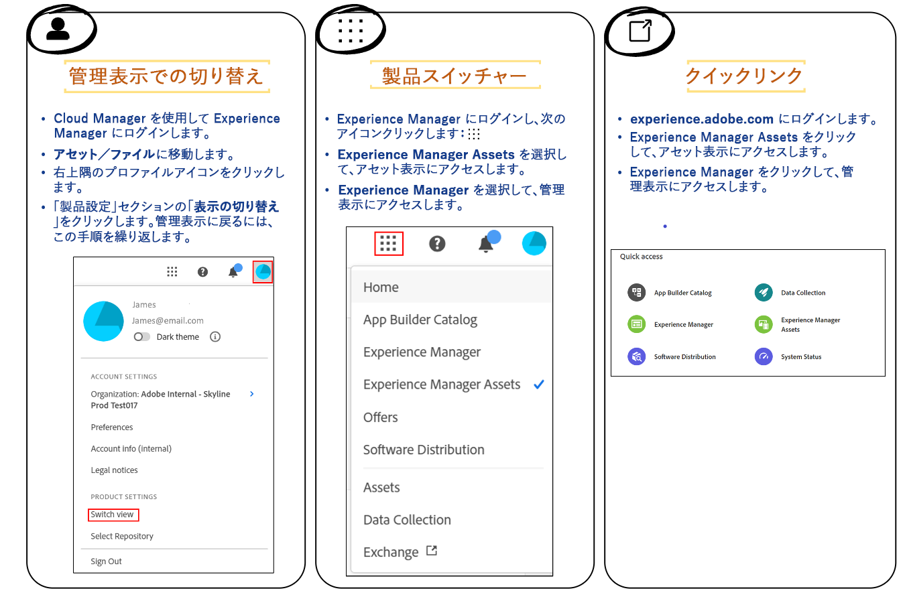

# コンテンツハブ向けアセットの承認 {#approve-assets-content-hub}

| [検索のベストプラクティス](/help/assets/search-best-practices.md) | [メタデータのベストプラクティス](/help/assets/metadata-best-practices.md) | [コンテンツハブ](/help/assets/product-overview.md) | [OpenAPI 機能を備えた Dynamic Media](/help/assets/dynamic-media-open-apis-overview.md) | [AEM Assets 開発者向けドキュメント](https://developer.adobe.com/experience-cloud/experience-manager-apis/) |
| ------------- | --------------------------- |---------|----|-----|

>[!AVAILABILITY]
>
>コンテンツハブガイドを PDF 形式で利用できるようになりました。ガイド全体をダウンロードし、Adobe Acrobat AI アシスタントを使用して質問に答えてください。
>
>[!BADGE コンテンツハブガイドの PDF]{type=Informative url="https://helpx.adobe.com/content/dam/help/en/experience-manager/aem-assets/content-hub.pdf"}

ブランドマネージャーとマーケターは、ブランドアセットを厳密に管理します。コンテンツハブ内で使用できるのは承認済みの最新バージョンのアセットのみなので、すべてのチャネルとアプリケーションでブランドの一貫性が確保されます。

AEM Assets as a Cloud Service を使用してアセットを承認すると、アセット管理が効率化され、アセットを処理するための制御された効率的なプロセスが確保されます。

## 始める前に {#pre-requisites}

開始する前に、次のものが必要です。

* AEM Assets as a Cloud Service へのアクセス権

* アセットの[アセットプロパティ](/help/assets/manage-organize-assets-view.md##manage-asset-status)で使用可能な「**[!UICONTROL ステータス]**」フィールドを編集できるように、アセットメタデータを編集するための書き込み権限。

## コンテンツハブ向けアセットの承認{#approve-assets-for-content-hub}

Assets as a Cloud Service で `approved` としてマークされたアセットは、コンテンツハブで自動的に使用できます。

>[!NOTE]
>
アセットをコンテンツハブに表示するには、Assets as a Cloud Service とコンテンツハブで同じ組織を使用する必要があります。

AEM as a Cloud Service 内のアセットビューを使用してアセットのステータスを `approved` に設定するには：

1. アセットを選択し、ツールバーの「**[!UICONTROL 詳細]**」をクリックします。

1. 「**[!UICONTROL 基本]**」タブで、**[!UICONTROL ステータス]**&#x200B;ドロップダウンリストから `approved` のアセットのステータスを選択します。
1. 「**[!UICONTROL 保存]**」をクリックします。

   >[!VIDEO](https://video.tv.adobe.com/v/3433172)

管理ビューを使用してアセットを承認する必要がある場合は、[管理ビューを使用したアセットの承認](/help/assets/approve-assets.md#approve-assets)を参照してください。

## アセットビューを使用したコンテンツハブのアセットの一括承認 {#bulk-approve-assets-content-hub}

AEM Assets as a Cloud Service のアセットビューを使用してアセットを一括承認します。一括で承認したすべてのアセットは、コンテンツハブで使用できるようになります。

アセットビューのフォルダー内でアセットを一括承認するには：

1. アセットを選択し、「**[!UICONTROL 一括メタデータ編集]**」をクリックします。

1. 右側のパネルの「[!UICONTROL プロパティ]」セクションにある「**[!UICONTROL ステータス]**」フィールドで「**[!UICONTROL 承認済み]**」を選択します。

1. 「**[!UICONTROL 保存]**」をクリックします。

## 管理ビューで新しく取り込まれたアセットの承認の自動化 {#automate-approval-newly-ingested-assets}

アセットビューから管理ビューに切り替えた後、フォルダーに追加したすべての新しいアセットが自動的に承認されるようにフォルダー設定を行うことができます。

管理ビューとアセットビューは、次の方法で切り替えることができます。

[!DNL Experience Manager Admin view] で新しく取り込まれたアセットの承認を自動化するには、次の手順に従います。

1. オーサー環境（https://author-pXXX-eYYY.adobeaemcloud.com）にフォルダーを作成します。_XXX_ をプログラム ID に置き換え、_YYY_ を Experience Manager の環境 ID に置き換えます。
1. **[!UICONTROL ツール]**／**[!UICONTROL アセット]**／**[!UICONTROL メタデータプロファイル]**&#x200B;に移動します。
1. ページの右上にある「**[!UICONTROL 作成]**」をクリックします。
1. プロファイルのタイトルを追加し、「**[!UICONTROL 作成]**」をクリックします。メタデータプロファイルが正常に作成されました。
1. 新しく作成したメタデータプロファイルを選択して、「**[!UICONTROL 編集&#x200B;_（e）_]**」をクリックします。 **[!UICONTROL メタデータプロファイルを編集]**フォームが開き、「**[!UICONTROL 基本]**」タブがハイライト表示されます。
1. 右側の「**[!UICONTROL フォームを作成]**」セクションから **[!UICONTROL 1 行のテキストフィールド]**&#x200B;をフォームの「メタデータ」セクションにドラッグ＆ドロップします。
1. 新しく追加されたフィールドをクリックし、**[!UICONTROL 設定]**&#x200B;パネルで次の更新を行います。
   1. **[!UICONTROL フィールドラベル]**&#x200B;を「_承認済みアセット_」に変更します。
   1. **[!UICONTROL マッピング先のプロパティ]**&#x200B;を _.jcr:content/metadata/dam:status_ に更新します。
   1. デフォルト値を「_承認済み_」に変更します。

1. 手順 6 と同様に、**[!UICONTROL 1 行のテキストフィールド]** を、右側の **[!UICONTROL フォームを作成]** セクションからフォームの「メタデータ」セクションにドラッグします。
1. 新しく追加されたフィールドをクリックし、**[!UICONTROL 設定]**&#x200B;パネルで次の更新を行います。
   1. **[!UICONTROL フィールドラベル]** を _有効化ターゲット_ に変更します。
   1. 「**[!UICONTROL プロパティにマッピング]**」を _./jcr:content/metadata/dam:activationTarget_。
   1. デフォルト値を _contenthub_ に変更します。

1. 「**[!UICONTROL 保存]**」をクリックします。
1. **[!UICONTROL メタデータプロファイル]**&#x200B;ページで、新しく作成したメタデータプロファイルを選択します。
1. 上部のアクションバーから「**[!UICONTROL フォルダーにメタ―データプロファイルを適用]**」をクリックします。
1. 承認する必要があるフォルダーを選択し、「**[!UICONTROL 適用]**」をクリックします。
    フォルダー全体の権限が承認用に設定され、このフォルダーにアップロードされたアセットはすべて自動的に承認されます。

   >[!VIDEO](https://video.tv.adobe.com/v/3427431)

>[!NOTE]
> 
このアプローチでは、フォルダー内に新しく作成したアセットが承認されます。フォルダー内の既存のアセットについては、手動で選択して承認する必要があります。

## コンテンツハブを使用してアップロードしたアセットの管理 {#manage-assets-uploaded-using-content-hub}

[アセットを追加する権限を持つコンテンツハブユーザー](/help/assets/deploy-content-hub.md#onboard-content-hub-users-add-assets)は、ローカルファイルシステムから[コンテンツハブにアセットを追加](/help/assets/upload-brand-approved-assets.md)することや、OneDrive または Dropbox データソースからアセットを読み込むことができます。検索機能を強化するのに、ローカルファイルシステムまたは OneDrive および Dropbox データソースで使用可能なフォルダー構造に関係なく、すべてのアセットがコンテンツハブの上位レベルに表示されます。

コンテンツハブを使用してアップロードしたアセットの表示は、[自動承認切替スイッチを有効](/help/assets/configure-content-hub-ui-options.md#configure-import-options-content-hub)にしているかどうかによって異なります。

* **[!UICONTROL 自動承認]**&#x200B;切替スイッチが有効になっている場合、コンテンツハブを使用してアップロードしたアセットは自動的に使用できます。

* **[!UICONTROL 自動承認]**&#x200B;切替スイッチが無効になっている場合、コンテンツハブを使用してアップロードしたアセットは自動的に表示されません。アセットは、Assets as a Cloud Service 環境の `hydrated-assets` フォルダーで使用できます。フォルダーに移動し、これらのアセットのステータスを[一括編集](#bulk-approve-assets-content-hub)して `Approved` にすると、これらのアセットがコンテンツハブに表示されます。

