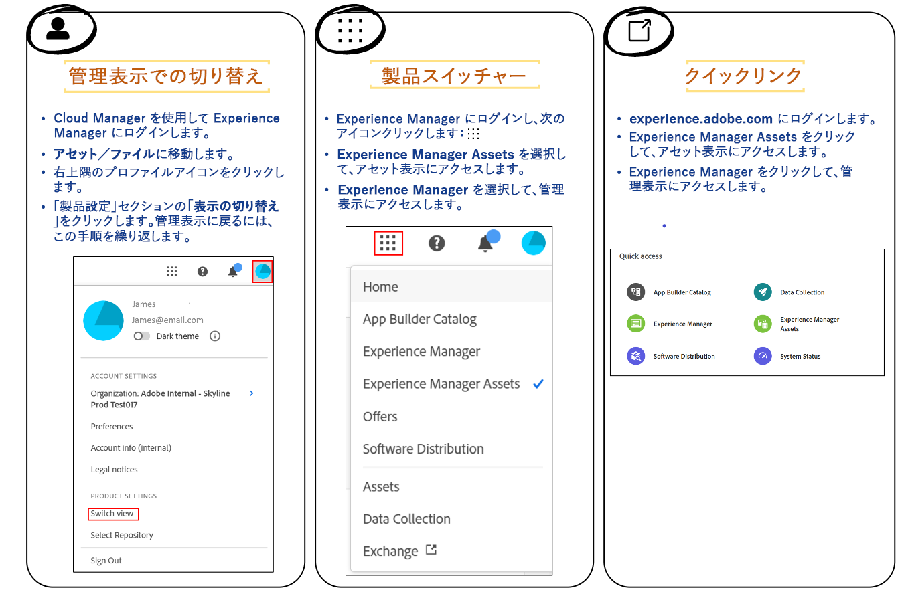

# コンテンツハブ向けアセットの承認 {#approve-assets-content-hub}

>[!AVAILABILITY]
>
>コンテンツハブガイドを PDF 形式で利用できるようになりました。 ガイド全体をダウンロードし、Adobe Acrobat AI アシスタントを使用して質問に答えてください。
>
>[!BADGE コンテンツハブガイドの PDF]{type=Informative url="https://helpx.adobe.com/content/dam/help/en/experience-manager/aem-assets/content-hub.pdf"}

ブランドマネージャーとマーケターは、ブランドアセットを厳密に管理します。 コンテンツハブ内で使用できるのは承認済みの最新バージョンのアセットのみなので、すべてのチャネルとアプリケーションでブランドの一貫性が確保されます。

AEM Assets as a Cloud Service を使用してアセットを承認すると、アセット管理が効率化され、アセットを処理するための制御された効率的なプロセスが確保されます。

## 開始する前に {#pre-requisites}

開始する前に、次のものが必要です。

* AEM Assets as a Cloud Service へのアクセス権

* アセットの[アセットプロパティ](/help/assets/manage-organize-assets-view.md##manage-asset-status)で使用可能な「**[!UICONTROL ステータス]**」フィールドを編集できるように、アセットメタデータを編集するための書き込み権限。

## コンテンツハブ向けアセットの承認{#approve-assets-for-content-hub}

Assets as a Cloud Service で `approved` としてマークされたアセットは、コンテンツハブで自動的に使用できます。

>[!NOTE]
>
>アセットをコンテンツハブに表示するには、Assets as a Cloud Service とコンテンツハブで同じ組織を使用する必要があります。

AEM as a Cloud Service 内のアセットビューを使用してアセットのステータスを `approved` に設定するには：

1. アセットを選択し、ツールバーの「**[!UICONTROL 詳細]**」をクリックします。

1. 「**[!UICONTROL 基本]**」タブで、**[!UICONTROL ステータス]**&#x200B;ドロップダウンリストから `approved` のアセットのステータスを選択します。
1. 「**[!UICONTROL 保存]**」をクリックします。

   >[!VIDEO](https://video.tv.adobe.com/v/3433172)

管理ビューを使用してアセットを承認する必要がある場合は、[管理ビューを使用したアセットの承認](/help/assets/approve-assets.md#approve-assets)を参照してください。

## アセットビューを使用したコンテンツハブのアセットの一括承認 {#bulk-approve-assets-content-hub}

AEM Assets as a Cloud Service のアセットビューを使用してアセットを一括承認します。 一括で承認したすべてのアセットは、コンテンツハブで使用できるようになります。

アセットビューのフォルダー内でアセットを一括承認するには：

1. アセットを選択し、「**[!UICONTROL 一括メタデータ編集]**」をクリックします。

1. 右側のパネルの「[!UICONTROL プロパティ]」セクションにある「**[!UICONTROL ステータス]**」フィールドで「**[!UICONTROL 承認済み]**」を選択します。

1. 「**[!UICONTROL 保存]**」をクリックします。

## 承認ターゲットの設定 {#set-approval-target}

アセットビューでは、アセットの詳細ページの「**承認ターゲット**」フィールドに設定した値に基づいて、承認済みアセットを OpenAPI 機能を備えた Dynamic Media、コンテンツハブ、またはその両方に公開できます。

承認ターゲットを設定するには：

1. アセットを選択し、ツールバーの「**[!UICONTROL 詳細]**」をクリックします。

1. 「**[!UICONTROL 基本]**」タブで、**[!UICONTROL ステータス]**&#x200B;ドロップダウンリストからアセットのステータスを選択します。 可能な値は、「承認済み」、「却下」、「ステータスなし」（デフォルト）です。

1. 手順 2 で「**承認済み**」を選択した場合は、承認ターゲットを選択します。 可能な値には、配信とコンテンツハブが含まれます。

   * 「**配信**」は、ドロップダウンメニューで選択されるデフォルトのオプションであり、[OpenAPI を備えた Dynamic Media](/help/assets/dynamic-media-open-apis-overview.md) と[コンテンツハブ](/help/assets/product-overview.md)の両方に（Experience Manager Assets で両方が有効になっている場合）アセットを公開します。

   * 「**コンテンツハブ**」を選択すると、アセットはコンテンツハブにのみ公開されます。 コンテンツハブは、Experience Manager Assets で有効になっている場合にのみオプションとして表示されます。

   * ドロップダウンリストからオプションを選択しない場合は、AEM as a Cloud Service 環境で有効になっているデフォルトのオプションがアセットに自動的に適用されます。

   使用できるオプションについて詳しくは、[承認済みアセットのデフォルトの承認ターゲットと公開先](#default-approval-target-options-publish-destinations)を参照してください。

   

1. 他のアセットプロパティを指定し、「**[!UICONTROL 保存]**」をクリックします。

その他の注意点を次に示します。

* デフォルトのメタデータフォームを使用しておらず、「**[!UICONTROL 承認ターゲット]**」フィールドを表示できない場合は、[メタデータフォームを編集](/help/assets/metadata-assets-view.md#metadata-forms)して、「**[!UICONTROL 承認対象]**」フィールドを使用できるコンポーネントからメタデータフォームにドラッグし、「**[!UICONTROL 保存]**」をクリックします。

* アセットビューを使用して承認ターゲットを `Content Hub` として選択すると、アセットは同じ組織に属するユーザーがコンテンツハブで使用できるようになります。

### 承認済みアセットのデフォルトの承認ターゲットと公開先 {#default-approval-target-options-publish-destinations}

次の表に、AEM as a Cloud Service 環境での OpenAPI を備えた DM とコンテンツハブのイネーブルメントに基づいて、`Approval Target` ドロップダウンリストとデフォルトの承認ターゲットを表示する前提条件を示します。

| OpenAPI を備えた Dynamic Media | コンテンツハブ | 承認ターゲットドロップダウンリストが表示されますか？ | 承認済みアセットのデフォルトの承認ターゲット | 公開先 |
| --- | --- | --- | --- |---|
| 有効になっています | 有効になっています | はい | 配信 | OpenAPI を備えた Dynamic Media とコンテンツハブ |
| 有効になっていません | 有効になっています | はい | コンテンツハブ | コンテンツハブ |
| 有効になっています | 有効になっていません | はい | 配信 | OpenAPI を備えた Dynamic Media |
| 有効になっていません | 有効になっていません | いいえ | 該当なし | 該当なし |

## 管理ビューで新しく取り込まれたアセットの承認の自動化 {#automate-approval-newly-ingested-assets}

アセットビューから管理ビューに切り替えた後、フォルダーに追加したすべての新しいアセットが自動的に承認されるようにフォルダー設定を行うことができます。

管理者ビューとAssets ビューは、次の方法で切り替えることができます。

[!DNL Experience Manager Admin view] で新しく取り込まれたアセットの承認を自動化するには、次の手順に従います。

1. オーサー環境（https://author-pXXX-eYYY.adobeaemcloud.com）にフォルダーを作成します。 _XXX_ をプログラム ID に置き換え、_YYY_ を Experience Manager の環境 ID に置き換えます。
1. **[!UICONTROL ツール]**／**[!UICONTROL アセット]**／**[!UICONTROL メタデータプロファイル]**&#x200B;に移動します。
1. ページの右上にある「**[!UICONTROL 作成]**」をクリックします。
1. プロファイルのタイトルを追加し、「**[!UICONTROL 作成]**」をクリックします。 メタデータプロファイルが正常に作成されました。
1. 新しく作成したメタデータプロファイルを選択して、「**[!UICONTROL 編集&#x200B;_（e）_]**」をクリックします。  **[!UICONTROL メタデータプロファイルを編集]**&#x200B;フォームが開き、「**[!UICONTROL 基本]**」タブがハイライト表示されます。
1. 右側の「**[!UICONTROL フォームを作成]**」セクションから **[!UICONTROL 1 行のテキストフィールド]**&#x200B;をフォームの「メタデータ」セクションにドラッグ＆ドロップします。
1. 新しく追加されたフィールドをクリックし、**[!UICONTROL 設定]**&#x200B;パネルで次の更新を行います。
   1. **[!UICONTROL フィールドラベル]**&#x200B;を「_承認済みアセット_」に変更します。
   1. **[!UICONTROL マップをプロパティ]**&#x200B;から_./jcr:content/metadata/dam :status_に更新します。
   1. デフォルト値を「_承認済み_」に変更します。

1. 手順 6 と同様に、右側の「**[!UICONTROL フォームを作成]**」セクションから **[!UICONTROL 1 行のテキストフィールド]**&#x200B;をフォームの「メタデータ」セクションにドラッグします。
1. 新しく追加されたフィールドをクリックし、**[!UICONTROL 設定]**&#x200B;パネルで次の更新を行います。
   1. **[!UICONTROL フィールドラベル]**&#x200B;を「_アクティベーションターゲット_」に変更します。
   1. **[!UICONTROL マップをプロパティ]**&#x200B;から_./jcr:content/metadata/dam :activationTarget_に更新します。
   1. デフォルト値を「_contenthub_」に変更します。

1. 「**[!UICONTROL 保存]**」をクリックします。
1. **[!UICONTROL メタデータプロファイル]**&#x200B;ページで、新しく作成したメタデータプロファイルを選択します。
1. 上部のアクションバーから「**[!UICONTROL フォルダーにメタ―データプロファイルを適用]**」をクリックします。
1. 承認する必要があるフォルダーを選択し、「**[!UICONTROL 適用]**」をクリックします。
    フォルダー全体の権限が承認用に設定され、このフォルダーにアップロードされたアセットはすべて自動的に承認されます。

   >[!VIDEO](https://video.tv.adobe.com/v/3427431)

>[!NOTE]
> 
>このアプローチでは、フォルダー内に新しく作成したアセットが承認されます。 フォルダー内の既存のアセットについては、手動で選択して承認する必要があります。

## コンテンツハブを使用してアップロードしたアセットの管理 {#manage-assets-uploaded-using-content-hub}

[アセットを追加する権限を持つコンテンツハブユーザー](/help/assets/deploy-content-hub.md#onboard-content-hub-users-add-assets)は、ローカルファイルシステムから[コンテンツハブにアセットを追加](/help/assets/upload-brand-approved-assets.md)することや、OneDrive または Dropbox データソースからアセットを読み込むことができます。 検索機能を強化するのに、ローカルファイルシステムまたは OneDrive および Dropbox データソースで使用可能なフォルダー構造に関係なく、すべてのアセットがコンテンツハブの上位レベルに表示されます。

コンテンツハブを使用してアップロードしたアセットの表示は、[自動承認切替スイッチを有効](/help/assets/configure-content-hub-ui-options.md#configure-import-options-content-hub)にしているかどうかによって異なります。

* **[!UICONTROL 自動承認]**&#x200B;切替スイッチが有効になっている場合、コンテンツハブを使用してアップロードしたアセットは自動的に使用できます。

* **[!UICONTROL 自動承認]**&#x200B;切替スイッチが無効になっている場合、コンテンツハブを使用してアップロードしたアセットは自動的に表示されません。 アセットは、Assets as a Cloud Service 環境の `hydrated-assets` フォルダーで使用できます。 フォルダーに移動し、これらのアセットのステータスを[一括編集](#bulk-approve-assets-content-hub)して `Approved` にすると、これらのアセットがコンテンツハブに表示されます。

## よくある質問 {#faqs-content-hub-approved-assets}

### Experience Manager as a Cloud ServiceでAEM Assets Content Hubのアセットを承認する目的は何ですか？ {#approving-assets-content-hub}

アセットを承認することで、AEM Assets Content Hubで使用できるのは最新のバージョンと承認済みのバージョンのみになり、あらゆるチャネルやアプリケーションをまたいでブランドの一貫性を保つことができます。 この管理されたプロセスにより、ブランドマネージャーとマーケターのアセット管理が合理化されます。

### AEM Assets Content Hubのアセットを承認するために必要な前提条件は何ですか？

アセットメタデータ、特にアセットプロパティの&#x200B;**ステータス** フィールドを編集するには、AEM Assets as a Cloud Serviceへのアクセス権と書き込み権限が必要です。

### AEM as a Cloud ServiceのAssets ビューを使用して、AEM Assets Content Hubで使用できるように、1つのアセットを承認するにはどうすればよいですか？

アセットを選択し、ツールバーの&#x200B;**詳細**&#x200B;をクリックし、**基本** タブに移動し、**ステータス** ドロップダウンリストから&#x200B;**承認済み**&#x200B;を選択して、**保存**&#x200B;をクリックします。 アセットはAEM Assets Content Hubで利用できます。

### AEM Assets Content Hubでは、アセットを一括承認できます。承認された場合、どうすればよいですか？

はい、アセットは一括承認できます。 Assets ビューで、複数のアセットを選択し、**一括メタデータ編集**&#x200B;をクリックし、「**ステータス**」フィールドの「**承認済み**」を選択して、**保存**」をクリックします。 選択したすべてのアセットは、AEM Assets Content Hubで使用できます。

### AEM Assets Content Hubのアセット承認プロセスの仕組み？ {#asset-approval-content-hub}

自動承認トグルが有効になっている場合は、AEM Assets Content Hubを使用してアップロードされたアセットが自動的に使用できるようになります。 無効にした場合、アップロードされたアセットはAssets as a Cloud Serviceの&#x200B;**hydrated-assets** フォルダーに配置され、ステータスを&#x200B;**Approved**&#x200B;に手動で一括編集してContent Hubに表示する必要があります。

### AEM Assets ビューの「承認ターゲット」フィールドとは何ですか？また、アセットの公開にどのような影響を与えますか？

アセットの詳細ページの&#x200B;**承認ターゲット** フィールドで、承認済みアセットの公開場所を選択できます。 オプションには、**配信** （OpenAPIとContent Hubを使用してDynamic Mediaの両方に公開）または&#x200B;**Content Hub**&#x200B;のみがあります。 オプションが選択されていない場合は、Assets as a Cloud Service環境のデフォルトが適用されます。 詳しくは、[承認済みアセットのデフォルトの承認ターゲットと公開先](#default-approval-target-options-publish-destinations)を参照してください。

### AEM Assets アセットの詳細ページに「承認対象」フィールドが表示されない場合はどうなりますか？

Assets アセットの詳細ページに&#x200B;**Approval Target** フィールドがない場合は、メタデータフォームを編集し、使用可能なコンポーネントから&#x200B;**Approval for** フィールドをフォームにドラッグして、**Save**&#x200B;をクリックする必要があります。 これにより、アセットの承認目標を設定できます。

### AEM Assets管理ビューで新しく取り込んだアセットの承認を自動化するにはどうすればよいですか？

オーサー環境でフォルダーを作成し、**ツール**/**Assets**/**メタデータプロファイル**&#x200B;に移動して、メタデータプロファイルを作成および編集します。 1行のテキストフィールドを追加し、**Approved Assets**&#x200B;というラベルを付け、&#39;./jcr:content/metadata/dam:status&#39;にマッピングし、デフォルト値を`approved`に設定します。 フォルダーにメタデータプロファイルを適用します。 これにより、フォルダーに追加された新しいアセットが自動的に承認されます。

### AEM Assets Content Hubの承認済みアセットには誰がアクセスでき、どのような管理が行われていますか？

承認済みアセットは、AEM Assets Content Hub内の同じ組織に属するユーザーが使用できます。 厳格な制御により、最新の承認済みバージョンのみにアクセスできるので、ブランドの一貫性とセキュリティを維持できます。

**関連情報**

* [アセットを翻訳](/help/assets/translate-assets.md)
* [Assets HTTP API](/help/assets/mac-api-assets.md)
* [AEM Assets as a Cloud Service でサポートされているファイル形式](/help/assets/file-format-support.md)
* [アセットを検索](/help/assets/search-assets.md)
* [接続されたアセット](/help/assets/use-assets-across-connected-assets-instances.md)
* [アセットレポート](/help/assets/asset-reports.md)
* [メタデータスキーマ](/help/assets/metadata-schemas.md)
* [アセットをダウンロード](/help/assets/download-assets-from-aem.md)
* [メタデータを管理](/help/assets/manage-metadata.md)
* [Dynamic Media テンプレートの管理](/help/assets/dynamic-media/manage-dynamic-media-templates.md)
* [レポートの管理](/help/assets/manage-reports-assets-view.md)
* [検索ファセット](/help/assets/search-facets.md)
* [コレクションを管理](/help/assets/manage-collections.md)
* [メタデータの一括読み込み](/help/assets/metadata-import-export.md)
* [AEM および Dynamic Media へのアセットの公開](/help/assets/publish-assets-to-aem-and-dm.md)
