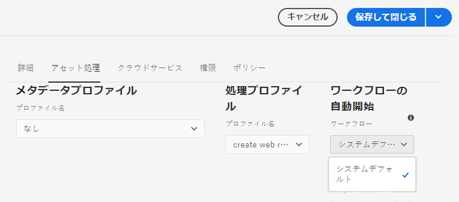

# アセットマイクロサービスと処理プロファイルの使用 {#get-started-using-asset-microservices}

| [検索のベストプラクティス](/help/assets/search-best-practices.md) | [メタデータのベストプラクティス](/help/assets/metadata-best-practices.md) | [コンテンツハブ](/help/assets/product-overview.md) | [OpenAPI 機能を備えた Dynamic Media](/help/assets/dynamic-media-open-apis-overview.md) | [AEM Assets 開発者向けドキュメント](https://developer.adobe.com/experience-cloud/experience-manager-apis/) |
| ------------- | --------------------------- |---------|----|-----|

アセットマイクロサービスは、クラウドネイティブアプリケーション（ワーカーとも呼ばれます）を使用して、アセットの拡張性と回復性に優れた処理を提供します。 アドビは、様々なアセットタイプや処理オプションを最適に処理するためのサービスを管理します。

アセットマイクロサービスを使用すると、以前のバージョンの [!DNL Experience Manager] よりも多くの形式をカバーする[様々なファイルタイプ](/help/assets/file-format-support.md)を追加設定なしで処理できます。例えば、PSD 形式と PSB 形式のサムネール抽出ができるようになりましたが、以前は [!DNL ImageMagick] などのサードパーティソリューションが必要でした。

アセットの処理は、**[!UICONTROL 処理プロファイル]**&#x200B;の設定に応じて異なります。Experience Managerでは、基本的なデフォルト設定を提供し、管理者はそれらを使用して、より具体的なアセット処理設定を追加できます。 管理者は、オプションのカスタマイズを含む、後処理ワークフローの設定を作成および管理できます。ワークフローのカスタマイズを使用すると、デベロッパーはデフォルトのオファーを拡張できます。

<!-- Proposed DRAFT diagram for asset microservices flow - see section "asset-microservices-flow.png (asset-microservices-configure-and-use.md)" in the PPTX deck

https://adobe-my.sharepoint.com/personal/gklebus_adobe_com/_layouts/15/guestaccess.aspx?guestaccesstoken=jexDC5ZnepXSt6dTPciH66TzckS1BPEfdaZuSgHugL8%3D&docid=2_1ec37f0bd4cc74354b4f481cd420e07fc&rev=1&e=CdgElS
-->

>[!NOTE]
>
>ここで説明するアセット処理は、以前のバージョンの [!DNL Experience Manager] に存在する `DAM Update Asset` ワークフローモデルに代わるものです。アセットマイクロサービスの処理は、標準レンディションの生成とメタデータ関連の手順のほとんどを置き換え、後処理ワークフローの設定は、残りの手順があれば置き換えることができます。

## アセット処理オプションについて {#get-started}

[!DNL Experience Manager] では、次のレベルの処理が可能です。

| オプション | 説明 | 対象となる使用例 |
|---|---|---|
| [デフォルト設定](#default-config) | 現在の状態で使用可能で、変更できません。この設定により、基本的なレンディション生成機能が提供されます。 | <ul> <li>[!DNL Assets] ユーザーインターフェイスで使用される標準サムネール（48、140、319 ピクセル） </li> <li> 大きなプレビュー（Web レンディション - 1280 ピクセル） </li><li> メタデータとテキストの抽出。</li></ul> |
| [カスタム設定](#standard-config) | ユーザーインターフェイスを介して管理者が設定します。 デフォルトオプションを拡張することで、レンディションを生成するためのオプションが追加されます。 標準搭載のオプションを拡張して、様々な形式とレンディションを提供します。 | <ul><li>FPO （プレースメントのみ）レンディション。 </li> <li>画像のファイル形式と解像度の変更</li> <li> 条件に応じて、設定したファイルタイプに適用します。 </li> </ul> |
| [カスタムプロファイル](#custom-config) | カスタムアプリケーションを介してカスタムコードを使用し、[アセット計算サービス](https://experienceleague.adobe.com/en/docs/asset-compute/using/introduction)を呼び出すように、ユーザーインターフェイスを介して管理者が設定します。クラウド固有の拡張性の高い方法で、より複雑な要件をサポートします。 | 「[可能な使用例](#custom-config)」を参照してください。 |

<!-- To create custom processing profiles specific to your custom requirements, say to integrate with other systems, see [post-processing workflows](#post-processing-workflows).
-->

## サポートされているファイル形式 {#supported-file-formats}

アセットマイクロサービスは、様々なファイル形式での処理、レンディションの生成、メタデータの抽出をサポートしています。MIME 型の完全なリストと各型でサポートされる機能については、「[サポートされているファイル形式](file-format-support.md)」を参照してください。

## デフォルト設定 {#default-config}

一部のデフォルトは、Experience Manager で必要なデフォルトのレンディションを使用できるように事前に設定されています。また、デフォルト設定では、メタデータの抽出操作とテキストの抽出操作が可能になります。 ユーザーはアセットのアップロードや更新を直ちに開始でき、基本的な処理がデフォルトで利用可能です。

デフォルト設定では、最も基本的な処理プロファイルのみが設定されています。このような処理プロファイルはユーザーインターフェイスに表示されず、変更することはできません。アップロードされたアセットは常に処理されます。このようなデフォルトの処理プロファイルを使用すると、[!DNL Experience Manager] で必要なあらゆる基本処理をすべてのアセットに対して実行できます。

<!-- 
-->

## 標準設定 {#standard-config}

[!DNL Experience Manager] は、ユーザーのニーズに応じて、一般的な形式に対してより具体的なレンディションを生成する機能を提供します。 管理者は、追加の[!UICONTROL 処理プロファイル]を作成して、そのようなレンディションの作成を容易にできます。ユーザーは、使用可能な 1 つ以上のプロファイルを特定のフォルダーに割り当てて、追加の処理を完了することができます。例えば、追加処理で、web、モバイルおよびタブレット用のレンディションを生成できます。 次のビデオでは、[!UICONTROL 処理プロファイル]の作成および適用方法と、作成したレンディションへのアクセス方法を示しています。

* **レンディションの幅と高さ**：レンディションの幅と高さの指定により、生成される出力画像の最大サイズが提供されます。 アセットマイクロサービスでは、レンディションの幅と高さがそれぞれ指定の幅と高さを超えない範囲で、可能な限り大きなレンディションを生成しようとします。縦横比は維持され、元の縦横比と同じになります。値が空の場合は、アセット処理で元の画像のピクセルサイズを前提とすることになります。

* **MIME タイプ包括ルール**：特定の MIME タイプのアセットが処理される際は、まず、その MIME タイプがレンディション仕様の除外 MIME タイプの値と照合されます。そのリストと一致する場合、この特定のレンディションはアセットに対して生成されません（ブロックリスト）。それ以外の場合は、MIME タイプが包含 MIME タイプと照合され、リストと一致する場合は、そのレンディションが生成されます（許可リスト）。

* **特殊 FPO レンディション**：クリエイティブ作業でサイズの大きいアセットを [!DNL Experience Manager] から [!DNL Adobe InDesign] ドキュメントに配置する際、[アセットを配置](https://helpx.adobe.com/jp/indesign/using/placing-graphics.html)した後、かなりの時間を待つ必要があります。その間ユーザーは [!DNL InDesign] の使用をブロックされます。これにより、クリエイティブの流れが中断され、ユーザーエクスペリエンスに悪影響が出ます。Adobeでは、最初に小さいサイズのレンディション [!DNL InDesign] ドキュメントに一時的に配置できますが、後でオンデマンドでフル解像度のアセットに置き換えることができます。 [!DNL Experience Manager] には、プレースメントのみに使用するレンディションが用意されています。 これらの FPO レンディションは、ファイルサイズは小さいですが、縦横比は同じです。

処理プロファイルには、FPO （プレースメント専用）レンディションを含めることができます。 処理プロファイルに対してオンにする必要があるかどうかを理解するには、[!DNL Adobe Asset Link] [ ドキュメント ](https://helpx.adobe.com/jp/enterprise/using/manage-assets-using-adobe-asset-link.html) を参照してください。 詳しくは、[Adobeアセットリンクの完全なドキュメント ](https://helpx.adobe.com/jp/enterprise/using/adobe-asset-link.html) を参照してください。

### 標準プロファイルの作成 {#create-standard-profile}

1. 管理者は、**[!UICONTROL ツール]**／**[!UICONTROL アセット]**／**[!UICONTROL 処理プロファイル]**&#x200B;にアクセスします。「**[!UICONTROL 作成]**」をクリックします。
1. フォルダーに適用する際に、プロファイルを一意に識別するのに役立つ名前を指定します。
1. FPO レンディションを生成するには、「**[!UICONTROL 画像]**」タブで「**[!UICONTROL FPO レンディションを作成]**」を有効にします。**[!UICONTROL 品質]**&#x200B;の値を 1～100 で入力します。
1. 他のレンディションを生成するには、「**[!UICONTROL 新規追加]**」をクリックし、次の情報を入力します。

   * 各レンディションのファイル名。
   * 各レンディションのファイル形式（PNG、JPEG、GIF、WebP）。
   * 各レンディションの幅と高さ（ピクセル単位）。指定しなかった場合は、元の画像の最大ピクセルサイズが使用されます。
   * 各 JPEG および WebP レンディションの画質（パーセント単位）。
   * プロファイルの適用性を定義する、包含および除外 MIME タイプ。

   

1. 「**[!UICONTROL 保存]**」をクリックします。

<!-- TBD: Update the video link when a new video is available from Tech Marketing.

The following video demonstrates the usefulness and usage of standard profile.

>[!VIDEO](https://video.tv.adobe.com/v/29832?quality=9)
-->

<!-- This image was removed per cqdoc-15624, as requested by engineering.
  
 -->

## カスタムプロファイルと使用例 {#custom-config}

[!DNL Asset Compute Service] は、デフォルトの処理や、Photoshop ファイルなどのAdobe固有の形式の処理など、様々なユースケースをサポートしています。 また、カスタムまたは組織固有の処理を実装することもできます。 以前に必要だった DAM アセットの更新ワークフローのカスタマイズは、自動的に処理されるか、処理プロファイル設定を使用して処理されます。 これらの処理オプションがビジネスニーズを満たさない場合、Adobeでは、[!DNL Asset Compute Service] を開発してデフォルトの機能を拡張することをお勧めします。 概要については、「[拡張機能と使用するタイミングについて](https://experienceleague.adobe.com/en/docs/asset-compute/using/extend/understand-extensibility)」を参照してください。

>[!NOTE]
>
>デフォルトの設定または標準のプロファイルを使用してビジネス要件を満たすことができない場合にのみ、カスタムアプリケーションの使用をお勧めします。

画像、ビデオ、ドキュメントおよびその他のファイル形式を、サムネール、抽出したテキストおよびメタデータ、アーカイブなど、様々なレンディションに変換できます。

デベロッパーは、[!DNL Asset Compute Service] を使用して、サポートされる使用例に応じた[カスタムアプリケーションを作成](https://experienceleague.adobe.com/en/docs/asset-compute/using/extend/develop-custom-application)できます。[!DNL Experience Manager]は、管理者が設定したカスタムプロファイルを使用して、これらのカスタムアプリケーションをユーザーインターフェイスから呼び出すことができます。[!DNL Asset Compute Service] は、外部サービスを呼び出す次の使用例をサポートしています。

* [!DNL Adobe Photoshop] の [ImageCutout API](https://developer.adobe.com/photoshop/photoshop-api-docs/) を使用し、結果をレンディションとして保存します。
* サードパーティシステムを呼び出して変更を行います（例：PIM システム）。
* [!DNL Photoshop] API を使用して、Photoshop テンプレートに基づく様々なレンディションを生成します。
* [Adobe Lightroom API](https://developer.adobe.com/photoshop/photoshop-api-docs/) を使用して、取り込んだアセットを最適化し、レンディションとして保存します。

>[!NOTE]
>
>標準メタデータは、カスタムアプリケーションを使用して編集することはできません。変更できるのは、カスタムメタデータのみです。

### カスタムプロファイルの作成 {#create-custom-profile}

1. 管理者は **[!UICONTROL ツール]**/**[!UICONTROL Assets]**/**[!UICONTROL 処理プロファイル]**/**[!UICONTROL 作成]** にアクセスします。
1. 処理プロファイル ページで「**[!UICONTROL カスタム]**」タブをクリックし、「**[!UICONTROL 新規追加]**」をクリックします。
1. 「名前」テキストフィールドにレンディションのファイル名を入力し、次の情報を入力します。

   * 各レンディションのファイル名と、サポートされているファイル拡張子。
   * [App Builder カスタムアプリのエンドポイント URL](https://experienceleague.adobe.com/en/docs/asset-compute/using/extend/deploy-custom-application)。 アプリは、Experience Manager アカウントと同じ組織のものである必要があります。
   * サービスパラメーターを追加し、[追加の情報やパラメーターをカスタムアプリケーションに渡します](https://experienceleague.adobe.com/en/docs/asset-compute/using/extend/develop-custom-application#extend)。
   * MIME タイプを追加および除外し、処理を特定のファイル形式のみに制限します。

1. ページの右上隅にある「**[!UICONTROL 保存]**」をクリックします。

カスタムアプリケーションは、ヘッドレスな [Project App Builder](https://developer.adobe.com/app-builder/docs/overview/) アプリです。処理プロファイルが設定されている場合、カスタムアプリケーションは指定されたすべてのファイルを取得します。 アプリケーションは、ファイルをフィルタリングする必要があります。

>[!CAUTION]
>
>App Builder アプリと [!DNL Experience Manager] アカウントが同じ組織に属していない場合、統合は機能しません。

### カスタムプロファイルの例 {#custom-profile-example}

カスタムプロファイルの使用方法を説明するために、キャンペーン画像にカスタムテキストを適用するユースケースを考えてみましょう。Photoshop API を使用して画像を編集する処理プロファイルを作成できます。

アセット計算サービスの統合により、Experience Manager は、「[!UICONTROL サービスパラメーター]」フィールドを使用して、これらのパラメーターをカスタムアプリケーションに渡すことができます。次に、カスタムアプリケーションはPhotoshop API を呼び出し、これらの値を API に渡します。 例えば、フォント名、テキストカラー、テキスト重み付け、テキストサイズを渡して、カスタムテキストをキャンペーン画像に追加できます。

<!-- TBD: Check screenshot against the interface. -->

*図：「[!UICONTROL  サービスパラメーター ]」フィールドを使用して、追加された情報をカスタムアプリケーションに作成された事前定義済みパラメーターに渡します。 この例では、キャンペーン画像がアップロードされると、画像は `Arial-BoldMT` フォントの `Jumanji` テキストで更新されます。*

## 処理プロファイルを使用したアセットの処理 {#use-profiles}

追加のカスタム処理プロファイルを作成して、特定のフォルダーに適用する。 このワークフローを使用すると、Experience Managerは、これらのフォルダーにアップロードされたアセットやこれらのフォルダーで更新されたアセットを処理できます。 デフォルトの組み込み標準処理プロファイルは常に実行されますが、ユーザーインターフェイスには表示されません。カスタムアセットを追加する場合、プロファイルされたアセットは両方のプロファイルを使用して処理されます。

次のいずれかの方法を使用して、処理プロファイルをフォルダーに適用します。

* 管理者は、**[!UICONTROL ツール]**/**[!UICONTROL Assets]**/**[!UICONTROL 処理プロファイル]** で処理プロファイルの定義を選択し、「**[!UICONTROL プロファイルをフォルダーに適用]**」アクションを使用できます。 コンテンツブラウザーが開きます。このブラウザーを使用すると、特定のフォルダーに移動して選択し、プロファイルの適用を確認できます。
* Assets ユーザーインターフェイスでフォルダーを選択し、**[!UICONTROL プロパティ]** アクションを使用して、フォルダーのプロパティ画面を開くことができます。 「**[!UICONTROL アセット処理]**」タブで、「処理プロファイル [!UICONTROL  リストからそのフォルダーに適した処理プロファイルを選択でき ] す。 変更を保存するには、「**[!UICONTROL 保存して閉じる]**」をクリックします。
  

* Assets ユーザーインターフェイスでフォルダーまたは特定のアセットを選択して処理プロファイルを適用し、上部にあるオプションから「**[!UICONTROL アセットを再処理]**」オプションを選択できます。

>[!TIP]
>
>1 つのフォルダーに適用できる処理プロファイルは 1 つだけです。さらにレンディションを生成するには、既存の処理プロファイルにレンディションの定義を追加します。

処理プロファイルがフォルダーに適用されると、このフォルダーまたはその任意のサブフォルダー内でアップロード（または更新）された新しいアセットはすべて、設定された追加の処理プロファイルを使用して処理されます。この処理は、標準のデフォルトプロファイルによる処理に加えて行われます。

>[!NOTE]
>
>フォルダーに適用された処理プロファイルはツリー全体で機能しますが、サブフォルダーに適用された別のプロファイルで上書きできます。 アセットがフォルダーにアップロードされると、Adobe Experience Manager は、そのフォルダーのプロパティで処理プロファイルを確認します。何も適用されない場合は、適用する処理プロファイルが階層内の親フォルダーで確認されます。

アセットが処理されていることを確認するには、生成されたレンディションを左側のパネルの[!UICONTROL レンディション]ビューでプレビューします。アセットのプレビューを開き、左側のパネルを開いて **[!UICONTROL レンディション]** 表示にアクセスします。 特定のアセットのタイプが MIME タイプ包含ルールと一致する処理プロファイルの特定のレンディションが表示され、アクセス可能になります。

*図：親フォルダーに適用された処理プロファイルで生成された 2 つの追加レンディションの例.*

## 後処理ワークフロー {#post-processing-workflows}

処理プロファイルを使用して実現できない追加のアセット処理が必要な状況では、追加の後処理ワークフローを設定に追加できます。 後処理では、アセットマイクロサービスを使用して、設定可能な処理の上に、完全にカスタマイズされた処理を追加できます。

マイクロサービスの処理が完了すると、[!DNL Experience Manager] は後処理ワークフロー（設定されている場合は [ 自動スタートワークフロー ](https://experienceleague.adobe.com/en/docs/experience-manager-learn/assets/configuring/auto-start-workflows) を自動的に実行します。 ワークフローランチャーを手動で追加してワークフローをトリガーする必要はありません。次に例を示します。

* アセットを処理するためのカスタムワークフロー手順。
* 外部システムから提供されるアセット（製品やプロセスの情報など）にメタデータやプロパティを追加するための統合機能。
* 追加の処理は外部サービスによって行われます。

後処理ワークフロー設定を [!DNL Experience Manager] に追加するには、次の手順に従います。

* 1 つ以上のワークフローモデルを作成します。このドキュメントでは、これらのカスタムモデルを *後処理ワークフローモデル* と呼びます。 これらは通常の [!DNL Experience Manager] ワークフローモデルです。
* 必要なワークフローステップをこれらのモデルに追加します。デフォルトワークフローのステップを確認し、必要なデフォルトステップをすべてカスタムワークフローに追加します。ステップは、ワークフローモデルの設定に基づいてアセットに対して実行されます。例えば、アセットのアップロード時に自動的にスマートタグ付けを実行する場合は、そのステップをカスタムの後処理ワークフローモデルに追加します。
* [!UICONTROL DAM アセットの更新ワークフロー完了プロセス ] ステップを最後に追加します。 この手順を追加すると、Experience Manager がいつ処理が終了したかを把握して、アセットを処理済みとしてマークできるので、アセットに&#x200B;*新規*&#x200B;が表示されます。
* Custom Workflow Runner サービスの設定を作成して、パス（フォルダーの場所）または正規表現によって後処理ワークフローモデルの実行を設定できます。

後処理ワークフローで使用できる標準ワークフローステップについて詳しくは、開発者向けリファレンスの[後処理ワークフローのワークフローステップ](developer-reference-material-apis.md#post-processing-workflows-steps)を参照してください。

### 後処理ワークフローモデルの作成 {#create-post-processing-workflow-models}

後処理ワークフローモデルは、通常の [!DNL Experience Manager] ワークフローモデルです。リポジトリーの場所やアセットタイプごとに異なる処理が必要な場合は、異なるモデルを作成します。

必要に応じて処理手順を追加します。サポートされている利用可能なステップと、カスタム実装されたワークフローステップの両方を使用できます。

各後処理ワークフローの最後の手順が `DAM Update Asset Workflow Completed Process` であることを確認します。最後のステップでは、アセットの処理が完了したことをExperience Managerが認識できるようにします。

### 後処理ワークフローの実行の設定 {#configure-post-processing-workflow-execution}

アセットマイクロサービスがアップロードされたアセットの処理を完了したら、後処理ワークフローを定義して、アセットをさらに処理できます。 ワークフローモデルを使用して後処理を設定するには、次のいずれかを実行します。

* [ フォルダーのプロパティにワークフローモデルを適用 ](#apply-workflow-model-to-folder)
* [Custom Workflow Runner サービスを設定する](#configure-custom-workflow-runner-service)。

#### フォルダーにワークフローモデルを適用する {#apply-workflow-model-to-folder}

一般的な後処理のユースケースでは、メソッドを使用してワークフローをフォルダーに適用することを検討してください。フォルダーの[!UICONTROL プロパティ]にワークフローモデルを適用するには、次の手順に従います。

1. ワークフローモデルを作成します。
1. フォルダーを選択し、ツールバーの **[!UICONTROL プロパティ]** をクリックして、「**[!UICONTROL Assets処理]**」タブをクリックします。
1. 「**[!UICONTROL 自動開始ワークフロー]**」で、必要なワークフローを選択し、ワークフローのタイトルを指定して、変更を保存します。

   

#### Custom Workflow Runner サービスの設定 {#configure-custom-workflow-runner-service}

フォルダーにワークフローを適用することでは実現できない高度な設定に対しては、Custom Workflow Runner サービスを設定できます。 例えば、正規表現を使用するワークフローなどです。Adobe CQ DAM Custom Workflow Runner（`com.adobe.cq.dam.processor.nui.impl.workflow.CustomDamWorkflowRunnerImpl`）は OSGi サービスです。設定には、次の 2 つのオプションが用意されています。

* パスによる後処理ワークフローの設定（`postProcWorkflowsByPath`）：異なるリポジトリーパスに基づいて、複数のワークフローモデルをリストアップできます。コロンを使用してパスとモデルを区切ります。単純なリポジトリーパスがサポートされています。`/var` パスのワークフローモデルにマッピングします。 例：`/content/dam/my-brand:/var/workflow/models/my-workflow`
* 式による後処理ワークフローの設定（`postProcWorkflowsByExpression`）：異なる正規表現に基づいて、複数のワークフローモデルをリストアップできます。式とモデルはコロンで区切ります。 正規表現が、レンディションまたはファイルの 1 つではなく、アセットノードを直接指すように指定します。 例：`/content/dam(/.*/)(marketing/seasonal)(/.*):/var/workflow/models/my-workflow`。

OSGi 設定のデプロイ方法については、[ [!DNL Experience Manager]](/help/implementing/deploying/overview.md)へのデプロイを参照してください。

#### ワークフローの後処理の実行を無効にする

後処理が必要ない場合は、**自動開始ワークフロー**&#x200B;選択で、「空の」ワークフローモデルを作成して使用します。

##### 無効な自動開始ワークフローモデルの作成

1. **ツール**／**ワークフロー**／**モデル**&#x200B;に移動します。
1. 上部のアクションバーから **作成**/**モデルを作成** をクリックします。
1. 新しいワークフローモデルのタイトルと名前を指定します。例：
   * タイトル：自動開始ワークフローを無効にする
   * 名前：disable-auto-start-workflow
1. 「**完了**」をクリックして、ワークフローモデルを作成します。
1. 作成したワークフローモデルの選択と編集
1. ワークフローモデルエディターで、モデル定義から **ステップ 1** をクリックして削除します。
1. サイドパネルから、「**ステップ**」をクリックします。
1. **DAM アセットの更新ワークフローの完了** ステップをモデル定義にドラッグします。
1. **サイドパネル** 切り替えスイッチの横にある **ページ情報** をクリックし、**プロパティを開く** をクリックします。
1. 「基本」タブで、「**一時的なワークフロー**」をクリックします。
1. 上部のアクションバーで、「保存して閉じる **をクリックし** す。
1. 上部のアクションバーで、「**同期**」をクリックします。
1. ワークフローモデルエディターを閉じます。

##### 無効な自動開始ワークフローモデルの適用

[ フォルダーにワークフローモデルを適用する ](#apply-workflow-model-to-folder) で説明した手順に従い、アセットの後処理を必要としないフォルダーの **自動開始ワークフローを無効にする** を **自動開始ワークフローを無効にする** として設定します。

## ベストプラクティスと制限事項 {#best-practices-limitations-tips}

* ワークフローを設計する際には、あらゆる種類のレンディションに対するニーズを考慮します。レンディションが今後必要になることが予測されない場合は、ワークフローからレンディションの作成ステップを削除します。以後、レンディションは一括削除できません。[!DNL Experience Manager] を長時間使用した後、不要なレンディションで大量のストレージ領域が占有される場合があります。個々のアセットについては、ユーザーインターフェイスからレンディションを手動で削除できます。複数のアセットの場合は、[!DNL Experience Manager] をカスタマイズして特定のレンディションを削除するか、アセットを削除して再度アップロードします。
* 現在、サポートはレンディションの生成に限られています。新しいアセットの生成はサポートされていません。
* 現在、メタデータ抽出のファイルサイズの上限は約 15 GB です。非常に大きなアセットをアップロードする場合、メタデータの抽出操作に失敗することがあります。

**関連情報**

* [アセットを翻訳](translate-assets.md)
* [Assets HTTP API](mac-api-assets.md)
* [AEM Assets as a Cloud Service でサポートされているファイル形式](file-format-support.md)
* [アセットを検索](search-assets.md)
* [接続されたアセット](use-assets-across-connected-assets-instances.md)
* [アセットレポート](asset-reports.md)
* [メタデータスキーマ](metadata-schemas.md)
* [アセットをダウンロード](download-assets-from-aem.md)
* [メタデータを管理](manage-metadata.md)
* [検索ファセット](search-facets.md)
* [コレクションを管理](manage-collections.md)
* [メタデータの一括読み込み](metadata-import-export.md)
* [AEM および Dynamic Media へのアセットの公開](/help/assets/publish-assets-to-aem-and-dm.md)

>[!MORELIKETHIS]
>
>* [アセット計算サービスの紹介](https://experienceleague.adobe.com/en/docs/asset-compute/using/introduction)。
>* [ 拡張機能と使用するタイミングについて ](https://experienceleague.adobe.com/en/docs/asset-compute/using/extend/understand-extensibility)。
>* [カスタムアプリケーションの作成方法](https://experienceleague.adobe.com/en/docs/asset-compute/using/extend/develop-custom-application)。
>* [様々な使用例でサポートされる MIME タイプ](/help/assets/file-format-support.md)。

<!-- TBD: 
* How/where can admins check what's already configured and provisioned.
* How/where to request for new provisioning/purchase.
-->
