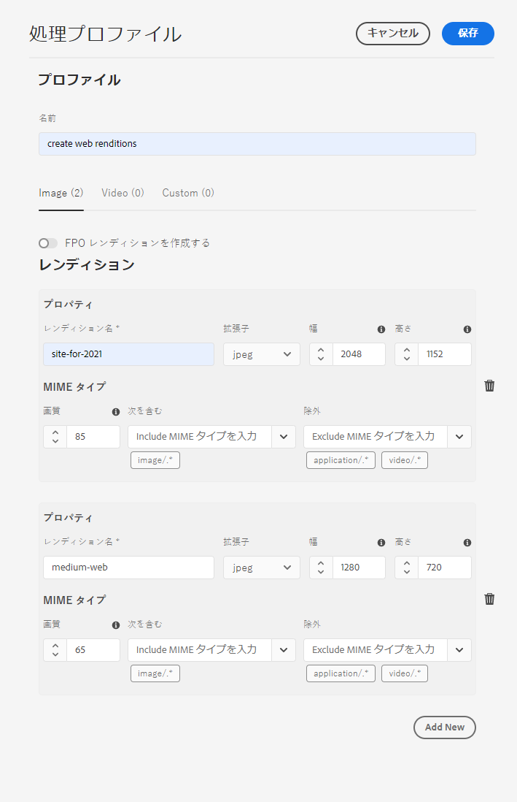

# アセットマイクロサービスと処理プロファイルの使用 {#get-started-using-asset-microservices}

アセットマイクロサービスは、クラウドネイティブアプリケーション（「ワーカー」とも呼ばれる）を使用して、アセットの拡張性と回復性の高い処理を実現します。アドビは、様々なアセットタイプや処理オプションを最適に処理するためのサービスを管理します。

アセットマイクロサービスを使用すると、以前のバージョンの [!DNL Experience Manager] よりも多くの形式をカバーする[様々なファイルタイプ](/help/assets/file-format-support.md)を追加設定なしで処理できます。例えば、以前は ImageMagick などのサードパーティソリューションが必要だった PSD 形式と PSB 形式を、サムネール抽出できるようになりました。

アセットの処理は、**[!UICONTROL 処理プロファイル]**&#x200B;の設定に応じて異なります。Experience Manager には基本的な初期設定が用意されており、管理者は特定のアセット処理設定を追加できます。管理者は、オプションのカスタマイズを含む、後処理ワークフローの設定を作成および管理できます。ワークフローのカスタマイズを使用すると、デベロッパーはデフォルトのオファーを拡張できます。

<!-- Proposed DRAFT diagram for asset microservices flow - see section "asset-microservices-flow.png (asset-microservices-configure-and-use.md)" in the PPTX deck

https://adobe-my.sharepoint.com/personal/gklebus_adobe_com/_layouts/15/guestaccess.aspx?guestaccesstoken=jexDC5ZnepXSt6dTPciH66TzckS1BPEfdaZuSgHugL8%3D&docid=2_1ec37f0bd4cc74354b4f481cd420e07fc&rev=1&e=CdgElS
-->

>[!NOTE]
>
>ここで説明するアセット処理は、以前のバージョンの [!DNL Experience Manager] に存在する `DAM Update Asset` ワークフローモデルに代わるものです。標準的なレンディション生成とメタデータ関連のステップのほとんどは、アセットマイクロサービスの処理に置き換わり、残りのステップは後処理ワークフロー設定に置き換えることができます。

## アセット処理オプションについて {#get-started}

Experience Manager では、次のレベルの処理が可能です。

| オプション | 説明 | 対象となる使用例 |
|---|---|---|
| [デフォルト設定](#default-config) | 現在の状態で使用可能で、変更できません。この設定は、非常に基本的なレンディション生成機能を提供します。 | <ul> <li>[!DNL Assets]ユーザーインターフェイスで使用される標準サムネール（48、140、319ピクセル） </li> <li> 大きいプレビュー（Webレンディション — 1280ピクセル） </li><li> メタデータとテキストの抽出。</li></ul> |
| [カスタム設定](#standard-config) | ユーザーインターフェイスを介して管理者が設定します。デフォルトのオプションを拡張して、レンディションの生成に関するさらなるオプションを提供します。標準搭載のオプションを拡張して、様々な形式とレンディションを提供します。 | <ul><li>FPO レンディション。 </li> <li>画像のファイル形式と解像度の変更</li> <li> 条件に応じて、設定したファイルタイプに適用します。 </li> </ul> |
| [カスタムプロファイル](#custom-config) | カスタムアプリケーションを介してカスタムコードを使用し、[アセット計算サービス](https://experienceleague.adobe.com/docs/asset-compute/using/introduction.html)を呼び出すように、ユーザーインターフェイスを介して管理者が設定します。クラウド固有の拡張性の高い方法で、より複雑な要件をサポートします。 | 「[可能な使用例](#custom-config)」を参照してください。 |

<!-- To create custom processing profiles specific to your custom requirements, say to integrate with other systems, see [post-processing workflows](#post-processing-workflows).
-->

## サポートされているファイル形式 {#supported-file-formats}

アセットマイクロサービスは、様々なファイル形式での処理、レンディションの生成、メタデータの抽出をサポートしています。MIME 型の完全なリストと各型でサポートされる機能については、「[サポートされているファイル形式](file-format-support.md)」を参照してください。

## デフォルト設定 {#default-config}

一部のデフォルトは、Experience Manager で必要なデフォルトのレンディションを使用できるように事前に設定されています。また、デフォルト設定は、メタデータ抽出およびテキスト抽出操作も使用できるようになっています。ユーザーはアセットのアップロードや更新を直ちに開始でき、基本的な処理がデフォルトで利用可能です。

デフォルト設定では、最も基本的な処理プロファイルのみが設定されています。このような処理プロファイルはユーザーインターフェイスに表示されず、変更することはできません。アップロードされたアセットは常に処理されます。このようなデフォルトの処理プロファイルを使用すると、[!DNL Experience Manager] で必要なあらゆる基本処理をすべてのアセットに対して実行できます。

<!-- 
-->

## 標準設定 {#standard-config}

[!DNL Experience Manager] には、ユーザーのニーズに応じて、一般的な形式向けのより具体的なレンディションを生成する機能があります。管理者は、追加の[!UICONTROL 処理プロファイル]を作成して、そのようなレンディションの作成を容易にできます。ユーザーは、使用可能な 1 つ以上のプロファイルを特定のフォルダーに割り当てて、追加の処理を完了することができます。例えば、追加の処理で Web、モバイル、タブレット用のレンディションを生成できるとします。次のビデオでは、[!UICONTROL 処理プロファイル]の作成および適用方法と、作成したレンディションへのアクセス方法を示しています。

* **レンディションの幅と高さ**：レンディションの幅と高さの仕様には、生成される出力画像の最大サイズを指定します。アセットマイクロサービスでは、レンディションの幅と高さがそれぞれ指定の幅と高さを超えない範囲で、可能な限り大きなレンディションを生成しようとします。縦横比は維持され、元の縦横比と同じになります。値が空の場合は、アセット処理で元の画像のピクセルサイズを前提とすることになります。

* **MIME タイプ包括ルール**：特定の MIME タイプのアセットが処理される際は、まず、その MIME タイプがレンディション仕様の除外 MIME タイプの値と照合されます。そのリストと一致する場合、この特定のレンディションはアセットに対して生成されません（ブロックリスト）。それ以外の場合は、MIME タイプが包含 MIME タイプと照合され、リストと一致する場合は、そのレンディションが生成されます（許可リスト）。

* **特殊 FPO レンディション**：クリエイティブ作業でサイズの大きいアセットを [!DNL Experience Manager] から [!DNL Adobe InDesign] ドキュメントに配置する際、[アセットを配置](https://helpx.adobe.com/jp/indesign/using/placing-graphics.html)した後、かなりの時間を待つ必要があります。その間ユーザーは [!DNL InDesign] の使用をブロックされます。これにより、クリエイティブの流れが中断され、ユーザーエクスペリエンスに悪影響が出ます。[!DNL InDesign] ドキュメントでは、最初に小さいサイズのレンディションを一時的に配置して、後からオンデマンドでフル解像度のアセットに置き換えることができます。[!DNL Experience Manager] には、配置専用（FPO）のレンディションが用意されています。これらの FPO レンディションは、ファイルサイズは小さいですが、縦横比は同じです。

処理プロファイルには、FPO（配置専用）レンディションを含めることができます。これを処理プロファイルで有効にする必要がある場合は、 [!DNL Adobe Asset Link] [ドキュメント](https://helpx.adobe.com/jp/enterprise/using/manage-assets-using-adobe-asset-link.html)を参照してください。詳しくは、[Adobe Asset Link の完全なドキュメント](https://helpx.adobe.com/jp/enterprise/using/adobe-asset-link.html)を参照してください。

### 標準プロファイルの作成 {#create-standard-profile}

標準の処理プロファイルを作成するには、次の手順に従います。

1. 管理者は、**[!UICONTROL ツール]**／**[!UICONTROL アセット]**／**[!UICONTROL 処理プロファイル]**&#x200B;にアクセスします。「**[!UICONTROL 作成]**」をクリックします。
1. フォルダーに適用する際に、プロファイルを一意に識別するのに役立つ名前を指定します。
1. FPO レンディションを生成するには、「**[!UICONTROL 標準]**」タブで「**[!UICONTROL FPO レンディションを作成]**」を有効にします。1 ～ 100 の&#x200B;**[!UICONTROL 画質]**&#x200B;値を入力します。
1. 他のレンディションを生成するには、「**[!UICONTROL 新規追加]**」をクリックし、次の情報を入力します。

   * 各レンディションのファイル名。
   * 各レンディションのファイル形式（PNG、JPEG、GIFまたはWebP）。
   * 各レンディションの幅と高さ（ピクセル単位）。指定しなかった場合は、元の画像の最大ピクセルサイズが使用されます。
   * 各JPEGおよびWebPレンディションの画質(%)。
   * プロファイルの適用性を定義する、包含および除外 MIME タイプ。

   

1. 「**[!UICONTROL 保存]**」をクリックします。

<!-- TBD: Update the video link when a new video is available from Tech Marketing.

The following video demonstrates the usefulness and usage of standard profile.

>[!VIDEO](https://video.tv.adobe.com/v/29832?quality=9)
-->

<!-- This image was removed per cqdoc-15624, as requested by engineering.
  
 -->

## カスタムプロファイルと使用例 {#custom-config}

[!DNL Asset Compute Service] は、デフォルト処理、Photoshop ファイルなどのアドビ固有の形式の処理、カスタム処理や組織固有の処理など、様々な使用例をサポートしています。以前に必要だった DAM アップデートアセットワークフローのカスタマイズは、自動的に処理されるか、処理プロファイルの設定を介して処理されます。これらの処理オプションでビジネスニーズが満たされない場合、デフォルトの機能を拡張するために [!DNL Asset Compute Service] を開発および使用することを推奨します。概要については、「[拡張機能と使用するタイミングについて](https://experienceleague.adobe.com/docs/asset-compute/using/extend/understand-extensibility.html)」を参照してください。

>[!NOTE]
>
>デフォルトの設定または標準のプロファイルを使用してビジネス要件を満たすことができない場合にのみ、カスタムアプリケーションの使用をお勧めします。

画像、ビデオ、ドキュメントおよびその他のファイル形式を、サムネール、抽出したテキストおよびメタデータ、アーカイブなど、様々なレンディションに変換できます。

デベロッパーは、[!DNL Asset Compute Service] を使用して、サポートされる使用例に応じた[カスタムアプリケーションを作成](https://experienceleague.adobe.com/docs/asset-compute/using/extend/develop-custom-application.html)できます。[!DNL Experience Manager]は、管理者が設定したカスタムプロファイルを使用して、これらのカスタムアプリケーションをユーザーインターフェイスから呼び出すことができます。[!DNL Asset Compute Service] は、外部サービスを呼び出す次の使用例をサポートしています。

* [!DNL Adobe Photoshop] の [ImageCutout API](https://github.com/AdobeDocs/photoshop-api-docs-pre-release#imagecutout) を使用して、結果をレンディションとして保存します。
* サードパーティシステムを呼び出して、PIM システムなどのデータをアップデートします。
* [!DNL Photoshop] API を使用して、Photoshop テンプレートに基づいて様々なレンディションを生成します。 
* [Adobe Lightroom API](https://github.com/AdobeDocs/lightroom-api-docs#supported-features) を使用して、取得したアセットを最適化し、レンディションとして保存します。

>[!NOTE]
>
>標準メタデータは、カスタムアプリケーションを使用して編集することはできません。変更できるのは、カスタムメタデータのみです。

### カスタムプロファイルの作成 {#create-custom-profile}

カスタムプロファイルを作成するには、次の手順に従います。

1. 管理者は、**[!UICONTROL ツール／アセット／処理プロファイル]**&#x200B;にアクセスします。「**[!UICONTROL 作成]**」をクリックします。
1. 「**[!UICONTROL カスタム]**」タブをクリックします。「**[!UICONTROL 新規追加]**」をクリックします。レンディションの目的のファイル名を指定します。
1. 以下の情報を入力します。

   * 各レンディションのファイル名と、サポートされているファイル拡張子。
   * [Firefly カスタムアプリのエンドポイント URL](https://experienceleague.adobe.com/docs/asset-compute/using/extend/deploy-custom-application.html)。アプリは、Experience Manager アカウントと同じ組織のものである必要があります。
   * サービスパラメーターを追加し、[追加の情報やパラメーターをカスタムアプリケーションに渡します](https://experienceleague.adobe.com/docs/asset-compute/using/extend/develop-custom-application.html#extend)。
   * MIME タイプを追加および除外し、処理を特定のファイル形式のみに制限します。

   「**[!UICONTROL 保存]**」をクリックします。

カスタムアプリケーションは、ヘッドレスな [Project Firefly](https://github.com/AdobeDocs/project-firefly) アプリです。処理プロファイルが設定されている場合、カスタムアプリケーションは指定されたすべてのファイルを取得します。アプリケーションは、ファイルをフィルタリングする必要があります。

>[!CAUTION]
>
>Firefly アプリと [!DNL Experience Manager] アカウントが同じ組織に属していない場合、統合は機能しません。

### カスタムプロファイルの例 {#custom-profile-example}

カスタムプロファイルの使用方法を説明するために、キャンペーン画像にカスタムテキストを適用する使用例を考えてみましょう。Photoshop API を利用して画像を編集する処理プロファイルを作成できます。

アセット計算サービスの統合により、Experience Manager は、「[!UICONTROL サービスパラメーター]」フィールドを使用して、これらのパラメーターをカスタムアプリケーションに渡すことができます。次に、カスタムアプリケーションが Photoshop API を呼び出し、これらの値を API に渡します。例えば、フォント名、テキストカラー、テキスト重み付け、テキストサイズを渡して、カスタムテキストをキャンペーン画像に追加できます。

*図：「[!UICONTROL サービスパラメーター]」フィールドを使用して、カスタムアプリケーションに組み込む事前定義済みのパラメーターに追加情報を渡します。この例では、キャンペーン画像がアップロードされると、画像は `Arial-BoldMT` フォントの `Jumanji` テキストで更新されます。*

## 処理プロファイルを使用したアセットの処理 {#use-profiles}

追加のカスタム処理プロファイルを作成し、Experience Manager の特定のフォルダーに適用して、これらのフォルダーにアップロードまたは更新されたアセットを処理します。デフォルトの組み込み標準処理プロファイルは常に実行されますが、ユーザーインターフェイスには表示されません。カスタムアセットを追加する場合、プロファイルされたアセットは両方のプロファイルを使用して処理されます。

次のいずれかの方法を使用して、処理プロファイルをフォルダーに適用します。

* 管理者が、**[!UICONTROL ツール]**／**[!UICONTROL アセット]**／**[!UICONTROL 処理プロファイル]**&#x200B;で処理プロファイルの定義を選択し、「**[!UICONTROL プロファイルをフォルダーに適用]**」アクションを使用します。コンテンツブラウザーが開き、そこで特定のフォルダーに移動したり、フォルダーを選択したり、プロファイルの適用を確定したりできます。
* ユーザーがアセットユーザーインターフェイスでフォルダーを選択し、「**[!UICONTROL プロパティ]**」アクションを使用してフォルダーのプロパティ画面を開き、「**[!UICONTROL 処理プロファイル]**」タブのポップアップリストでそのフォルダーに適した処理プロファイルを選択します。変更を保存するには、「**[!UICONTROL 保存して閉じる]**」をクリックします。
   

>[!TIP]
>
>1 つのフォルダーに適用できる処理プロファイルは 1 つだけです。さらにレンディションを生成するには、既存の処理プロファイルにレンディションの定義を追加します。

処理プロファイルがフォルダーに適用されると、このフォルダーまたはその任意のサブフォルダー内でアップロード（または更新）された新しいアセットはすべて、設定された追加の処理プロファイルを使用して処理されます。この処理は、標準のデフォルトプロファイルによる処理に加えておこなわれます。

>[!NOTE]
>
>フォルダーに適用された処理プロファイルはツリー全体で機能しますが、サブフォルダーに適用された別のプロファイルでオーバーライドすることができます。アセットがフォルダーにアップロードされると、Adobe Experience Manager は、そのフォルダーのプロパティで処理プロファイルを確認します。何も適用されない場合は、適用する処理プロファイルが階層内の親フォルダーで確認されます。

アセットが処理されていることを確認するには、生成されたレンディションを左側のパネルの[!UICONTROL レンディション]ビューでプレビューします。アセットプレビューを開き、左のパネルを開いて&#x200B;**[!UICONTROL レンディション]**&#x200B;ビューにアクセスします。特定のアセットのタイプが MIME タイプ包含ルールと一致する処理プロファイルの特定のレンディションが表示され、アクセス可能になります。

*図：親フォルダーに適用された処理プロファイルで生成された 2 つの追加レンディションの例.*

## 後処理ワークフロー {#post-processing-workflows}

処理プロファイルを使用して実現できない追加のアセット処理が必要な状況では、追加の後処理ワークフローを設定に追加できます。これにより、アセットマイクロサービスを使用して、設定可能な処理の上に完全にカスタマイズされた処理を追加できます。

後処理ワークフローは、設定されている場合、マイクロサービスの処理が終了した後、[!DNL Experience Manager]によって自動的に実行されます。 ワークフローランチャーを手動で追加してトリガーする必要はありません。次に例を示します。

* アセットを処理するためのカスタムワークフロー手順。
* 外部システムから提供されるアセット（製品やプロセスの情報など）にメタデータやプロパティを追加するための統合機能。
* 外部サービスによる追加処理。

後処理ワークフロー設定を Adobe Experience Manager に追加する作業は、次の手順で構成されます。

* 1 つ以上のワークフローモデルの作成。ドキュメントでは&#x200B;*後処理ワークフローモデル*&#x200B;と呼びますが、これらは通常の Experience Manager ワークフローモデルです。
* これらのモデルへの特定のワークフローステップの追加。手順は、ワークフローモデルの設定に基づいてアセットに対して実行されます。
* [!UICONTROL DAM アセットの更新ワークフロー完了プロセス]ステップを最後に追加します。この手順を追加すると、Experience Manager がいつ処理が終了したかを把握して、アセットを処理済みとしてマークできるので、アセットに&#x200B;*新規*&#x200B;が表示されます。
* Custom Workflow Runner サービスの設定を作成すると、パス（フォルダーの場所）または正規表現で後処理ワークフローモデルの実行を設定できます。

### 後処理ワークフローモデルの作成 {#create-post-processing-workflow-models}

後処理ワークフローモデルは、通常の[!DNL Experience Manager]ワークフローモデルです。 リポジトリの場所やアセットタイプごとに異なる処理が必要な場合は、異なるモデルを作成します。

処理ステップは、ニーズに応じて追加する必要があります。サポートされているステップのほか、カスタム実装されたワークフローステップも使用できます。

各後処理ワークフローの最後の手順が `DAM Update Asset Workflow Completed Process` であることを確認します。最後の手順は、アセットの処理が完了したことを Experience Manager が確実に把握できるようにするのに役立ちます。

### 後処理ワークフローの実行の設定 {#configure-post-processing-workflow-execution}

アセットマイクロサービスの処理が終了した後に、システム内でアップロードまたは更新されたアセットに対して実行する後処理ワークフローモデルを設定するには、Custom Workflow Runner サービスを設定する必要があります。

Custom Workflow Runner サービス（`com.adobe.cq.dam.processor.nui.impl.workflow.CustomDamWorkflowRunnerImpl`）は OSGi サービスで、次の 2 つの設定オプションを提供します。

* パスによる後処理ワークフローの設定（`postProcWorkflowsByPath`）：異なるリポジトリパスに基づいて、複数のワークフローモデルをリストアップできます。パスとモデルはコロンで区切る必要があります。単純なリポジトリパスがサポートされており、`/var` パス内のワークフローモデルにマッピングされる必要があります。例：`/content/dam/my-brand:/var/workflow/models/my-workflow`
* 式による後処理ワークフローの設定（`postProcWorkflowsByExpression`）：異なる正規表現に基づいて、複数のワークフローモデルをリストアップできます。式とモデルはコロンで区切る必要があります。正規表現は、レンディションやファイルの 1 つではなく、アセットノードを直接指すものでなければなりません。例：`/content/dam(/.*/)(marketing/seasonal)(/.*):/var/workflow/models/my-workflow`

>[!NOTE]
>
>Custom Workflow Runner の設定は、OSGi サービスの設定になります。OSGi 設定のデプロイ方法については、[Adobe Experience Manager へのデプロイ](/help/implementing/deploying/overview.md)を参照してください。
>OSGi Webコンソールは、[!DNL Experience Manager]のオンプレミスおよび管理されたサービスデプロイメントとは異なり、クラウドサービスデプロイメントでは直接利用できません。

後処理ワークフローで使用できる標準ワークフローステップについて詳しくは、開発者向けリファレンスの[後処理ワークフローのワークフローステップ](developer-reference-material-apis.md#post-processing-workflows-steps)を参照してください。

## ベストプラクティスと制限事項 {#best-practices-limitations-tips}

* ワークフローを設計する際には、あらゆる種類のレンディションに対するニーズを考慮します。レンディションが今後必要になることが予測されない場合は、ワークフローからレンディションの作成ステップを削除します。以後、レンディションは一括削除できません。[!DNL Experience Manager] を長時間使用した後、不要なレンディションで大量のストレージ領域が占有される場合があります。個々のアセットについては、ユーザーインターフェイスからレンディションを手動で削除できます。複数のアセットについては、特定のレンディションを削除するように [!DNL Experience Manager] をカスタマイズすることもできますし、アセットを削除して再びアップロードすることもできます。
* 現在、サポートはレンディションの生成に限られています。新しいアセットの生成はサポートされていません。

>[!MORELIKETHIS]
>
>* [アセット計算サービスの紹介](https://experienceleague.adobe.com/docs/asset-compute/using/introduction.html)。
>* [拡張機能と使用するタイミングについて](https://experienceleague.adobe.com/docs/asset-compute/using/extend/understand-extensibility.html)。
>* [カスタムアプリケーションの作成方法](https://experienceleague.adobe.com/docs/asset-compute/using/extend/develop-custom-application.html)。
>* [様々な使用例でサポートされる MIME タイプ](/help/assets/file-format-support.md)。

<!-- TBD: 
* How/where can admins check what's already configured and provisioned.
* How/where to request for new provisioning/purchase.
-->
