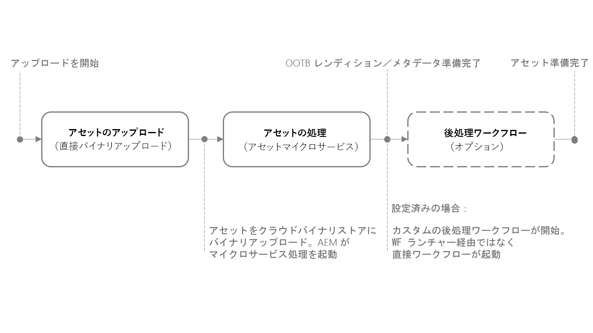
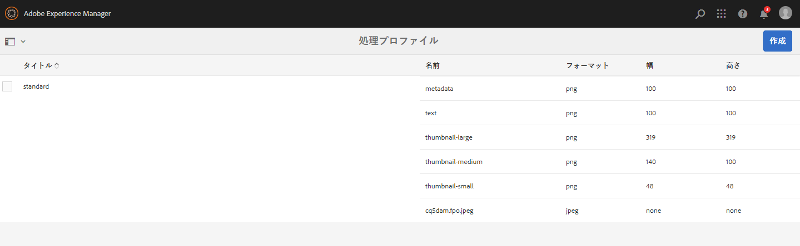
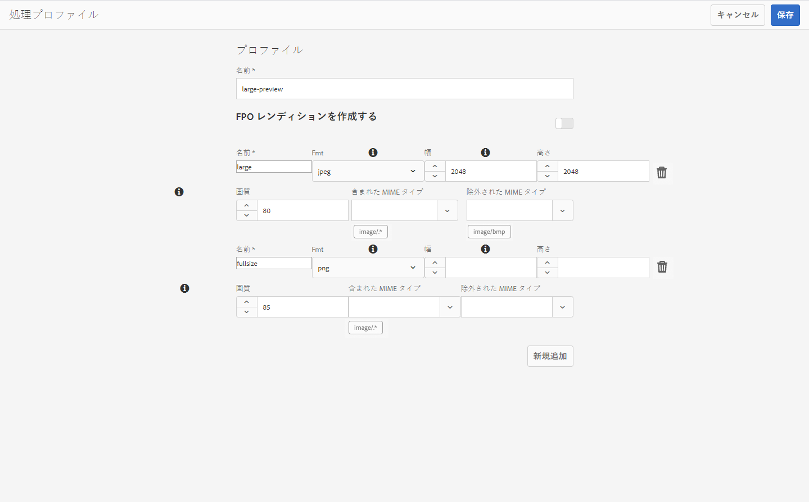
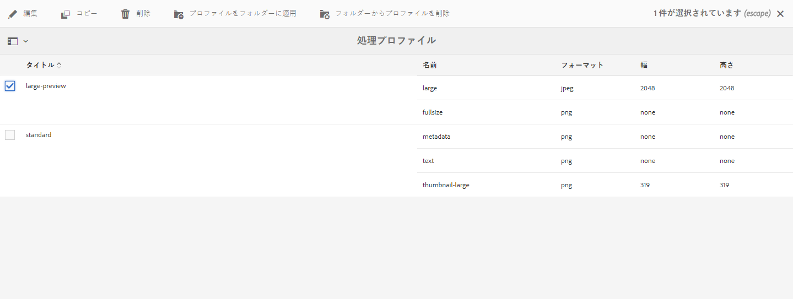
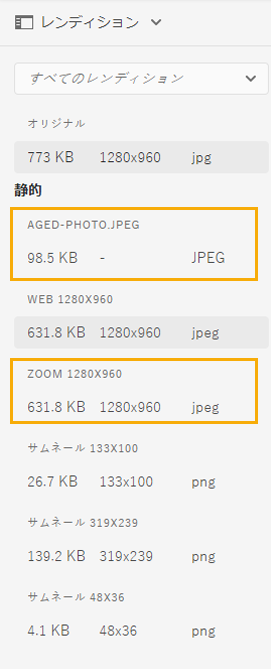

# アセットマイクロサービスと処理プロファイルの使用 {#get-started-using-asset-microservices}

<!--
* Current capabilities of asset microservices offered. If workers have names then list the names and give a one-liner description. (The feature-set is limited for now and continues to grow. So will this article continue to be updated.)
* How to access the microservices. UI. API. Is extending possible right now?
* Detailed list of what file formats and what processing is supported by which workflows/workers process.
* How/where can admins check what's already configured and provisioned.
* How to create new config or request for new provisioning/purchase.

* [DO NOT COVER?] Exceptions or limitations or link back to lack of parity with AEM 6.5.
-->

アセットマイクロサービスは、クラウドサービスを使用して、アセットの拡張性と回復性に優れた処理を実現します。 アドビは、様々なアセットタイプや処理オプションを最適に処理するためのサービスを管理します。

アセット処理は、**[!UICONTROL 処理プロファイル]**&#x200B;の設定に依存してします。処理プロファイルには、デフォルトの設定が用意されていますが、管理者がより具体的なアセット処理設定を追加することもできます。管理者は、オプションのカスタマイズを含む、後処理ワークフローの設定を作成および管理できます。ワークフローのカスタマイズでは、拡張機能と完全なカスタマイズが可能です。

アセットマイクロサービスを使用すると、以前のバージョンの Experience Manager よりも多くの形式をカバーする[様々なファイルタイプ](/help/assets/file-format-support.md)を追加設定なしで処理できます。例えば、以前は ImageMagick などのサードパーティソリューションが必要だった PSD 形式と PSB 形式を、サムネール抽出できるようになりました。

<!-- Proposed DRAFT diagram for asset microservices flow - see section "asset-microservices-flow.png (asset-microservices-configure-and-use.md)" in the PPTX deck

https://adobe-my.sharepoint.com/personal/gklebus_adobe_com/_layouts/15/guestaccess.aspx?guestaccesstoken=jexDC5ZnepXSt6dTPciH66TzckS1BPEfdaZuSgHugL8%3D&docid=2_1ec37f0bd4cc74354b4f481cd420e07fc&rev=1&e=CdgElS
-->

>[!NOTE]
>
>The asset processing described here replaces the `DAM Update Asset` workflow model that exists in the previous versions of [!DNL Experience Manager]. 標準的なレンディション生成とメタデータ関連のステップのほとんどは、アセットマイクロサービスの処理に置き換わり、残りのステップは後処理ワークフロー設定に置き換えることができます。

## アセット処理オプションの理解 {#get-started}

Experience Managerでは、次のレベルの処理が可能です。

| 設定 | 説明 | 対象となる使用例 |
|---|---|---|
| [デフォルト設定](#default-config) | 現在の状態で使用可能で、変更できません。 この設定は、非常に基本的なレンディション生成機能を提供します。 | ユーザーインターフェイスで使用される [!DNL Assets] 標準のサムネール（48、140および319 px） 大きいプレビュー（Webレンディション — 1280 px）; メタデータとテキストの抽出。 |
| [標準設定](#standard-config) | ユーザーインターフェイス経由の管理者のみが設定します。 上記のデフォルト設定よりも、レンディションの生成に関する多くのオプションを提供します。 | 画像の形式と解像度の変更、 FPOレンディションを生成します。 |
| [カスタム設定](#custom-config) | より複雑な要件をサポートするカスタムワーカーを呼び出すために、管理者がユーザーインターフェイスを介して設定します。 クラウドネイティブを活用 [!DNL Asset Compute Service]します。 | 使用 [可能な使用例を参照してください](#custom-config)。 |

他のシステムとの統合などのカスタム要件に特化したカスタム処理プロファイルを作成する場合は、[後処理ワークフロー](#post-processing-workflows)を参照してください。

## サポートされているファイル形式 {#supported-file-formats}

アセットマイクロサービスでは、レンディション生成やメタデータ抽出の機能に関して、様々なファイル形式をサポートしています。そのリストについては、[サポートされているファイル形式](file-format-support.md)を参照してください。

## デフォルト設定 {#default-config}

一部の初期設定は、Experience Managerで必要なデフォルトのレンディションを使用できるように事前に設定されています。 また、デフォルトの設定では、メタデータ抽出とテキスト抽出の操作も確実に行えます。 ユーザーはアセットのアップロードや更新を直ちに開始でき、基本的な処理がデフォルトで利用可能です。

デフォルト設定では、最も基本的な処理プロファイルのみが設定されます。 このような処理プロファイルは、ユーザーインターフェイスに表示されず、変更することはできません。 アップロードされたアセットは常に処理されます。Such a default processing profile ensures that the basic processing required by [!DNL Experience Manager] is completed on all assets.

<!-- 
-->

## 標準プロファイル {#standard-config}

[!DNL Experience Manager] には、ユーザーのニーズに応じて、一般的な形式向けのより具体的なレンディションを生成する機能があります。 管理者は、追加の [!UICONTROL 処理プロファイルを作成して] 、そのようなレンディションの作成を容易にできます。 次に、1つ以上の使用可能なプロファイルを特定のフォルダーに割り当て、追加の処理を行います。 例えば、追加の処理でWeb、モバイル、タブレット用のレンディションを生成できるとします。 次のビデオでは、[!UICONTROL 処理プロファイル]の作成および適用方法と、作成したレンディションへのアクセス方法を示しています。

* **レンディションの幅と高さ**: 「レンディションの幅」と「高さ」の指定では、生成される出力画像の最大サイズが指定されます。 Asset Microservicesは、可能な限り大きいレンディションを生成しようとします。このレンディションの幅と高さは、それぞれ指定された幅と高さ以下です。 縦横比は維持され、元の縦横比と同じになります。値が空の場合は、アセット処理で元の画像のピクセルサイズを前提とすることになります。

* **MIMEタイプインクルージョンルール**: 特定のMIMEタイプを持つアセットが処理される場合、最初に、MIMEタイプがレンディション仕様の除外されたMIMEタイプ値と比較されます。 そのリストと一致する場合、この特定のレンディションはアセットに対して生成されません（ブロックリスト）。それ以外の場合は、MIME タイプが包含 MIME タイプと照合され、リストと一致する場合は、そのレンディションが生成されます（許可リスト）。

* **Special FPO rendition**: クリエイティブプロフェッショナルは、サイズの大きいアセットをから [!DNL Experience Manager] ドキュメントに配置する際、アセットを [!DNL Adobe InDesign] 配置した後、かなりの時間待ちます 。 Meanwhile, the user is blocked from using [!DNL InDesign]. これにより、クリエイティブの流れが中断され、ユーザーエクスペリエンスに悪影響が出ます。Adobe enables temporarily placing small-sized renditions in [!DNL InDesign] documents to begin with, which can be replaced with full-resolution assets on-demand later. [!DNL Experience Manager] には、配置専用（FPO）のレンディションが用意されています。これらの FPO レンディションは、ファイルサイズは小さいですが、縦横比は同じです。

処理プロファイルには、FPO（配置専用）レンディションを含めることができます。これを処理プロファイルで有効にする必要がある場合は、 の[!DNL Adobe Asset Link][ドキュメント](https://helpx.adobe.com/jp/enterprise/using/manage-assets-using-adobe-asset-link.html)を参照してください。詳しくは、[Adobe Asset Link の完全なドキュメント](https://helpx.adobe.com/jp/enterprise/using/adobe-asset-link.html)を参照してください。

### 標準プロファイルの作成 {#create-standard-profile}

標準の処理プロファイルを作成するには、次の手順に従います。

1. 管理者は、 **[!UICONTROL ツール]** / **[!UICONTROL アセット]** / **[!UICONTROL 処理プロファイルにアクセスします]**。 「**[!UICONTROL 作成]**」をクリックします。
1. フォルダーに適用する際に、プロファイルを一意に識別するのに役立つ名前を指定します。
1. FPOレンディションを生成するには、「 **[!UICONTROL 標準]** 」タブで「FPOレンディションを **[!UICONTROL 作成]**」を有効にします。 1 ～ 100の **[!UICONTROL 画質]** (Quality)値を入力します。
1. 他のレンディションを生成するには、「 **[!UICONTROL 追加New]** 」をクリックし、次の情報を入力します。

   * 各レンディションのファイル名。
   * 各レンディションのファイル形式（PNG、JPEGまたはGIF）。
   * 各レンディションの幅と高さ（ピクセル単位） 値を指定しない場合は、元の画像の最大ピクセルサイズが使用されます。
   * 各JPEGレンディションの画質(%)。
   * プロファイルの適用性を定義する、包含および除外 MIME タイプ。

1. 「**[!UICONTROL 保存]**」をクリックします。

次のビデオでは、標準プロファイルの有用性と使用方法を示します。

>[!VIDEO](https://video.tv.adobe.com/v/29832?quality=9)

<!-- Removed per cqdoc-15624 request by engineering.
  
 -->

## カスタムプロファイルと使用例 {#custom-config}

**未定項目**:

* 拡張性コンテンツを使用した全体的なクロスリンク。
* 作業者のURLの取得方法について説明します。 開発、ステージ、および実稼動環境のワーカーURL
* サービスパラメーターのメンションマッピング。 サービス記事を計算するためのリンクです。
* Jiraチケットで共有されるフローの観点から確認します。

組織のニーズが異なるため、複雑なアセット処理の使用例の中には、デフォルト設定を使用して実行できないものもあります。 このような場合 [!DNL Asset Compute Service] のAdobeオファー。 これは、デジタルアセットを処理するためのスケーラブルで拡張可能なサービスです。 画像、ビデオ、ドキュメント、その他のファイル形式を、サムネール、抽出したテキスト、メタデータ、アーカイブなど、様々なレンディションに変換できます。

開発者は、Asset Compute Serviceを使用して、事前定義済みの複雑な使用例に対応する特殊なカスタムワーカーを作成できます。 [!DNL Experience Manager] 管理者が設定するカスタムプロファイルを使用して、これらのカスタムワーカーをユーザーインターフェイスから呼び出すことができます。 [!DNL Asset Compute Service] は、次の使用例をサポートしています。

* Adobe Senseiを使用して、デジタルアセット用に拡張されたカスタムスマートタグを生成します。
* Adobe Senseiを使用して、被写体の切り抜きマスクを生成します。
* PIMシステムから製品メタデータ情報を取得し、アセットの取り込み中に、メタデータをバイナリアセットの一部にします。
* APIを使用して、透明画像の背景色を変更し [!DNL Adobe Photoshop] ます。
* APIを使用して画像をリタッチし [!DNL Photoshop] ます。
* APIを使用して画像をまっすぐにし [!DNL Adobe Lightroom] ます。

>[!NOTE]
>
>標準メタデータは、カスタムワーカーを使用して編集することはできません。 変更できるのは、カスタムメタデータのみです。

### カスタムプロファイルの作成 {#create-custom-profile}

カスタムプロファイルを作成するには、次の手順に従います。

1. 管理者は、 **[!UICONTROL ツール/アセット/処理プロファイルにアクセスします]**。 「**[!UICONTROL 作成]**」をクリックします。
1. Click on **[!UICONTROL Custom]** tab. Click **[!UICONTROL Add New]**. レンディションの目的のファイル名を指定します。
1. 次の情報を入力し、「 **[!UICONTROL 保存]**」をクリックします。

   * 各レンディションのファイル名と、サポートされているファイル拡張子。
   * FireflyカスタムアプリのエンドポイントURL。 アプリは、Experience Managerアカウントと同じ組織のものである必要があります。
   * 必要に応じて、追加サービスパラメーターを設定します。
   * プロファイルの適用性を定義する、包含および除外 MIME タイプ。

>[!CAUTION]
>
>Fireflyアプリと [!DNL Experience Manager] アカウントが同じ組織に属していない場合、統合は機能しません。

## 処理プロファイルを使用したアセットの処理 {#use-profiles}

追加のカスタム処理プロファイルを作成し、Experience Manager の特定のフォルダーに適用して、これらのフォルダーにアップロードまたは更新されたアセットを処理します。デフォルトの組み込み標準処理プロファイルは常に実行されますが、ユーザーインターフェイスには表示されません。カスタムアセットを追加する場合、プロファイルされたアセットは両方のプロファイルを使用して処理されます。

次のいずれかの方法を使用して、処理プロファイルをフォルダーに適用します。

* 管理者が、**[!UICONTROL ツール／Assets／処理プロファイル]**&#x200B;で処理プロファイルの定義を選択し、「**[!UICONTROL プロファイルをフォルダーに適用]**」アクションを使用します。コンテンツブラウザーが開き、そこで特定のフォルダーに移動したり、フォルダーを選択したり、プロファイルの適用を確定したりできます。
* Users can select a folder in the Assets user interface, use **[!UICONTROL Properties]** action to open folder properties screen, click on the **[!UICONTROL Processing Profiles]** tab, and in the popup list, select the correct processing profile for that folder. 変更を保存するには、「 **[!UICONTROL 保存して閉じる]**」をクリックします。

>[!NOTE]
>
>特定のフォルダーに適用できる処理プロファイルは 1 つだけです。さらにレンディションを生成するには、既存の処理プロファイルにレンディションの定義を追加します。

処理プロファイルがフォルダーに適用されると、このフォルダーまたはその任意のサブフォルダー内でアップロード（または更新）された新しいアセットはすべて、設定された追加の処理プロファイルを使用して処理されます。この処理は、標準のデフォルトプロファイルに加えて、行われます。 フォルダーに複数のプロファイルを適用する場合、アップロードまたは更新されたアセットは、それぞれのプロファイルを使用して処理されます。

>[!NOTE]
>
>フォルダーに適用した処理プロファイルはツリー全体で機能しますが、サブプロファイルーに適用した別のフォルダーで上書きできます。 アセットがフォルダーにアップロードされると、Adobe Experience Manager は、そのフォルダーのプロパティで処理プロファイルを確認します。何も適用されない場合は、適用する処理プロファイルが階層内の親フォルダーで確認されます。

ユーザーは、新しくアップロードされ処理が完了したアセットのプレビューを開き、左側のパネルの&#x200B;**[!UICONTROL レンディション]**&#x200B;表示をクリックして、処理が実際におこなわれたかどうかを確認できます。特定のアセットのタイプが MIME タイプ包含ルールと一致する処理プロファイルの特定のレンディションが表示され、アクセス可能になります。

*図：親フォルダーに適用された処理プロファイルで生成された 2 つの追加レンディションの例.*

## 後処理ワークフロー {#post-processing-workflows}

処理プロファイルを使用して実現できない追加のアセット処理が必要な状況では、追加の後処理ワークフローを設定に追加できます。これにより、アセットマイクロサービスを使用して、設定可能な処理の上に完全にカスタマイズされた処理を追加できます。

後処理ワークフローが設定されている場合は、マイクロサービスの処理が終了した後に、AEM で後処理ワークフローが自動的に実行されます。ワークフローランチャーを手動で追加してトリガーする必要はありません。次に例を示します。

* アセットを処理するためのカスタムワークフロー手順。
* 外部システムから提供されるアセット（製品やプロセスの情報など）にメタデータやプロパティを追加するための統合機能。
* 外部サービスによる追加処理。

後処理ワークフロー設定を Adobe Experience Manager に追加する作業は、次の手順で構成されます。

* 1 つ以上のワークフローモデルの作成。ドキュメントでは&#x200B;*後処理ワークフローモデル*&#x200B;と呼びますが、これらは通常の Experience Manager ワークフローモデルです。
* これらのモデルへの特定のワークフローステップの追加。手順は、ワークフローモデルの設定に基づいてアセットに対して実行されます。
* [!UICONTROL DAM アセットの更新ワークフロー完了プロセス]ステップを最後に追加します。この手順を追加すると、Experience Manager がいつ処理が終了したかを把握して、アセットを処理済みとしてマークできるので、アセットに&#x200B;*新規*&#x200B;が表示されます。
* Custom Workflow Runner サービスの設定を作成すると、パス（フォルダーの場所）または正規表現で後処理ワークフローモデルの実行を設定できます。

### 後処理ワークフローモデルの作成 {#create-post-processing-workflow-models}

後処理ワークフローモデルは、通常の AEM ワークフローモデルです。リポジトリの場所やアセットタイプごとに異なる処理が必要な場合は、異なるモデルを作成します。

処理ステップは、ニーズに応じて追加する必要があります。サポートされているステップのほか、カスタム実装されたワークフローステップも使用できます。

各後処理ワークフローの最後の手順が `DAM Update Asset Workflow Completed Process` であることを確認します。最後の手順は、アセットの処理が完了したことを Experience Manager が確実に把握できるようにするのに役立ちます。

### 後処理ワークフローの実行の設定 {#configure-post-processing-workflow-execution}

アセットマイクロサービスの処理が終了した後に、システム内でアップロードまたは更新されたアセットに対して実行する後処理ワークフローモデルを設定するには、Custom Workflow Runner サービスを設定する必要があります。

Custom Workflow Runner サービス（`com.adobe.cq.dam.processor.nui.impl.workflow.CustomDamWorkflowRunnerImpl`）は OSGi サービスで、次の 2 つの設定オプションを提供します。

* パスによる後処理ワークフローの設定（`postProcWorkflowsByPath`）：異なるリポジトリパスに基づいて、複数のワークフローモデルをリストアップできます。パスとモデルはコロンで区切る必要があります。単純なリポジトリパスがサポートされており、`/var` パス内のワークフローモデルにマッピングされる必要があります。例：`/content/dam/my-brand:/var/workflow/models/my-workflow`
* 式による後処理ワークフローの設定（`postProcWorkflowsByExpression`）：異なる正規表現に基づいて、複数のワークフローモデルをリストアップできます。式とモデルはコロンで区切る必要があります。正規表現は、レンディションやファイルの 1 つではなく、アセットノードを直接指すものでなければなりません。例：`/content/dam(/.*/)(marketing/seasonal)(/.*):/var/workflow/models/my-workflow`

>[!NOTE]
>
>Custom Workflow Runner の設定は、OSGi サービスの設定になります。OSGi 設定のデプロイ方法については、[Adobe Experience Manager へのデプロイ](/help/implementing/deploying/overview.md)を参照してください。
>OSGi Web コンソールは、AEM の On-Premise デプロイメントや Managed Services デプロイメントとは異なり、Cloud Service デプロイメントでは直接使用できません。

後処理ワークフローで使用できる標準ワークフローステップについて詳しくは、開発者向けリファレンスの[後処理ワークフローのワークフローステップ](developer-reference-material-apis.md#post-processing-workflows-steps)を参照してください。

## ベストプラクティスと制限事項 {#best-practices-limitations-tips}

* ワークフローを設計する際には、あらゆる種類のレンディションに対するニーズを考慮します。レンディションが今後必要になることが予測されない場合は、ワークフローからレンディションの作成ステップを削除します。以後、レンディションは一括削除できません。[!DNL Experience Manager] を長時間使用した後、不要なレンディションで大量のストレージ領域が占有される場合があります。個々のアセットについては、ユーザーインターフェイスからレンディションを手動で削除できます。複数のアセットについては、特定のレンディションを削除するように [!DNL Experience Manager] をカスタマイズすることもできますし、アセットを削除して再びアップロードすることもできます。
