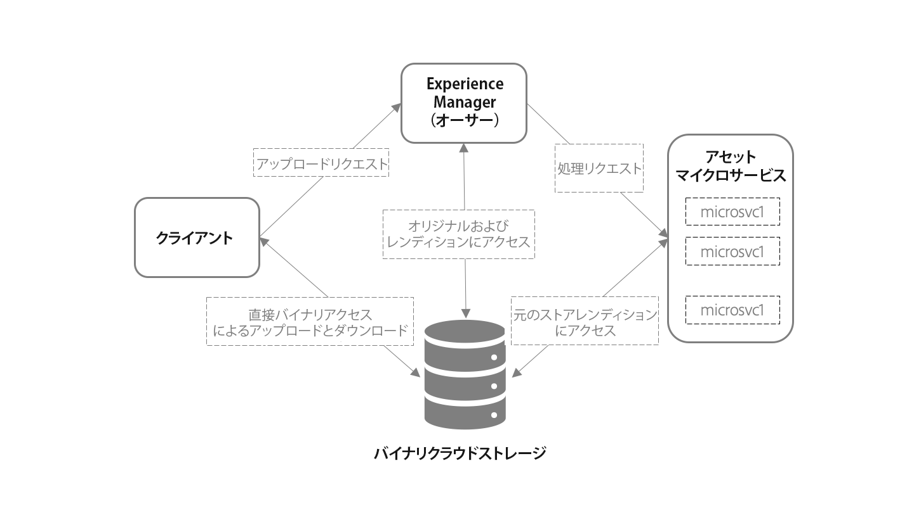

# アセットマイクロサービスを使用したアセットの取り込みと処理の概要 {#asset-microservices-overview}

Adobe Experience Manager as a [!DNL Cloud Service] は、Experience Manager のアプリケーションと機能を利用するためのクラウドネイティブな方法です。この新しいアーキテクチャの主要な要素の 1 つは、アセットの取り込みと処理で、これはアセットマイクロサービスを利用して行われます。アセットマイクロサービスは、クラウドサービスを使用して、拡張性と回復性に優れたアセット処理を提供します。アドビは、様々なアセットタイプや処理オプションを最適に処理するための Cloud Services を管理します。クラウドネイティブなアセットマイクロサービスの主な利点は次のとおりです。

* リソースを大量に消費する操作をシームレスに処理できる、拡張性の高いアーキテクチャ。
* Adobe Experience Manager 環境のパフォーマンスに影響を与えない、効率的なインデックス作成とテキスト抽出。
* Adobe Experience Manager 環境でアセットを処理するワークフローの必要性を最小限に抑えることが可能。これにより、リソースが解放され、Adobe Experience Manager の負荷が最小限に抑えられ、拡張性が向上します。
* アセット処理の耐障害性が向上。破損したファイルや非常に大きなファイルなど、異常なファイルを処理する際に問題が発生しても、デプロイメントのパフォーマンスに影響を与えない。
* 管理者向けのアセット処理の設定を簡素化。
* アセット処理のセットアップをアドビが管理および維持することで、様々なファイルタイプのレンディション、メタデータ、テキスト抽出を処理するためのよく知られた設定を提供。
* アドビのネイティブファイル処理サービスを適宜使用して、[アドビ独自のファイル形式の高品質な出力と効率的な処理](file-format-support.md)を提供。
* ユーザー固有のアクションおよび統合を追加するための後処理ワークフローを設定可能。

アセットマイクロサービスを利用すると、サードパーティ製のレンダリングツールやメソッド（[!DNL ImageMagick] や FFmpeg トランスコーディングなど）が不要になり、システムの設定が簡単になると同時に、一般的なファイル形式に使用できる基本的な機能がデフォルトで提供されます。

## アーキテクチャの概要 {#asset-microservices-architecture}

アセットの取り込みと処理の主要要素、およびシステム全体でのアセットのフローを次のアーキテクチャ概要図に示します。

<!-- Proposed DRAFT diagram for asset microservices overview - see section "Asset processing - high-level diagram" in the PPTX deck

https://adobe-my.sharepoint.com/personal/gklebus_adobe_com/_layouts/15/guestaccess.aspx?guestaccesstoken=jexDC5ZnepXSt6dTPciH66TzckS1BPEfdaZuSgHugL8%3D&docid=2_1ec37f0bd4cc74354b4f481cd420e07fc&rev=1&e=CdgElS
-->

アセットマイクロサービスを使用した取り込みと処理の主な手順は次のとおりです。

* Web ブラウザーや Adobe Asset Link などのクライアントが Adobe [!DNL Experience Manager] にアップロードリクエストを送信し、バイナリクラウドストレージへのバイナリの直接アップロードを開始します。
* バイナリの直接アップロードが完了すると、クライアントが Adobe [!DNL Experience Manager] に通知します。
* [!DNL Experience Manager]Adobe がアセットマイクロサービスに処理リクエストを送信します。リクエストの内容は、生成するレンディションを指定する Adobe [!DNL Experience Manager] 内の処理プロファイル設定によって異なります。
* アセットマイクロサービスのバックエンドがリクエストを受け取り、リクエストに応じて 1 つ以上のマイクロサービスにリクエストをディスパッチします。各マイクロサービスは、バイナリクラウドストア内の元のバイナリに直接アクセスします。
* レンディションなどの処理結果がバイナリクラウドストレージに保存されます。
* Experience Manager には、生成されたバイナリ（レンディション）への直接ポインターと共に処理が完了したことが通知されます。生成されたレンディションは、アップロードされたアセットに対して [!DNL Experience Manager] で使用できます。

これが、アセットの取り込みと処理の基本的なフローです。設定した場合、Experience Manager では、カスタムワークフローモデルを開始して、アセットの後処理を実行することもできます。例えば、エンタープライズシステムから情報を取得し、アセットプロパティに追加するなど、環境に固有のカスタマイズされた手順を実行します。

取得と処理フローは、Experience Manager のアセットマイクロサービスアーキテクチャの主要な概念です。

* **直接バイナリアクセス**：Adobe Experience Manager 環境にいったん設定されると、アセットがクラウドバイナリストアに転送（およびアップロード）された後、[!DNL Experience Manager]、アセットマイクロサービスに続いて、最終的にクライアントがアセットに直接アクセスして、作業を実行することができます。これにより、ネットワークの負荷と、保存されるバイナリの重複を最小限に抑えることができます。
* **処理の外部化**：アセットの処理は [!DNL Experience Manager] 環境の外部で行われるので、主要なデジタルアセット管理（DAM）機能を提供しシステムでのエンドユーザーのインタラクティブな作業をサポートするためのリソース（CPU、メモリ）を節約できます。

## 直接バイナリアクセスを使用したアセットのアップロード {#asset-upload-with-direct-binary-access}

提供製品の一部として含まれている Adobe Experience Manager クライアントはすべて、直接バイナリアクセスを使用したアップロードをデフォルトでサポートしています。これには、Web インターフェイス、Adobe Asset Link、[!DNL Experience Manager] デスクトップアプリケーションを使用したアップロードが含まれます。

[!DNL Experience Manager] HTTP API を直接使用するカスタムアップロードツールを使用できます。これらの API を直接使用することもできますし、アップロードプロトコルを実装している次のオープンソースプロジェクトを使用し拡張することもできます。

* [オープンソースアップロードライブラリ](https://github.com/adobe/aem-upload)
* [オープンソースコマンドラインツール](https://github.com/adobe/aio-cli-plugin-aem)

詳しくは、[アセットのアップロード](add-assets.md)を参照してください。

## アセットのカスタム後処理の追加 {#add-custom-asset-post-processing}

設定可能なアセットマイクロサービスでアセット処理のすべてのニーズを実現できる場合がほとんどですが、追加のアセット処理が必要な場合も一部あります。特に、統合を通じて他のシステムから得られる情報に基づいてアセットを処理する必要がある場合が、これに当てはまります。そのような場合には、カスタムの後処理ワークフローを使用できます。

後処理ワークフローは通常の [!DNL Experience Manager] ワークフローモデルであり、[!DNL Experience Manager] ワークフローエディターで作成および管理されます。ユーザーは、あらかじめ用意されている使用可能なワークフローステップやカスタムワークフローの使用など、アセットに対して追加の処理ステップを実行するようにワークフローを設定できます。

Adobe Experience Manager は、アセット処理の完了後に後処理ワークフローを自動的にトリガーするように設定できます。

<!-- TBD asgupta, Engg: Create some asset-microservices-data-flow-diagram.
-->

**関連情報**

* [アセットを翻訳](translate-assets.md)
* [Assets HTTP API](mac-api-assets.md)
* [AEM Assets as a Cloud Service でサポートされているファイル形式](file-format-support.md)
* [アセットを検索](search-assets.md)
* [接続されたアセット](use-assets-across-connected-assets-instances.md)
* [アセットレポート](asset-reports.md)
* [メタデータスキーマ](metadata-schemas.md)
* [アセットをダウンロード](download-assets-from-aem.md)
* [メタデータを管理](manage-metadata.md)
* [検索ファセット](search-facets.md)
* [コレクションを管理](manage-collections.md)
* [メタデータの一括読み込み](metadata-import-export.md)
* [AEM および Dynamic Media へのアセットの公開](/help/assets/publish-assets-to-aem-and-dm.md)

>[!MORELIKETHIS]
>
>* [アセットマイクロサービスの基本](asset-microservices-configure-and-use.md)
>* [サポートされているファイル形式](file-format-support.md)
>* [Adobe Asset Link](https://helpx.adobe.com/jp/enterprise/using/adobe-asset-link.html)
>* [[!DNL Experience Manager] デスクトップアプリケーション](https://experienceleague.adobe.com/docs/experience-manager-desktop-app/using/introduction.html?lang=ja)
>* [直接バイナリアクセスに関する Apache Oak ドキュメント](https://jackrabbit.apache.org/oak/docs/features/direct-binary-access.html)
