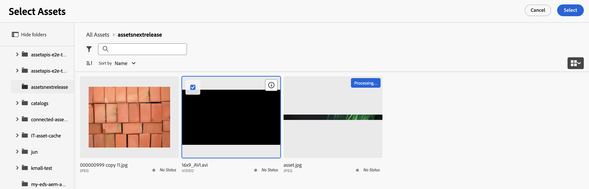
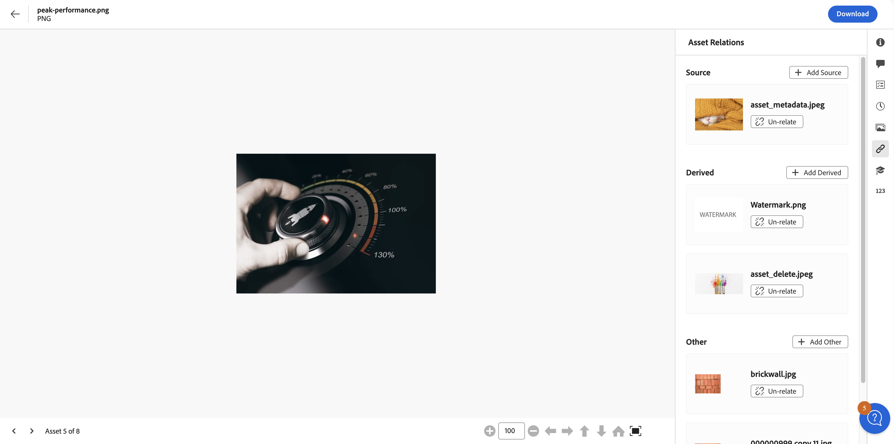

# アセットの関連付け {#related-assets}

[!DNL Adobe Experience Manager Assets] では、関連するアセット機能を使用して、組織のニーズに基づいて手動でアセットを関連付けることができます。例えば、ライセンスファイルを、類似するトピックのアセットや画像／ビデオに関連付けることができます。特定の共通属性を共有するアセットを関連付けることができます。また、この機能を使用して、アセット間にソースと派生の関係を作成することもできます。例えば、INDD ファイルから生成された PDF ファイルがある場合、その PDF ファイルをそのソース INDD ファイルに関連付けることができます。

この機能を使用すると、ベンダーや代理店と低解像度の PDF ファイルや JPG ファイルを共有し、高解像度の INDD ファイルは必要な場合のみ利用できるように柔軟に指定できます。

>[!NOTE]
>
>アセットに対する編集権限を持つユーザーのみが、アセットの関連付けと関連付け解除を行うことができます。

## アセットを関連付ける手順 {#steps-to-relate-assets}

1. [!DNL Experience Manager] のインターフェイスから、関連付けるアセットの **[!UICONTROL プロパティ]**&#x200B;ページを開きます。

   

1. 選択したアセットに別のアセットを関連付けるには、「**[!UICONTROL アセットの関連付け]**」アイコンをクリックします。
1. 次のいずれかの操作を行います。

   * アセットのソースファイルを関連付けるには、リストから「**[!UICONTROL ソースを追加]**」を選択します。ソースとして関連付けることができるアセットは 1 つだけです。
   * 派生ファイルを関連付けるには、リストから「**[!UICONTROL 派生を追加]**」を選択します。このカテゴリには複数のアセットを関連付けることができます。
   * アセット間に双方向の関係を作成するには、リストから「**[!UICONTROL その他を追加]**」を選択します。このカテゴリには複数のアセットを関連付けることができます。

1. **[!UICONTROL アセットを選択]**&#x200B;画面から、関連付けを行うアセットの場所に移動して、選択します。アセットを 1 つずつ選択することもできますが、Shift キーを押しながらクリックして複数のアセットを選択することもできます。この場合、[アセットビューでサポートされているファイル形式](/help/assets/supported-file-formats-assets-view.md)を使用できます。

   

1. 「**[!UICONTROL 選択]**」をクリックします。手順 3 で選択した関係に応じて、関連付けられたアセットが「**[!UICONTROL アセットの関連付け]**」セクションの適切なカテゴリに表示されます。例えば、関連付けたアセットが現在のアセットのソースファイルの場合は、「**[!UICONTROL ソース]**」の下に表示されます。

   

1. 各セクション（[!UICONTROL ソース]、[!UICONTROL 派生]、[!UICONTROL その他]）で関連付けられているすべてのアセットで使用できる「**[!UICONTROL 関連付けを解除]**」をクリックすると、アセットの関連付けを解除できます。

## 関連アセットの翻訳 {#translating-related-assets}

関連アセット機能を使用してアセット間でソースと派生の関係を作成すると、翻訳ワークフローにも役立ちます。派生アセットで翻訳ワークフローを実行すると、[!DNL Experience Manager Assets] はソースファイルが参照するすべてのアセットを自動的に取得し、翻訳用に組み込みます。これにより、ソースアセットが参照するアセットが、ソースおよび派生アセットと共に翻訳されます。ソースファイルが別のアセットに関連付けられている場合、[!DNL Experience Manager Assets] は参照されているアセットを取得し、翻訳用に組み込みます。

[AEM でのアセットの翻訳](/help/assets/translate-assets.md)を参照してください。

## 次の手順 {#next-steps}

* アセットビューユーザーインターフェイスの「[!UICONTROL フィードバック]」オプションを使用して、製品に関するフィードバックを提供する

* 右側のサイドバーにある「[!UICONTROL このページを編集]」（）または「[!UICONTROL 問題を記録] 」（）を使用してドキュメントに関するフィードバックを提供する

* [カスタマーケア](https://experienceleague.adobe.com/ja?support-solution=General#support)に問い合わせる

>[!MORELIKETHIS]
>
>* [アセットのバージョンを表示](/help/assets/manage-organize-assets-view.md#view-versions)
>* [AEM でのアセットの翻訳](/help/assets/translate-assets.md)
>* [アセットビューでサポートされているファイル形式](/help/assets/supported-file-formats-assets-view.md)。
