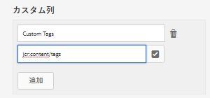

# アセットレポート {#asset-reports}

アセットレポートは、Adobe Experience Manager（AEM）Assets デプロイメントのユーティリティを評価するための重要なツールです。AEM Assets では、デジタルアセットに関する様々なレポートを生成できます。レポートでは、システムの使用状況、ユーザーによるアセットの操作方法、ダウンロードされたアセットや共有されているアセットなどに関する有用な情報が提供されます。

レポートの情報を使用して重要な成功指標を導き出し、企業やお客様における AEM Assets の採用状況を測定することができます。

AEM Assets のレポートフレームワークでは、Sling ジョブを利用して、レポートの要求が順序立てて非同期的に処理されます。このフレームワークは大規模なリポジトリに合わせて拡張することができます。レポートの非同期処理により、レポートを生成する際の効率性とスピードが向上します。

直観的なレポート管理インターフェイスに備わっているきめ細かなオプションやコントロールを使用すれば、アーカイブされたレポートにアクセスしたり、レポートの実行ステータス（成功、失敗および待機中）を表示したりすることができます。

レポートが生成されると、インボックス通知<!-- through an email (optional) and -->で通知されます。それまでに生成されたすべてのレポートが示されるレポートリストページで、レポートの表示、ダウンロードまたは削除をおこなうことができます。

## レポートの生成 {#generate-reports}

AEM Assets では、次の標準レポートが生成されます。

* アップロード
* ダウンロード
* 有効期限
* 変更
* 公開
* Brand Portal 公開
* ディスク使用量
* ファイル
* リンク共有

AEM 管理者は、これらのレポートを手軽に生成し、実装に合わせて容易にカスタマイズできます。レポートを生成するには、以下の手順に従います。

1. AEM のロゴをタップまたはクリックし、**[!UICONTROL ツール]**／**[!UICONTROL アセット]**／**[!UICONTROL レポート]**&#x200B;に移動します。

   

1. アセットレポートページで、ツールバーの「**[!UICONTROL 作成]**」をタップまたはクリックします。
1. **[!UICONTROL レポートを作成]**&#x200B;ページで、作成するレポートを選択し、「**[!UICONTROL 次へ]**」をタップまたはクリックします。

   

   >[!NOTE]
   >
   >「**[!UICONTROL ダウンロードされたアセット]**」レポートを生成する前に、Asset Download サービスが有効になっていることを確認してください。Web コンソール（`https://[aem_server]:[port]/system/console/configMgr`）で、「**[!UICONTROL Day CQ DAM Event Recorder]**」設定を開き、「イベントタイプ」で「**[!UICONTROL ダウンロードされたアセット（ダウンロード済み）]**」オプションを選択します（まだ選択されていない場合）。

   >[!NOTE]
   >
   >デフォルトで、「ダウンロードされたアセット」レポートにはコンテンツフラグメントとリンク共有が含まれています。適切なオプションを選択して、リンク共有のレポートを作成するか、ダウンロードレポートからコンテンツフラグメントを除外します。

1. タイトル、説明、サムネール、CRX リポジトリ内のフォルダーパス（レポートの保存場所）など、レポートの詳細を設定します。デフォルトでは、フォルダーパスは */content/dam* ですが、別のパスを指定することもできます。

   

   レポートの日付範囲を選択します。

   レポートを今すぐ生成するか、将来の日時に生成するかを選択できます。

   >[!NOTE]
   >
   >レポートを後で生成するようにスケジュールする場合は必ず、「日時」フィールドで日付と時刻を指定してください。値を指定しなかった場合、レポートエンジンはそのレポートをすぐに生成するものとして取り扱います。

   設定フィールドは、作成するレポートのタイプによって異なることがあります。

   例えば、「**[!UICONTROL ディスク使用量]**」レポートには、アセットが使用しているディスク領域を計算する際にアセットレンディションを含めるオプションが用意されています。ディスク使用量を計算する際にサブフォルダー内のアセットを含めるか除外するかを選択することもできます。

   >[!NOTE]
   >
   >「**[!UICONTROL ディスク使用量]**」レポートには、現在のディスク領域使用量のみが示されます。そのため、日付範囲のフィールドはありません。

   

   「**[!UICONTROL ファイル]**」レポートを作成する場合は、サブフォルダーを含めるか除外するかを選択できます。ただし、このレポートの場合、アセットレンディションを含めることはできません。

   

   「**[!UICONTROL リンク共有]**」レポートには、AEM Assets 内から外部ユーザーと共有されているアセットへの URL が表示されます。<!-- It includes email ids of the user who shared the assets, emails ids of users with which the assets are shared, share date, and expiration date for the link. -->列をカスタマイズすることはできません。

   「**[!UICONTROL リンク共有]**」レポートでは、*/var/dam/share* に表示される共有 URL が公開されるだけです。そのため、サブフォルダーやレンディションに関するオプションは用意されていません。

   

1. ツールバーの「**[!UICONTROL 次へ]**」をタップまたはクリックします。

1. **[!UICONTROL 列を構成]**&#x200B;ページでは、いくつかの列がデフォルトでレポートに表示されるように選択されています。追加の列を選択できます。選択されている列の選択を解除すると、その列はレポートから除外されます。

   

   カスタムの列名やプロパティパスを表示するには、CRX の jcr:content ノード下のアセットバイナリのプロパティを設定します。または、プロパティパスピッカーを使用してパスを追加します。

   

1. ツールバーの「**[!UICONTROL 作成]**」をタップまたはクリックします。レポートの生成が開始されたことを通知するメッセージが表示されます。
1. アセットレポートページのレポート生成ステータスは、レポートジョブの現在の状態（「成功」、「失敗」、「待機中」、「スケジュール済み」など）に基づきます。同じステータスが通知インボックスにも表示されます。

   レポートページを表示するには、レポートのリンクをタップまたはクリックします。または、レポートを選択し、ツールバーの「表示」アイコンをタップまたはクリックします。

   

   ツールバーの「ダウンロード」アイコンをタップまたはクリックすると、レポートを CSV 形式でダウンロードできます。

## カスタム列の追加 {#add-custom-columns}

次のレポートにカスタム列を追加し、独自の要件に応じてさらに多くのデータを表示することができます。

* アップロード
* ダウンロード
* 有効期限
* 変更
* 公開
* Brand Portal 公開
* ファイル

1. AEM のロゴをタップまたはクリックし、**[!UICONTROL ツール]**／**[!UICONTROL アセット]**／**[!UICONTROL レポート]**&#x200B;に移動します。
1. アセットレポートページで、ツールバーの「**[!UICONTROL 作成]**」をタップまたはクリックします。

1. **[!UICONTROL レポートを作成]**&#x200B;ページで、作成するレポートを選択し、「**[!UICONTROL 次へ]**」をタップまたはクリックします。
1. タイトル、説明、サムネール、フォルダーパス、日付範囲など、該当するレポートの詳細を設定します。

1. カスタム列を表示するには、「**[!UICONTROL カスタム列]**」で列の名前を指定します。

   

1. プロパティパスピッカーを使用して、CRXDE の `jcr:content` ノード下にプロパティパスを追加します。

   

   または、プロパティパスフィールドにパスを入力します。

   

   カスタム列をさらに追加するには、「**[!UICONTROL 追加]**」をタップまたはクリックし、手順 5 および 6 を繰り返します。

1. ツールバーの「**[!UICONTROL 作成]**」をタップまたはクリックします。レポートの生成が開始されたことを通知するメッセージが表示されます。

## パージサービスの設定 {#configure-purging-service}

不要になったレポートを削除するには、数量や経過日数に基づいて既存のレポートをパージするように、Web コンソールで DAM レポートパージサービスを設定します。

1. `https://[aem_server]:[port]/system/console/configMgr` で Web コンソール（設定マネージャー）にアクセスします。
1. 「**[!UICONTROL DAM Report Purge Service]**」設定を開きます。
1. `scheduler.expression.name` フィールドでパージサービスの頻度（時間間隔）を指定します。レポートの経過日数および数量のしきい値を設定することもできます。
1. 変更内容を保存します。
