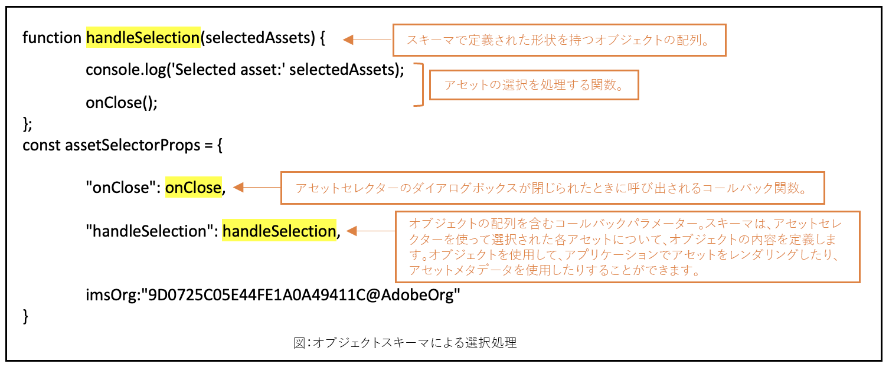

# アセットセレクターのカスタマイズ {#asset-selector-customization}

<table>
    <tr>
        <td>
            <sup style= "background-color:#008000; color:#FFFFFF; font-weight:bold"><i>新規</i></sup> <a href="/help/assets/dynamic-media/dm-prime-ultimate.md"><b>Dynamic Media Prime と Ultimate</b></a>
        </td>
        <td>
            <sup style= "background-color:#008000; color:#FFFFFF; font-weight:bold"><i>新規</i></sup> <a href="/help/assets/assets-ultimate-overview.md"><b>AEM Assets Ultimate</b></a>
        </td>
        <td>
            <sup style= "background-color:#008000; color:#FFFFFF; font-weight:bold"><i>新規</i></sup> <a href="/help/assets/integrate-aem-assets-edge-delivery-services.md"><b>AEM Assets と Edge Delivery Services の統合</b></a>
        </td>
        <td>
            <sup style= "background-color:#008000; color:#FFFFFF; font-weight:bold"><i>新規</i></sup> <a href="/help/assets/aem-assets-view-ui-extensibility.md"><b>UI 拡張機能</b></a>
        </td>
          <td>
            <sup style= "background-color:#008000; color:#FFFFFF; font-weight:bold"><i>新規</i></sup> <a href="/help/assets/dynamic-media/enable-dynamic-media-prime-and-ultimate.md"><b>Dynamic Media Prime と Ultimate の有効化</b></a>
        </td>
    </tr>
    <tr>
        <td>
            <a href="/help/assets/search-best-practices.md"><b>検索のベストプラクティス</b></a>
        </td>
        <td>
            <a href="/help/assets/metadata-best-practices.md"><b>メタデータのベストプラクティス</b></a>
        </td>
        <td>
            <a href="/help/assets/product-overview.md"><b>コンテンツハブ</b></a>
        </td>
        <td>
            <a href="/help/assets/dynamic-media-open-apis-overview.md"><b>OpenAPI 機能を備えた Dynamic Media</b></a>
        </td>
        <td>
            <a href="https://developer.adobe.com/experience-cloud/experience-manager-apis/"><b>AEM Assets 開発者向けドキュメント</b></a>
        </td>
    </tr>
</table>

アセットセレクターを使用すると、環境設定、要件、機能のニーズに応じて、様々なコンポーネントをカスタマイズできます。[マイクロフロントエンドのアセットセレクター](#overview-asset-selector.md)の次のコンポーネントをカスタマイズできます。

* [フィルターパネルのカスタマイズ](#customize-filter-panel)
* [モーダルビューでの情報のカスタマイズ](#customize-info-in-modal-view)
* [ドラッグ＆ドロップモードを有効または無効にする](#enable-disable-drag-and-drop)
* [アセットの選択](#selection-of-assets)
* [有効期限切れのアセットのカスタマイズ](#customize-expired-assets)
* [コンテキスト呼び出しフィルター](#contextual-invocation-filter)
* [dragOptions プロパティ](#drag-options-property)

アプリケーション実装内の **index.html** ファイルまたは同様のファイルで前提条件を定義して、[!DNL Experience Manager Assets] リポジトリにアクセスする認証の詳細を定義する必要があります。完了したら、要件に応じてコードスニペットを追加できます。

## フィルターパネルのカスタマイズ {#customize-filter-panel}

次のコードスニペットを `assetSelectorProps` オブジェクトに追加して、フィルターパネルをカスタマイズできます。

```
filterSchema: [
    {
    header: 'File Type',
    groupKey: 'TopGroup',
    fields: [
    {
    element: 'checkbox',
    name: 'type',
    options: [
    {
    label: 'Images',
    value: '<comma separated mimetypes, without space, that denote all images, for e.g., image/>',
    },
    {
    label: 'Videos',
    value: '<comma separated mimetypes, without space, that denote all videos for e.g., video/,model/vnd.mts,application/mxf>'
    }
    ]
    }
    ]
    },
    {
    fields: [
    {
    element: 'checkbox',
    name: 'type',
    options: [
    { label: 'JPG', value: 'image/jpeg' },
    { label: 'PNG', value: 'image/png' },
    { label: 'TIFF', value: 'image/tiff' },
    { label: 'GIF', value: 'image/gif' },
    { label: 'MP4', value: 'video/mp4' }
    ],
    columns: 3,
    },
    ],
    header: 'Mime Types',
    groupKey: 'MimeTypeGroup',
    },
    {
    fields: [
    {
    element: 'checkbox',
    name: 'property=metadata.application.xcm:keywords.value',
    options: [
    { label: 'Fruits', value: 'fruits' },
    { label: 'Vegetables', value: 'vegetables'}
    ],
    columns: 3,
    },
    ],
    header: 'Food Category',
    groupKey: 'FoodCategoryGroup',
    }
],
```

## モーダルビューでの情報のカスタマイズ {#customize-info-in-modal-view}

 アイコンをクリックすると、アセットの詳細ビューをカスタマイズできます。以下のコードを実行します。

```
// Create an object infoPopoverMap and set the property `infoPopoverMap` with it in assetSelectorProps
const infoPopoverMap = (map) => {
// for example, to skip `path` from the info popover view
let defaultPopoverData = PureJSSelectors.getDefaultInfoPopoverData(map);
return defaultPopoverData.filter((i) => i.label !== 'Path')
};
assetSelectorProps.infoPopoverMap = infoPopoverMap;
```

## ドラッグ＆ドロップモードを有効または無効にする {#enable-disable-drag-and-drop}

次のプロパティを `assetSelectorProp` に追加して、ドラッグ＆ドロップモードを有効にします。ドラッグ＆ドロップを無効にするには、`true` パラメーターを `false` に置き換えます。

```
rail: true,
acvConfig: {
dragOptions: {
allowList: {
'*': true,
},
},
selectionType: 'multiple'
}

// the drop handler to be implemented
function drop(e) {
e.preventDefault();
// following helps you get the selected assets – an array of objects.
const data = JSON.parse(e.dataTransfer.getData('collectionviewdata'));
}
```

## アセットの選択 {#selection-of-assets}

選択されたアセットタイプは、`handleSelection`、`handleAssetSelection`、および `onDrop` 関数を使用している場合、アセット情報を含むオブジェクトの配列です。

次の手順を実行して、1 つまたは複数のアセットの選択を設定します。

```
acvConfig: {
selectionType: 'multiple' // 'single' for single selection
}
// the `handleSelection` callback, always gets you the array of selected assets
```

**スキーマ構文**

```
interface SelectedAsset {
    'repo:id': string;
    'repo:name': string;
    'repo:path': string;
    'repo:size': number;
    'repo:createdBy': string;
    'repo:createDate': string;
    'repo:modifiedBy': string; 
    'repo:modifyDate': string; 
    'dc:format': string; 
    'tiff:imageWidth': number;
    'tiff:imageLength': number;
    'repo:state': string;
    computedMetadata: Record<string, any>;
    _links: {
        'https://ns.adobe.com/adobecloud/rel/rendition': Array<{
            href: string;
            type: string;
            'repo:size': number;
            width: number;
            height: number;
            [others: string]: any;
        }>;
    };
}
```

次の表に、選択されたアセットのオブジェクトの重要なプロパティの一部を示します。

| Property | タイプ | 説明 |
|---|---|---|
| *repo:repositoryId* | 文字列 | アセットが保存されるリポジトリの一意の ID。 |
| *repo:id* | 文字列 | アセットの一意の ID。 |
| *repo:assetClass* | 文字列 | アセットの分類（例：画像、ビデオ、ドキュメント）。 |
| *repo:name* | 文字列 | ファイル拡張子を含むアセットの名前。 |
| *repo:size* | 数値 | アセットのサイズ（バイト単位）。 |
| *repo:path* | 文字列 | リポジトリ内のアセットの場所。 |
| *repo:ancestors* | `Array<string>` | リポジトリ内のアセットの上位項目の配列。 |
| *repo:state* | 文字列 | リポジトリ内のアセットの現在のステータス（例：アクティブ、削除済みなど）。 |
| *repo:createdBy* | 文字列 | アセットを作成したユーザーまたはシステム。 |
| *repo:createDate* | 文字列 | アセットが作成された日時。 |
| *repo:modifiedBy* | 文字列 | アセットを最後に変更したユーザーまたはシステム。 |
| *repo:modifyDate* | 文字列 | アセットが最後に変更された日時。 |
| *dc:format* | 文字列 | ファイルタイプなどのアセットの形式（例：JPEG、PNG）。 |
| *tiff:imageWidth* | 数値 | アセットの幅。 |
| *tiff:imageLength* | 数値 | アセットの高さ。 |
| *computedMetadata* | `Record<string, any>` | あらゆる種類（リポジトリ、アプリケーション、埋め込みメタデータ）のすべてのアセットのメタデータのバケットを表すオブジェクト。 |
| *_links* | `Record<string, any>` | 関連付けられたアセットのハイパーメディアリンク。メタデータやレンディションなどのリソースへのリンクが含まれます。 |
| *`_links.<https://ns.adobe.com/adobecloud/rel/rendition>`* | `Array<Object>` | アセットのレンディションに関する情報を含むオブジェクトの配列。 |
| *`_links.<https://ns.adobe.com/adobecloud/rel/rendition[].href>`* | 文字列 | レンディションの URI。 |
| *`_links.<https://ns.adobe.com/adobecloud/rel/rendition[].type>`* | 文字列 | レンディションの MIME タイプ。 |
| *`_links.<https://ns.adobe.com/adobecloud/rel/rendition[].repo:size>`* | 数値 | レンディションのサイズ（バイト単位）。 |
| *`_links.<https://ns.adobe.com/adobecloud/rel/rendition[].width>`* | 数値 | レンディションの幅。 |
| *`_links.<https://ns.adobe.com/adobecloud/rel/rendition[].height>`* | 数値 | レンディションの高さ。 |

### オブジェクトスキーマを使用したアセット選択の処理 {#handling-selection}

`handleSelection` プロパティを使用して、アセットセレクターでの 1 つまたは複数のアセットの選択を処理します。次の例に、`handleSelection` を使用した構文を示します。



### アセットの選択を無効にする {#disable-selection}

「選択を無効にする」は、アセットやフォルダーを非表示にしたり、選択できないようにしたりするために使用します。カードやアセットから選択チェックボックスを非表示にし、選択されないようにします。この機能を使用するには、配列内で無効にするアセットやフォルダーの位置を宣言します。例えば、最初の位置に表示されるフォルダーの選択を無効にする場合は、次のコードを追加できます。
`disableSelection: [0]:folder`

無効にする MIME タイプ（画像、フォルダー、ファイル、image／jpeg などの他の MIME タイプ）のリストを配列に指定できます。宣言する MIME タイプは、アセットの `data-card-type` 属性と `data-card-mimetype` 属性にマッピングされます。

また、選択が無効なアセットもドラッグできます。特定のアセットタイプのドラッグ＆ドロップを無効にするには、`dragOptions.allowList` プロパティを使用します。

「選択を無効にする」の構文は次のとおりです。

```
(args)=> {
    return(
        <ASDialogWrapper
            {...args}
            disableSelection={args.disableSelection}
            handleAssetSelection={action('handleAssetSelection')}
            handleSelection={action('handleSelection')}
            selectionType={args.selectionType}
        />
    );
}
```

>[!NOTE]
>
> アセットの場合、選択チェックボックスは非表示になりますが、フォルダーの場合、フォルダーは選択できませんが、指定したフォルダーのナビゲーションは表示されます。

<!--For a complete list of properties and detailed example, visit [Asset Selector Code Example](https://github.com/adobe/aem-assets-selectors-mfe-examples).-->

## 有効期限切れのアセットのカスタマイズ {#customize-expired-assets}

アセットセレクターを使用すると、有効期限切れのアセットの使用状況を制御できます。有効期限切れのアセットを&#x200B;**間もなく期限切れ**&#x200B;バッジでカスタマイズすると、現在の日付から 30 日以内に有効期限切れになるアセットを事前に把握するのに役立ちます。さらに、要件に応じてカスタマイズできます。また、キャンバス上で有効期限切れのアセットを選択することや、その逆を行うこともできます。有効期限切れのアセットのカスタマイズは、いくつかのコードスニペットを使用して様々な方法で実行できます。

<!--{
    getExpiryStatus: function, // to control Expired/Expiring soon badges of the asset
    allowSelectionAndDrag: boolean, // set true to allow the selection of expired assets on canvas, set false, otherwise.
}-->

```
expiryOptions: {
    getExpiryStatus: getExpiryStatus;
}
```

### 有効期限切れのアセットの選択 {#selection-of-expired-asset}

有効期限切れのアセットの使用状況をカスタマイズして、選択可能または選択不可にすることができます。アセットセレクターのキャンバス上で有効期限切れのアセットをドラッグ＆ドロップできるようにするかどうかをカスタマイズできます。これを行うには、次のパラメーターを使用して、キャンバス上でアセットを選択不可にします。

```
expiryOptions:{
    allowSelectionAndDrop: false;
}
```
<!--
Additionally, To do this, navigate to **[!UICONTROL Disable default expiry behavior]** under the [!UICONTROL Controls] tab and set the boolean value to `true` or `false` as per the requirement. If `true` is selected, you can see the select box over the expired asset, otherwise it remains unselected. You can hover to the info icon of an asset to know the details of an expired asset. 

-->

### 有効期限切れのアセットの期間の設定 {#set-duration-of-expired-asset}

次のコードスニペットは、今後 5 日以内に有効期限が切れるアセットに&#x200B;**間もなく期限切れ**&#x200B;バッジを設定するのに役立ちます。<!--The `expirationDate` property is used to set the expiration duration of an asset. Refer to the code snippet below:-->

```
/**
  const getExpiryStatus = async (asset) => {
  if (!asset.expirationDate) {
    return null;
  }
  const currentDate = new Date();
  const millisecondsInDay = 1000 * 60 * 60 * 24;
  const fiveDaysFromNow = new Date(value: currentDate.getTime() + 5 * millisecondsInDay);
  const expirationDate = new Date(asset.expirationDate);
  if (expirationDate.getTime() < currentDate.getTime()) {
    return 'EXPIRED';
  } else if (expirationDate.getTime() < fiveDaysFromNow.getTime()) {
    return 'EXPIRING_SOON';
  } else {
    return 'NOT_EXPIRED';
  }
};
```

<!--In the above code snippet, the `getExpiryStatus` function is used to show the **Expiring soon** badge that have expiration date stored in `customExpirationDate`. Additionally, it sets the expiration date of an asset to five days from the current date. The `millisecondsInDay` helps you set expiry of an asset by specifying the time range in milliseconds. You can replace milliseconds with hours directly or customize function as per the requirement. Whereas, the `getTime()` function returns the number of milliseconds for the mentioned date. See [properties](#asset-selector-properties) to know about `expirationDate` property.-->

現在の日付と時刻を取得するプロパティの動作を理解するには、次の例を参照してください。

```
const currentData = new Date();
currentData.getTime(),
```

日付形式 2024-06-19T06:36:53.959Z に従って `1718779013959` が返されます。

### 有効期限切れのアセットのトーストメッセージのカスタマイズ {#customize-toast-message}

`showToast` プロパティは、有効期限切れのアセットに表示するトーストメッセージのカスタマイズに使用します。

構文：

```
{
    type: 'ERROR', 'NEUTRAL', 'INFO', 'SUCCESS',
    message: '<message to be shown>',
    timeout: optional,
}
```

デフォルトのタイムアウトは 500 ミリ秒です。一方、要件に応じて変更することもできます。さらに、値 `timeout: 0` を渡すと、クロスボタンをクリックするまでトーストが開いたままになります。

フォルダーの選択を許可せず、対応するメッセージを表示する必要がある場合に、トーストメッセージを表示する例を以下に示します。

```
const showToast = {
    type: 'ERROR',
    message: 'Folder cannot be selected',
    timeout: 5000,
}
```

有効期限切れのアセットの使用に関するトーストメッセージを表示するには、次のコードスニペットを使用します。

```
(args) => {
    const [selectedAssets, setSelectedAssets] = useState([]);
    const [showToast, setShowToast] = React.useState(false);
    const handleAssetSelection = (assets) => {
        let directorySelectedFlag = false;
        const temp = assets.filter((asset) => {
            if (asset['repo:assetClass'] === 'directory') {
                directorySelectedFlag = true;
                setShowToast(true);
            }
            return !(asset['repo:assetClass'] === 'directory');
        });
        if (!directorySelectedFlag) {
            setShowToast(false);
        }
        setSelectedAssets(temp);
    };
    return (
        <ASDialogWrapper
            {...args}
            showToast={showToast ? args.showToast : null}
            selectedAssets={selectedAssets}
            handleAssetSelection={handleAssetSelection}
        />
    );
}
```

## コンテキスト呼び出しフィルター{#contextual-invocation-filter}

アセットセレクターを使用すると、タグピッカーフィルターを追加できます。特定のタグ付けグループに関連するすべてのタグを組み合わせるタググループをサポートします。また、検索するアセットに対応する追加のタグを選択できます。さらに、最もよく使用するコンテキスト呼び出しフィルターの下にデフォルトのタググループを設定して、外出先でもアクセスできるようにすることもできます。

>
>
> * 検索でタグ付けフィルターを有効にするには、コンテキスト呼び出しコードスニペットを追加する必要があります。
> * タググループタイプに対応する名前プロパティ `(property=xcm:keywords.id=)` を使用することは必須です。

構文：

```
const filterSchema=useMemo(() => {
    return: [
        {
            element: 'taggroup',
            name: 'property=xcm:keywords.id='
        },
    ];
}, []);
```

フィルターパネルにタググループを追加するには、1 つ以上のタググループをデフォルトとして追加する必要があります。さらに、以下のコードスニペットを使用して、タググループから事前に選択されたデフォルトのタグを追加します。

```
export const WithAssetTags = (props) = {
const [selectedTags, setSelectedTags] = useState (
new Set(['orientation', 'color', 'facebook', 'experience-fragments:', 'dam', 'monochrome'])
const handleSelectTags = (selected) => {
setSelectedTags (new Set (selected)) ;
};
const filterSchema = useMemo ((); => {
    return {
        schema: [
            ｛
                fields: [
                    {
                    element: 'checkbox', 
                    name: 'property=xcm:keywords=', 
                    defaultValue: Array. from(selectedTags), 
                    options: assetTags, 
                    orientation: 'vertical',
                    },
                ],
    header: 'Asset Tags', 
    groupkey: 'AssetTagsGroup',
        ],
    },
｝；
}, [selectedTags]);
```


## アセットセレクターでのアップロード {#upload-in-asset-selector}

ローカルファイルシステムからアセットセレクターにファイルまたはフォルダーをアップロードできます。ローカルファイルシステムを使用してファイルをアップロードするには、通常、アセットセレクターのマイクロフロントエンドアプリケーションによって提供されるアップロード機能を使用する必要があります。アセットセレクターでアップロードを呼び出すのに必要な様々なコードスニペットには、次が含まれます。

* [基本アップロードフォームのコードスニペット](#basic-upload)
* [メタデータを使用したアップロード](#upload-with-metadata)
* [カスタマイズされたアップロード](#customized-upload)
* [サードパーティのソースを使用したアップロード](#upload-using-third-party-source)

### 基本アップロードフォーム {#basic-upload}

```
import { AllInOneUpload } from '@assets/upload';
import { TextField, ContextualHelp } from '@adobe/react-spectrum';

const repoId = 'author-p52554-e145207-cmstg.adobeaemcloud.com'
const apiToken = 'eyJhbG....';
const targetUploadPath = '/content/dam/hydrated-assets/cq/as/cq-assets-upload-storybook-testing';

export const UploadExample = () => {
    return (
        <>
            <TextField
                marginStart="size-200"
                width="size-6000"
                isDisabled={true}
                label="Target Upload Path"
                value={targetUploadPath}
                contextualHelp={
                    <ContextualHelp>
                        <Content>Use Storybook Controls panel to change the default upload location</Content>
                    </ContextualHelp>
                }
            />
            <AllInOneUpload
                repositoryId={repoId}
                apiToken={apiToken}
                targetUploadPath={targetUploadPath}
            />
        <>
    )
}
```

### メタデータを使用したアップロード {#upload-with-metadata}

```
import { AllInOneUpload } from '@assets/upload';

const repoId = 'author-p52554-e145207-cmstg.adobeaemcloud.com'
const apiToken = 'eyJhbG....';
const targetUploadPath = '/content/dam/hydrated-assets/cq/as/cq-assets-upload-storybook-testing';

/**
 * see https://git.corp.adobe.com/CQ/assets-upload/blob/main/packages/@assets/upload/stories/data/SampleMetadataSchemas.ts
 * for full schema shape used in rendered example below
 */
const metadataSchema = [
    {
        mapToProperty: 'gmo:lineofBusiness',
        label: 'Line of Business',
        placeholder: 'Select one',
        required: true,
        element: 'dropdown',
        dropdownOptions: [
            {
                id: 'corporate',
                name: 'Corporate',
            },
            {
                id: 'digital-media-dme',
                name: 'Digital Media (DMe)',
            },
            {
                id: 'digital-experience-dx',
                name: 'Digital Experience (DX)',
            },
            {
                id: 'business-solutions',
                name: 'Business Solutions',
            },
        ],
    },
    // ... see link above for full schema
    {
        mapToProperty: 'dam:assetStatus',
        value: 'approved',
        // hidden metadata element, this metadata will be applied to the asset without rendering UI for user input
        element: 'hidden',
    },
];

const handleMetadataFormChange = (event: MetadataChangeEvent) => {
    const { property, value } = event;

    console.log({ property, value });
}

const UploadExampleWithMetadataForm = () => {
    return (
        <AllInOneUpload
            repositoryId={repoId}
            apiToken={apiToken}
            targetUploadPath={targetUploadPath}
            metadataSchema={sampleMetadataSchema}
            onMetadataFormChange={handleMetadataFormChange}
        />
    )
}
```

### カスタマイズされたアップロード {#customized-upload}

```
const MultipleAllInOneUploadExample = () => {
    const mfeRef = React.useRef<{ iframeRef: { current: HTMLIFrameElement } }>(null);

    return (
        <>
            <Button
                onPress={() => UploadCoordinator.initiateUpload(mfeRef.current?.iframeRef?.current)}
            >
                External Initiate Upload
            </Button>
            <AllInOneUpload
                {...otherProps}
                ref={mfeRef}
            />
        <>
    );
}
```

### サードパーティのソースを使用したアップロード {#upload-using-third-party-source}

```
import { useState, useRef } from 'react';
import { AllInOneUpload, UploadCoordinator } from '@assets/upload';
import { Button, Flex, Divider } from '@adobe/react-spectrum';
import { sampleMetadataSchema } from './SampleMetadataSchemas';

const repoId = 'author-p52554-e145207-cmstg.adobeaemcloud.com'
const apiToken = 'eyJhbG....';
const targetUploadPath = '/content/dam/hydrated-assets/cq/as/cq-assets-upload-storybook-testing';

const defaultFiles = [
    new File(['file-content'], 'Controlled File 1'),
    new File(['file-content-with-more'], 'Controlled File 2')
];

const ControlledUploadExample = () => {
    const [controlledFiles, setControlledFiles] = useState<File[]>(defaultFiles)
    const inputRef = React.useRef<HTMLInputElement>(null);

    const handleFileInputChange = useCallback((e: ChangeEvent<HTMLInputElement>) => {
        if (e.target.files) {
            setMyFiles([...e.target.files]);
        }
    }, []);

    return (
        <Flex height="100%" alignItems="center" direction="column">
            <Flex direction="row" alignItems="center" justifyContent="center">
                <Button
                    variant="accent"
                    onPress={() => UploadCoordinator.initiateUpload()}
                    isDisabled={files.length < 1}
                >
                    External Initiate Upload
                </Button>
                <Button
                    variant="secondary"
                    onPress={() => {
                        inputRef.current?.click();
                    }}
                >
                    External Browse files
                </Button>
            </Flex>
            <Divider size="M" marginTop="size-200" />
            <AllInOneUpload
                repositoryId={repoId}
                apiToken={apiToken}
                targetUploadPath={targetUploadPath}
                files={controlledFiles}
                onFilesChange={setControlledFiles}
                hideUploadButton={true}
                metadataSchema={sampleMetadataSchema}
            />
            <input
                ref={inputRef}
                type="file"
                style={{ display: 'none' }}
                onChange={handleFileInputChange}
                multiple={true}
            />
        </Flex>
    )
}
```

### dragOptions プロパティ {#drag-options-property}

```
dragOptions: {
            allowList: {
                '*': true,          // allow all types to be dragged
                'folder': false,    // except those explicitly set to disallow
                'image/jpeg': false // or those with specific mimeTypes
            },
         }
```

>[!MORELIKETHIS]
>
>* [アセットセレクターのプロパティ](/help/assets/asset-selector-properties.md)
>* [アセットセレクターと様々なアプリケーションの統合](/help/assets/integrate-asset-selector.md)
>* [アセットセレクターのプロパティ](/help/assets/asset-selector-properties.md)
>* [OpenAPI 機能を備えた Dynamic Media とのアセットセレクターの統合](/help/assets/integrate-asset-selector-dynamic-media-open-api.md)
