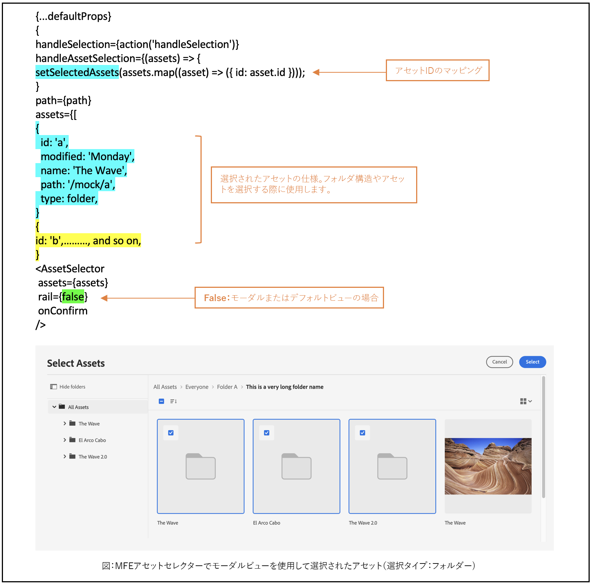

# アセットセレクターのプロパティの使用例 {#usage-examples}

**index.html** ファイルでアセットセレクターの[プロパティ](/help/assets/asset-selector-properties.md)を定義して、アプリケーション内のアセットセレクター表示をカスタマイズできます。

## 例 1：パネルビューのアセットセレクター

アセットセレクターの `rail` の値が `false` に設定されている、またはプロパティで示されていない場合、アセットセレクターはデフォルトでモーダルビューに表示されます。`acvConfig` プロパティを使用すると、ドラッグ＆ドロップなどの詳細な設定が可能になります。`acvConfig` プロパティの使用法については、[ドラッグ＆ドロップを有効または無効にする](asset-selector-customization.md#enable-disable-drag-and-drop)を参照してください。

<!--
### Example 2: Use selectedAssets property in addition to the path property

Use the `path` property to define the folder name that displays automatically when the Asset Selector is rendered. In addition, use the `selectedAssets` property to define the IDs for the assets that you need to select within the folder. Moreover, when you want to display assets that are pre-defined within the folder, you can use selectedAssets property.

   
-->

## 例 2：メタデータポップオーバー

様々なプロパティを使用して、情報アイコンを使用して表示するアセットのメタデータを定義します。情報ポップオーバーは、アセットまたはフォルダーに関する情報のコレクションを提供します。この情報には、アセットのタイトル、寸法、変更日、場所、説明などが含まれます。次の例では、様々なプロパティを使用してアセットのメタデータを表示します。例えば、`repo:path` プロパティは、アセットの場所を指定します。<!--`repo` represents the repository from where the asset is showing, whereas, `path` represents the route from where the asset or folder is rendered.-->

## 例 3：パネルビューのカスタムフィルタープロパティ

ファセット検索に加えて、アセットセレクターを使用すると、様々な属性をカスタマイズし、[!DNL Cloud Service] アプリケーションとして [!DNL Adobe Experience Manager] からの検索を絞り込むことができます。カスタマイズした検索フィルターをアプリケーションに追加するには、次のコードを追加します。次の例では、画像、ドキュメント、ビデオの中からアセットタイプをフィルタリングする `Type Filter` 検索、または検索用に追加したフィルタータイプを使用します。

<!--

## Customization after integrating Asset Selector 

### Custom metadata

Assets display panel shows the out of the box metadata that can be displayed in the info of the asset. In addition to this, [!DNL Adobe Experience Manager] as a [!DNL Cloud Service] application allows configuration of the asset selector by adding custom metadata that is shown in info panel of the asset.
-->

>[!MORELIKETHIS]
>
>* [アセットセレクターのカスタマイズ](/help/assets/asset-selector-customization.md)
>* [アセットセレクターのアップロード](/help/assets/asset-selector-upload.md)
>* [アセットセレクターのプロパティ](/help/assets/asset-selector-properties.md)
>* [OpenAPI 機能を備えた Dynamic Media とのアセットセレクターの統合](/help/assets/integrate-asset-selector-dynamic-media-open-api.md)
