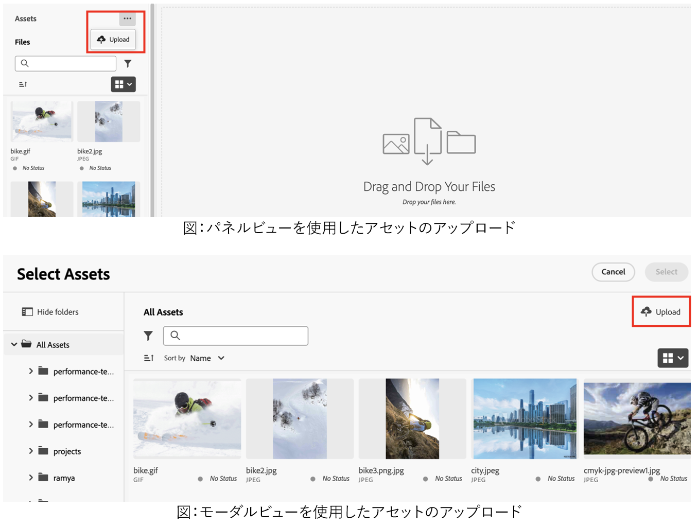
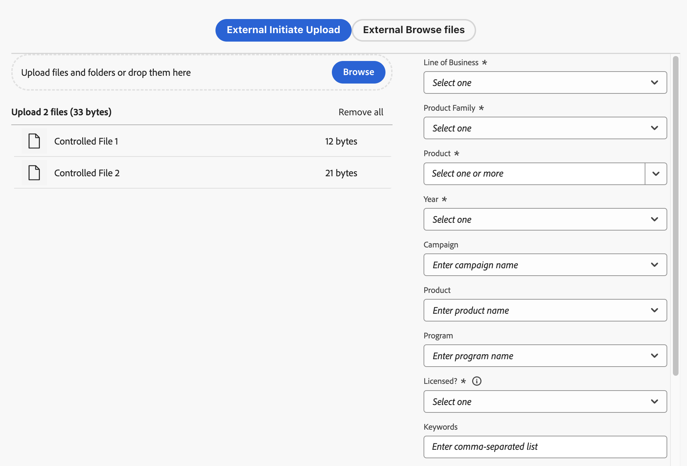

# アセットセレクターへのファイルおよびフォルダーのアップロード {#upload-files-folders}

<table>
    <tr>
        <td>
            <i>新規</i> <a href="/help/assets/dynamic-media/dm-prime-ultimate.md"><b>Dynamic Media Prime と Ultimate</b></a>
        </td>
        <td>
            <i>新規</i> <a href="/help/assets/assets-ultimate-overview.md"><b>AEM Assets Ultimate</b></a>
        </td>
        <td>
            <i>新規</i> <a href="/help/assets/integrate-aem-assets-edge-delivery-services.md"><b>AEM Assets と Edge Delivery Services の統合</b></a>
        </td>
        <td>
            <i>新規</i> <a href="/help/assets/aem-assets-view-ui-extensibility.md"><b>UI 拡張機能</b></a>
        </td>
          <td>
            <i>新規</i> <a href="/help/assets/dynamic-media/enable-dynamic-media-prime-and-ultimate.md"><b>Dynamic Media Prime と Ultimate の有効化</b></a>
        </td>
    </tr>
    <tr>
        <td>
            <a href="/help/assets/search-best-practices.md"><b>検索のベストプラクティス</b></a>
        </td>
        <td>
            <a href="/help/assets/metadata-best-practices.md"><b>メタデータのベストプラクティス</b></a>
        </td>
        <td>
            <a href="/help/assets/product-overview.md"><b>コンテンツハブ</b></a>
        </td>
        <td>
            <a href="/help/assets/dynamic-media-open-apis-overview.md"><b>OpenAPI 機能を備えた Dynamic Media</b></a>
        </td>
        <td>
            <a href="https://developer.adobe.com/experience-cloud/experience-manager-apis/"><b>AEM Assets 開発者向けドキュメント</b></a>
        </td>
    </tr>
</table>

ローカルファイルシステムからアセットセレクターにファイルまたはフォルダーをアップロードできます。ローカルファイルシステムを使用してファイルをアップロードするには、通常、アセットセレクターのマイクロフロントエンドアプリケーションによって提供されるアップロード機能を使用する必要があります。

## ローカルファイルシステムからのアセットのアップロード {#basic-upload}

アセットセレクターにアセットを追加するには、次の手順を実行します。

1. パネルビューを使用している場合は、省略記号に移動して 「**[!UICONTROL アップロード]**」をクリックします。一方、モーダルビューの場合は、右上の 「**[!UICONTROL アップロード]**」をクリックします。[!UICONTROL アセットをアップロード]画面が表示されます。

   

   さらに、「**[!UICONTROL ここにファイルまたはフォルダーをドラッグ]**」セクションでは、ローカルファイルシステムからアセットをドラッグするか、「**[!UICONTROL 参照]**」をクリックしてローカルファイルシステムで使用可能なファイルまたはフォルダーを手動で選択できます。アップロードに含まれるファイルのリストは、リストとして使用できます。

   

   また、サムネールを使用して選択した画像をプレビューし、X アイコンをクリックして、リストから特定の画像を削除することもできます。X アイコンは、画像名またはサイズの上にマウスポインタを合わせた際にのみ表示されます。また、「**[!UICONTROL すべてを削除]**」をクリックして、アップロードリストからすべての項目を削除することもできます。

1. アップロードプロセスを完了するには、「**[!UICONTROL アップロード]**」をクリックします。アップロードしたアセットが表示されます。設定可能なコードについて詳しくは、[基本アップロード](/help/assets/asset-selector-customization.md#basic-upload)を参照してください。

## メタデータを使用したアセットのアップロード {#upload-assets-with-metadata}

アセットをアプリケーションにすぐにアップロードしながら、メタデータを追加できます。メタデータには、ビジネスの件名、製品の詳細、キャンペーンなど、様々なフィールドが含まれます。これを行うには、`metadataSchema` プロパティを使用します。`metadataSchema` プロパティについて詳しくは、[アセットセレクターのプロパティ](/help/assets/asset-selector-properties.md)を参照してください。

設定に必要なコードスニペットについて詳しくは、[メタデータを使用したアップロード](/help/assets/asset-selector-customization.md#upload-with-metadata)を参照してください。

1. 「**[!UICONTROL キャンペーン名]**」フィールドを使用して、アップロードの名前を定義します。既存の名前を使用するか、新しい名前を作成できます。アセットセレクターでは、名前を入力する際にさらに多くのオプションが提供されます。

   ベストプラクティスとして、アドビでは、アップロードしたアセットの検索エクスペリエンスを強化すると共に、残りのフィールドに値を指定することをお勧めします。

1. 同様に、「**[!UICONTROL キーワード]**」、「**[!UICONTROL チャネル]**」、「**[!UICONTROL 期間]**」、「**[!UICONTROL 地域]**」の各フィールドの値を定義します。キーワード、チャネル、場所でアセットのタグ付けとグループ化を行うと、承認済みの会社のコンテンツを使用するすべてのユーザーがこれらのアセットを見つけて整理できるようになります。

1. 「**[!UICONTROL アップロード]**」をクリックして、アセットセレクターにアセットをアップロードします。[!UICONTROL レビューの詳細]確認ボックスが表示されます。「[!UICONTROL 続行]」をクリックします。

1. アセットのアップロードが開始されます。「[!UICONTROL 新規アップロード]」をクリックして、アップロード手順を再開します。「[!UICONTROL 完了]」をクリックして、アップロードを完了します。

## カスタマイズされたアップロード {#customize-upload}

アセットセレクターを使用すると、カスタマイズされたアップロードフォームを追加できます。複数のカスタマイズが可能です。例えば、[hideUploadButton](/help/assets/asset-selector-properties.md) プロパティを使用すると、アプリケーションでデフォルトで表示されるアップロードボタンを非表示にすることができます。代わりに、要件に応じて MFE アプリケーションの外部でレンダリングするようにカスタマイズできます。設定について詳しくは、[カスタマイズされたアップロード](/help/assets/asset-selector-customization.md#customized-upload)を参照してください。

>[!MORELIKETHIS]
>
>* [アセットセレクターの例](/help/assets/asset-selector-examples.md)
>* [アセットセレクターと様々なアプリケーションの統合](/help/assets/integrate-asset-selector.md)
>* [アセットセレクターのプロパティ](/help/assets/asset-selector-properties.md)
