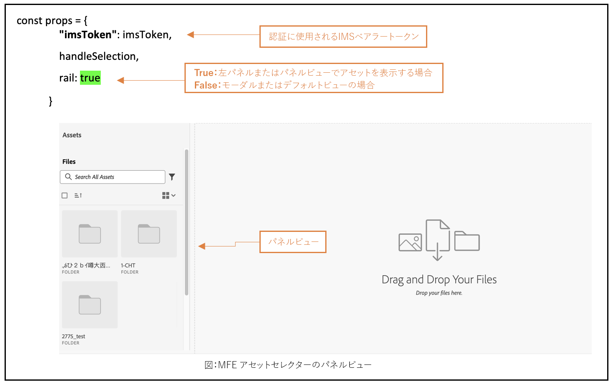
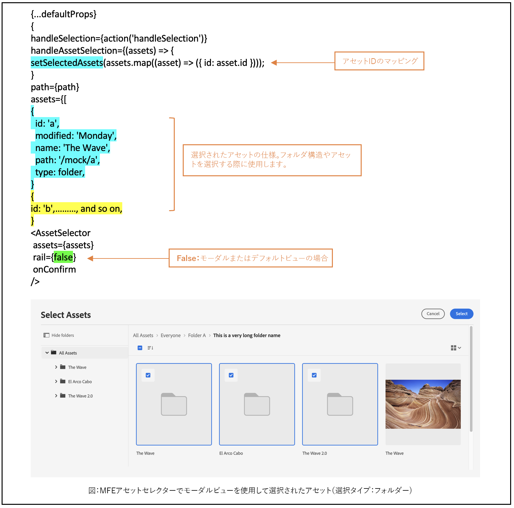
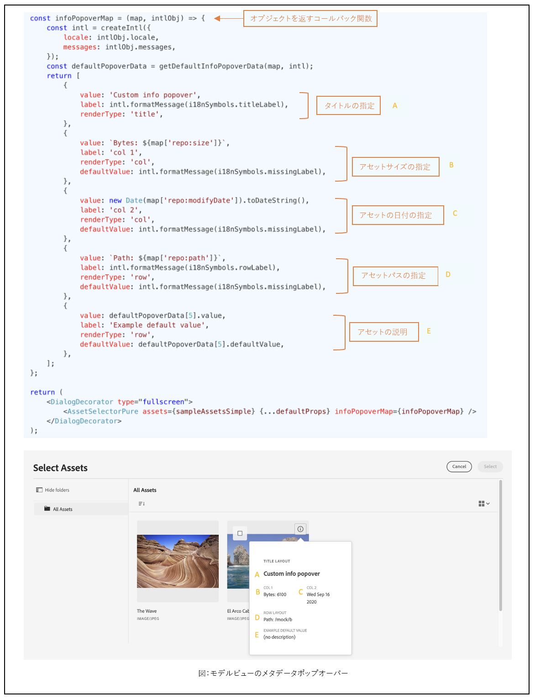
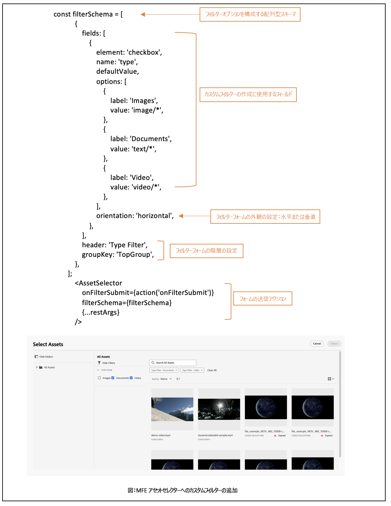

# マイクロフロントエンドアセットセレクター {#Overview}

<table>
    <tr>
        <td>
            <sup style= "background-color:#008000; color:#FFFFFF; font-weight:bold"><i>新規</i></sup> <a href="/help/assets/dynamic-media/dm-prime-ultimate.md"><b>Dynamic Media Prime と Ultimate</b></a>
        </td>
        <td>
            <sup style= "background-color:#008000; color:#FFFFFF; font-weight:bold"><i>新規</i></sup> <a href="/help/assets/assets-ultimate-overview.md"><b>AEM Assets Ultimate</b></a>
        </td>
        <td>
            <sup style= "background-color:#008000; color:#FFFFFF; font-weight:bold"><i>新規</i></sup> <a href="/help/assets/integrate-aem-assets-edge-delivery-services.md"><b>AEM Assets と Edge Delivery Services の統合</b></a>
        </td>
        <td>
            <sup style= "background-color:#008000; color:#FFFFFF; font-weight:bold"><i>新規</i></sup> <a href="/help/assets/aem-assets-view-ui-extensibility.md"><b>UI 拡張機能</b></a>
        </td>
          <td>
            <sup style= "background-color:#008000; color:#FFFFFF; font-weight:bold"><i>新規</i></sup> <a href="/help/assets/dynamic-media/enable-dynamic-media-prime-and-ultimate.md"><b>Dynamic Media Prime と Ultimate の有効化</b></a>
        </td>
    </tr>
    <tr>
        <td>
            <a href="/help/assets/search-best-practices.md"><b>検索のベストプラクティス</b></a>
        </td>
        <td>
            <a href="/help/assets/metadata-best-practices.md"><b>メタデータのベストプラクティス</b></a>
        </td>
        <td>
            <a href="/help/assets/product-overview.md"><b>コンテンツハブ</b></a>
        </td>
        <td>
            <a href="/help/assets/dynamic-media-open-apis-overview.md"><b>OpenAPI 機能を備えた Dynamic Media</b></a>
        </td>
        <td>
            <a href="https://developer.adobe.com/experience-cloud/experience-manager-apis/"><b>AEM Assets 開発者向けドキュメント</b></a>
        </td>
    </tr>
</table>

マイクロフロントエンドアセットセレクターは、[!DNL Experience Manager Assets] リポジトリと簡単に統合できるユーザーインターフェイスを提供します。ユーザーはこれにより、リポジトリで使用可能なデジタルアセットを参照または検索し、アプリケーションのオーサリングエクスペリエンスで使用できるようになります。

アセットセレクターパッケージを使用すると、マイクロフロントエンドのユーザーインターフェイスをアプリケーションエクスペリエンスで利用できるようになります。パッケージのアップデートはすべて自動的に読み込まれ、デプロイされた最新のアセットセレクターがアプリケーション内に自動的に読み込まれます。


アセットセレクターには、次のような多くの利点があります。

* Vanilla JavaScript ライブラリを使用して、あらゆる[アドビ](#asset-selector-ims)アプリケーションまたは[アドビ以外](#asset-selector-non-ims)のアプリケーションと簡単に統合できます。
* アセットセレクターパッケージのアップデートがアプリケーションで使用可能なアセットセレクターに自動的にデプロイされるため、管理が簡単です。最新の修正内容を読み込むために、アプリケーション内でアップデートを行う必要がありません。
* アプリケーション内のアセットセレクターの表示を制御するプロパティを利用できるため、カスタマイズが容易です。
* フルテキスト検索、標準のフィルターおよびカスタマイズされたフィルターを使用して、オーサリングエクスペリエンス内で使用するアセットにすばやく移動できます。
* IMS 組織内のリポジトリを切り替えて、アセットを選択できます。
* 名前、寸法、サイズでアセットを並べ替えたり、リスト、グリッド、ギャラリー、ウォーターフォールの各レイアウトでアセットを表示したりできます。

<!--Perform the following tasks to integrate and use Asset Selector with your [!DNL Experience Manager Assets] repository:

1. [Install Asset Selector](#installation)
2. [Integrate Asset Selector using Vanilla JS](#integration-using-vanilla-js)
3. [Use Asset Selector](#using-asset-selector)
-->

<!--
## Setting up Asset Selector {#asset-selector-setup}


-->

## 前提条件{#prereqs}

次の通信方法を確保する必要があります。

* アプリケーションは HTTPS で実行されている。
* アプリケーションの URL は、IMS クライアントのリダイレクト URL の許可リストにある。
* IMS ログインフローは、web ブラウザーのポップアップを使用して設定およびレンダリングされる。そのため、ターゲットブラウザーでポップアップを有効または許可する必要があります。

アセットセレクターの IMS 認証ワークフローが必要な場合は、上記の前提条件を使用します。または、IMS ワークフローで既に認証されている場合は、代わりに IMS 情報を追加できます。

>[!IMPORTANT]
>
> このリポジトリは、アセットセレクターを統合するために使用可能な API と使用例について説明した補足ドキュメントとして機能することを目的としています。アセットセレクターをインストールまたは使用する前に、Experience Manager Assets as a Cloud Service プロファイルの一部としてアセットセレクターへのアクセスがプロビジョニングされていることを確認します。プロビジョニングされていない場合、これらのコンポーネントを統合または使用することはできません。プロビジョニングをリクエストするには、プログラム管理者が Admin Console から P2 としてマークされたサポートチケットを発行し、次の情報を含める必要があります。
>
>* 統合アプリケーションがホストされるドメイン名。
>* プロビジョニング後、アセットセレクターの設定に不可欠な、リクエストされた環境に対応する `imsClientId`、`imsScope` および `redirectUrl` が組織に提供されます。これらの有効なプロパティがないと、インストール手順を実行できません。

## インストール {#installation}

アセットセレクターは、ESM CDN 経由（例：[esm.sh](https://esm.sh/)／[skypack](https://www.skypack.dev/)）および [UMD](https://github.com/umdjs/umd) バージョン経由のいずれでも使用できます。

**UMD バージョン**&#x200B;を使用しているブラウザー（推奨）：

```
<script src="https://experience.adobe.com/solutions/CQ-assets-selectors/static-assets/resources/assets-selectors.js"></script>

<script>
  const { renderAssetSelector } = PureJSSelectors;
</script>
```

**ESM CDN バージョン**&#x200B;を使用している `import maps` 対応ブラウザー：

```
<script type="module">
  import { AssetSelector } from 'https://experience.adobe.com/solutions/CQ-assets-selectors/static-assets/resources/@assets/selectors/index.js'
</script>
```

**ESM CDN バージョン**&#x200B;を使用している Deno/Webpack Module Federation：

```
import { AssetSelector } from 'https://experience.adobe.com/solutions/CQ-assets-selectors/static-assets/resources/@assets/selectors/index.js'
```

## Vanilla JS を使用したアセットセレクターの統合 {#integration-using-vanilla-js}

あらゆる [!DNL Adobe] アプリケーションまたはアドビ以外のアプリケーションを [!DNL Experience Manager Assets] リポジトリと統合し、アプリケーション内からアセットを選択できます。[アセットセレクターと様々なアプリケーションの統合](#asset-selector-integration-with-apps)を参照してください。

統合は、アセットセレクターパッケージを読み込み、Vanilla JavaScript ライブラリを使用して Assets as a Cloud Service に接続することで行われます。アプリケーション内の `index.html` または適切なファイルを、次の目的で編集します。

* 認証の詳細を定義する
* Assets as a Cloud Service リポジトリにアクセスする
* アセットセレクターの表示プロパティを設定する

次の場合は、一部の IMS プロパティを定義せずに認証を実行できます。

* [統合シェル](https://experienceleague.adobe.com/docs/experience-manager-cloud-service/content/overview/aem-cloud-service-on-unified-shell.html?lang=ja)の [!DNL Adobe] アプリケーションを統合している場合。
* 認証用に既に IMS トークンが生成されている場合。

## アセットセレクターと様々なアプリケーションの統合 {#asset-selector-integration-with-apps}

アセットセレクターは、次のような様々なアプリケーションと統合できます。

* [アセットセレクターと  [!DNL Adobe]  アプリケーションの統合](#adobe-app-integration-vanilla)
* [アセットセレクターとアドビ以外のアプリケーションの統合](#adobe-non-app-integration)
* [OpenAPI 機能を備えた Dynamic Media の統合](#adobe-app-integration-polaris)

>[!BEGINTABS]

<!--Integration with an Adobe application content starts here-->

>[!TAB アドビアプリケーションとの統合]

### 前提条件{#prereqs-adobe-app}

アセットセレクターを [!DNL Adobe] アプリケーションと統合する場合は、次の前提条件を使用しまず。

* [通信方法](#prereqs)
* imsOrg
* imsToken
* apikey

### アセットセレクターと [!DNL Adobe] アプリケーションの統合 {#adobe-app-integration-vanilla}

次の例では、統合シェルの下で [!DNL Adobe] アプリケーションを実行している場合、または認証用に生成された `imsToken` が既にある場合に、アセットセレクターの使用方法を示します。

以下の例の _6～15 行目_&#x200B;に示されているように、`script` タグを使用してアセットセレクターパッケージをコードに含めます。スクリプトが読み込まれると、`PureJSSelectors` グローバル変数を使用できるようになります。_16～23 行目_&#x200B;に示されているように、アセットセレクターの[プロパティ](#asset-selector-properties)を定義します。`imsOrg` プロパティと `imsToken` プロパティは、いずれもアドビアプリケーションでの認証に必要です。`handleSelection` プロパティは、選択したアセットを処理するために使用されます。_17 行目_&#x200B;で示されているように、アセットセレクターをレンダリングするには `renderAssetSelector` 関数を呼び出します。_21～22 行目_&#x200B;に示されているように、アセットセレクターが `<div>` コンテナ要素に表示されます。

これらの手順に従うことで、[!DNL Adobe] アプリケーションでアセットセレクターを使用できます。

```html {line-numbers="true"}
<!DOCTYPE html>
<html>
<head>
    <title>Asset Selector</title>
    <script src="https://experience.adobe.com/solutions/CQ-assets-selectors/assets/resources/assets-selectors.js"></script>
    <script>
        // get the container element in which we want to render the AssetSelector component
        const container = document.getElementById('asset-selector-container');
        // imsOrg and imsToken are required for authentication in Adobe application
        const assetSelectorProps = {
            imsOrg: 'example-ims@AdobeOrg',
            imsToken: "example-imsToken",
            apiKey: "example-apiKey-associated-with-imsOrg",
            handleSelection: (assets: SelectedAssetType[]) => {},
        };
        // Call the `renderAssetSelector` available in PureJSSelectors globals to render AssetSelector
        PureJSSelectors.renderAssetSelector(container, assetSelectorProps);
    </script>
</head>

<body>
    <div id="asset-selector-container" style="height: calc(100vh - 80px); width: calc(100vw - 60px); margin: -20px;">
    </div>
</body>

</html>
```

<!--For detailed example, visit [Asset Selector Code Example](https://github.com/adobe/aem-assets-selectors-mfe-examples).-->

+++**ImsAuthProps**
`ImsAuthProps` プロパティは、アセットセレクターが `imsToken` を取得するために使用する認証情報とフローを定義します。これらのプロパティを設定すると、認証フローの動作を制御し、様々な認証イベントのリスナーを登録できます。

| プロパティ名 | 説明 |
|---|---|
| `imsClientId` | 認証目的で使用される IMS クライアント ID を表す文字列値。この値はアドビが指定し、アドビの AEM CS 組織に固有です。 |
| `imsScope` | 認証で使用されるスコープについて説明します。スコープは、組織のリソースに対するアプリケーションのアクセスレベルを決定します。複数のスコープは、コンマで区切ることができます。 |
| `redirectUrl` | 認証後にユーザーがリダイレクトされる URL を表します。この値は通常、アプリケーションの現在の URL に設定されます。`redirectUrl` を指定していない場合、`ImsAuthService` は `imsClientId` の登録に使用した redirectUrl を使用します。 |
| `modalMode` | 認証フローをモーダル（ポップアップ）に表示するかどうかを示すブール値。`true` に設定すると、認証フローがポップアップで表示されます。`false` に設定すると、認証フローはページ全体をリロードして表示されます。_メモ：_ UX を向上させるために、ユーザーがブラウザーのポップアップを無効にしている場合は、この値を動的に制御できます。 |
| `onImsServiceInitialized` | Adobe IMS 認証サービスを初期化する際に呼び出されるコールバック関数。この関数は、Adobe IMS サービスを表すオブジェクトである `service` という 1 つのパラメーターを受け取ります。詳しくは、[`ImsAuthService`](#imsauthservice-ims-auth-service) を参照してください。 |
| `onAccessTokenReceived` | Adobe IMS 認証サービスから `imsToken` を受信する際に呼び出されるコールバック関数。この関数は、アクセストークンを表す文字列である `imsToken` という 1 つのパラメーターを受け取ります。 |
| `onAccessTokenExpired` | アクセストークンの有効期限が切れる際に呼び出されるコールバック関数。この関数は通常、新しい認証フローをトリガーして新しいアクセストークンを取得するために使用されます。 |
| `onErrorReceived` | 認証中にエラーが発生する際に呼び出されるコールバック関数。この関数は、エラータイプとエラーメッセージという 2 つのパラメーターを受け取ります。エラータイプはエラータイプを表す文字列で、エラーメッセージはエラーメッセージを表す文字列です。 |

+++

+++**ImsAuthService**
`ImsAuthService` クラスは、アセットセレクターの認証フローを処理します。これは、Adobe IMS 認証サービスから `imsToken` を取得する役割を果たします。`imsToken` は、ユーザーを認証し、[!DNL Adobe Experience Manager] as a [!DNL Cloud Service] アセットリポジトリへのアクセスを認証するために使用されます。ImsAuthService は、`ImsAuthProps` プロパティを使用して認証フローを制御し、様々な認証イベントのリスナーを登録します。便利な [`registerAssetsSelectorsAuthService`](#purejsselectorsregisterassetsselectorsauthservice) 関数を使用して、_ImsAuthService_ インスタンスをアセットセレクターに登録できます。`ImsAuthService` クラスでは、次の関数を使用できます。ただし、_registerAssetsSelectorsAuthService_ 関数を使用している場合は、これらの関数を直接呼び出す必要はありません。

| 関数名 | 説明 |
|---|---|
| `isSignedInUser` | ユーザーが現在サービスにログインしているかどうかを判断し、それに応じてブール値を返します。 |
| `getImsToken` | 現在ログインしているユーザーの認証 `imsToken` を取得します。これは、asset _rendition の生成など、他のサービスへのリクエストを認証するために使用できます。 |
| `signIn` | ユーザーのログインプロセスを開始します。この関数は、`ImsAuthProps` を使用して、ポップアップまたはページ全体のリロードで認証を表示します。 |
| `signOut` | ユーザーをサービスからログアウトし、認証トークンを無効にし、保護されたリソースにアクセスするには再度ログインするようにリクエストします。この関数を呼び出すと、現在のページがリロードされます。 |
| `refreshToken` | 現在ログインしているユーザーの認証トークンを更新して、トークンの有効期限切れを防ぎ、保護されたリソースに中断なくアクセスできるようになります。後続のリクエストに使用できる新しい認証トークンを返します。 |

+++

+++**提供された IMS トークンによる検証**

```
<script>
    const apiToken="<valid IMS token>";
    function handleSelection(selection) {
    console.log("Selected asset: ", selection);
    };
    function renderAssetSelectorInline() {
    console.log("initializing Asset Selector");
    const props = {
    "repositoryId": "delivery-p64502-e544757.adobeaemcloud.com",
    "apiKey": "ngdm_test_client",
    "imsOrg": "<IMS org>",
    "imsToken": apiToken,
    handleSelection,
    hideTreeNav: true
    }
    const container = document.getElementById('asset-selector-container');
    PureJSSelectors.renderAssetSelector(container, props);
    }
    $(document).ready(function() {
    renderAssetSelectorInline();
    });
</script>
```

+++

+++**IMS サービスへのコールバックの登録**

```
// object `imsProps` to be defined as below 
let imsProps = {
    imsClientId: <IMS Client Id>,
        imsScope: "openid",
        redirectUrl: window.location.href,
        modalMode: true,
        adobeImsOptions: {
            modalSettings: {
            allowOrigin: window.location.origin,
},
        useLocalStorage: true,
},
onImsServiceInitialized: (service) => {
            console.log("onImsServiceInitialized", service);
},
onAccessTokenReceived: (token) => {
            console.log("onAccessTokenReceived", token);
},
onAccessTokenExpired: () => {
            console.log("onAccessTokenError");
// re-trigger sign-in flow
},
onErrorReceived: (type, msg) => {
            console.log("onErrorReceived", type, msg);
},
}
```

+++

<!--Integration with non-Adobe application content starts here-->

>[!TAB アドビ以外のアプリケーションとの統合]

<!--### Integrate Asset Selector with a [!DNL non-Adobe] application {#adobe-non-app-integration}-->

### 前提条件 {#prereqs-non-adobe-app}

アセットセレクターをアドビ以外のアプリケーションと統合する場合は、次の前提条件を使用します。

* [通信方法](#prereqs)
* imsClientId
* imsScope
* redirectUrl
* imsOrg
* apikey

アセットセレクターは、アドビ以外のアプリケーションと統合する場合に、`imsScope` や `imsClientID` などの Identity Management System（IMS）プロパティを使用した [!DNL Experience Manager Assets] リポジトリへの認証をサポートします。

+++**アドビ以外のアプリケーションに対するアセットセレクターの設定**
アドビ以外のアプリケーションに対してアセットセレクターを設定するには、まずプロビジョニングのサポートチケットを記録してから、統合手順を実行する必要があります。

**サポートチケットの記録**
Admin Console を使用してサポートチケットを記録する手順は次のとおりです。

1. チケットのタイトルに **AEM Assets を含むアセットセレクター**&#x200B;を追加します。

1. 説明には、次の詳細を入力します。

   * [!DNL Experience Manager Assets] as a [!DNL Cloud Service] URL（プログラム ID および環境 ID）。
   * アドビ以外の web アプリケーションがホストされるドメイン名。
+++

+++**統合手順**
アセットセレクターをアドビ以外のアプリケーションと統合する際の認証には、この例の `index.html` ファイルを使用します。

`index.html` ファイルの例の *9 行目*&#x200B;から *11 行目*&#x200B;に示すように、`Script` タグを使用してアセットセレクターパッケージにアクセスします。

この例の *14 行目*&#x200B;から *38 行目*&#x200B;では、`imsClientId`、`imsScope`、`redirectURL` などの IMS フロープロパティが記載されています。この関数では、`imsClientId` プロパティと `imsScope` プロパティの少なくとも 1 つを定義する必要があります。`redirectURL` の値を定義しない場合は、クライアント ID に登録されているリダイレクト URL が使用されます。

`imsToken` が生成されていないので、`index.html` ファイルの例の 40 行目から 50 行目に示すように、`registerAssetsSelectorsAuthService` 関数と `renderAssetSelectorWithAuthFlow` 関数を使用します。`renderAssetSelectorWithAuthFlow` の前に `registerAssetsSelectorsAuthService` 関数を使用して、`imsToken` をアセットセレクターに登録します。[!DNL Adobe] では、コンポーネントをインスタンス化する際に `registerAssetsSelectorsAuthService` を呼び出すことをお勧めします。

`index.html` ファイルの例の *54 行目*&#x200B;から *60 行目*&#x200B;に示すように、`const props` セクションで認証およびその他の Assets as a Cloud Service アクセス関連のプロパティを定義します。

*65 行目*&#x200B;に示している `PureJSSelectors` グローバル変数は、web ブラウザーでアセットセレクターをレンダリングするために使用されます。

*74 行目*&#x200B;から *81 行目*&#x200B;に示すように、アセットセレクターは `<div>` コンテナ要素にレンダリングされます。例では、ダイアログを使用してアセットセレクターを表示します。

```html {line-numbers="true"}
<!DOCTYPE html>
<html>

<head>
    <meta http-equiv="X-UA-Compatible" content="IE=edge">
    <meta charset="utf-8">
    <title>Asset Selectors</title>
    <link rel="stylesheet" href="index.css">
    <script id="asset-selector"
        src="https://experience.adobe.com/solutions/CQ-assets-selectors/assets/resources/asset-selectors.js"></script>
    <script>

        const imsProps = {
            imsClientId: "<obtained from IMS team>",
            imsScope: "openid, <other scopes>",
            redirectUrl: window.location.href,
            modalMode: true, // false to open in a full page reload flow
            onImsServiceInitialized: (service) => {
                // invoked when the ims service is initialized and is ready
                console.log("onImsServiceInitialized", service);
            },
            onAccessTokenReceived: (token) => {
                console.log("onAccessTokenReceived", token);
            },
            onAccessTokenExpired: () => {
                console.log("onAccessTokenError");
                // re-trigger sign-in flow
            },
            onErrorReceived: (type, msg) => {
                console.log("onErrorReceived", type, msg);
            },
        }

        function load() {
            const registeredTokenService = PureJSSelectors.registerAssetsSelectorsAuthService(imsProps);
            imsInstance = registeredTokenService;
        };

        // initialize the IMS flow before attempting to render the asset selector
        load();
        

        //function that will render the asset selector
            const otherProps = {
            // any other props supported by asset selector
            }
            const assetSelectorProps = {
                "imsOrg": "imsorg",
                ...otherProps
            }
             // container element on which you want to render the AssetSelector/DestinationSelector component
            const container = document.getElementById('asset-selector');

            /// Use the PureJSSelectors in globals to render the AssetSelector/DestinationSelector component
            PureJSSelectors.renderAssetSelectorWithAuthFlow(container, assetSelectorProps, () => {
                const assetSelectorDialog = document.getElementById('asset-selector-dialog');
                assetSelectorDialog.showModal();
            });
        }
    </script>

</head>
<body class="asset-selectors">
    <div>
        <button onclick="renderAssetSelectorWithAuthFlowFlow()">Asset Selector - Select Assets with Ims Flow</button>
    </div>
        <dialog id="asset-selector-dialog">
            <div id="asset-selector" style="height: calc(100vh - 80px); width: calc(100vw - 60px); margin: -20px;">
            </div>
        </dialog>
    </div>
</body>

</html>
```

+++

+++**配信リポジトリにアクセスできない**

>[!TIP]
>
>新規登録ログインワークフローを使用してアセットセレクターを統合したにもかかわらず配信リポジトリにアクセスできない場合は、ブラウザーの Cookie をクリーンアップする必要があります。そうしないと、コンソールに `invalid_credentials All session cookies are empty` エラーが表示されます。

+++

<!--Integration with Polaris application content starts here-->

>[!TAB OpenAPI 機能を備えた Dynamic Media の統合]

### 前提条件 {#prereqs-polaris}

アセットセレクターと、OpenAPI 機能を備えた Dynamic Media の統合には、次の前提条件を使用します。

* [通信方法](#prereqs)
* OpenAPI 機能を備えた Dynamic Media にアクセスするには、次のライセンスが必要です。
   * アセットリポジトリ（例：Experience Manager Assets as a Cloud Service）。
   * AEM Dynamic Media。
* ブランドの一貫性を確保するために、[承認済みアセット](#approved-assets.md)のみを使用できます。

### OpenAPI 機能を備えた Dynamic Media の統合{#adobe-app-integration-polaris}

アセットセレクターと Dynamic Media OpenAPI プロセスの統合には、カスタマイズされた Dynamic Media URL の作成や、Dynamic Media URL を選択する準備など、様々な手順が含まれます。

+++**OpenAPI 機能を備えた Dynamic Media のアセットセレクターの統合**

OpenAPI 機能を備えた Dynamic Media では、`rootPath` プロパティと `path` プロパティを使用しないでください。代わりに、`aemTierType` プロパティを設定できます。設定の構文を以下に示します。

```
aemTierType:[1: "delivery"]
```

この設定により、すべての承認済みアセットをフォルダーなしで表示したり、フラットな構造として表示したりできます。詳しくは、[アセットセレクターのプロパティ](#asset-selector-properties)の `aemTierType` プロパティを参照してください。

+++

+++**承認済みアセットからの動的配信 URL の作成**
アセットセレクターを設定すると、オブジェクトのスキーマを使用して、選択したアセットから動的配信 URL が作成されます。
例えば、アセットの選択時に受信されるオブジェクトの配列からの 1 つのオブジェクトのスキーマは次のようになります。

```
{
"dc:format": "image/jpeg",
"repo:assetId": "urn:aaid:aem:xxxxxxxx-xxxx-xxxx-xxxx-xxxxxxxxxxxx",
"repo:name": "image-7.jpg",
"repo:repositoryId": "delivery-pxxxx-exxxxxx.adobe.com",
...
}
```

すべての選択済みアセットは、JSON オブジェクトとして機能する `handleSelection` 関数によって実行されます。例えば、`JsonObj` のようになります。動的配信 URL は、以下のキャリアを組み合わせて作成されます。

| オブジェクト | JSON |
|---|---|
| ホスト | `assetJsonObj["repo:repositoryId"]` |
| API ルート | `/adobe/dynamicmedia/deliver` |
| asset-id | `assetJsonObj["repo:assetId"]` |
| seo-name | `assetJsonObj["repo:name"].split(".").slice(0,-1).join(".")` |
| format | `.jpg` |

**承認済みアセット配信 API 仕様**

URL 形式：
`https://<delivery-api-host>/adobe/assets/<asset-id>/as/<seo-name>.<format>?<image-modification-query-parameters>`

ここで、

* ホストは `https://delivery-pxxxxx-exxxxxx.adobe.com` です
* API ルートは `"/adobe/assets"` です
* `<asset-id>` はアセット識別子です
* `as` は、アセットを何と呼ぶかを示す、オープン API 仕様の定数部分です
* `<seo-name>` はアセットの名前です
* `<format>` は出力形式です
* `<image modification query parameters>` は、承認済みアセットの配信 API 仕様でサポートされています

**承認されたアセットオリジナルレンディション配信 API**

動的配信 URL の構文は次のとおりです。
`https://<delivery-api-host>/adobe/assets/<asset-id>/original/as/<seo-name>`、ここで、

* ホストは `https://delivery-pxxxxx-exxxxxx.adobe.com` です
* 元のレンディション配信の API ルートは `"/adobe/assets"` です。
* `<asset-id>` はアセット識別子です
* `/original/as` は、元のレンディションが何と呼ばれるかを示す、オープン API 仕様の定数部分です
* `<seo-name>` は、拡張子がある場合とない場合があるアセットの名前です。

+++

+++**動的配信 URL を選択する準備**
すべての選択済みアセットは、JSON オブジェクトとして機能する `handleSelection` 関数によって実行されます。例えば、`JsonObj` のようになります。動的配信 URL は、以下のキャリアを組み合わせて作成されます。

| オブジェクト | JSON |
|---|---|
| ホスト | `assetJsonObj["repo:repositoryId"]` |
| API ルート | `/adobe/assets/deliver` |
| asset-id | `assetJsonObj["repo:assetId"]` |
| seo-name | `assetJsonObj["repo:name"]` |

JSON オブジェクトをトラバースする 2 つの方法を以下に示します。


* **サムネール：**&#x200B;サムネールは画像にすることができ、アセットは PDF、ビデオ、画像などです。ただし、アセットのサムネールの高さと幅の属性を動的配信レンディションとして使用できます。
PDF タイプのアセットには、次のレンディションセットを使用できます。
サイドキックで PDF を選択すると、選択コンテキストに以下の情報が表示されます。JSON オブジェクトをトラバースする方法を以下に示します。

  <!---->

  上記のスクリーンショットから、レンディションリンクの配列については `selection[0].....selection[4]` を参照できます。例えば、サムネールレンディションの 1 つに含まれる主要なプロパティは次のとおりです。

  ```
  { 
      "height": 319, 
      "width": 319, 
      "href": "https://delivery-pxxxxx-exxxxx.adobeaemcloud.com/adobe/assets/urn:aaid:aem:8560f3a1-d9cf-429d-a8b8-d81084a42d41/as/algorithm design.jpg?width=319&height=319", 
      "type": "image/webp" 
  } 
  ```

上記のスクリーンショットでは、PDF が必要でサムネールは不要な場合は、PDF の元のレンディションの配信 URL をターゲットエクスペリエンスに組み込む必要があります。例えば、`https://delivery-pxxxxx-exxxxx-cmstg.adobeaemcloud.com/adobe/assets/urn:aaid:aem:8560f3a1-d9cf-429d-a8b8-d81084a42d41/original/as/algorithm design.pdf` のように指定します。

* **ビデオ：**&#x200B;埋め込み iFrame を使用するビデオタイプのアセットには、ビデオプレーヤーの URL を使用できます。ターゲットエクスペリエンスでは、次の配列レンディションを使用できます。
  <!---->

  ```
  { 
      "height": 319, 
      "width": 319, 
      "href": "https://delivery-pxxxxx-exxxxx.adobeaemcloud.com/adobe/assets/urn:aaid:aem:2fdef732-a452-45a8-b58b-09df1a5173cd/as/asDragDrop.2.jpg?width=319&height=319", 
      "type": "image/webp" 
  } 
  ```

  上記のスクリーンショットから、レンディションリンクの配列については `selection[0].....selection[4]` を参照できます。例えば、サムネールレンディションの 1 つに含まれる主要なプロパティは次のとおりです。

  上記のスクリーンショットのコードスニペットは、ビデオアセットの例です。これには、レンディションリンク配列が含まれます。抜粋の `selection[5]` は、ターゲットエクスペリエンス内のビデオサムネールのプレースホルダーとして使用できる画像サムネールの例です。レンディション配列の `selection[5]` は、ビデオプレーヤー用です。これは、HTML を提供し、iframe の `src` として設定できます。ビデオの web に最適化された配信であるアダプティブビットレートストリーミングをサポートします。

  上記の例では、ビデオ プレーヤーの URL は、`https://delivery-pxxxxx-exxxxx.adobeaemcloud.com/adobe/assets/urn:aaid:aem:2fdef732-a452-45a8-b58b-09df1a5173cd/play` です。

+++**OpenAPI 機能を備えた Dynamic Media のアセットセレクターのユーザーインターフェイス**

アドビのマイクロフロントエンドアセットセレクターと統合すると、Experience Manager アセットリポジトリで使用可能なすべての承認済みアセットの、アセットのみの構造を表示できます。


* **A**：[パネルの非表示／表示](#hide-show-panel)
* **B**：[アセット](#repository)
* **C**：[並べ替え](#sorting)
* **D**：[フィルター](#filters)
* **E**：[検索バー](#search-bar)
* **F**：[昇順または降順での並べ替え](#sorting)
* **G**：選択をキャンセル
* **H**：1 つまたは複数のアセットを選択

+++

+++**カスタムフィルターの設定**
OpenAPI 機能を備えた Dynamic Media のアセットセレクターを使用すると、カスタムプロパティとそれに基づくフィルターを設定できます。このようなプロパティを設定するには、`filterSchema` プロパティを使用します。カスタマイズは、`metadata.<metadata bucket>.<property name>.` として公開され、それに対してフィルターを設定できます。ここで、

* `metadata` はアセットの情報です
* `embedded` は、設定に使用される静的パラメーターです
* `<propertyname>` は、設定しているフィルター名です

設定では、`jcr:content/metadata/` レベルで定義されているプロパティが、設定するフィルターの `metadata.<metadata bucket>.<property name>.` として公開されます。

例えば、OpenAPI 機能を備えた Dynamic Media のアセットセレクターでは、フィルター設定のために `asset jcr:content/metadata/client_name:market` のプロパティが `metadata.embedded.client_name:market` に変換されます。

名前を取得するには、1 回限りのアクティビティを実行する必要があります。アセットの検索 API 呼び出しを行って、プロパティ名（基本的にはバケット）を取得します。

+++

>[!ENDTABS]

## アセットセレクターのプロパティ {#asset-selector-properties}

アセットセレクターのプロパティを使用して、アセットセレクターのレンダリング方法をカスタマイズできます。次の表に、アセットセレクターをカスタマイズして使用するために利用できるプロパティを示します。

| Property | タイプ | 必須 | デフォルト | 説明 |
|---|---|---|---|---|
| *rail* | ブーリアン | いいえ | False | `true` とマークされている場合、アセットセレクターは左側のパネルビューにレンダリングされます。`false` とマークされている場合、アセットセレクターはモーダルビューにレンダリングされます。 |
| *imsOrg* | 文字列 | はい | | [!DNL Adobe Experience Manager] as a [!DNL Cloud Service] を組織にプロビジョニングする場合に割り当てられる Adobe Identity Management System（IMS）の ID です。`imsOrg` キーは、アクセスしようとしている組織が Adobe IMS 内にあるかどうかを認証するために必要です。 |
| *imsToken* | 文字列 | いいえ | | 認証に使用される IMS ベアラートークンです。統合に [!DNL Adobe] アプリケーションを使用している場合、`imsToken` は必須です。 |
| *apiKey* | 文字列 | いいえ | | AEM Discovery サービスへのアクセスに使用する API キーです。[!DNL Adobe] アプリケーション統合を使用している場合、`apiKey` は必須です。 |
| *filterSchema* | 配列 | いいえ | | フィルタープロパティの設定に使用するモデルです。これは、アセットセレクターで特定のフィルターオプションを制限する場合に便利です。 |
| *filterFormProps* | オブジェクト | いいえ | | 検索を絞り込むために使用する必要があるフィルタープロパティを指定します。（例：MIME タイプの JPG、PNG、GIF） |
| *selectedAssets* | 配列 `<Object>` | いいえ |                 | アセットセレクターがレンダリングされる際に、選択したアセットを指定します。アセットの ID プロパティを含むオブジェクトの配列が必要です。（例：`[{id: 'urn:234}, {id: 'urn:555'}]`）アセットは、現在のディレクトリで使用できる必要があります。別のディレクトリを使用する必要がある場合は、`path` プロパティの値も指定します。 |
| *acvConfig* | オブジェクト | いいえ | | デフォルトを上書きするカスタム設定が含まれているオブジェクトを含む、アセットコレクション表示プロパティです。また、このプロパティは、アセットビューアのパネルビューを有効にするために `rail` プロパティと共にに使用されます。 |
| *i18nSymbols* | `Object<{ id?: string, defaultMessage?: string, description?: string}>` | いいえ |                 | OOTB 翻訳がアプリケーションのニーズを満たさない場合は、独自のローカライズされたカスタム値を `i18nSymbols` プロップ経由で渡すことができるインターフェイスを表示できます。このインターフェイスを介して値を渡すと、提供されたデフォルトの翻訳が上書きされ、代わりに独自の翻訳が使用されます。上書きを実行するには、上書きしたい `i18nSymbols` のキーに有効な[メッセージ記述子](https://formatjs.io/docs/react-intl/api/#message-descriptor)オブジェクトを渡す必要があります。 |
| *intl* | オブジェクト | いいえ | | アセットセレクターはデフォルトの OOTB 翻訳を提供します。`intl.locale` プロップを介して有効なロケール文字列を指定することで、翻訳言語を選択できます。（例：`intl={{ locale: "es-es" }}` </br></br>）サポートされているロケール文字列は、言語名の標準規格を表す [ISO 639 - コード](https://www.iso.org/iso-639-language-codes.html)に従います。</br></br> サポートされているロケールの一覧：英語 - &#39;en-us&#39;（デフォルト）スペイン語 - &#39;es-es&#39; ドイツ語 - &#39;de-de&#39; フランス語 - &#39;fr-fr&#39; イタリア語 - &#39;it-it&#39; 日本語 - &#39;ja-jp&#39; 韓国語 - &#39;ko-kr&#39; ポルトガル語 - &#39;pt-br&#39; 中国語（簡体字） - &#39;zh-cn&#39; 中国語（繁体字） - &#39;zh-tw&#39; |
| *repositoryId* | 文字列 | いいえ | &#39;&#39; | アセットセレクターがコンテンツを読み込む元のリポジトリです。 |
| *additionalAemSolutions* | `Array<string>` | いいえ | [ ] | 追加の AEM リポジトリのリストを追加できます。このプロパティで情報が指定されない場合、メディアライブラリまたは AEM Assets リポジトリのみが考慮されます。 |
| *hideTreeNav* | ブーリアン | いいえ |  | アセットツリーのナビゲーションサイドバーを表示するか非表示にするかを指定します。このプロパティはモーダルビューでのみ使用されるので、パネルビューではこのプロパティの影響はありません。 |
| *onDrop* | 関数 | いいえ | | このプロパティで、アセットのドロップ機能を許可することができます。 |
| *dropOptions* | `{allowList?: Object}` | いいえ | | 「allowList」を使用してドロップオプションを設定します。 |
| *colorScheme* | 文字列 | いいえ | | アセットセレクターのテーマ（`light` または `dark`）を設定します。 |
| *handleSelection* | 関数 | いいえ | | アセットが選択され、モーダルの `Select` ボタンがクリックされた場合に、アセットの項目の配列と一緒に呼び出されます。この関数は、モーダルビューでのみ呼び出されます。パネルビューの場合は、`handleAssetSelection` 関数または `onDrop` 関数を使用します。例： <pre>handleSelection=(assets: Asset[])=> {...}</pre> 詳しくは、[選択されたアセットタイプ](#selected-asset-type)を参照してください。 |
| *handleAssetSelection* | 関数 | いいえ | | アセットが選択または選択解除されたときに、項目の配列と一緒に呼び出されます。これは、ユーザーがアセットの選択時にアセットをリッスンする場合に役立ちます。例： <pre>handleSelection=(assets: Asset[])=> {...}</pre> 詳しくは、[選択されたアセットタイプ](#selected-asset-type)を参照してください。 |
| *onClose* | 関数 | いいえ | | モーダルビューで `Close` ボタンが押された際に呼び出されます。これは、`modal` ビューでのみ呼び出され、`rail` ビューでは無視されます。 |
| *onFilterSubmit* | 関数 | いいえ | | ユーザーが別のフィルター条件を変更したときに、フィルター項目と一緒に呼び出されます。 |
| *selectionType* | 文字列 | いいえ | シングル | 一度にアセットを `single` 選択または `multiple` 選択するための設定です。 |
| *dragOptions.allowList* | ブール値 | 不要 | | プロパティは、選択できないアセットのドラッグを許可または拒否するために使用されます。 |
| *aemTierType* | 文字列 | いいえ |  | 配信層、オーサー層またはその両方のアセットを表示するかを選択できます。<br><br>構文：`aemTierType:[0]: "author" 1: "delivery"` <br><br>例えば、`["author","delivery"]` の両方を使用する場合、リポジトリスイッチャーにはオーサーと配信の両方のオプションが表示されます。 |
| *handleNavigateToAsset* | 関数 | いいえ | | アセットの選択を処理するコールバック関数です。 |
| *noWrap* | ブーリアン | いいえ | | *noWrap* プロパティは、サイドパネルでのアセットセレクターのレンダリングに役立ちます。このプロパティを指定しない場合、デフォルトで&#x200B;*ダイアログビュー*&#x200B;がレンダリングされます。 |
| *dialogSize* | 小、中、大、フルスクリーン、またはフルスクリーンのテイクオーバー | 文字列 | オプション | 指定されたオプションを使用してサイズを指定することで、レイアウトを制御できます。 |
| *colorScheme* | ライトまたはダーク | いいえ | | このプロパティは、アセットセレクターアプリケーションのテーマを設定するために使用されます。テーマは、ライトテーマとダークテーマから選択できます。 |
| *filterRepoList* | 関数 | いいえ |  | Experience Manager リポジトリを呼び出し、フィルタリングされたリポジトリのリストを返す `filterRepoList` コールバック関数を使用できます。 |
| *expiryOptions* | 関数 | | | 次の 2 つのプロパティ間で使用できます。**getExpiryStatus** では、有効期限切れのアセットのステータスが表示されます。関数は、指定したアセットの有効期限に基づいて、`EXPIRED`、`EXPIRING_SOON` または `NOT_EXPIRED` を返します。[有効期限切れのアセットのカスタマイズ](#customize-expired-assets)を参照してください。さらに、**allowSelectionAndDrag** を使用できます。この場合、関数の値は `true` または `false` のいずれかになります。値が `false` に設定されている場合、有効期限切れのアセットはキャンバス上で選択またはドラッグできません。 |
| *showToast* | | いいえ | | これにより、アセットセレクターで、有効期限切れのアセットに対してカスタマイズされたトーストメッセージを表示できます。 |

<!--
| *rootPath* | String | No | /content/dam/ | Folder path from which Asset Selector displays your assets. `rootPath` can also be used in the form of encapsulation. For example, given the following path, `/content/dam/marketing/subfolder/`, Asset Selector does not allow you to traverse through any parent folder, but only displays the children folders. |
| *path* | String | No | | Path that is used to navigate to a specific directory of assets when the Asset Selector is rendered. |
| *expirationDate* | Function | No | | This function is used to set the usability period of an asset. |
| *disableDefaultBehaviour* | Boolean | No | False | It is a function that is used to enable or disable the selection of an expired asset. You can customize the default behavior of an asset that is set to expire. See [customize expired assets](#customize-expired-assets). |
-->

## アセットセレクターのプロパティの使用例 {#usage-examples}

`index.html` ファイルでアセットセレクターの[プロパティ](#asset-selector-properties)を定義して、アプリケーション内のアセットセレクター表示をカスタマイズできます。

### 例 1：パネルビューのアセットセレクター



アセットセレクターの `rail` の値が `false` に設定されている、またはプロパティで示されていない場合、アセットセレクターはデフォルトでモーダルビューに表示されます。`acvConfig` プロパティを使用すると、ドラッグ＆ドロップなどの詳細な設定が可能になります。`acvConfig` プロパティの使用法については、[ドラッグ＆ドロップを有効または無効にする](#enable-disable-drag-and-drop)を参照してください。

<!--
### Example 2: Use selectedAssets property in addition to the path property

Use the `path` property to define the folder name that displays automatically when the Asset Selector is rendered. In addition, use the `selectedAssets` property to define the IDs for the assets that you need to select within the folder. Moreover, when you want to display assets that are pre-defined within the folder, you can use selectedAssets property.

   
-->

### 例 2：メタデータポップオーバー

様々なプロパティを使用して、情報アイコンを使用して表示するアセットのメタデータを定義します。情報ポップオーバーは、アセットまたはフォルダーに関する情報のコレクションを提供します。この情報には、アセットのタイトル、寸法、変更日、場所、説明などが含まれます。次の例では、様々なプロパティを使用してアセットのメタデータを表示します。例えば、`repo:path` プロパティは、アセットの場所を指定します。<!--`repo` represents the repository from where the asset is showing, whereas, `path` represents the route from where the asset or folder is rendered.-->



### 例 3：パネルビューのカスタムフィルタープロパティ

ファセット検索に加えて、アセットセレクターを使用すると、様々な属性をカスタマイズし、[!DNL Cloud Service] アプリケーションとして [!DNL Adobe Experience Manager] からの検索を絞り込むことができます。カスタマイズした検索フィルターをアプリケーションに追加するには、次のコードを追加します。次の例では、画像、ドキュメント、ビデオの中からアセットタイプをフィルタリングする `Type Filter` 検索、または検索用に追加したフィルタータイプを使用します。



<!--

## Customization after integrating Asset Selector 

### Custom metadata

Assets display panel shows the out of the box metadata that can be displayed in the info of the asset. In addition to this, [!DNL Adobe Experience Manager] as a [!DNL Cloud Service] application allows configuration of the asset selector by adding custom metadata that is shown in info panel of the asset.
-->

## 機能設定コードスニペット{#code-snippets}

アプリケーション実装内の `index.html` ファイルまたは同様のファイルで前提条件を定義して、[!DNL Experience Manager Assets] リポジトリにアクセスするための認証の詳細を定義します。完了したら、要件に応じてコードスニペットを追加できます。

### フィルターパネルのカスタマイズ {#customize-filter-panel}

次のコードスニペットを `assetSelectorProps` オブジェクトに追加して、フィルターパネルをカスタマイズできます。

```
filterSchema: [
    {
    header: 'File Type',
    groupKey: 'TopGroup',
    fields: [
    {
    element: 'checkbox',
    name: 'type',
    options: [
    {
    label: 'Images',
    value: '<comma separated mimetypes, without space, that denote all images, for e.g., image/>',
    },
    {
    label: 'Videos',
    value: '<comma separated mimetypes, without space, that denote all videos for e.g., video/,model/vnd.mts,application/mxf>'
    }
    ]
    }
    ]
    },
    {
    fields: [
    {
    element: 'checkbox',
    name: 'type',
    options: [
    { label: 'JPG', value: 'image/jpeg' },
    { label: 'PNG', value: 'image/png' },
    { label: 'TIFF', value: 'image/tiff' },
    { label: 'GIF', value: 'image/gif' },
    { label: 'MP4', value: 'video/mp4' }
    ],
    columns: 3,
    },
    ],
    header: 'Mime Types',
    groupKey: 'MimeTypeGroup',
    }},
    {
    fields: [
    {
    element: 'checkbox',
    name: 'property=metadata.application.xcm:keywords.value',
    options: [
    { label: 'Fruits', value: 'fruits' },
    { label: 'Vegetables', value: 'vegetables'}
    ],
    columns: 3,
    },
    ],
    header: 'Food Category',
    groupKey: 'FoodCategoryGroup',
    }
],
```

### モーダルビューでの情報のカスタマイズ {#customize-info-in-modal-view}

 アイコンをクリックすると、アセットの詳細ビューをカスタマイズできます。以下のコードを実行します。

```
// Create an object infoPopoverMap and set the property `infoPopoverMap` with it in assetSelectorProps
const infoPopoverMap = (map) => {
// for example, to skip `path` from the info popover view
let defaultPopoverData = PureJSSelectors.getDefaultInfoPopoverData(map);
return defaultPopoverData.filter((i) => i.label !== 'Path'
};
assetSelectorProps.infoPopoverMap = infoPopoverMap;
```

### ドラッグ＆ドロップモードを有効または無効にする {#enable-disable-drag-and-drop}

次のプロパティを `assetSelectorProp` に追加して、ドラッグ＆ドロップモードを有効にします。ドラッグ＆ドロップを無効にするには、`true` パラメーターを `false` に置き換えます。

```
rail: true,
acvConfig: {
dragOptions: {
allowList: {
'*': true,
},
},
selectionType: 'multiple'
}

// the drop handler to be implemented
function drop(e) {
e.preventDefault();
// following helps you get the selected assets – an array of objects.
const data = JSON.parse(e.dataTransfer.getData('collectionviewdata'));
}
```

### アセットの選択 {#selection-of-assets}

選択されたアセットタイプは、`handleSelection`、`handleAssetSelection`、および `onDrop` 関数を使用している場合、アセット情報を含むオブジェクトの配列です。

次の手順を実行して、1 つまたは複数のアセットの選択を設定します。

```
acvConfig: {
selectionType: 'multiple' // 'single' for single selection
}
// the `handleSelection` callback, always gets you the array of selected assets
```

**スキーマ構文**

```
interface SelectedAsset {
    'repo:id': string;
    'repo:name': string;
    'repo:path': string;
    'repo:size': number;
    'repo:createdBy': string;
    'repo:createDate': string;
    'repo:modifiedBy': string; 
    'repo:modifyDate': string; 
    'dc:format': string; 
    'tiff:imageWidth': number;
    'tiff:imageLength': number;
    'repo:state': string;
    computedMetadata: Record<string, any>;
    _links: {
        'https://ns.adobe.com/adobecloud/rel/rendition': Array<{
            href: string;
            type: string;
            'repo:size': number;
            width: number;
            height: number;
            [others: string]: any;
        }>;
    };
}
```

次の表に、選択されたアセットのオブジェクトの重要なプロパティの一部を示します。

| Property | タイプ | 説明 |
|---|---|---|
| *repo:repositoryId* | 文字列 | アセットが保存されるリポジトリの一意の ID。 |
| *repo:id* | 文字列 | アセットの一意の ID。 |
| *repo:assetClass* | 文字列 | アセットの分類（例：画像、ビデオ、ドキュメント）。 |
| *repo:name* | 文字列 | ファイル拡張子を含むアセットの名前。 |
| *repo:size* | 数値 | アセットのサイズ（バイト単位）。 |
| *repo:path* | 文字列 | リポジトリ内のアセットの場所。 |
| *repo:ancestors* | `Array<string>` | リポジトリ内のアセットの上位項目の配列。 |
| *repo:state* | 文字列 | リポジトリ内のアセットの現在のステータス（例：アクティブ、削除済みなど）。 |
| *repo:createdBy* | 文字列 | アセットを作成したユーザーまたはシステム。 |
| *repo:createDate* | 文字列 | アセットが作成された日時。 |
| *repo:modifiedBy* | 文字列 | アセットを最後に変更したユーザーまたはシステム。 |
| *repo:modifyDate* | 文字列 | アセットが最後に変更された日時。 |
| *dc:format* | 文字列 | ファイルタイプなどのアセットの形式（例：JPEG、PNG）。 |
| *tiff:imageWidth* | 数値 | アセットの幅。 |
| *tiff:imageLength* | 数値 | アセットの高さ。 |
| *computedMetadata* | `Record<string, any>` | あらゆる種類（リポジトリ、アプリケーション、埋め込みメタデータ）のすべてのアセットのメタデータのバケットを表すオブジェクト。 |
| *_links* | `Record<string, any>` | 関連付けられたアセットのハイパーメディアリンク。メタデータやレンディションなどのリソースへのリンクが含まれます。 |
| *_links.<https://ns.adobe.com/adobecloud/rel/rendition>* | `Array<Object>` | アセットのレンディションに関する情報を含むオブジェクトの配列。 |
| *_links.<https://ns.adobe.com/adobecloud/rel/rendition[].href>* | 文字列 | レンディションの URI。 |
| *_links.<https://ns.adobe.com/adobecloud/rel/rendition[].type>* | 文字列 | レンディションの MIME タイプ。 |
| *_links.<https://ns.adobe.com/adobecloud/rel/rendition[].repo:size>&#39;* | 数値 | レンディションのサイズ（バイト単位）。 |
| *_links.<https://ns.adobe.com/adobecloud/rel/rendition[].width>* | 数値 | レンディションの幅。 |
| *_links.<https://ns.adobe.com/adobecloud/rel/rendition[].height>* | 数値 | レンディションの高さ。 |

<!--For a complete list of properties and detailed example, visit [Asset Selector Code Example](https://github.com/adobe/aem-assets-selectors-mfe-examples).-->

### 有効期限切れのアセットのカスタマイズ {#customize-expired-assets}

アセットセレクターを使用すると、有効期限切れのアセットの使用状況を制御できます。有効期限切れのアセットを&#x200B;**間もなく期限切れ**&#x200B;バッジでカスタマイズすると、現在の日付から 30 日以内に有効期限切れになるアセットを事前に把握するのに役立ちます。さらに、要件に応じてカスタマイズできます。また、キャンバス上で有効期限切れのアセットを選択することや、その逆を行うこともできます。有効期限切れのアセットのカスタマイズは、いくつかのコードスニペットを使用して様々な方法で実行できます。

<!--{
    getExpiryStatus: function, // to control Expired/Expiring soon badges of the asset
    allowSelectionAndDrag: boolean, // set true to allow the selection of expired assets on canvas, set false, otherwise.
}-->

```
expiryOptions: {
    getExpiryStatus: getExpiryStatus;
}
```

#### 有効期限切れのアセットの選択 {#selection-of-expired-asset}

有効期限切れのアセットの使用状況をカスタマイズして、選択可能または選択不可にすることができます。アセットセレクターのキャンバス上で有効期限切れのアセットをドラッグ＆ドロップできるようにするかどうかをカスタマイズできます。これを行うには、次のパラメーターを使用して、キャンバス上でアセットを選択不可にします。

```
expiryOptions:{
    allowSelectionAndDrop: false;
}
```
<!--
Additionally, To do this, navigate to **[!UICONTROL Disable default expiry behavior]** under the [!UICONTROL Controls] tab and set the boolean value to `true` or `false` as per the requirement. If `true` is selected, you can see the select box over the expired asset, otherwise it remains unselected. You can hover to the info icon of an asset to know the details of an expired asset. 

-->

#### 有効期限切れのアセットの期間の設定 {#set-duration-of-expired-asset}

次のコードスニペットは、今後 5 日以内に有効期限が切れるアセットに&#x200B;**間もなく期限切れ**&#x200B;バッジを設定するのに役立ちます。<!--The `expirationDate` property is used to set the expiration duration of an asset. Refer to the code snippet below:-->

```
/**
  const getExpiryStatus = async (asset) => {
  if (!asset.expirationDate) {
    return null;
  }
  const currentDate = new Date();
  const millisecondsInDay = 1000 * 60 * 60 * 24;
  const fiveDaysFromNow = new Date(value: currentDate.getTime() + 5 * millisecondsInDay);
  const expirationDate = new Date(asset.expirationDate);
  if (expirationDate.getTime() < currentDate.getTime()) {
    return 'EXPIRED';
  } else if (expirationDate.getTime() < fiveDaysFromNow.getTime()) {
    return 'EXPIRING_SOON';
  } else {
    return 'NOT_EXPIRED';
  }
};
```

<!--In the above code snippet, the `getExpiryStatus` function is used to show the **Expiring soon** badge that have expiration date stored in `customExpirationDate`. Additionally, it sets the expiration date of an asset to five days from the current date. The `millisecondsInDay` helps you set expiry of an asset by specifying the time range in milliseconds. You can replace milliseconds with hours directly or customize function as per the requirement. Whereas, the `getTime()` function returns the number of milliseconds for the mentioned date. See [properties](#asset-selector-properties) to know about `expirationDate` property.-->

現在の日付と時刻を取得するプロパティの動作を理解するには、次の例を参照してください。

```
const currentData = new Date();
currentData.getTime(),
```

日付形式 2024-06-19T06:36:53.959Z に従って `1718779013959` が返されます。

#### 有効期限切れのアセットのトーストメッセージのカスタマイズ {#customize-toast-message}

`showToast` プロパティは、有効期限切れのアセットに表示するトーストメッセージのカスタマイズに使用します。

構文：

```
{
    type: 'ERROR', 'NEUTRAL', 'INFO', 'SUCCESS',
    message: '<message to be shown>',
    timeout: optional,
}
```

デフォルトのタイムアウトは 500 ミリ秒です。一方、要件に応じて変更することもできます。さらに、値 `timeout: 0` を渡すと、クロスボタンをクリックするまでトーストが開いたままになります。

フォルダーの選択を許可せず、対応するメッセージを表示する必要がある場合に、トーストメッセージを表示する例を以下に示します。

```
const showToast = {
    type: 'ERROR',
    message: 'Folder cannot be selected',
    timeout: 5000,
}
```

有効期限切れのアセットの使用に関するトーストメッセージを表示するには、次のコードスニペットを使用します。


### コンテキスト呼び出しフィルター{#contextual-invocation-filter}

アセットセレクターを使用すると、タグピッカーフィルターを追加できます。特定のタグ付けグループに関連するすべてのタグを組み合わせるタググループをサポートします。また、検索するアセットに対応する追加のタグを選択できます。さらに、最もよく使用するコンテキスト呼び出しフィルターの下にデフォルトのタググループを設定して、外出先でもアクセスできるようにすることもできます。

>
>
> * 検索でタグ付けフィルターを有効にするには、コンテキスト呼び出しコードスニペットを追加する必要があります。
> * タググループタイプに対応する名前プロパティ `(property=xcm:keywords.id=)` を使用することは必須です。

構文：

```
const filterSchema=useMemo(() => {
    return: [
        {
            element: 'taggroup',
            name: 'property=xcm:keywords.id='
        },
    ];
}, []);
```

フィルターパネルにタググループを追加するには、1 つ以上のタググループをデフォルトとして追加する必要があります。さらに、以下のコードスニペットを使用して、タググループから事前に選択されたデフォルトのタグを追加します。

```
export const WithAssetTags = (props) = {
const [selectedTags, setSelectedTags] = useState (
new Set(['orientation', 'color', 'facebook', 'experience-fragments:', 'dam', 'monochrome'])
const handleSelectTags = (selected) => {
setSelectedTags (new Set (selected)) ;
};
const filterSchema = useMemo ((); => {
    return {
        schema: [
            ｛
                fields: [
                    {
                    element: 'checkbox', 
                    name: 'property=xcm:keywords=', 
                    defaultValue: Array. from(selectedTags), 
                    options: assetTags, 
                    orientation: 'vertical',
                    },
                ],
    header: 'Asset Tags', 
    groupkey: 'AssetTagsGroup',
        ],
    },
｝；
}, [selectedTags]);
```


## オブジェクトスキーマを使用したアセット選択の処理 {#handling-selection}

`handleSelection` プロパティを使用して、アセットセレクターでの 1 つまたは複数のアセットの選択を処理します。次の例に、`handleSelection` を使用した構文を示します。


## アセットの選択を無効にする {#disable-selection}

「選択を無効にする」は、アセットやフォルダーを非表示にしたり、選択できないようにしたりするために使用します。カードやアセットから選択チェックボックスを非表示にし、選択されないようにします。この機能を使用するには、配列内で無効にするアセットやフォルダーの位置を宣言します。例えば、最初の位置に表示されるフォルダーの選択を無効にする場合は、次のコードを追加できます。
`disableSelection: [0]:folder`

無効にする MIME タイプ（画像、フォルダー、ファイル、image／jpeg などの他の MIME タイプ）のリストを配列に指定できます。宣言する MIME タイプは、アセットの `data-card-type` 属性と `data-card-mimetype` 属性にマッピングされます。

また、選択が無効なアセットもドラッグできます。特定のアセットタイプのドラッグ＆ドロップを無効にするには、`dragOptions.allowList` プロパティを使用します。

「選択を無効にする」の構文は次のとおりです。

```
(args)=> {
    return(
        <ASDialogWrapper
            {...args}
            disableSelection={args.disableSelection}
            handleAssetSelection={action('handleAssetSelection')}
            handleSelection={action('handleSelection')}
            selectionType={args.selectionType}
        />
    );
}
```

>[!NOTE]
>
> アセットの場合、選択チェックボックスは非表示になりますが、フォルダーの場合、フォルダーは選択できませんが、指定したフォルダーのナビゲーションは表示されます。

## アセットセレクターの使用 {#using-asset-selector}

アセットセレクターを設定し、[!DNL Adobe Experience Manager] as a [!DNL Cloud Service] アプリケーションでアセットセレクターの使用が認証されると、アセットを選択したり、その他の様々な操作を実行してリポジトリ内でアセットを検索したりできます。


* **A**：[パネルの非表示／表示](#hide-show-panel)
* **B**：[リポジトリスイッチャー](#repository-switcher)
* **C**：[アセット](#repository)
* **D**：[フィルター](#filters)
* **E**：[検索バー](#search-bar)
* **F**：[並べ替え](#sorting)
* **G**：[昇順または降順での並べ替え](#sorting)
* **H**：[表示](#types-of-view)

### パネルの非表示／表示 {#hide-show-panel}

左側のナビゲーションでフォルダーを非表示にするには、「**[!UICONTROL フォルダーを非表示]**」アイコンをクリックします。変更を元に戻すには、「**[!UICONTROL フォルダーを非表示]**」アイコンを再度クリックします。

### リポジトリスイッチャー {#repository-switcher}

アセットセレクターを使用すると、アセットを選択するためにリポジトリを切り替えることもできます。左側のパネルにあるドロップダウンから、目的のリポジトリを選択できます。ドロップダウンリストで使用できるリポジトリオプションは、`index.html` ファイルで定義されている `repositoryId` プロパティに基づいています。これは、ログインしているユーザーがアクセスする、選択された IMS 組織の環境に基づいています。消費者は優先する `repositoryID` を渡すことができ、その場合、アセットセレクターはリポジトリスイッチャーのレンダリングを停止し、指定されたリポジトリからのみアセットをレンダリングします。

### アセットリポジトリ

操作の実行に使用できるアセットフォルダーのコレクションです。

### 標準のフィルター {#filters}

アセットセレクターには、検索結果を絞り込むための標準のフィルターオプションも用意されています。次のフィルターを使用できます。

* **[!UICONTROL ステータス]：**&#x200B;アセットの現在の状態（`all`、`approved`、`rejected`、`no status`）が含まれます。
* **[!UICONTROL ファイルタイプ]：**`folder`、`file`、`images`、`documents`、`video` が含まれます。
* **[!UICONTROL 有効期限ステータス]：**&#x200B;有効期限に基づいてアセットに言及します。`[!UICONTROL Expired]`チェックボックスをオンにして有効期限切れのアセットをフィルタリングするか、アセットの `[!UICONTROL Expiration Duration]` を設定し、有効期限に基づいてアセットを表示できます。アセットの有効期限が既に切れている場合や、有効期限切れが近い場合は、その旨を示すバッジが表示されます。さらに、有効期限切れのアセットの使用状況（またはドラッグ＆ドロップ）を許可するかどうかを制御できます。詳しくは、[有効期限切れのアセットのカスタマイズ](#customize-expired-assets)を参照してください。デフォルトでは、今後 30 日以内に有効期限が切れるアセットに対して&#x200B;**間もなく期限切れ**&#x200B;バッジが表示されます。ただし、`expirationDate` プロパティを使用して有効期限を設定できます。

  >[!TIP]
  >
  > 将来の有効期限に基づいてアセットを表示またはフィルタリングする場合は、「`[!UICONTROL Expiration Duration]`」フィールドに将来の日付範囲を指定します。これにより、**間もなく期限切れ**&#x200B;バッジが付いたアセットが表示されます。

* **[!UICONTROL MIME タイプ]：**`JPG`、`GIF`、`PPTX`、`PNG`、`MP4`、`DOCX`、`TIFF`、`PDF`、`XLSX` が含まれます。
* **[!UICONTROL 画像サイズ]：**&#x200B;画像の最小／/最大の幅、最小／最大の高さが含まれます。

  

### カスタム検索

フルテキスト検索の他に、アセットセレクターでは、カスタマイズされた検索を使用してファイル内のアセットを検索できます。カスタム検索フィルターは、モーダル表示モードとパネル表示モードの両方で使用できます。


また、デフォルトの検索フィルターを作成して、頻繁に検索するフィールドを保存し、後で使用することもできます。アセットのカスタム検索を作成するには、`filterSchema` プロパティを使用できます。

### 検索バー {#search-bar}

アセットセレクターを使用すると、選択したリポジトリ内のアセットに対してフルテキスト検索を実行できます。例えば、検索バーにキーワード「`wave`」を入力すると、メタデータプロパティのいずれかでキーワード「`wave`」が記述されているアセットがすべて表示されます。

### 並べ替え {#sorting}

アセットセレクター内のアセットを、アセットの名前、寸法、サイズで並べ替えることができます。アセットを昇順または降順で並べ替えることもできます。

### 表示の種類 {#types-of-view}

アセットセレクターを使用すると、次の 4 つの異なるビューでアセットを表示できます。

* ** [!UICONTROL リスト表示]**：リスト表示では、スクロール可能なファイルとフォルダーが 1 列に表示されます。
* ** [!UICONTROL グリッド表示]**：グリッド表示では、スクロール可能なファイルとフォルダーは、行と列のグリッド形式で表示されます。
* ** [!UICONTROL ギャラリー表示]**：ギャラリー表示では、ファイルやフォルダーは、中央に固定された水平リストに表示されます。
* ** [!UICONTROL ウォーターフォール表示]**：ウォーターフォール表示では、ファイルやフォルダーがブリッジ図形式で表示されます。

<!--
### Modes to view Asset Selector

Asset Selector supports two types of out of the box views:

**  Modal view or Inline view:** The modal view or inline view is the default view of Asset Selector that represents Assets folders in the front area. The modal view allows users to view assets in a full screen to ease the selection of multiple assets for import. Use `<AssetSelector rail={false}>` to enable modal view.

    

**  Rail view:** The rail view represents Assets folders in a left panel. The drag and drop of assets can be performed in this view. Use `<AssetSelector rail={true}>` to enable rail view.

    
-->
<!--

### Application Integration

Asset Selector is flexible and can be integrated within your existing [!DNL Adobe Experience Manager] as a [!DNL Cloud Service] application. It is accessible and localized to add, search, and select assets in your application. With Asset Selector you can:
*   **Configure** You can configure the files/folders that you want to show at the upfront. The assets that are chosen to view can be of any supported formats, for example, JPEG. It lets you control the display of various text or symbols as per your choice.
*   **Perfect fit** Asset selector easily fits in your existing [!DNL Adobe Experience Manager] as a [!DNL Cloud Service] application and choose the way you want to view. The mode of view can be inline, rail, or modal view.
*   **Accessible** With Asset Selector, you can reach the desired asset in an easy manner.
*   **Localize** Assets can be availed for the various locales available as per Adobe's localization standards.
-->
<!--

### Support for multiple instances

The micro front-end design supports the display of multiple instances of Asset Selector on a single screen.


-->

<!--

### Controlled selection with multi-select

You can make default multi-selection of assets by specifying the assets to the component using `selectedAssets` property. You should specify an array of asset IDs. For example, `[{id: 'urn:234}, {id: 'urn:555'}].`
-->
<!--

### Action buttons

When you customize your application with Asset Selector based on ReactJS, you are provided with the following action buttons to perform various actions:
*   **Open in media library** Lets you open the asset in media library.
*   **Upload** Lets you upload an asset directly.
*   **Download** Downloads the asset in [!DNL Adobe Experience Manager] as a [!DNL Cloud Service].
-->
<!--

### Status of an asset

Asset Selector lets you know the status of your uploaded assets. The status can be `Approved`, `Rejected`, or `Expired` of the asset. 
-->
<!--

### Localization

The integration of Asset Selector with [!DNL Adobe Experience Manager] as a [!DNL Cloud Service] allows localized content appear in your application.
-->


<!--Best Practice-->
<!--
+++**Control default selection of the filter**
You can make the selection of filter default by implementing the following code snippet:

```
"defaultValue": [
    "image/*",
    "application/*"
],

{
    "label": "Documents",
    "value": "application/*"
}
```

+++
-->
