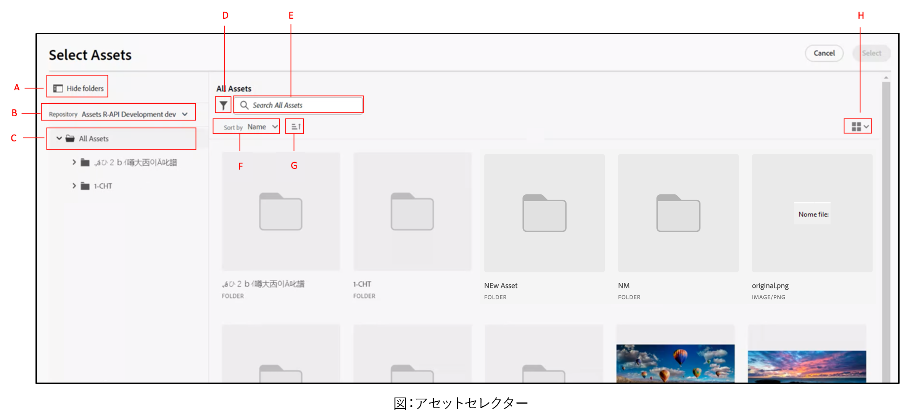

# マイクロフロントエンドアセットセレクター {#Overview}

マイクロフロントエンドアセットセレクターは、[!DNL Experience Manager Assets as a Cloud Service] リポジトリと簡単に統合できるユーザーインターフェイスを提供します。ユーザーはこれにより、リポジトリで使用可能なデジタルアセットを参照または検索し、アプリケーションのオーサリングエクスペリエンスで使用できるようになります。

アセットセレクターパッケージを使用すると、マイクロフロントエンドのユーザーインターフェイスをアプリケーションエクスペリエンスで利用できるようになります。パッケージのアップデートはすべて自動的に読み込まれ、デプロイされた最新のアセットセレクターがアプリケーション内に自動的に読み込まれます。


アセットセレクターには、次のような多くの利点があります。

* Vanilla JavaScript ライブラリを使用して、あらゆるアドビアプリケーションまたはアドビ以外のアプリケーションと簡単に統合できます。
* アセットセレクターパッケージのアップデートがアプリケーションで使用可能なアセットセレクターに自動的にデプロイされるため、管理が簡単です。最新の修正内容を読み込むために、アプリケーション内でアップデートを行う必要がありません。
* アプリケーション内のアセットセレクターの表示を制御するプロパティを利用できるため、カスタマイズが容易です。

* フルテキスト検索、標準のフィルターおよびカスタマイズされたフィルターを使用して、オーサリングエクスペリエンス内で使用するアセットにすばやく移動できます。

* IMS 組織内のリポジトリを切り替えて、アセットを選択できます。

* 名前、寸法、サイズでアセットを並べ替えたり、リスト、グリッド、ギャラリー、ウォーターフォールの各レイアウトでアセットを表示したりできます。

この記事では、統合シェルの下で [!DNL Adobe] アプリケーションと連携してアセットセレクターを使用する方法、または認証用に生成された imsToken が既にある場合にアセットセレクターを使用する方法について説明します。この記事では、これらのワークフローを非 SUSI フローと呼びます。

次のタスクを実行してアセットセレクターを [!DNL Experience Manager Assets as a Cloud Service] リポジトリと統合し、連携して使用します。

* [Vanilla JS を使用したアセットセレクターの統合](#integration-with-vanilla-js)
* [アセットセレクターの表示プロパティの定義](#asset-selector-properties)
* [アセットセレクターの使用](#using-asset-selector)

## Vanilla JS を使用したアセットセレクターの統合 {#integration-with-vanilla-js}

あらゆる [!DNL Adobe] アプリケーションまたはアドビ以外のアプリケーションを [!DNL Experience Manager Assets] as a [!DNL Cloud Service] リポジトリと統合し、アプリケーション内からアセットを選択できます。

統合は、アセットセレクターパッケージを読み込み、Vanilla JavaScript ライブラリを使用して Assets as a Cloud Service に接続することで行われます。アプリケーション内の `index.html` または適切なファイルを、次の目的で編集する必要があります。

* 認証の詳細を定義する
* Assets as a Cloud Service リポジトリにアクセスする
* アセットセレクターの表示プロパティを設定する

<!--
Asset Selector supports authentication to the [!DNL Experience Manager Assets] as a [!DNL Cloud Service] repository using Identity Management System (IMS) properties such as `imsScope` or `imsClientID`. Authentication using these IMS properties is referred to as SUSI (Sign Up Sign In) flow in this article.

You can perform authentication without defining some of the IMS properties, such as `imsScope` or `imsClientID`, if:

*   You are integrating an [!DNL Adobe] application on [Unified Shell](https://experienceleague.adobe.com/docs/experience-manager-cloud-service/content/overview/aem-cloud-service-on-unified-shell.html?lang=en).
*   You already have an IMS token generated for authentication.

Accessing [!DNL Experience Manager Assets] as a [!DNL Cloud Service] repository without defining `imsScope` or `imsClientID` IMS properties is referred to as a non-SUSI flow in this article.
-->

次の場合は、一部の IMS プロパティを定義せずに認証を実行できます。

* [統合シェル](https://experienceleague.adobe.com/docs/experience-manager-cloud-service/content/overview/aem-cloud-service-on-unified-shell.html?lang=ja)の [!DNL Adobe] アプリケーションを統合している場合。
* 認証用に既に IMS トークンが生成されている場合。

## 前提条件 {#prerequisites}

<!--
If your application requires user based authentication, out-of-the-box Asset Selector also supports a flow for authentication to the [!DNL Experience Manager Assets] as a [!DNL Cloud Service] repository using Identity Management System (IMS.)

You can use properties such as `imsScope` or `imsClientID` to retrieve `imsToken` automatically. You can use SUSI (Sign Up Sign In) flow and IMS properties. Also, you can obtain your own imsToken and pass it to Asset Selector by integrating within [!DNL Adobe] application on Unified Shell or if you already have an imsToken obtained via other methods (for example, using technical account). Accessing [!DNL Experience Manager Assets] as a [!DNL Cloud Service] repository without defining IMS properties (For example, `imsScope` and `imsClientID`) is referred to as a non-SUSI flow.
-->

アプリケーション実装内の `index.html` ファイルまたは同様のファイルで前提条件を定義して、[!DNL Experience Manager Assets] as a [!DNL Cloud Service] リポジトリにアクセスするための認証の詳細を定義します。前提条件は次のとおりです。

* imsOrg
* imsToken
* apikey
<!--
The prerequisites vary if you are authenticating using a SUSI flow or a non-SUSI flow.

**Non-SUSI flow**

*   imsOrg
*   imsToken
*   apikey

For more information on these properties, see [Asset Selector Properties](#asset-selector-properties).

**SUSI flow**

*   imsClientId
*   imsScope
*   redirectUrl
*   imsOrg
*   apikey

For more information on these properties, see [Example for the SUSI flow](#susi-vanilla) and [Asset Selector Properties](#asset-selector-properties).
-->

## インストール {#installation}

アセットセレクターは、ESM CDN 経由（例：[esm.sh](https://esm.sh/)／[skypack](https://www.skypack.dev/)）および [UMD](https://github.com/umdjs/umd) バージョン経由のいずれでも使用できます。

**UMD バージョン**&#x200B;を使用しているブラウザー（推奨）：

```
<script src="https://experience.adobe.com/solutions/CQ-assets-selectors/static-assets/resources/assets-selectors.js"></script>

<script>
  const { renderAssetSelector } = PureJSSelectors;
</script>
```

**ESM CDN バージョン**&#x200B;を使用している `import maps` 対応ブラウザー：

```
<script type="module">
  import { AssetSelector } from 'https://experience.adobe.com/solutions/CQ-assets-selectors/static-assets/resources/@assets/selectors/index.js'
</script>
```

**ESM CDN バージョン**&#x200B;を使用している Deno/Webpack Module Federation：

```
import { AssetSelector } from 'https://experience.adobe.com/solutions/CQ-assets-selectors/static-assets/resources/@assets/selectors/index.js'
```

### 選択されたアセットタイプ {#selected-asset-type}

選択されたアセットタイプは、`handleSelection`、`handleAssetSelection`、および `onDrop` 関数を使用している場合、アセット情報を含むオブジェクトの配列です。

**スキーマ構文**

```
interface SelectedAsset {
    'repo:id': string;
    'repo:name': string;
    'repo:path': string;
    'repo:size': number;
    'repo:createdBy': string;
    'repo:createDate': string;
    'repo:modifiedBy': string; 
    'repo:modifyDate': string; 
    'dc:format': string; 
    'tiff:imageWidth': number;
    'tiff:imageLength': number;
    'repo:state': string;
    computedMetadata: Record<string, any>;
    _links: {
        'http://ns.adobe.com/adobecloud/rel/rendition': Array<{
            href: string;
            type: string;
            'repo:size': number;
            width: number;
            height: number;
            [others: string]: any;
        }>;
    };
}
```

次の表に、選択されたアセットのオブジェクトの重要なプロパティの一部を示します。

| プロパティ | タイプ | 説明 |
|---|---|---|
| *repo:repositoryId* | 文字列 | アセットが保存されるリポジトリの一意の ID。 |
| *repo:id* | 文字列 | アセットの一意の ID。 |
| *repo:assetClass* | 文字列 | アセットの分類（例：画像、ビデオ、ドキュメント）。 |
| *repo:name* | 文字列 | ファイル拡張子を含むアセットの名前。 |
| *repo:size* | 数値 | アセットのサイズ（バイト単位）。 |
| *repo:path* | 文字列 | リポジトリ内のアセットの場所。 |
| *repo:ancestors* | `Array<string>` | リポジトリ内のアセットの上位項目の配列。 |
| *repo:state* | 文字列 | リポジトリ内のアセットの現在のステータス（例：アクティブ、削除済みなど）。 |
| *repo:createdBy* | 文字列 | アセットを作成したユーザーまたはシステム。 |
| *repo:createDate* | 文字列 | アセットが作成された日時。 |
| *repo:modifiedBy* | 文字列 | アセットを最後に変更したユーザーまたはシステム。 |
| *repo:modifyDate* | 文字列 | アセットが最後に変更された日時。 |
| *dc:format* | 文字列 | ファイルタイプなどのアセットの形式（例：JPEG、PNG）。 |
| *tiff:imageWidth* | 数値 | アセットの幅。 |
| *tiff:imageLength* | 数値 | アセットの高さ。 |
| *computedMetadata* | `Record<string, any>` | あらゆる種類（リポジトリ、アプリケーション、埋め込みメタデータ）のすべてのアセットのメタデータのバケットを表すオブジェクト。 |
| *_links* | `Record<string, any>` | 関連付けられたアセットのハイパーメディアリンク。メタデータやレンディションなどのリソースへのリンクが含まれます。 |
| *_links.http://ns.adobe.com/adobecloud/rel/rendition* | `Array<Object>` | アセットのレンディションに関する情報を含むオブジェクトの配列。 |
| *_links.http://ns.adobe.com/adobecloud/rel/rendition[].href* | 文字列 | レンディションの URI。 |
| *_links.http://ns.adobe.com/adobecloud/rel/rendition[].type* | 文字列 | レンディションの MIME タイプ。 |
| *_links.http://ns.adobe.com/adobecloud/rel/rendition[].&#39;repo:size&#39;* | 数値 | レンディションのサイズ（バイト単位）。 |
| *_links.http://ns.adobe.com/adobecloud/rel/rendition[].width* | 数値 | レンディションの幅。 |
| *_links.http://ns.adobe.com/adobecloud/rel/rendition[].height* | 数値 | レンディションの高さ。 |

プロパティの完全なリストと詳細な例については、[アセットセレクターのコード例](https://github.com/adobe/aem-assets-selectors-mfe-examples)を参照してください。

<!--
### ImsAuthProps {#ims-auth-props}

The `ImsAuthProps` properties define the authentication information and flow that the Asset Selector uses to obtain an `imsToken`. By setting these properties, you can control how the authentication flow should behave and register listeners for various authentication events.

| Property Name | Description|
|---|---|
| `imsClientId`| A string value representing the IMS client ID used for authentication purposes. This value is provided by Adobe and is specific to your Adobe AEM CS organization.|
| `imsScope`| Describes the scopes used in authentication. The scopes determine the level of access that the application has to your organization resources. Multiple scopes can be separated by commas.|
| `redirectUrl` | Represents the URL where the user is redirected after authentication. This value is typically set to the current URL of the application. If a `redirectUrl` is not supplied, `ImsAuthService` will use the redirectUrl used to register the `imsClientId`|
| `modalMode`| A boolean indicating whether the authentication flow should be displayed in a modal (pop-up) or not. If set to `true`, the authentication flow is displayed in a pop-up. If set to `false`, the authentication flow is displayed in a full page reload. _Note:_ for better UX, you can dynamically control this value if the user has browser pop-up disabled. |
| `onImsServiceInitialized`| A callback function that is called when the Adobe IMS authentication service is initialized. This function takes one parameter, `service`, which is an object representing the Adobe IMS service. See [`ImsAuthService`](#imsauthservice-ims-auth-service) for more details.|
| `onAccessTokenReceived`| A callback function that is called when an `imsToken` is received from the Adobe IMS authentication service. This function takes one parameter, `imsToken`, which is a string representing the access token. |
| `onAccessTokenExpired`| A callback function that is called when an access token has expired. This function is typically used to trigger a new authentication flow to obtain a new access token. |
| `onErrorReceived`| A callback function that is called when an error occurs during authentication. This function takes two parameters: the error type and error message. The error type is a string representing the type of error and the error message is a string representing the error message. |

### ImsAuthService {#ims-auth-service}

`ImsAuthService` class handles the authentication flow for the Asset Selector. It is responsible for obtaining an `imsToken` from the Adobe IMS authentication service. The `imsToken` is used to authenticate the user and authorize access to the Adobe Experience Manager (AEM) CS Assets repository. ImsAuthService uses the `ImsAuthProps` properties to control the authentication flow and register listeners for various authentication events. You can use the convenient [`registerAssetsSelectorsAuthService`](#purejsselectorsregisterassetsselectorsauthservice) function to register the _ImsAuthService_ instance with the Asset Selector. The following functions are available on the `ImsAuthService` class. However, if you are using the _registerAssetsSelectorsAuthService_ function, you do not need to call these functions directly.

| Function Name | Description |
|---|---|
| `isSignedInUser` | Determines whether the user is currently signed in to the service and returns a boolean value accordingly.|
| `getImsToken`    | Retrieves the authentication `imsToken` for the currently signed-in user, which can be used to authenticate requests to other services such as generating asset _rendition.|
| `signIn`| Initiates the sign-in process for the user. This function uses the `ImsAuthProps` to show authentication in either a pop-up or a full page reload |
| `signOut`| Signs the user out of the service, invalidating their authentication token and requiring them to sign in again to access protected resources. Invoking this function will reload the current page.|
| `refreshToken`| Refreshes the authentication token for the currently signed-in user, preventing it from expiring and ensuring uninterrupted access to protected resources. Returns a new authentication token that can be used for subsequent requests. |
-->

### 非 SUSI フローの例 {#non-susi-vanilla}

この例では、統合シェルの下で [!DNL Adobe] アプリケーションを実行している場合、または認証用に生成された `imsToken` が既にある場合に、アセットセレクターを非 SUSI フローと連携して使用する方法を示します。

以下の例の _6～15 行目_&#x200B;に示されているように、`script` タグを使用してアセットセレクターパッケージをコードに含めます。スクリプトが読み込まれると、`PureJSSelectors` グローバル変数を使用できるようになります。_16～23 行目_&#x200B;に示されているように、アセットセレクターの[プロパティ](#asset-selector-properties)を定義します。`imsOrg` プロパティと `imsToken` プロパティは、いずれも非 SUSI フローでの認証に必要です。`handleSelection` プロパティは、選択したアセットを処理するために使用されます。_17 行目_&#x200B;で示されているように、アセットセレクターをレンダリングするには `renderAssetSelector` 関数を呼び出します。_21～22 行目_&#x200B;に示されているように、アセットセレクターが `<div>` コンテナ要素に表示されます。

これらの手順に従うと、[!DNL Adobe] アプリケーションでアセットセレクターを非 SUSI フローと連携して使用できます。

```html {line-numbers="true"}
<!DOCTYPE html>
<html>
<head>
    <title>Asset Selector</title>
    <script src="https://experience.adobe.com/solutions/CQ-assets-selectors/assets/resources/assets-selectors.js"></script>
    <script>
        // get the container element in which we want to render the AssetSelector component
        const container = document.getElementById('asset-selector-container');
        // imsOrg and imsToken are required for authentication in non-SUSI flow
        const assetSelectorProps = {
            imsOrg: 'example-ims@AdobeOrg',
            imsToken: "example-imsToken",
            apiKey: "example-apiKey-associated-with-imsOrg",
            handleSelection: (assets: SelectedAssetType[]) => {},
        };
        // Call the `renderAssetSelector` available in PureJSSelectors globals to render AssetSelector
        PureJSSelectors.renderAssetSelector(container, assetSelectorProps);
    </script>
</head>

<body>
    <div id="asset-selector-container" style="height: calc(100vh - 80px); width: calc(100vw - 60px); margin: -20px;">
    </div>
</body>

</html>
```

詳細な例は、[アセットセレクターのコード例](https://github.com/adobe/aem-assets-selectors-mfe-examples)を参照してください。

<!--
### Example for the SUSI flow {#susi-vanilla}

Use this example `index.html` file for authentication if you are integrating your application using SUSI flow.

Access the Asset Selector package using the `Script` Tag, as shown in *line 9* to *line 11* of the example `index.html` file.

*Line 14* to *line 38* of the example describes the IMS flow properties, such as `imsClientId`, `imsScope`, and `redirectURL`. The function requires that you define at least one of the `imsClientId` and `imsScope` properties. If you do not define a value for `redirectURL`, the registered redirect URL for the client ID is used.

As you do not have an `imsToken` generated, use the `registerAssetsSelectorsAuthService` and `renderAssetSelectorWithAuthFlow` functions, as shown in line 40 to line 50 of the example `index.html` file. Use the `registerAssetsSelectorsAuthService` function before `renderAssetSelectorWithAuthFlow` to register the `imsToken` with the Asset Selector. [!DNL Adobe] recommends to call `registerAssetsSelectorsAuthService` when you instantiate the component.

Define the authentication and other Assets as a Cloud Service access-related properties in the `const props` section, as shown in *line 54* to *line 60* of the example `index.html` file.

The `PureJSSelectors` global variable, mentioned in *line 65*, is used to render the Asset Selector in the web browser.

Asset Selector is rendered on the `<div>` container element, as mentioned in *line 74* to *line 81*. The example uses a dialog to display the Asset Selector.

```html {line-numbers="true"}
<!DOCTYPE html>
<html>

<head>
    <meta http-equiv="X-UA-Compatible" content="IE=edge">
    <meta charset="utf-8">
    <title>Asset Selectors</title>
    <link rel="stylesheet" href="index.css">
    <script id="asset-selector"
        src="https://experience.adobe.com/solutions/CQ-assets-selectors/assets/resources/asset-selectors.js"></script>
    <script>

        const imsProps = {
            imsClientId: "<obtained from IMS team>",
            imsScope: "openid, <other scopes>",
            redirectUrl: window.location.href,
            modalMode: true, // false to open in a full page reload flow
            onImsServiceInitialized: (service) => {
                // invoked when the ims service is initialized and is ready
                console.log("onImsServiceInitialized", service);
            },
            onAccessTokenReceived: (token) => {
                console.log("onAccessTokenReceived", token);
            },
            onAccessTokenExpired: () => {
                console.log("onAccessTokenError");
                // re-trigger sign-in flow
            },
            onErrorReceived: (type, msg) => {
                console.log("onErrorReceived", type, msg);
            },
        }

        function load() {
            const registeredTokenService = PureJSSelectors.registerAssetsSelectorsAuthService(imsProps);
            imsInstance = registeredTokenService;
        };

        // initialize the IMS flow before attempting to render the asset selector
        load();
        

        //function that will render the asset selector
            const otherProps = {
            // any other props supported by asset selector
            }
            const assetSelectorProps = {
                "imsOrg": "imsorg",
                ...otherProps
            }
             // container element on which you want to render the AssetSelector/DestinationSelector component
            const container = document.getElementById('asset-selector');

            /// Use the PureJSSelectors in globals to render the AssetSelector/DestinationSelector component
            PureJSSelectors.renderAssetSelectorWithAuthFlow(container, assetSelectorProps, () => {
                const assetSelectorDialog = document.getElementById('asset-selector-dialog');
                assetSelectorDialog.showModal();
            });
        }
    </script>

</head>
<body class="asset-selectors">
    <div>
        <button onclick="renderAssetSelectorWithAuthFlowFlow()">Asset Selector - Select Assets with Ims Flow</button>
    </div>
        <dialog id="asset-selector-dialog">
            <div id="asset-selector" style="height: calc(100vh - 80px); width: calc(100vw - 60px); margin: -20px;">
            </div>
        </dialog>
    </div>
</body>

</html>

```
-->

## アセットセレクターのプロパティを使用する {#asset-selector-properties}

アセットセレクターのプロパティを使用して、アセットセレクターのレンダリング方法をカスタマイズできます。次の表に、アセットセレクターをカスタマイズして使用するために利用できるプロパティを示します。

| プロパティ | タイプ | 必須 | デフォルト | 説明 |
|---|---|---|---|---|
| *rail* | ブーリアン | いいえ | false | `true` とマークされている場合、アセットセレクターは左側のパネルビューにレンダリングされます。`false` とマークされている場合、アセットセレクターはモーダルビューにレンダリングされます。 |
| *imsOrg* | 文字列 | はい | | [!DNL Adobe Experience Manager] as a [!DNL Cloud Service] を組織にプロビジョニングする場合に割り当てられる Adobe Identity Management System（IMS）の ID です。`imsOrg` キーは、アクセスしようとしている組織が Adobe IMS 内にあるかどうかを認証するために必要です。 |
| *imsToken* | 文字列 | いいえ | | 認証に使用される IMS ベアラートークンです。非 SUSI フローを使用している場合、`imsToken` は必須です。 |
| *apiKey* | 文字列 | いいえ | | AEM Discovery サービスへのアクセスに使用する API キーです。非 SUSI フローを使用している場合、`apiKey` は必須です。 |
| *rootPath* | 文字列 | いいえ | /content/dam/ | アセットセレクターがアセットを表示する元のフォルダーパスです。`rootPath` はカプセル化の形式でも使用できます。例えば、次のパス `/content/dam/marketing/subfolder/` を指定すると、アセットセレクターでは親フォルダーをトラバースできず、子フォルダーのみが表示されます。 |
| *path* | 文字列 | いいえ | | アセットセレクターがレンダリングされる際に、アセットの特定のディレクトリに移動するために使用されるパスです。 |
| *filterSchema* | 配列 | いいえ | | フィルタープロパティの設定に使用するモデルです。これは、アセットセレクターで特定のフィルターオプションを制限する場合に便利です。 |
| *filterFormProps* | オブジェクト | いいえ | | 検索を絞り込むために使用する必要があるフィルタープロパティを指定します。（例：MIME タイプの JPG、PNG、GIF） |
| *selectedAssets* | 配列 `<Object>` | いいえ |                 | アセットセレクターがレンダリングされる際に、選択したアセットを指定します。アセットの ID プロパティを含むオブジェクトの配列が必要です。（例：`[{id: 'urn:234}, {id: 'urn:555'}]`）アセットは、現在のディレクトリで使用できる必要があります。別のディレクトリを使用する必要がある場合は、`path` プロパティの値も指定します。 |
| *acvConfig* | オブジェクト | いいえ | | デフォルトを上書きするカスタム設定が含まれているオブジェクトを含むアセットコレクション表示プロパティです。 |
| *i18nSymbols* | `Object<{ id?: string, defaultMessage?: string, description?: string}>` | いいえ |                 | OOTB 翻訳がアプリケーションのニーズを満たさない場合は、独自のローカライズされたカスタム値を `i18nSymbols` プロップ経由で渡すことができるインターフェイスを表示できます。このインターフェイスを介して値を渡すと、提供されたデフォルトの翻訳が上書きされ、代わりに独自の翻訳が使用されます。上書きを実行するには、上書きしたい `i18nSymbols` のキーに有効な[メッセージ記述子](https://formatjs.io/docs/react-intl/api/#message-descriptor)オブジェクトを渡す必要があります。 |
| *intl* | オブジェクト | いいえ | | アセットセレクターはデフォルトの OOTB 翻訳を提供します。`intl.locale` プロップを介して有効なロケール文字列を指定することで、翻訳言語を選択できます。（例：`intl={{ locale: "es-es" }}` </br></br>）サポートされているロケール文字列は、言語名の標準規格を表す [ISO 639 - コード](https://www.iso.org/iso-639-language-codes.html)に従います。</br></br> サポートされているロケールの一覧：英語 - &#39;en-us&#39;（デフォルト）スペイン語 - &#39;es-es&#39; ドイツ語 - &#39;de-de&#39; フランス語 - &#39;fr-fr&#39; イタリア語 - &#39;it-it&#39; 日本語 - &#39;ja-jp&#39; 韓国語 - &#39;ko-kr&#39; ポルトガル語 - &#39;pt-br&#39; 中国語（簡体字） - &#39;zh-cn&#39; 中国語（繁体字） - &#39;zh-tw&#39; |
| *repositoryId* | 文字列 | いいえ | &#39;&#39; | アセットセレクターがコンテンツを読み込む元のリポジトリです。 |
| *additionalAemSolutions* | `Array<string>` | いいえ | [ ] | 追加のAEMリポジトリのリストを追加できます。 このプロパティで情報が指定されない場合、メディアライブラリまたは AEM Assets リポジトリのみが考慮されます。 |
| *hideTreeNav* | ブーリアン | いいえ |  | アセットツリーのナビゲーションサイドバーを表示するか非表示にするかを指定します。このプロパティはモーダルビューでのみ使用されるので、パネルビューではこのプロパティの影響はありません。 |
| *onDrop* | 関数 | いいえ | | このプロパティで、アセットのドロップ機能を許可することができます。 |
| *dropOptions* | `{allowList?: Object}` | いいえ | | 「allowList」を使用してドロップオプションを設定します。 |
| *colorScheme* | 文字列 | いいえ | | アセットセレクターのテーマ（`light` または `dark`）を設定します。 |
| *handleSelection* | 関数 | いいえ | | アセットが選択され、モーダルの `Select` ボタンがクリックされた場合に、アセットの項目の配列と一緒に呼び出されます。この関数は、モーダルビューでのみ呼び出されます。パネルビューの場合は、`handleAssetSelection` 関数または `onDrop` 関数を使用します。例： <pre>handleSelection=(assets: Asset[])=> {...}</pre> 詳しくは、[選択されたアセットタイプ](#selected-asset-type)を参照してください。 |
| *handleAssetSelection* | 関数 | いいえ | | アセットが選択または選択解除されたときに、項目の配列と一緒に呼び出されます。これは、ユーザーがアセットの選択時にアセットをリッスンする場合に役立ちます。例： <pre>handleSelection=(assets: Asset[])=> {...}</pre> 詳しくは、[選択されたアセットタイプ](#selected-asset-type)を参照してください。 |
| *onClose* | 関数 | いいえ | | モーダルビューで `Close` ボタンが押された際に呼び出されます。これは、`modal` ビューでのみ呼び出され、`rail` ビューでは無視されます。 |
| *onFilterSubmit* | 関数 | いいえ | | ユーザーが別のフィルター条件を変更したときに、フィルター項目と一緒に呼び出されます。 |
| *selectionType* | 文字列 | いいえ | single | 一度にアセットを `single` 選択または `multiple` 選択するための設定です。 |

## アセットセレクターのプロパティの使用例 {#usage-examples}

`index.html` ファイルでアセットセレクターの[プロパティ](#asset-selector-properties)を定義して、アプリケーション内のアセットセレクター表示をカスタマイズできます。

### 例 1：パネルビューのアセットセレクター


アセットセレクターの `rail` の値が `false` に設定されている、またはプロパティで示されていない場合、アセットセレクターはデフォルトでモーダルビューに表示されます。

<!--
### Example 2: Use selectedAssets property in addition to the path property

Use the `path` property to define the folder name that displays automatically when the Asset Selector is rendered. In addition, use the `selectedAssets` property to define the IDs for the assets that you need to select within the folder. Moreover, when you want to display assets that are pre-defined within the folder, you can use selectedAssets property.

   
-->

### 例 2：メタデータポップオーバー

様々なプロパティを使用して、情報アイコンを使用して表示するアセットのメタデータを定義します。情報ポップオーバーは、アセットまたはフォルダーに関する情報のコレクションを提供します。この情報には、アセットのタイトル、寸法、変更日、場所、説明などが含まれます。次の例では、様々なプロパティを使用してアセットのメタデータを表示します。例えば、`repo:path` プロパティは、アセットの場所を指定します。<!--`repo` represents the repository from where the asset is showing, whereas, `path` represents the route from where the asset or folder is rendered.-->


### 例 3：パネルビューのカスタムフィルタープロパティ

アセットセレクターを使用すると、ファセット検索に加えて、様々な属性をカスタマイズして、検索を絞り込むことができます。 [!DNL Adobe Experience Manager] as a [!DNL Cloud Service] アプリケーション。 カスタマイズした検索フィルターをアプリケーションに追加するには、次のコードを追加する必要があります。次の例では、画像、ドキュメント、ビデオの中からアセットタイプをフィルタリングする `Type Filter` 検索、または検索用に追加したフィルタータイプを使用します。


<!--

## Customization after integrating Asset Selector 

### Custom metadata

Assets display panel shows the out of the box metadata that can be displayed in the info of the asset. In addition to this, [!DNL Adobe Experience Manager] as a [!DNL Cloud Service] application allows configuration of the asset selector by adding custom metadata that is shown in info panel of the asset.
-->

<!-- Property details to be added here. Referred the ticket https://jira.corp.adobe.com/browse/ASSETS-19023-->

<!--
## Asset Selector Object Schema {#object-schema}

Schema describes the object properties associated with an asset selected using Asset Selector. It uses the combination of data types and their values to validate the object describing the selected Asset using an Asset Selector.

**Schema Syntax**
````
interface SelectedAsset {
    'repo:id': string;
    'repo:name': string;
    'repo:path': string;
    'repo:size': number;
    'repo:createdBy': string;
    'repo:createDate': string;
    'repo:modifiedBy': string; 
    'repo:modifyDate': string; 
    'dc:format': string; 
    'tiff:imageWidth': number;
    'tiff:imageLength': number;
    'repo:state': string;
    computedMetadata: Record<string, any>;
    _links: {
        'http://ns.adobe.com/adobecloud/rel/rendition': Array<{
            href: string;
            type: string;
            'repo:size': number;
            width: number;
            height: number;
            [others: string]: any;
        }>;
    };
}
````

**Query Parameters**

| Parameter | Type | Description |
|---|---|---|
| repo:id | string | ID of an Asset |
| repo:name | string | The name of an Asset |
| repo:path | string | The path of an Asset |
| repo:size | number | Size of an Asset (in bytes) |
| repo:createdBy | string | ID of a user who created an Asset |
| repo: createdDate | string | The timestamp when an asset was created |
| repo:modifiedBy | string | ID of a user who modified the asset recently |
| repo:modifyDate | string | The timestamp when the asset was last modified |
| dc:format | string | MIME type of an Asset |
| tiff:imageWidth | number | The width of an image type of Asset |
| tiff:imageLength | number | The height of an image type of Asset |
| repo:state | string | The `Approved`, `Rejected`, or `Expired`state of an Asset |
| computedMetadata | string | It is an object that represents a bucket for all the Asset's metadata of all kinds (repository, application or embedded metadata) |
| _links | string | It represents the collection of links used in the Asset Selector. The links are represented in the form of an array. The parameters of an array include: `href`, `type`, `repo:size`, `width`, `height`, and so on  |

For the detailed example of Object Schema, click 
-->

## オブジェクトスキーマを使用したアセット選択の処理 {#handling-selection}

`handleSelection` プロパティを使用して、アセットセレクターでの 1 つまたは複数のアセットの選択を処理します。次の例に、`handleSelection` を使用した構文を示します。


## アセットセレクターの使用 {#using-asset-selector}

アセットセレクターを設定し、[!DNL Adobe Experience Manager] as a [!DNL Cloud Service] アプリケーションでアセットセレクターの使用が認証されると、アセットを選択したり、その他の様々な操作を実行してリポジトリ内でアセットを検索したりできます。



* **A**：[パネルの非表示／表示](#hide-show-panel)
* **B**：[リポジトリスイッチャー](#repository-switcher)
* **C**：[アセット](#repository)
* **D**：[フィルター](#filters)
* **E**：[検索バー](#search-bar)
* **F**：[並べ替え](#sorting)
* **G**：[昇順または降順での並べ替え](#sorting)
* **H**：[表示](#types-of-view)

### パネルの非表示／表示 {#hide-show-panel}

左側のナビゲーションでフォルダーを非表示にするには、「**[!UICONTROL フォルダーを非表示]**」アイコンをクリックします。変更を元に戻すには、「**[!UICONTROL フォルダーを非表示]**」アイコンを再度クリックします。

### リポジトリスイッチャー {#repository-switcher}

また、アセットセレクターを使用して、アセット選択用のリポジトリーを切り替えることもできます。 左側のパネルにあるドロップダウンから、目的のリポジトリを選択できます。ドロップダウンリストで使用できるリポジトリオプションは、`index.html` ファイルで定義されている `repositoryId` プロパティに基づいています。これは、ログインしているユーザーがアクセスする、選択された IMS 組織の環境に基づいています。消費者は優先する `repositoryID` を渡すことができ、その場合、アセットセレクターはリポジトリスイッチャーのレンダリングを停止し、指定されたリポジトリからのみアセットをレンダリングします。
<!--
It is based on the `imsOrg` that is provided in the application. If you want to see the list of repositories, then `repositoryId` is required to view those specific repositories in your application.
-->

### アセットリポジトリ

操作の実行に使用できるアセットフォルダーのコレクションです。

### 標準のフィルター {#filters}

アセットセレクターには、検索結果を絞り込むための標準のフィルターオプションも用意されています。次のフィルターを使用できます。

* `File type`：フォルダー、ファイル、画像、ドキュメント、ビデオを含む
* `MIME type`：JPG、GIF、PPTX、PNG、MP4、DOCX、TIFF、PDF、XLSX を含む
* `Image Size`：画像の最小／/最大の幅、最小／最大の高さを含む

  

### カスタム検索

アセットセレクターでは、全文検索に加えて、カスタマイズされた検索を使用してファイル内のアセットを検索することができます。 カスタム検索フィルターは、モーダル表示モードとパネル表示モードの両方で使用できます。


また、デフォルトの検索フィルターを作成して、頻繁に検索するフィールドを保存し、後で使用することもできます。アセットのカスタム検索を作成するには、`filterSchema` プロパティを使用できます。

### 検索バー {#search-bar}

アセットセレクターを使用すると、選択したリポジトリ内のアセットに対して、全文検索を実行できます。 例えば、検索バーにキーワード「`wave`」を入力すると、メタデータプロパティのいずれかでキーワード「`wave`」が記述されているアセットがすべて表示されます。

### 並べ替え {#sorting}

アセットセレクター内のアセットを、アセットの名前、寸法、サイズで並べ替えることができます。アセットを昇順または降順で並べ替えることもできます。

### 表示の種類 {#types-of-view}

アセットセレクターを使用すると、次の 4 つの異なるビューでアセットを表示できます。

* ** [!UICONTROL リスト表示]**：リスト表示では、スクロール可能なファイルとフォルダーが 1 列に表示されます。
* ** [!UICONTROL グリッド表示]**：グリッド表示では、スクロール可能なファイルとフォルダーが行と列のグリッドに表示されます。
* ** [!UICONTROL ギャラリー表示]**：ギャラリー表示では、ファイルやフォルダーが中央に固定された水平リストに表示されます。
* ** [!UICONTROL ウォーターフォール表示]**：ウォーターフォール表示では、ファイルやフォルダーが Bridge の形式で表示されます。

<!--
### Modes to view Asset Selector

Asset Selector supports two types of out of the box views:

**  Modal view or Inline view:** The modal view or inline view is the default view of Asset Selector that represents Assets folders in the front area. The modal view allows users to view assets in a full screen to ease the selection of multiple assets for import. Use `<AssetSelector rail={false}>` to enable modal view.

    

**  Rail view:** The rail view represents Assets folders in a left panel. The drag and drop of assets can be performed in this view. Use `<AssetSelector rail={true}>` to enable rail view.

    
-->
<!--

### Application Integration

Asset Selector is flexible and can be integrated within your existing [!DNL Adobe Experience Manager] as a [!DNL Cloud Service] application. It is accessible and localized to add, search, and select assets in your application. With Asset Selector you can:
*   **Configure** You can configure the files/folders that you want to show at the upfront. The assets that are chosen to view can be of any supported formats, for example, JPEG. It lets you control the display of various text or symbols as per your choice.
*   **Perfect fit** Asset selector easily fits in your existing [!DNL Adobe Experience Manager] as a [!DNL Cloud Service] application and choose the way you want to view. The mode of view can be inline, rail, or modal view.
*   **Accessible** With Asset Selector, you can reach the desired asset in an easy manner.
*   **Localize** Assets can be availed for the various locales available as per Adobe's localization standards.
-->
<!--

### Support for multiple instances

The micro front-end design supports the display of multiple instances of Asset Selector on a single screen.


-->

<!--

### Controlled selection with multi-select

You can make default multi-selection of assets by specifying the assets to the component using `selectedAssets` property. You should specify an array of asset IDs. For example, `[{id: 'urn:234}, {id: 'urn:555'}].`
-->
<!--

### Action buttons

When you customize your application with Asset Selector based on ReactJS, you are provided with the following action buttons to perform various actions:
*   **Open in media library** Lets you open the asset in media library.
*   **Upload** Lets you upload an asset directly.
*   **Download** Downloads the asset in [!DNL Adobe Experience Manager] as a [!DNL Cloud Service].
-->
<!--

### Status of an asset

Asset Selector lets you know the status of your uploaded assets. The status can be `Approved`, `Rejected`, or `Expired` of the asset. 
-->
<!--

### Localization

The integration of Asset Selector with [!DNL Adobe Experience Manager] as a [!DNL Cloud Service] allows localized content appear in your application.
-->
