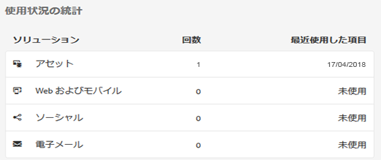
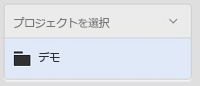
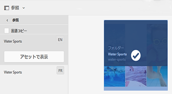
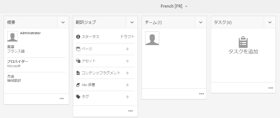
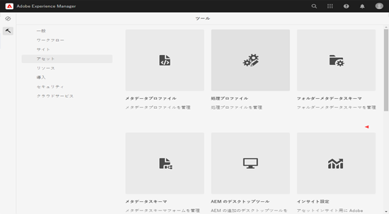

# アセットインサイト {#asset-insights}

アセットインサイトは、サードパーティの Web サイト、マーケティングキャンペーン、アドビのクリエイティブソリューションで使用される画像のユーザーのレーティングと使用状況統計を追跡します。これにより、画像のパフォーマンスと人気に関するインサイトが提供されます。

アセットインサイトでは、画像の評価回数、クリック数、インプレッション数（画像が Web サイトに読み込まれた回数）など、ユーザーのアクティビティの詳細を取得します。これらの統計情報に基づいて画像にスコアを割り当てます。スコアとパフォーマンス統計を使用して、人気が高い画像を選び、カタログやマーケティングキャンペーンなどに含めることができます。このような統計に基づいて、アーカイブやライセンス更新のポリシーを策定することさえできます。

アセットインサイトが画像の使用状況統計を Web サイトから取得するためには、画像の埋め込みコードを Web サイトのコードに組み込む必要があります。

アセットインサイトでアセットの使用状況統計を表示できるようにするには、最初に Adobe Analytics からのレポートデータをフェッチするようにこの機能を設定します。詳しくは、[アセットインサイトの設定](#configure-asset-insights)を参照してください。

>[!NOTE]
>
>インサイトのサポートおよび提供がおこなわれるのは、画像に対してのみです。

## 画像の統計情報の表示 {#viewing-statistics-for-an-image}

メタデータページでアセットインサイトのスコアを確認できます。

1. Assets ユーザーインターフェイス（UI）から、画像を選択し、ツールバーの「**[!UICONTROL プロパティ]**」をタップします。
1. プロパティページで、「**[!UICONTROL インサイト]**」をタップします。
1. 「**[!UICONTROL インサイト]**」タブで、アセットの使用状況の詳細を確認します。「**[!UICONTROL スコア]**」セクションには、アセットの全体的な使用状況とパフォーマンスのスコアが表示されます。

   使用状況のスコアは、アセットが様々なソリューションで使用された回数です。

   「**[!UICONTROL インプレッション数]**」のスコアは、アセットが Web サイトに読み込まれた回数です。「**[!UICONTROL クリック数]**」の下に表示される数値は、アセットがクリックされた回数です。

1. 「**[!UICONTROL 使用状況の統計]**」セクションを見て、アセットが含まれているエンティティや最近使用されたクリエイティブソリューションを確認します。使用率が高いほど、ユーザーの間で人気のあるアセットであることを意味します。使用状況データは、次の見出しの下に表示されます。

   * **[!UICONTROL アセット]**：アセットが、コレクションまたは複合アセットに含まれた回数.
   * **[!UICONTROL Web およびモバイル]**：アセットが Web サイトまたはアプリに含まれた回数.
   * **[!UICONTROL ソーシャル]**：アセットが Adobe Social や Adobe Campaign などのソリューションで使用された回数.
   * **[!UICONTROL 電子メール]**：アセットが電子メールキャンペーンで使用された回数.

   

   >[!NOTE]
   >
   >アセットインサイト機能は、通常 Adobe Analytics のソリューションデータを定期的にフェッチするので、「ソリューション」セクションには最新データが表示されていない場合があります。表示されるデータが対応する期間は、アセットインサイトが Analytics のデータを取得するために実行するフェッチ操作のスケジュールによって決まります。

1. 特定の期間のアセットのパフォーマンス統計をグラフィカルに表示するには、「**[!UICONTROL パフォーマンス統計]**」セクションで期間を選択します。クリック数やインプレッション数などの詳細がグラフの傾向線として表示されます。

   

   >[!NOTE]
   >
   >「ソリューション」セクションのデータとは異なり、「パフォーマンス統計」セクションには最新データが表示されます。

1. パフォーマンスデータを得るために Web サイトに組み込んだアセットの埋め込みコードを取得するには、アセットのサムネールの下の「**[!UICONTROL 埋め込みコードの取得]**」をタップまたはクリックします。<!-- For more information on how to include your Embed code in third-party web pages, see [Using Page Tracker and Embed code in web pages](/help/assets/use-page-tracker.md). -->

   

## 画像の総統計の表示 {#viewing-aggregate-statistics-for-images}

**[!UICONTROL インサイト表示]**&#x200B;を使用すると、フォルダー内のすべてのアセットのスコアを同時に表示できます。

1. Assets UI で、インサイトを表示するアセットを含むフォルダーに移動します。
1. ツールバーの「レイアウト」アイコンをタップまたはクリックして、「**[!UICONTROL インサイト表示]**」オプションを選択します。
1. このページには、アセットの使用状況スコアが表示されます。様々なアセットのレーティングを比較して、洞察を導きます。

<!-- TBD: Commenting as Web Console is not available. Document the appropriate OSGi config method if available in CS.

## Schedule background job {#scheduling-background-job}

Asset Insights fetches usage data for assets from Adobe Analytics report suites in a periodic manner. By default, Asset Insights runs a background job every 24 hours at 2 AM to the fetch data. However, you can modify both the frequency and the time by configuring the **[!UICONTROL Adobe CQ DAM Asset Performance Report Sync Job]** service from the web console.

1. Click the [!DNL Experience Manager] logo, and go to **[!UICONTROL Tools]** &gt; **[!UICONTROL Operations]** &gt; **[!UICONTROL Web Console]**.
1. Open the **[!UICONTROL Adobe CQ DAM Asset Performance Report Sync Job]** service configuration.

   

1. Specify the desired scheduler frequency and the start time for the job in the property scheduler expression. Save the changes.
-->

## アセットインサイトの設定 {#configure-asset-insights}

[!DNL Experience Manager Assets] サードパーティWebサイトで使用されるデジタルアセットの使用状況データを、から取得 [!DNL Adobe Analytics]します。アセットインサイトを有効にしてこのデータを取得し、インサイトを生成するには、まず[!DNL Adobe Analytics]と統合する機能を設定します。

>[!NOTE]
>
>インサイトのサポートおよび提供がおこなわれるのは、画像に対してのみです。

1. [!DNL Experience Manager]で、**[!UICONTROL ツール]**/**[!UICONTROL アセット]**&#x200B;をクリックします。

   

1. 「**[!UICONTROL インサイト設定]**」カードをクリックします。
1. ウィザードで、データセンターを選択し、会社名、ユーザー名、共有暗号鍵などの資格情報を指定します。

   ![ のアセットインサイト用に Adobe Analytics を設定する[!DNL Experience Manager]](assets/insights_config2.png)

   *図： のアセットインサイト用に Adobe Analytics を設定する[!DNL Experience Manager]*

1. 「**[!UICONTROL 認証]**」をクリックまたはタップします。[!DNL Experience Manager]が資格情報を認証した後、**[!UICONTROL レポートスイート]**&#x200B;リストから、アセットインサイトからデータを取得するAdobe Analyticsレポートスイートを選択します。 「**[!UICONTROL 追加]**」をクリックします。
1. [!DNL Experience Manager]がレポートスイートを設定したら、**[!UICONTROL 「完了]**」をタップします。

### ページトラッカー {#page-tracker}

Adobe Analytics アカウントを設定すると、ページトラッカーコードが生成されます。サードパーティWebサイトで使用される[!DNL Experience Manager]アセットを追跡するためにアセットインサイトを有効にするには、Webサイトコードにページトラッカーコードを含めます。  Assets のページトラッカーユーティリティを使用してページトラッカーコードを生成してください。<!--  For more information on how to include your Page Tracker code in third-party web pages, see [Using Page Tracker and Embed code in web pages](/help/assets/use-page-tracker.md). -->

1. [!DNL Experience Manager]で、**[!UICONTROL ツール]**/**[!UICONTROL アセット]**&#x200B;をクリックします。

   

1. **[!UICONTROL ナビゲーション]**&#x200B;ページで、「**[!UICONTROL インサイトページトラッカー]**」カードをクリックします。
1. 「**[!UICONTROL ダウンロード]**」をクリックして、ページトラッカーコードをダウンロードします。

<!--

## Using demo package for Asset Insights {#using-demo-package-for-asset-insights}

Using the demo package, you can enable Adobe Asset Insights to capture data from and generate insights for a sample web page.

1. Configure Asset Insights using the instructions in [Configure Asset Insights](#configure-asset-insights).
1. Download the sample [!DNL Experience Manager Assets] package from below and install the package from CRXDE package manager.

   [Get File](assets/insightsdemo.zip)

1. Download the ZIP file containing the sample web page from below and extract on your local file system.

   [Get File](assets/demosite.zip)

1. Click the web page to open it in the web browser.

   >[!CAUTION]
   >
   >Web Page is configured to load asset from the localhost server . In case your server is running somewhere else change server address from localhost to server address in the HTML content of the web page.

   >[!NOTE]
   >
   >The external web page can be in [!DNL Experience Manager] itself.

-->
