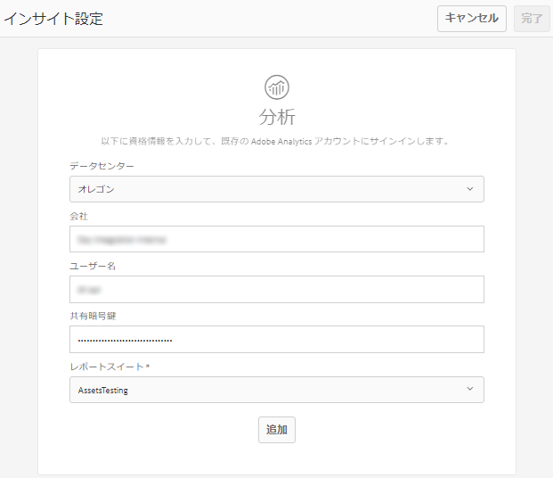

# アセットインサイト{#asset-insights}

<!-- TBD: Add uicontrol tags  -->

アセットインサイト機能を使用すると、サードパーティの Web サイト、マーケティングキャンペーン、アドビのクリエイティブソリューションで使用される画像のユーザーのレーティングと使用状況統計を追跡できます。画像のパフォーマンスと人気に関するインサイトを導き出せます。

アセットインサイトでは、画像の評価回数、クリック数、インプレッション数（画像が Web サイトに読み込まれた回数）など、ユーザーのアクティビティの詳細を取得します。これらの統計に基づいて画像にスコアを割り当てます。 スコアとパフォーマンス統計を使用して、人気のある画像を選択し、カタログやマーケティングキャンペーンなどに含めることができます。 このような統計に基づいて、アーカイブやライセンス更新のポリシーを策定することさえできます。

アセットインサイトが画像の使用状況統計を Web サイトから取得するためには、画像の埋め込みコードを Web サイトのコードに組み込む必要があります。

アセットインサイトでアセットの使用状況統計を表示できるようにするには、最初に Adobe Analytics からのレポートデータをフェッチするようにこの機能を設定します。詳しくは、[アセットインサイトの設定](#configure-asset-insights)を参照してください。

>[!NOTE]
>
>インサイトのサポートおよび提供がおこなわれるのは、画像に対してのみです。

## View statistics for an image {#viewing-statistics-for-an-image}

メタデータページでアセットインサイトのスコアを確認できます。

1. From the Assets user interface (UI), select the image and then tap **[!UICONTROL Properties]** from the toolbar.
1. プロパティページで、「インサイト」をタッ **[!UICONTROL プします]**。
1. 「**[!UICONTROL インサイト]**」タブで、アセットの使用状況の詳細を確認します。The **[!UICONTROL Score]** section describes the total asset usage and performance sores of an asset .

   使用状況のスコアは、アセットが様々なソリューションで使用された回数です。

   「**[!UICONTROL インプレッション数]**」のスコアは、アセットが Web サイトに読み込まれた回数です。「**[!UICONTROL クリック数]**」の下に表示される数値は、アセットがクリックされた回数です。

1. Review the **[!UICONTROL Usage Statistics]** section to know which entities the asset was part of and which creative solutions recently used it. 使用率が高いほど、ユーザーの間で人気のあるアセットであることを意味します。使用状況データは、次の見出しの下に表示されます。

   * **アセット**：アセットが、コレクションまたは複合アセットに含まれた回数
   * **Webおよびモバイル**:アセットがWebサイトやアプリの一部であった回数
   * **ソーシャル**：アセットが Adobe Social や Adobe Campaign などのソリューションで使用された回数
   * **電子メール**：アセットが電子メールキャンペーンで使用された回数
   

   >[!NOTE]
   >
   >通常、アセットインサイト機能は、Adobe Analyticsからソリューションデータを定期的に取得するので、「ソリューション」セクションには最新のデータが表示されない場合があります。 表示されるデータが対応する期間は、アセットインサイトが Analytics のデータを取得するために実行するフェッチ操作のスケジュールによって決まります。

1. 特定の期間のアセットのパフォーマンス統計をグラフィカルに表示するには、「**[!UICONTROL パフォーマンス統計]**」セクションで期間を選択します。クリック数やインプレッション数を含む詳細は、グラフのトレンドラインとして表示されます。

   

   >[!NOTE]
   >
   >「ソリューション」セクションのデータとは異なり、「パフォーマンス統計」セクションには最新データが表示されます。

1. To obtain the embed code for the asset that you include in websites to gets performance data, tap/click **[!UICONTROL Get Embed Code]** below the asset thumbnail. <!-- For more information on how to include your Embed code in third-party web pages, see [Using Page Tracker and Embed code in web pages](/help/assets/use-page-tracker.md). -->

   

## View aggregate statistics for images {#viewing-aggregate-statistics-for-images}

**[!UICONTROL インサイト表示]**&#x200B;を使用すると、フォルダー内のすべてのアセットのスコアを同時に表示できます。

1. Assets UI で、インサイトを表示するアセットを含むフォルダーに移動します。
1. ツールバーの「レイアウト」アイコンをタップまたはクリックして、「**[!UICONTROL インサイト表示]**」オプションを選択します。
1. このページには、アセットの使用状況スコアが表示されます。様々なアセットのレーティングを比較して、洞察を導きます。

## バックグラウンドジョブのスケジュール {#scheduling-background-job}

アセットインサイトは、Adobe Analytics レポートスイートから定期的にアセットの使用状況データをフェッチします。デフォルトでは、アセットインサイトはデータをフェッチするためのバックグラウンドジョブを 24 時間おきに午前 2 時に実行します。この間隔と時刻は、「**[!UICONTROL Adobe CQ DAM Asset Performance Report Sync Job]**」サービスを Web コンソールで設定して変更できます。

1. Tap the AEM logo, and go to **[!UICONTROL Tools]** > **[!UICONTROL Operations]** > **[!UICONTROL Web Console]**.
1. Open the **[!UICONTROL Adobe CQ DAM Asset Performance Report Sync Job]** service configuration.

   

1. プロパティスケジューラーの式にスケジューラーの目的の頻度とジョブの開始時間を指定します。変更内容を保存します。

## アセットインサイトの設定 {#configure-asset-insights}

Adobe Experience Manager（AEM）Assets は、サードパーティの Web サイトで使用される AEM アセットに関する使用状況データを Adobe Analytics からフェッチします。アセットインサイトでこのようなデータを取得して洞察を得るためには、最初に Adobe Analytics と統合するようにこの機能を設定します。

>[!NOTE]
>
>インサイトは画像に対してのみサポートおよび提供されます。

1. AEM で&#x200B;**[!UICONTROL ツール]**／**[!UICONTROL アセット]**&#x200B;をクリックします。

   

1. 「**[!UICONTROL インサイト設定]**」カードをクリックします。
1. ウィザードで、データセンターを選択し、会社名、ユーザー名、共有暗号鍵などの資格情報を指定します。

   
   *図：AEMでのアセットインサイト用のAdobe Analyticsの設定*

1. 「**[!UICONTROL 認証]**」をクリックまたはタップします。AEM によって資格情報が認証されたら、**[!UICONTROL レポートスイート]**&#x200B;リストから、アセットインサイトでデータをフェッチする Adobe Analytics レポートスイートを選択します。「**[!UICONTROL 追加]**」をクリックします。
1. After AEM sets up your report suite, tap **[!UICONTROL Done]**.

### ページトラッカー {#page-tracker}

Adobe Analyticsアカウントを設定すると、ページトラッカーコードが生成されます。 サードパーティの Web サイトで使用される AEM アセットをアセットインサイトで追跡できるようにするには、Web サイトコードにトラッカーコードを組み込みます。AEM Assets のページトラッカーユーティリティを使用してページトラッカーコードを生成してください。<!--  For more information on how to include your Page Tracker code in third-party web pages, see [Using Page Tracker and Embed code in web pages](/help/assets/use-page-tracker.md). -->

1. AEM で&#x200B;**[!UICONTROL ツール]**／**[!UICONTROL アセット]**&#x200B;をクリックします。

   

1. From the **[!UICONTROL Navigation]** page, click the **[!UICONTROL Insights Page Tracker]** card.
1. Click **[!UICONTROL Download]** to download the page tracker code.

<!--

## Using demo package for Asset Insights {#using-demo-package-for-asset-insights}

Using the demo package, you can enable Adobe Asset Insights to capture data from and generate insights for a sample web page.

1. Configure Asset Insights using the instructions in [Configure Asset Insights](#configure-asset-insights).
1. Download the sample AEM Assets package from below and install the package from CRXDE package manager.

   [Get File](assets/insightsdemo.zip)

1. Download the ZIP file containing the sample web page from below and extract on your local file system.

   [Get File](assets/demosite.zip)

1. Click the web page to open it in the web browser.

   >[!CAUTION]
   >
   >Web Page is configured to load asset from the localhost server . In case your server is running somewhere else change server address from localhost to server address in the HTML content of the web page.

   >[!NOTE]
   >
   >The external web page can be in AEM itself.

-->
