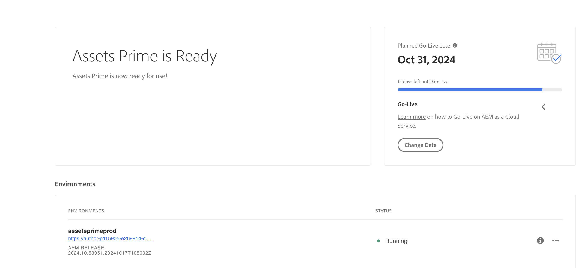
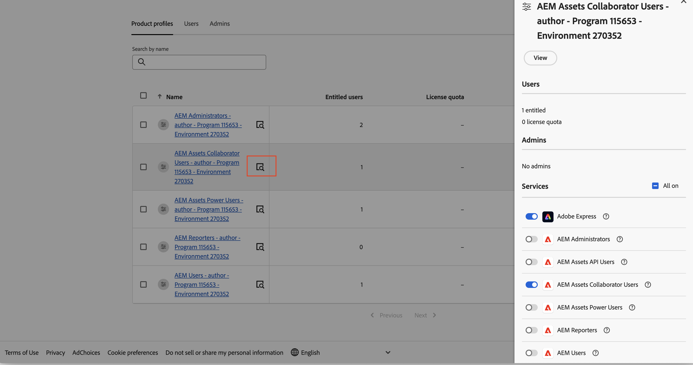

# [!DNL Assets] as a Cloud Service Prime  {#assets-prime}

| [検索のベストプラクティス](/help/assets/search-best-practices.md) | [メタデータのベストプラクティス](/help/assets/metadata-best-practices.md) | [コンテンツハブ](/help/assets/product-overview.md) | [OpenAPI 機能を備えた Dynamic Media](/help/assets/dynamic-media-open-apis-overview.md) | [AEM Assets 開発者向けドキュメント](https://developer.adobe.com/experience-cloud/experience-manager-apis/) |
| ------------- | --------------------------- |---------|----|-----|

Assets as a Cloud Service Prime には、次のような様々な主要機能を実行できる軽量の DAM が含まれています。

* **アセット管理およびライブラリサービス**：ユーザーがブランドのデジタルアセットを一元化されたリポジトリに取り込み、保存、カタログ化、制御、管理、制御できるようにするツール

* **検索、検出、および共同作業**：ユーザーがリッチなカスタマーエクスペリエンスを作成するために必要なアセットを参照、検出、共有、および共同作業できるようにするツール。

* **セキュリティと Rights Management**：コンプライアンス、一貫性、ブランドの整合性を確保するために、アクセス、権限、権利、およびセキュリティを管理するツール。

* **Creative Cloud 接続**：マーケティングチームとクリエイティブチームが、簡素化されたアクセス、コメント、レビュー、注釈を使用して共同作業し、デジタルアセットを更新または完成できるようにするツール。

* **Experience Cloud 接続**：他の Experience Cloud アプリケーションやサービスからのデジタルアセットへのネイティブアクセスをサポートするツール。

* **拡張機能オプションのない配布ポータルエクスペリエンス（コンテンツハブ）**：ブランドの承認済みデジタルアセットへのアクセスを広範な関係者に拡張し、使用状況とブランドの一貫性を確保するツール。

* **統合**：他のアドビアプリケーションおよびアドビ以外のアプリケーションとの統合。

* **Dynamic Media（アドオン）**：画像、ビデオ、その他の新しいコンテンツを変換して配信し、あらゆるデバイスで大規模にリッチでインタラクティブなマルチメディアエクスペリエンスを実現するためのツール。

  >[!NOTE]
  >
  >回転、切り抜き（手動のみ – スマート切り抜きなし）、反転、サイズ、優先 WebP、高さ、幅、画質、形式、アダプティブビデオストリーミングなどの基本的な画像修飾子にアクセスできる、OpenAPI 機能を持つDynamic Mediaは、Assets Prime でも使用できます。 詳しくは、Adobeアカウントチームにお問い合わせください。

1. [新しいプログラムを作成します](/help/journey-onboarding/create-program.md)。

ただし、DAM のニーズが拡大し、UI 拡張機能、API 駆動型自動化、カスタムコードのデプロイメントなどのより多くの機能が必要になる場合は、[Assets Ultimate](/help/assets/assets-ultimate-overview.md) へのアップグレードを考慮する必要があります。

この記事では、Assets as a Cloud Service Prime を有効にするエンドツーエンドのワークフローについて説明します。

## Assets as a Cloud Service Prime の有効化{#enable-assets-prime}

Cloud Manager を使用して新しいプログラムを作成する際に、Assets Prime を有効にします。次の手順を実行します。

1. システム管理者として、Cloud Manager にログオンします。ログイン時に正しい組織を選択していることを確認します。

   >[!NOTE]
   >
   >新しいプログラムを追加するには、適切な Cloud Manager 製品プロファイルに追加されていることを確認します。詳しくは、[Cloud Manager での役割に基づく権限](/help/onboarding/cloud-manager-introduction.md#role-based-permissions)を参照してください。

1. [新しいプログラムを作成します](/help/journey-onboarding/create-program.md)。

   新しいプログラムの作成中に、「**[!UICONTROL ソリューションとアドオン]**」タブで「**[!UICONTROL Assets Prime]**」を選択します。また、**[!UICONTROL Assets Prime]** を展開し、「**[!UICONTROL コンテンツハブ]**」を選択して、アセット配布用の[コンテンツハブ](/help/assets/product-overview.md)を有効にすることもできます。

   

1. 「**[!UICONTROL 作成]**」をクリックしてプログラムを作成します。

1. プログラムカードをクリックし、「**[!UICONTROL 環境を追加]**」をクリックします。

1. 環境名を指定し、地域を定義し、「**[!UICONTROL 保存]**」をクリックして、環境を作成します。

   

>[!NOTE]
>
>Assets Prime では、実稼動環境のみを作成できます。実稼動環境が正常に作成されると、環境を追加するオプションは使用できなくなります。

これで、Assets Prime が Experience Manager Assets as a Cloud Service で有効になります。

システム管理者は、AEM 管理者としての資格が自動的に付与され、Admin Console に移動するメールを受信し、製品プロファイルを管理できます。

Admin Console 上の AEM as a Cloud Service インスタンスは、次の製品プロファイルで構成されます。

* AEM 管理者

* AEM ユーザー

* [AEM Assets 共同作業者ユーザー](#onboard-collaborator-users)

* [AEM Assets パワーユーザー](#onboard-power-users)

AEM Assets 共同作業者ユーザーおよび AEM Assets パワーユーザー製品プロファイルへのユーザーまたはユーザーグループの追加を開始できます。詳しくは、[AEM Assets 共同作業者ユーザーのオンボード](#onboard-collaborator-users)および[AEM Assets パワーユーザーのオンボード](#onboard-power-users)を参照してください。

Assets as a Cloud Service 用のコンテンツハブを有効にしている場合は、Admin Console の AEM Assets as a Cloud Service 内に、サフィックスとして `delivery` が付いた新しいインスタンスが作成されます。

>[!NOTE]
>
>2024年8月14日（PT）より前にコンテンツハブをプロビジョニングした場合、新しいインスタンスはサフィックスとして `contenthub` を付けて作成されます。

コンテンツハブのインスタンス名には、`author` または `publish` がありません。

インスタンス名をクリックすると、`AEM Assets Limited Users` コンテンツハブ製品プロファイルが表示されます。

この製品プロファイルへのユーザーまたはユーザーグループの追加を開始して、コンテンツハブへのアクセス権を付与できます。

>[!NOTE]
>
>2024年8月14日（PT）より前にコンテンツハブをプロビジョニングした場合、コンテンツハブ製品プロファイルには、`delivery` ではなく、`Limited Users` の後に `contenthub` が表示されます。

## AEM Assets 共同作業者ユーザーのオンボード {#onboard-collaborator-users}

AEM Assets 共同作業者ユーザーは、他のアドビ製品やアドビ以外のアプリケーションで組織が使用できる Assets の統合を通じて Experience Manager のアセットを操作することや、組み込みの Adobe Express および Firefly を使用してプロフェッショナルがデザインしたテンプレート、ブランドキット、Adobe Stock アセットなどを活用したアセットを作成および編集することや、AEM Assets コンテンツハブポータルを使用して組織の承認済みアセットにアクセスして活用できます。

共同作業者ユーザーをオンボードするには：

1. Admin Console の製品のリストで AEM as a Cloud Service 製品名をクリックして、Experience Manager Assets 製品プロファイルにアクセスします。

1. AEM as a Cloud Service の実稼動オーサーインスタンスをクリックします。
   

1. 共同作業者ユーザーの製品プロファイルをクリックし、「**[!UICONTROL ユーザーを追加]**」をクリックして、製品プロファイルにユーザーを追加します。
   

1. 「**[!UICONTROL 保存]**」をクリックして、変更を保存します。

また、次の画像に示すように、共同作業者ユーザーに割り当てられたサービスにアクセスして表示することもできます。

`Adobe Express` および `AEM Assets Collaborator Users` サービスは、デフォルトで有効になっています。必要に応じて、切替スイッチをオフ／オンにすることができますが、アドビでは、製品プロファイルに対して有効になっているデフォルトのサービスを使用することをお勧めします。

## AEM Assets パワーユーザーのオンボード {#onboard-power-users}

AEM Assets パワーユーザーは、アセット、権限、メタデータ、デジタルアセットに関する全体的なガバナンスと自動化の管理を含むすべての AEM Assets 機能にアクセスすることや、他のアドビアプリケーションやアドビ以外のアプリケーションで組織が使用できる Assets の統合を通じて Experience Manager のアセットを操作することや、組み込みの Adobe Express および Firefly を使用してプロフェッショナルがデザインしたテンプレート、ブランドキット、Adobe Stock アセットなどを活用したアセットを作成および編集することや、AEM Assets コンテンツハブポータルを使用して組織の承認済みアセットにアクセスして活用できます。

パワーユーザーをオンボードするには：

1. Admin Console の製品のリストで AEM as a Cloud Service 製品名をクリックして、Experience Manager Assets 製品プロファイルにアクセスします。

1. AEM as a Cloud Service の実稼動オーサーインスタンスをクリックします。
   

1. パワーユーザーの製品プロファイルをクリックし、「**[!UICONTROL ユーザーを追加]**」をクリックして、製品プロファイルにユーザーを追加します。
   

1. 「**[!UICONTROL 保存]**」をクリックして、変更を保存します。

また、次の画像に示すように、パワーユーザーに割り当てられたサービスにアクセスして表示することもできます。

`Adobe Express` および `AEM Assets Power Users` サービスは、デフォルトで有効になっています。必要に応じて、切替スイッチをオフ／オンにすることができますが、アドビでは、製品プロファイルに対して有効になっているデフォルトのサービスを使用することをお勧めします。
