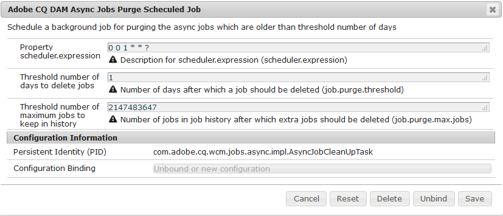

# 非同期操作 {#asynchronous-operations}

Adobe Experience Manger（AEM）Assets では、パフォーマンスを悪化させないために、長時間実行され、リソースを集中的に消費する特定のアセット操作は、非同期的に処理されます。

このような操作には以下のようなものがあります。

* 多数のアセットの削除
* 多数の参照を含む複数のアセットまたはアセットの移動
* アセットメタデータの一括での書き出しまたは読み込み
* リモートAEMデプロイメントから、設定されたしきい値を超えるアセットを取得しています。

非同期処理では複数のジョブがエンキューされ、システムリソースの可用性に応じた順序でジョブが実行されます。

You can view the status of asynchronous jobs from the **[!UICONTROL Async Job Status]** page.

>[!NOTE]
>
>デフォルトでは、AEM Assets でのジョブは並行して実行されます。N を CPU コアの数とすると、デフォルトでは N/2 のジョブを並行して実行できます。ジョブキューのカスタム設定を使用するには、Web コンソールで「**Async Operation Default Queue**」設定を変更します。For more information, see [Queue Configurations](https://sling.apache.org/documentation/bundles/apache-sling-eventing-and-job-handling.html#queue-configurations).

## 非同期操作のステータスの監視 {#monitoring-the-status-of-asynchronous-operations}

AEM Assets で非同期的に操作がおこなわれると、インボックスと電子メールに通知が届きます。

To view the status of the asynchronous operations in detail, navigate to the **[!UICONTROL Async Job Status]** page.

1. AEM のロゴをタップまたはクリックし、**[!UICONTROL アセット]**／**[!UICONTROL ジョブ]**&#x200B;に移動します。
1. In the **[!UICONTROL Async Job Status]** page, review the details of the operations.

   

   特定の操作の進行状況を確認するには、「**[!UICONTROL ステータス]**」列の値を参照します。進行状況に応じて、以下のいずれかのステータスが表示されます。

   **[!UICONTROL アクティブ]**：操作は処理中です。

   **[!UICONTROL 成功]**：操作は完了しました。

   **[!UICONTROL 失敗**[!UICONTROL &#x200B;または&#x200B;]**エラー]**：操作を処理できませんでした。

   **[!UICONTROL スケジュール済み]**：操作は後で処理するためにスケジュールされています。

1. アクティブな操作を停止するには、リストから対象の操作を選択し、ツールバーの「**[!UICONTROL 停止]**」アイコンをタップまたはクリックします。

   

1. 説明やログなど、その他の詳細を表示するには、操作を選択し、ツールバーの「**[!UICONTROL 開く]**」アイコンをタップまたはクリックします。

   

   ジョブの詳細ページが表示されます。

   

1. リストから操作を削除するには、ツールバーの「**[!UICONTROL 削除]**」を選択します。詳細を CSV ファイルでダウンロードするには、「**[!UICONTROL ダウンロード]**」アイコンをタップまたはクリックします。

   >[!NOTE]
   >
   >ステータスがアクティブまたは待機中のジョブは削除できません。

## 完了済みジョブのパージ {#purging-completed-jobs}

AEM Assets は、毎日午前 1 時にパージジョブを実行して、1 日以上経過した完了済みの非同期ジョブを削除します。

パージジョブのスケジュールと、完了済みジョブの詳細を削除するまでの保持期間を変更できます。また、任意の時点での詳細を保持する、完了済みジョブの最大数を設定することもできます。

1. AEM のロゴをタップまたはクリックし、**[!UICONTROL ツール]**／**[!UICONTROL 運営]**／**[!UICONTROL Web コンソール]**&#x200B;に移動します。
1. Open the **[!UICONTROL Adobe CQ DAM Async Jobs Purge Scheduled]** job.
1. 完了したジョブが削除されてからのしきい値と、詳細が履歴に保持されるジョブの最大数を指定します。

   
   *図：非同期ジョブの削除をスケジュールする設定*

1. 変更内容を保存します。

## 非同期処理のしきい値の設定 {#configuring-thresholds-for-asynchronous-processing}

AEM Assets が特定の操作を非同期的に処理する際の、アセットまたは参照の数のしきい値を設定できます。

### 非同期削除操作のしきい値の設定 {#configuring-thresholds-for-asynchronous-delete-operations}

削除するアセットまたはフォルダーの数がしきい値を超えると、削除操作が非同期的に実行されます。

1. AEM のロゴをタップまたはクリックし、**[!UICONTROL ツール]**／**[!UICONTROL 運営]**／**[!UICONTROL Web コンソール]**&#x200B;に移動します。
1. From the web console, open the **[!UICONTROL Async Delete Operation Job Processing]** configuration.
1. In the **[!UICONTROL Threshold number of assets]** box, specify the threshold number of assets/folders for asynchronous processing of delete operations.

   

1. 変更内容を保存します。

### 非同期移動操作のしきい値の設定 {#configuring-thresholds-for-asynchronous-move-operations}

移動するアセットやフォルダーまたは参照の数がしきい値を超えると、移動操作が非同期的に実行されます。

1. AEM のロゴをタップまたはクリックし、**[!UICONTROL ツール]**／**[!UICONTROL 運営]**／**[!UICONTROL Web コンソール]**&#x200B;に移動します。
1. From the web console, open the **[!UICONTROL Async Move Operation Job Processing]** configuration.
1. In the **[!UICONTROL Threshold number of assets/references]** box, specify the threshold number of assets/folders or references for asynchronous processing of move operations.

   

1. 変更内容を保存します。
