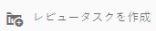
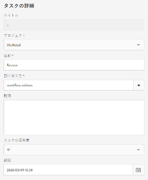
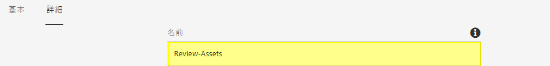
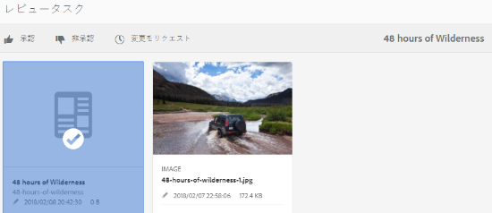
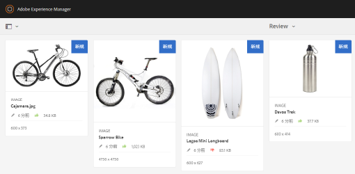
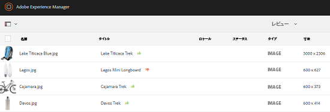
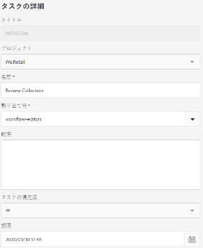
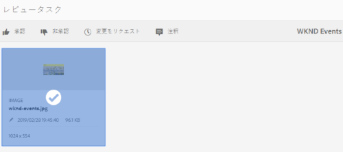
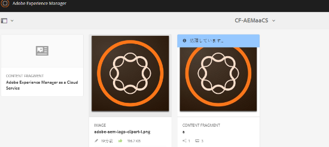
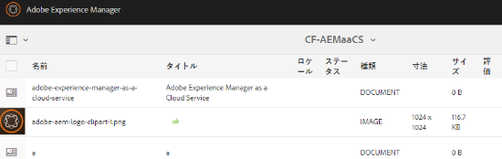

# フォルダー内およびコレクション内のアセットの確認 {#review-folder-assets-and-collections}

Adobe Experience Manager (AEM) Assets では、フォルダー内またはコレクション内のアセットに対してアドホックレビューワークフローを設定できます。それをレビュー担当者やクリエイティブパートナーと共有して、フィードバックを得ることができます。レビューワークフローをプロジェクトと関連付けることも、独立したレビュータスクを作成することもできます。

ユーザーがアセットを共有した後で、レビュー担当者がアセットを承認または拒否できます。ワークフローの様々なステージで、様々なタスクの完了に関する通知が対象の受信者に送られます。例えば、ユーザーがフォルダーまたはコレクションを共有すると、レビュー担当者は、フォルダーまたはコレクションがレビューのために共有されたという通知を受け取ります。

レビュー担当者がレビューを終了（アセットを承認または拒否）すると、ユーザーはレビューが完了したという通知を受け取ります。

## フォルダー用レビュータスクの作成  {#creating-a-review-task-for-folders}

1. Assets ユーザーインターフェイスで、レビュータスクを作成するフォルダーを選択します。
1. ツールバーで「**[!UICONTROL レビュータスクを作成]**」アイコンをタップまたはクリックして、**[!UICONTROL レビュータスク]**&#x200B;ページを開きます。ツールバーにこのアイコンが表示されていない場合は、「**[!UICONTROL その他]**」をタップまたはクリックしてアイコンを選択します。

   

1. （オプション）「**[!UICONTROL プロジェクト]**」リストから、レビュータスクを関連付けるプロジェクトを選択します。デフォルトでは、「**[!UICONTROL なし]**」オプションが選択されています。レビュータスクにプロジェクトを関連付けない場合は、この選択状態のままにします。

   >[!NOTE]
   >
   >エディターレベルの権限（またはそれ以上）のあるプロジェクトのみが「**[!UICONTROL プロジェクト]**」リストに表示されます。

1. レビュータスクの名前を入力し、「**[!UICONTROL 割り当て先]**」リストから承認者を選択します。

   >[!NOTE]
   >
   >選択されたプロジェクトのメンバーまたはグループが、承認者として「**[!UICONTROL 割り当て先]**」リストに表示されます。

1. レビュータスクの説明、タスクの優先順位および期限を入力します。

   

1. 「詳細」タブで、URI の作成に使用されるラベルを入力します。

   

1. 「**[!UICONTROL 送信]**」、「**[!UICONTROL 完了]**」の順にタップまたはクリックし、確認メッセージを閉じます。新しいタスクに関する通知が承認者に送信されます。
1. 承認者として AEM Assets にログインし、Assets UI に移動します。アセットを承認するには、**[!UICONTROL 通知]**&#x200B;アイコンをクリックまたはタップし、リストからレビュータスクを選択します。

   

1. **[!UICONTROL レビュータスク]**&#x200B;ページでレビュータスクの詳細を確認し、「**[!UICONTROL レビュー]**」をタップまたはクリックします。
1. **[!UICONTROL レビュータスク]**&#x200B;ページでアセットを選択し、必要に応じて&#x200B;**[!UICONTROL 「承認」または「非承認」]**&#x200B;アイコンをタップまたはクリックして、承認するか拒否します。

   

1. ツールバーの「**[!UICONTROL 完了]**」アイコンをタップまたはクリックします。ダイアログでコメントを入力し、「**[!UICONTROL 完了]**」をタップまたはクリックして確認します。
1. Assets UI に移動し、フォルダーを開きます。アセットの承認ステータスアイコンは、カード表示とリスト表示の両方に表示されます。

   **カード表示**

   

   **リスト表示**

   

## コレクション用レビュータスクの作成 {#creating-a-review-task-for-collections}

1. コレクションページで、レビュータスクを作成するコレクションを選択します。
1. ツールバーで「**[!UICONTROL レビュータスクを作成]**」アイコンをタップまたはクリックして、**[!UICONTROL レビュータスク]**&#x200B;ページを開きます。ツールバーにこのアイコンが表示されていない場合は、「**[!UICONTROL その他]**」をタップまたはクリックしてアイコンを選択します。

   

1. （オプション）「**[!UICONTROL プロジェクト]**」リストから、レビュータスクを関連付けるプロジェクトを選択します。デフォルトでは、「**[!UICONTROL なし]**」オプションが選択されています。レビュータスクにプロジェクトを関連付けない場合は、この選択状態のままにします。

   >[!NOTE]
   >
   >エディターレベルの権限（またはそれ以上）のあるプロジェクトのみが「**[!UICONTROL プロジェクト]**」リストに表示されます。

1. レビュータスクの名前を入力し、「**[!UICONTROL 割り当て先]**」リストから承認者を選択します。

   >[!NOTE]
   >
   >選択されたプロジェクトのメンバーまたはグループが、承認者として「**[!UICONTROL 割り当て先]**」リストに表示されます。

1. レビュータスクの説明、タスクの優先順位および期限を入力します。

   

1. 「**[!UICONTROL 送信]**」、「**[!UICONTROL 完了]**」の順にタップまたはクリックし、確認メッセージを閉じます。新しいタスクに関する通知が承認者に送信されます。
1. 承認者として AEM Assets にログインし、アセットコンソールに移動します。アセットを承認するには、**[!UICONTROL 通知]**&#x200B;アイコンをタップまたはクリックし、リストからレビュータスクを選択します。
1. **[!UICONTROL レビュータスク]**&#x200B;ページでレビュータスクの詳細を確認し、「**[!UICONTROL レビュー]**」をタップまたはクリックします。
1. コレクションのすべてのアセットがレビューページに表示されます。アセットを選択し、必要に応じて&#x200B;**[!UICONTROL 「承認」または「非承認」]**&#x200B;アイコンをタップまたはクリックして、アセットを承認するか拒否します。

   

1. ツールバーの「**[!UICONTROL 完了]**」アイコンをタップまたはクリックします。ダイアログでコメントを入力し、「**[!UICONTROL 完了]**」をタップまたはクリックして確認します。
1. コレクションコンソールに移動して、コレクションを開きます。アセットの承認ステータスアイコンは、カード表示とリスト表示の両方に表示されます。

   **カード表示**

   

   **リスト表示**

   

