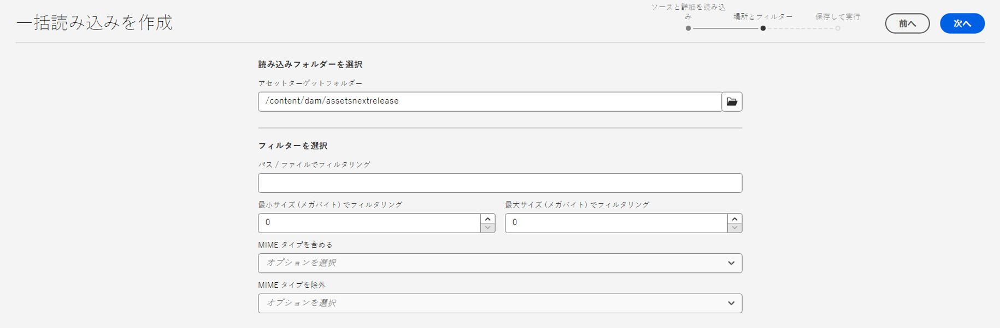
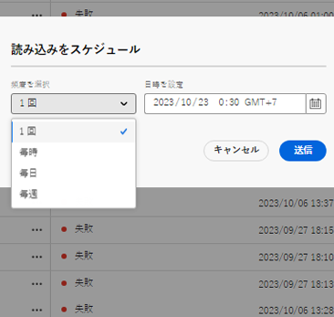
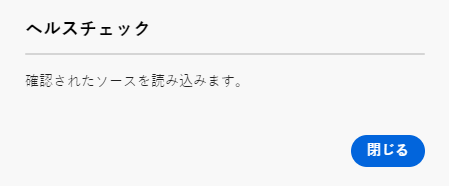
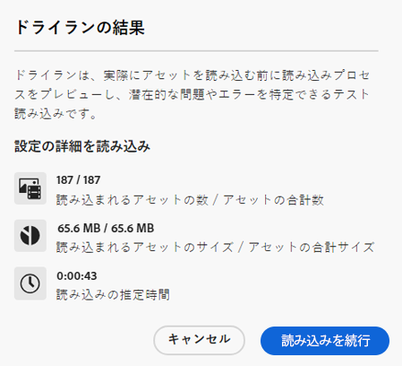

# Assets ビューを使用したアセットの一括読み込み  {#bulk-import-assets-view}

AEM Assets ビューの一括読み込みを使用すると、管理者はデータソースから AEM Assets に大量のアセットを読み込むことができます。管理者は、個々のアセットやフォルダーを AEM Assets にアップロードする必要がなくなりました。

>[!NOTE]
>
>Assets 表示の一括インポーターは、管理者表示の一括インポーターと同じバックエンドを使用します。 ただし、から読み込むデータソースが増え、ユーザーエクスペリエンスがより効率的になります。

次のデータソースからアセットを読み込むことができます。

* Azure
* AWS
* Google Cloud
* Dropbox
* OneDrive

>[!VIDEO](https://video.tv.adobe.com/v/3426857/?learn=on){transcript=true}

## 前提条件 {#prerequisites}

| データソース | 前提条件 |
|-----|------|
| Azure | <ul> <li>Azure ストレージアカウント </li> <li> Azure ブロブコンテナ <li> 認証モードに基づく Azure アクセスキーまたは SAS トークン </li></ul> |
| AWS | <ul> <li>AWS 地域 </li> <li> AWS バケット <li> AWS アクセスキー </li><li> AWS アクセスシークレット </li></ul> |
| Google Cloud | <ul> <li>GCP バケット </li> <li> GCP サービスアカウントメール <li> GCP サービスアカウントの秘密キー</li></ul> |
| Dropbox | <ul> <li>Dropbox のクライアント ID（アプリキー） </li> <li> Dropbox のクライアントシークレット（アプリシークレット）</li></ul> |
| OneDrive | <ul> <li>OneDrive テナント ID  </li> <li> OneDrive クライアント ID</li><li> OneDrive クライアントシークレット</li></ul> |

データソースに基づくこれらの前提条件に加えて、AEM Assets に読み込む必要があるすべてのアセットが含まれるデータソースで使用可能なソースフォルダー名を認識しておく必要があります。

## Dropbox 開発者アプリケーションの設定 {#dropbox-developer-application}

Dropbox アカウントからAEM Assets にアセットを読み込む前に、Dropbox 開発者アプリケーションを作成して設定します。

以下の手順を実行します。

1. [Dropbox アカウント](https://www.dropbox.com/developers)にログインし、「**[!UICONTROL アプリを作成]**」をクリックします。 Enterprise Dropbox アカウントを使用している場合は、コンテンツ管理者の役割へのアクセス権が必要です。

1. 「**[!UICONTROL API を選択]**」セクションで、使用可能なラジオボタンのみを選択します。

1. 「**[!UICONTROL 必要なアクセスのタイプを選択]**」セクションで、次のいずれかのオプションを選択します。

   * Dropbox アカウントで、アプリケーション内で作成された 1 つのフォルダーにアクセスする必要がある場合は、「**[!UICONTROL アプリフォルダー]**」を選択します。

   * Dropbox アカウント内のすべてのファイルおよびフォルダーにアクセスする必要がある場合は、「**[!UICONTROL 完全な Dropbox]**」を選択します。

1. アプリケーションの名前を指定し、「**[!UICONTROL アプリを作成]**」をクリックします。

1. アプリケーションの「**[!UICONTROL 設定]**」タブで、https://experience.adobe.com を「**[!UICONTROL リダイレクト URI]**」セクションに追加します。

1. 「**[!UICONTROL アプリキー]**」および「**[!UICONTROL アプリシークレット]**」フィールドの値をコピーします。これらの値は、AEM Assets で一括読み込みツールを設定する際に必要になります。

1. 「**[!UICONTROL 権限]**」タブで、「**[!UICONTROL 個々のスコープ]**」セクションに次の権限を追加します。

   * account_info.read

   * files.metadata.read

   * files.content.read

   * files.content.write

1. 「**[!UICONTROL 送信]**」をクリックして、変更を保存します。

## OneDrive 開発者アプリケーションの設定 {#onedrive-developer-application}

OneDrive アカウントから AEM Assets にアセットを読み込む前に、OneDrive 開発者アプリケーションを作成して設定します。

### アプリケーションの作成

1. [OneDrive アカウント](https://portal.azure.com/#view/Microsoft_AAD_RegisteredApps/ApplicationsListBlade)にログインして「**[!UICONTROL 新規登録]**」をクリックします。

1. アプリケーションの名前を指定し、「**[!UICONTROL サポートされるアカウントのタイプ]**」で「**[!UICONTROL この組織ディレクトリのアカウントのみ（アドビのみ - シングルテナント）]**」を選択します。

1. 次の手順を実行して、リダイレクト URI を追加します。

   1. **[!UICONTROL プラットフォームを選択]**&#x200B;ドロップダウンメニューで、「**[!UICONTROL Web]**」を選択します。

   1. https://experience.adobe.com を「**[!UICONTROL リダイレクト URI]**」セクションに追加します。
   <!-- Add the first URI and click **[!UICONTROL Configure]** to add it. You can add more by clicking **[!UICONTROL Add URI]** option available in the **[!UICONTROL Web]** section on the **[!UICONTROL Authentication]** page. -->

1. 「**[!UICONTROL 登録]**」をクリックします。アプリケーションが正常に作成されます。

1. 「**[!UICONTROL アプリケーション（クライアント）ID]**」および「**[!UICONTROL ディレクトリ（テナント）ID]**」フィールドの値をコピーします。これらの値は、AEM Assets で一括読み込みツールを設定する際に必要になります。

1. 「**[!UICONTROL クライアント資格情報]**」オプションに対応する「**[!UICONTROL 証明書または秘密鍵を追加]**」をクリックします。

1. 「**[!UICONTROL 新しいクライアント秘密鍵]**」をクリックし、クライアント秘密鍵の説明と有効期限を指定して、「**[!UICONTROL 追加]**」をクリックします。

1. クライアントシークレットを作成したら、「**[!UICONTROL 値]**」フィールドをコピーします（「シークレット ID」フィールドはコピーしないでください）。これは、AEM Assets で一括読み込みを設定する際に必要になります。

### API 権限の追加

次の手順を実行して、アプリケーションの API 権限を追加します。

1. 左側のウィンドウで「**[!UICONTROL API 権限]**」、「**[!UICONTROL 権限を追加]**」の順にクリックします。
1. **[!UICONTROL Microsoft Graph]**／**[!UICONTROL 委任された権限]**&#x200B;をクリックします。「**[!UICONTROL 権限を選択]**」セクションに、使用可能な権限が表示されます。
1. 「`OpenId permissions` の `offline_access` 権限」および「`Files` の `Files.ReadWrite.All` 権限」を選択します。
1. 「**[!UICONTROL 権限を追加]**」をクリックして更新内容を保存します。

## 一括読み込み設定の作成 {#create-bulk-import-configuration}

[!DNL Experience Manager Assets] に一括読み込み設定を作成するには、次の手順を実行します。

1. 左側のパネルで「**[!UICONTROL 一括読み込み]**」をクリックし、「**[!UICONTROL 読み込みを作成]**」をクリックします。
1. データソースを選択します。使用可能なオプションには、**[!UICONTROL Azure]**、**[!UICONTROL AWS]**、**[!UICONTROL Google Cloud]**、**[!UICONTROL Dropbox]**、**[!UICONTROL OneDrive]** が含まれます。
1. 「**[!UICONTROL 名前]**」フィールドで一括読み込み設定の名前を指定します。
1. [前提条件](#prerequisites)で説明しているように、データソース固有の資格情報を指定します。
1. 「**[!UICONTROL ソースフォルダー]**」フィールドでデータソースのアセットを含むルートフォルダーの名前を指定します。

   >[!NOTE]
   >
   >データソースとして Dropbox を使用している場合は、次のルールに基づいてソースフォルダーのパスを指定します。
   >* Dropbox のアプリケーションと、`https://www.dropbox.com/home/bulkimport-assets` にあるアセットを含むフォルダーの作成中に、「**完全な Dropbox**」を選択した場合は、「**[!UICONTROL ソースフォルダー]**」フィールドで `bulkimport-assets` を指定します。
   >* Dropbox のアプリケーションと、`https://www.dropbox.com/home/Apps/BulkImportAppFolderScope/bulkimport-assets` にあるアセットを含むフォルダーの作成中に、「**アプリのフォルダー**」を選択した場合は、「**[!UICONTROL ソースフォルダー]**」フィールドで `bulkimport-assets` を指定します。ここで `BulkImportAppFolderScope` は、アプリケーションの名前を指します。ここでは、`Apps` が `home` の後に自動的に追加されます。

   >[!NOTE]
   >
   >データソースとして OneDrive を使用している場合は、次のルールに基づいてソースフォルダーのパスを指定します。
   >* ドメインを含まないルートフォルダー名のみを指定します。フォルダーの完全な URL パスが `https://my.sharepoint.com/my?id=/personal/user/Documents/Importfolder/` の場合は、「**[!UICONTROL ソースフォルダー]**」フィールドで `/Importfolder/` を指定します。
   >* フォルダー名にスペースで区切られた複数の単語が含まれている場合は、一括読み込み設定でスペースを含む名前を指定します。
   >* ソースフォルダーは、ディレクトリのルートに配置する必要があります。フォルダーパスはサポートされていません。

1. （オプション）ファイルが Experience Manager Assets に読み込まれた後、ソースデータストアから元のファイルを削除するには、「**[!UICONTROL 読み込み後にソースファイルを削除]**」オプションを選択します。
1. 「**[!UICONTROL 読み込みモード]**」を選択します。「**[!UICONTROL スキップ]**」、「**[!UICONTROL 置換]**」または「**[!UICONTROL バージョンを作成]**」を選択します。スキップモードがデフォルトです。このモードでは、アセットが既に存在する場合は、取得をスキップします。
   

1. （オプション）「**[!UICONTROL メタデータファイル]**」フィールドに、CSV 形式で読み込むメタデータファイルを指定します。メタデータソースファイルは、ソースフォルダー内に指定する必要があります。「**[!UICONTROL 次へ]**」をクリックして、**[!UICONTROL 場所とフィルター]**&#x200B;に移動します。

   >[!NOTE]
   >
   >組織のセキュリティルールに応じて、このアプリケーションが一括読み込みツールに接続するためには、管理者の同意が必要になる場合があります。これが必要な場合は、一括読み込み設定を保存する前に管理者が同意する必要があります。

1. 「 **[!UICONTROL アセットのターゲットフォルダー]**」フィールドを使用して、アセットの読み込み先となる DAM 内の場所を定義するパスを指定します。例：`/content/dam/imported_assets`
1. （オプション）「**[!UICONTROL フィルターを選択]**」セクションで、アセットの最小ファイルサイズを MB 単位で指定して、「**[!UICONTROL 最小サイズでフィルター]**」フィールドの取り込みプロセスにアセットを含めます。
1. （オプション）アセットの最大ファイルサイズを MB 単位で指定して、「**[!UICONTROL 最大サイズでフィルター]**」フィールドの取り込みプロセスにアセットを含めます。
1. （オプション）「**[!UICONTROL MIME タイプを含める]**」フィールドを使用して、取り込みプロセスに含める MIME タイプを選択します。このフィールド内で複数の MIME タイプを選択できます。値を定義しない場合、すべての MIME タイプが取り込みプロセスに含まれます。

1. （オプション）「**[!UICONTROL MIME タイプを除外]**」フィールドを使用して、取り込みプロセスで除外する MIME タイプを選択します。このフィールド内で複数の MIME タイプを選択できます。値を定義しない場合、すべての MIME タイプが取り込みプロセスに含まれます。

   

1. 「**[!UICONTROL 次へ]**」をクリックします。環境設定に応じて、次のいずれかのオプションを選択します。

   * **[!UICONTROL 読み込みを保存]**：後で実行できるように現在の設定を保存します。
   * **[!UICONTROL 保存して読み込みを実行]**：設定を保存し、一括読み込みを実行します。
   * **[!UICONTROL 読み込みを保存してスケジュール]**：設定を保存し、後で一括読み込みを実行するようにスケジュールします。一括読み込みの頻度を選択し、読み込みの日時を設定できます。一括読み込みは、選択した頻度で、設定した日時に実行されます。

   

1. 「**[!UICONTROL 保存]**」をクリックして、選択したオプションを実行します。

### 一括読み込み時のファイル名の処理 {#filename-handling-bulkimport-assets-view}

アセットやフォルダーを一括で読み込む場合、[!DNL Experience Manager Assets] は、インポートソースに存在する情報の構造全体を読み込みます。[!DNL Experience Manager] は、アセット名とフォルダー名に含まれる特殊文字に対する組み込みルールに従うので、これらのファイル名のサニタイズが必要になります。フォルダー名とアセット名の両方について、ユーザーが定義したタイトルは変更されず、`jcr:title` に保存されます。

一括読み込み時に、[!DNL Experience Manager] は、既存のフォルダーを探してアセットやフォルダーの再読み込みを避けると共に、読み込みが行われる親フォルダーに適用されるサニタイズルールを検証します。親フォルダーにサニタイズルールが適用される場合、インポートソースにも同じルールが適用されます。新規読み込みの場合、アセットやフォルダーのファイル名を管理するために、次のサニタイズルールが適用されます。

一括読み込み時の禁止名、アセット名の処理、フォルダー名の処理について詳しくは、 [管理ビューでの一括インポート中のファイル名の処理](add-assets.md##filename-handling-bulkimport).

## 既存の一括読み込み設定を表示 {#view-import-configuration}

既存の一括読み込みを表示するには、左側のパネルで「**[!UICONTROL 一括読み込み]**」オプションを選択します。一括読み込みページが表示され、**[!UICONTROL 実行された読み込み]**&#x200B;のリストが表示されます。 
また、ドロップダウンオプションから**[!UICONTROL 保存された読み込み]**&#x200B;および&#x200B;**[!UICONTROL 定期インポート]**&#x200B;を表示することもできます。

## 一括読み込み設定を編集 {#edit-import-configuration}

設定の詳細を編集するには、設定名に対応する  をクリックし、「**[!UICONTROL 編集]**」をクリックします。編集操作の実行中は、設定のタイトルとデータソースの読み込みを編集することはできません。「実行された読み込み」タブ、「スケジュールされた読み込み」タブまたは「保存された読み込み」タブを使用して、設定を編集できます。

## 1 回限りの読み込みまたは繰り返しの読み込みのスケジュール設定 {#schedule-imports}

1 回限りの一括読み込みまたは繰り返しの一括読み込みをスケジュール設定するには、次の手順に従います。

1. 「**[!UICONTROL 実行された読み込み]**」タブまたは「**[!UICONTROL 保存された読み込み]**」タブで使用可能な設定名に対応する  をクリックし、「**[!UICONTROL スケジュール]**」をクリックします。また、「**[!UICONTROL 定期インポート]**」タブに移動し、「**[!UICONTROL スケジュール]**」をクリックして、既存の定期インポートを再スケジュールすることもできます。

1. 1 回限りの取り込みを設定するか、1 時間ごと、1 日ごと、または 1 週間ごとのスケジュールを設定します。「**[!UICONTROL 送信]**」をクリックします。

   

## 読み込みのヘルスチェックを実行 {#import-health-check}

データソースへの接続を検証するには、設定名に対応する 、**[!UICONTROL チェック]**&#x200B;の順にクリックします。接続に成功すると、Experience Manager Assets に次のメッセージが表示されます。

## 読み込みを実行する前にドライランを実行 {#dry-run-bulk-import}

設定名に対応する  をクリックし、「**[!UICONTROL ドライラン]**」をクリックして、一括読み込みジョブのテスト実行を呼び出します。Experience Manager Assets には、一括読み込みジョブに関する次の詳細が表示されます。

## 一括読み込みを実行 {#run-bulk-import}

設定の作成中に読み込みを保存した場合は、「保存された読み込み」タブに移動して、その設定に対応する  アイコンをクリックし、「**[!UICONTROL 実行]**」をクリックします。

同様に、既に実行された読み込みを実行する必要がある場合は、「実行された読み込み」タブに移動して、設定名に対応する  をクリックし、「**[!UICONTROL 実行]**」をクリックします。

## 進行中の読み込みの停止またはスケジュール {#schedule-stop-ongoing-report}

読み込み中に一括読み込みホームページに表示される一括読み込みステータスダイアログを使用して、進行中の一括読み込みをスケジュールまたは停止できます。

また、「**[!UICONTROL アセットを表示]**」をクリックして、ターゲットフォルダーに読み込まれたアセットを表示することもできます。

## 一括読み込み設定を削除 {#delete-bulk-import-configuration}

「**[!UICONTROL 実行された読み込み]**」タブ、「**[!UICONTROL 定期インポート]**」タブまたは「**[!UICONTROL 保存された読み込み]**」タブに存在し、設定名に対応する  をクリックし、「**[!UICONTROL 削除]**」をクリックして一括読み込み設定を削除します。

## 一括読み込みの実行後のアセットへの移動 {#view-assets-after-bulk-import}

一括読み込みジョブの実行後にアセットが読み込まれる Assets のターゲット場所を表示するには、設定名に対応する  をクリックして、「**[!UICONTROL アセットを表示]**」をクリックします。
