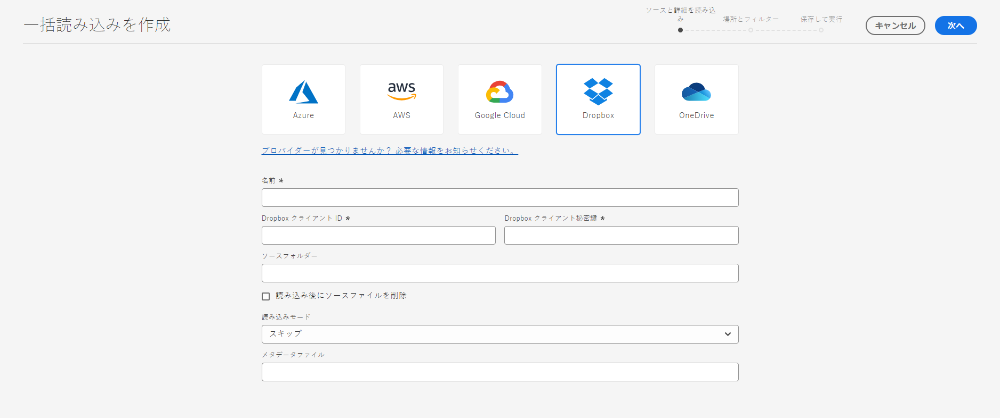
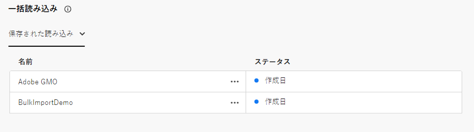
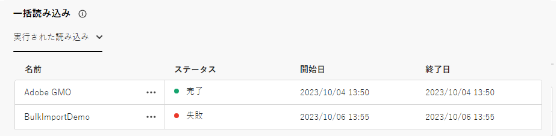
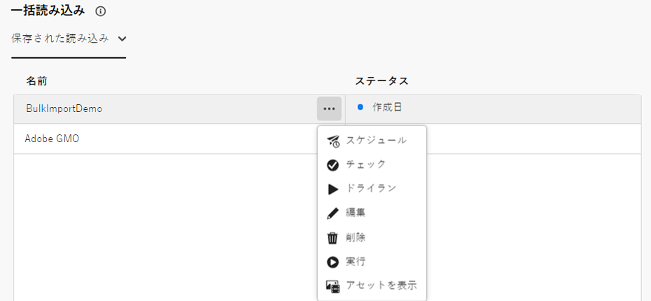

# Assets ビューを使用したアセットの一括読み込み  {#bulk-import-assets-view}

AEM Assets表示での一括読み込みを使用すると、管理者は、データソースからAEM Assetsに大量のアセットを読み込むことができます。 管理者は、個々のアセットやフォルダーをAEM Assetsにアップロードする必要はありません。

>[!NOTE]
>
>Assets 表示の一括インポーターは、管理者表示の一括インポーターと同じバックエンドを使用します。 ただし、から読み込むデータソースが増え、ユーザーエクスペリエンスがより効率的になります。

次のデータソースからアセットを読み込むことができます。

* Azure
* AWS
* Google Cloud
* Dropbox

## 前提条件 {#prerequisites}

| データソース | 前提条件 |
|-----|------|
| Azure | <ul> <li>Azure ストレージアカウント </li> <li> Azure ブロブコンテナ <li> 認証モードに基づく Azure Access Key または SAS トークン </li></ul> |
| AWS | <ul> <li>AWS 地域 </li> <li> AWS バケット <li> AWS アクセスキー </li><li> AWS アクセスシークレット </li></ul> |
| Google Cloud | <ul> <li>GCP バケット </li> <li> GCP サービスアカウントメール <li> GCP サービスアカウントの秘密キー</li></ul> |
| Dropbox | <ul> <li>Dropboxクライアント ID </li> <li> Dropboxクライアント秘密鍵</li></ul> |

データソースに基づく前述の前提条件に加えて、AEM Assetsに読み込む必要のあるすべてのアセットが含まれる、データソースで使用可能なソースフォルダー名を把握しておく必要があります。

## 一括読み込み設定の作成 {#create-bulk-import-configuration}

一括読み込み設定を作成するには、次の手順を実行します。

1. に移動します。 **[!UICONTROL 設定]** > **[!UICONTROL 一括読み込み]** をクリックします。 **[!UICONTROL インポートを作成]**.
1. データソースを選択します。 利用可能なオプションには、Azure、AWS、Google Cloud、Dropboxが含まれます。
1. で一括読み込み設定の名前を指定します。 **[!UICONTROL 名前]** フィールドに入力します。
1. データソース固有の資格情報を指定します ( [前提条件](#prerequisites).
1. 「**[!UICONTROL ソースフォルダー]**」フィールドでデータソースのアセットを含むルートフォルダーの名前を指定します。
1. （オプション） **[!UICONTROL インポート後にソースファイルを削除]** 「 」オプションを使用して、ファイルをExperience Manager Assetsに読み込んだ後で、元のファイルをソースデータストアから削除できます。
1. 「**[!UICONTROL 読み込みモード]**」を選択します。「**[!UICONTROL スキップ]**」、「**[!UICONTROL 置換]**」または「**[!UICONTROL バージョンを作成]**」を選択します。スキップモードがデフォルトです。このモードでは、アセットが既に存在する場合、取り込みをスキップして読み込みます。
   

1. （オプション）読み込むメタデータファイルを CSV 形式で指定し、「メタデータファイル」フィールドで「 **[!UICONTROL 次へ]** に移動します。 **[!UICONTROL 場所とフィルター]**.
1. を使用してアセットが読み込まれる DAM 内の場所を定義するには、以下を実行します。 **[!UICONTROL アセットのターゲットフォルダー]** 「 」フィールドで、パスを指定します。 例：`/content/dam/imported_assets`
1. （オプション） **[!UICONTROL フィルターを選択]** 「 」セクションでは、アセットの最小ファイルサイズを MB 単位で指定し、アセットが **[!UICONTROL 最小サイズでフィルター]** フィールドに入力します。
1. （オプション）アセットの最大ファイルサイズを MB 単位で指定して、「**[!UICONTROL 最大サイズでフィルター]**」フィールドの取り込みプロセスにアセットを含めます。
1. （オプション）取り込みプロセスに含める MIME タイプを、 **[!UICONTROL MIME タイプを含める]** フィールドに入力します。 このフィールド内で複数の MIME タイプを選択できます。 値を定義しない場合、すべての MIME タイプが取り込まれます。

1. （オプション）取り込みプロセスで、 **[!UICONTROL MIME タイプを除外]** フィールドに入力します。 このフィールド内で複数の MIME タイプを選択できます。 値を定義しない場合、すべての MIME タイプが取り込まれます。

   

1. 「**[!UICONTROL 次へ]**」をクリックします。選択 **[!UICONTROL インポートを保存して実行]** 設定を保存し、一括読み込みを実行します。 選択 **[!UICONTROL インポートを保存]** 設定を保存して後で実行できるようにする。

   

1. クリック **[!UICONTROL 保存]** をクリックして、選択したオプションを実行します。

### 一括読み込み時のファイル名の処理 {#filename-handling-bulkimport-assets-view}

アセットやフォルダーを一括で読み込む場合、[!DNL Experience Manager Assets] は、インポートソースに存在する情報の構造全体を読み込みます。[!DNL Experience Manager] は、アセット名とフォルダー名に含まれる特殊文字に対する組み込みルールに従うので、これらのファイル名のサニタイズが必要になります。フォルダー名とアセット名の両方について、ユーザーが定義したタイトルは変更されず、`jcr:title` に保存されます。

一括読み込み時に、[!DNL Experience Manager] は、既存のフォルダーを探してアセットやフォルダーの再読み込みを避けると共に、読み込みが行われる親フォルダーに適用されるサニタイズルールを検証します。親フォルダーにサニタイズルールが適用される場合、インポートソースにも同じルールが適用されます。新規読み込みの場合、アセットやフォルダーのファイル名を管理するために、次のサニタイズルールが適用されます。

一括読み込み時の禁止名、アセット名の処理、フォルダー名の処理について詳しくは、 [管理ビューでの一括インポート中のファイル名の処理](add-assets.md##filename-handling-bulkimport).

## 既存の一括インポート設定を表示 {#view-import-configuration}

設定を作成後に保存することを選択した場合は、設定が「 **[!UICONTROL 保存済みのインポート]** タブをクリックします。

インポートを保存して実行する場合、インポート設定が **[!UICONTROL 実行されたインポート]** タブをクリックします。

インポートをスケジュールすると、 **[!UICONTROL 予定インポート]** タブをクリックします。

## 一括読み込み設定の編集 {#edit-import-configuration}

設定の詳細を編集するには、設定名に対応する「 ... 」をクリックし、 **[!UICONTROL 編集]**. 編集操作の実行中は、設定のタイトルとデータソースの読み込みを編集することはできません。「実行済み」、「スケジュール済み」または「保存済みのインポート」タブを使用して、設定を編集できます。

## 1 回限りのインポートまたは定期的なインポートのスケジュール設定 {#schedule-imports}

1 回限りの一括読み込みまたは繰り返しの一括読み込みをスケジュール設定するには、次の手順に従います。

1. 「 ... 」をクリックし、 **[!UICONTROL 実行されたインポート]** または **[!UICONTROL 保存済みのインポート]** タブをクリックし、 **[!UICONTROL スケジュール]**. また、に移動して、既存のスケジュール済みインポートのスケジュールを変更することもできます。 **[!UICONTROL 予定インポート]** タブとクリック **[!UICONTROL スケジュール]**.

1. 1 回限りの取得を設定するか、1 時間ごと、1 日ごと、または 1 週間ごとのスケジュールを設定します。「**[!UICONTROL 送信]**」をクリックします。

   

## インポートヘルスチェックを実行する {#import-health-check}

データソースへの接続を検証するには、設定名に対応する「 ... 」をクリックし、「 」をクリックします。 **[!UICONTROL チェック]**. 接続に成功すると、Experience Manager Assetsに次のメッセージが表示されます。

## インポートを実行する前にドライランを実行する {#dry-run-bulk-import}

設定名に対応する「 ... 」をクリックし、「 」をクリックします。 **[!UICONTROL ドライラン]** をクリックして、一括読み込みジョブのテスト実行を呼び出します。 Experience Manager Assetsには、一括読み込みジョブに関する次の詳細が表示されます。

## 一括インポートの実行 {#run-bulk-import}

設定の作成時にインポートを保存した場合は、「保存済みのインポート」タブに移動し、設定に対応する「 ... 」をクリックして、「 」をクリックします。 **[!UICONTROL 実行]**.

同様に、既に実行済みのインポートを実行する必要がある場合は、「実行済みのインポート」タブに移動し、設定名に対応する「 ... 」をクリックして、 **[!UICONTROL 実行]**.

## 進行中のインポートを停止またはスケジュール {#schedule-stop-ongoing-report}

インポート中に一括インポートホームページに表示される一括インポートステータスダイアログを使用して、進行中の一括インポートをスケジュールまたは停止できます。

また、ターゲットフォルダーに読み込まれたアセットを表示するには、 **[!UICONTROL アセットを表示]**.

## 一括読み込み設定の削除 {#delete-bulk-import-configuration}

次に示す設定名に対応する「 ... 」をクリックします。 **[!UICONTROL 実行されたインポート]**, **[!UICONTROL 予定インポート]**&#x200B;または **[!UICONTROL 保存済みのインポート]** タブとクリック **[!UICONTROL 削除]** をクリックして、一括読み込み設定を削除します。

## 一括読み込みの実行後にアセットに移動する {#view-assets-after-bulk-import}

一括読み込みジョブの実行後にアセットが読み込まれる Assets のターゲット位置を表示するには、設定名に対応する「 ... 」をクリックし、 **[!UICONTROL アセットを表示]**.

