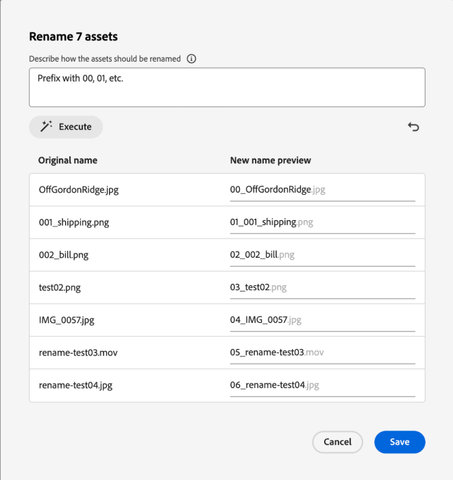

# [!DNL Assets view] でのアセットまたはフォルダーの名前の変更 {#rename-single-asset-or-folder}

名前を変更すると、コンテンツや場所を変更せずにアセットを整理、分類および識別しやすくなります。 選択 [!DNL Assets view] たアセットまたはフォルダーの名前を変更できます。

アセットまたはフォルダーの名前を変更するには、次の手順を実行します。

1. 名前を変更するアセットまたはフォルダーを見つけます。

1. アセットまたはフォルダーの名前を変更するには、次のいずれかの方法を使用します。

   * アセットまたはフォルダーを選択し、上部のメニューから **[!UICONTROL 名前を変更]** をクリックします。
   * アセットまたはフォルダーの `...` にある「その他」オプションをクリックし、「**[!UICONTROL 名前を変更]**」を選択します。
   * アセットまたはフォルダーのタイトルをクリックして、名前を変更します。 「**アセット名を変更**」テキストボックスに新しいテキストを入力し、「**保存**」をクリックします。 この機能は、グリッド、ギャラリー、ウォーターフォール、リストの各表示で利用できます。

## AI を利用したアセットの一括名前変更 {#rename-bulk-assets-using-ai}

[!DNL Assets view] では、AI を使用して複数のアセットの名前を一度に変更できます。 AI 一括名前変更機能は、フォルダーではなく、ファイルにのみ適用できます。 複数のファイルを一度に選択し、それらをまとめて名前を変更できます。

AI で生成されたプロンプトを使用して一度にアセットのバルク名を変更するには、次の手順に従います。

1. 複数のアセットを選択し、上部のメニューから **[!UICONTROL 一括名前変更]** をクリックします。

1. 選択したアセットの名前の変更方法を示すプロンプトを追加します。 [AI の一括名前変更の例 ](#examples-ai-bulk-rename) を参照してください。

1. **[!UICONTROL 実行]** をクリックして、プロンプトに示すように、AI がアセットの名前を変更できるようにします。

1. [ オプション ]  をクリックして、最後に実行したアクションを取り消したりキャンセルしたりします。

1. [!UICONTROL  新しい名前のプレビュー ] 列で変更を確認し、**[!UICONTROL 保存]** をクリックします。

   

## AI の一括名前変更の例 {#examples-ai-bulk-rename}

AI を使用して、AI プロンプトに基づいてアセットの名前を一括で変更する例を以下に示します。

* 00、01 などのプレフィックスと、今日の日付を示すサフィックス。
* すべてのファイルを「my-file」に変更し、増分数を追加します。
* プレフィックスとサフィックスを削除し、名前の中央の部分だけを残します。
* ファイルの前に 001、002 などを付けます。 英語に翻訳してください。

>[!VIDEO](https://video.tv.adobe.com/v/3440975)

>[!NOTE]
>
> * 絵文字をテキストに変換することはできません。
> * アセット名の変更時に警告メッセージが表示されないように、一意の名前を使用します。 ただし、新しい名前で再試行できます。
> * また、Unicode 文字や英数字以外の文字をテキストに変換することもできます。

## 次の手順 {#next-steps}

* [ビデオを視聴してアセットビューでのメタデータフォームの管理を学ぶ](https://experienceleague.adobe.com/docs/experience-manager-learn/assets-essentials/configuring/metadata-forms.html?lang=ja)

* アセットビューのユーザーインターフェイスの「[!UICONTROL フィードバック]」オプションを使用して製品に関するフィードバックを提供する

* 右側のサイドバーにある「[!UICONTROL このページを編集]」（）または「[!UICONTROL 問題を記録] 」（）を使用してドキュメントに関するフィードバックを提供する

* [カスタマーケア](https://experienceleague.adobe.com/ja?support-solution=General#support)に問い合わせる
