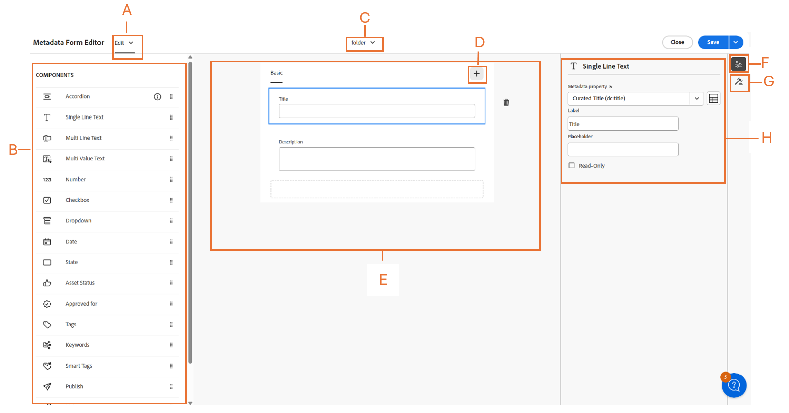
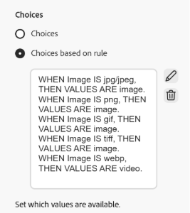

# カスケードメタデータAssets表示{#cascading-metadata-assets-view}

アセットのメタデータ情報を取得するときに、ユーザーは様々なフィールドに情報を指定します。他のフィールドで選択されているオプションに応じて、特定のメタデータフィールドやフィールド値を表示できます。こうした条件に応じたメタデータの表示は、カスケードメタデータと呼ばれます。つまり、特定のメタデータフィールドや値と、1 つ以上のフィールドまたはその値（あるいはその両方）との依存関係を作成できます。

メタデータFormsを使用して、カスケードメタデータを表示するルールを定義します。 例えば、メタデータフォームにアセットタイプフィールドが含まれている場合は、ユーザーが選択したアセットタイプに基づいて、表示するフィールドの関連セットを定義できます。

次に、カスケードメタデータを定義できるいくつかの使用例を示します。

* ユーザーの所在地が必要な場合に、ユーザーが選択した国および都道府県に基づいて、関連する都市名を表示します。
* ユーザーが選択した製品カテゴリに基づいて、関連するブランド名をリストに読み込みます。
* 別のフィールドで指定された値に基づいて、特定のフィールドの表示と非表示を切り替えます。例えば、ユーザーが別の住所への配送を希望した場合に、別の発送先住所フィールドを表示します。
* 別のフィールドに指定された値に基づいて、特定のフィールドを必須として指定します。
* 別のフィールドで指定された値に基づいて、特定のフィールドに表示されるオプションを変更します。
* 別のフィールドで指定された値に基づいて、特定のフィールドにデフォルトのメタデータ値を設定します。

>[!IMPORTANT]
>
>カスケードメタデータ機能は、限定提供（LA）機能として利用できます。 [アドビカスタマーサポートケースを作成および送信](https://helpx.adobe.com/jp/enterprise/using/support-for-experience-cloud.html)し、デプロイメントで有効にすることができます。

## [!DNL Experience Manager] でのカスケードメタデータの設定  {#configure-cascading-metadata-in-aem}

選択されたアセットタイプに基づいて、カスケードメタデータを表示するシナリオを検討します。例：

* ビデオの場合、形式やコーデック、長さなど、適用可能なフィールドを表示します。
* Word 文書や PDF ドキュメントの場合は、ページ数や作成者などのフィールドを表示します。

例として `Image` という名前のドロップダウンフィールドを使用して、画像タイプに基づいてファイルを分類します。 ドロップダウンには、サポートされる画像拡張機能（JPG/JPEG、GIFなど）を表すオプションが含まれます。 データの一貫性を確保し、サポートされていない形式が選択または処理されないようにするには、このフィールドに検証ルールを適用します。 ルールは、選択したドロップダウン値を評価し、受け入れられる画像形式に合わせて制約を適用します。

>[!IMPORTANT]
>
>ドロップダウンフィールドのみに基づいてルールを作成できます。

選択したアセットタイプに関係なく、著作権情報を必須フィールドとして表示します。 [ 定義済みのメタデータコンポーネント ](metadata-assets-view.md#property-components) および [ フォルダーへのメタデータの割り当て ](metadata-assets-view.md#assign-metadata-form-folder) を使用できます。

### メタデータFormsの構築 {#build-metadata-schema-forms}

新しいメタデータフォームを作成するには、次の手順を検討してください。

1. [!DNL Experience Manager] ロゴを選択し、**[!UICONTROL 設定]**/**[!UICONTROL メタデータForms]**/**[!UICONTROL 作成]** に移動します。

1. **[!UICONTROL タイプ]** ドロップダウンから、「**[!UICONTROL ファイル]**」、「**[!UICONTROL フォルダー]**」、「**[!UICONTROL コレクション]** のいずれかの適切なフォームタイプを選択します。

1. 「**[!UICONTROL 名前]**」フィールドでメタデータフォームのタイトルを指定します。

1. または、「**[!UICONTROL 既存のフォームテンプレートから選択]**」ドロップダウンから既存のメタデータフォームテンプレートを選択します。

1. 空のメタデータフォームが表示されます。 新規タブを追加します。

   

   * **A:** [!UICONTROL  編集 ] または [!UICONTROL  プレビュー ] を切り替える
   * **B:** [ メタデータフォームのコンポーネント ](metadata-assets-view.md#property-components)
   * **C:** 他のメタデータフォームへの切り替え
   * **D:** 新しいタブを追加
   * **E:** キャンバス
   * **F:** 選択したコンポーネントの一般設定
   * 「**G:** ルール」タブ
   * **H:** コンポーネントのプロパティ

このビデオでは、手順のシーケンス [ メタデータFormsの設定 ](https://video.tv.adobe.com/v/341275) を確認します。

### 既存のメタデータフォームの変更 {#modify-existing-metadata-form}

既存のメタデータフォームを変更するには、次の手順に従います。

1. 既存のメタデータフォームを開き、フォームに追加する [ 事前定義済みのコンポーネント ](metadata-assets-view.md#property-components) に移動して、キャンバスに要素をドロップします。

   **画像** のユースケースに従って、ドロップダウンフィールドを追加して画像アセットタイプを定義します。 **設定** で名前およびプロパティのパスを指定し、オプションでフィールドを **[!UICONTROL 読み取り専用]** または **[!UICONTROL 複数選択]** に設定します。

1. 手動で入力するか、JSON パスを指定するか、CSV ファイルを読み込むことで、ドロップダウンのキー値オプションを指定します。

   * 値を手動で指定するには、「選択肢 **[!UICONTROL の下の「]** 手動で追加 **[!UICONTROL 」を選択し]** 「`Add`」をクリックして、オプションのラベルと値を指定します。 例えば、ビデオ、PDF、画像の各アセットタイプを指定します。

     

   * JSON パスから値を取得するには、「**[!UICONTROL JSON パスで追加]** を選択し、JSON ファイルのパスを指定します。

     >[!NOTE]
     >
     >すべての DAM エディターおよび作成者がアクセスできる共有場所に JSON ファイルを必ず保存してください。

     

   * CSV から値を動的に取得するには、「**[!UICONTROL CSV を読み込み]** をクリックして、CSV ファイルのパスを指定します。 [!DNL Experience Manager] は、フォームがユーザーに提供されたときに、キーと値のペアをリアルタイムで取得します。

     

   >[!NOTE]
   > 
   >両方のオプションは相互に排他的なので、CSV ファイルからオプションを読み込んで手動で編集することはできません。

1. 画像フィールドとその他のフィールド間の依存関係を作成するには、依存フィールドを選択して「**[!UICONTROL ルール]**」タブを開きます。 各コンポーネントは、特定のルールセットをサポートしています。 このユースケースでは、画像アセットタイプのオプションを使用してルールロジックを定義します。

   <!---->

   <!---->

1. **[!UICONTROL 必須]** で、「**[!UICONTROL 新しいルールに基づいて必須]**」オプションを選択します。  をクリックして、新しいルールを追加します。

   

   現在のユースケースでは、画像アセットの形式がJPG/JPEG、PNG、GIF、TIFFまたは WEBP の場合に、「アセットタイプ」フィールドは必須です。 さらに、 をクリックしてルールを再定義するか、 をクリックして定義済みのルールを削除します。

   

1. **[!UICONTROL 表示]** で、「**[!UICONTROL 表示、新しいルールに基づく]**」オプションを選択します。  をクリックして、新しいルールを追加します。

   >[!NOTE]
   >
   >**[!UICONTROL 要件]** 条件と **[!UICONTROL 表示]** 条件は互いに独立して適用できます。

   

   現在のユースケースでは、画像アセットの形式がJPG/JPEG、PNG またはGIFの場合に、「アセットタイプ」フィールドが表示されます。 さらに、 をクリックしてルールを再定義するか、 をクリックして定義済みのルールを削除します。

   

1. **[!UICONTROL ルールに基づいた選択肢]** を選択して、依存関係を作成し、ルールを定義します。  をクリックして、新しいルールを追加します。

   

   アセットタイプ ドロップダウンのルールベースの選択肢を設定するには、ルールを作成し、依存フィールドとして画像を設定します。 次に、JPG/JPEG、PNG、GIF、TIFFの画像を選択し、WEBP のビデオを選択することで、各画像形式の表示値を定義し、関連するオプションを動的に表示するために、各形式で意図された値のみがチェックされるようにします。 さらに、 をクリックしてルールを再定義するか、 をクリックして定義済みのルールを削除します。

   

1. 同様に、この手順を繰り返して、「[!UICONTROL  アセットタイプ ]」フィールドのPDFや Word など他のアセットと、「[!UICONTROL  ページ数 ]」や「[!UICONTROL  作成者 ] などのフィールドとの依存関係を作成します。

1. 「**[!UICONTROL 保存]**」をクリックします。メタデータフォームをフォルダーに適用します。

1. メタデータフォームを適用したフォルダーに移動し、アセットのプロパティページを開きます。 「アセットの種類」フィールドでの選択に応じて、関連するカスケードメタデータのフィールドが表示されます。

   

>[!NOTE]
> 
>Assets ビューアカウントのカスケードメタデータに早期にアクセスするには、[Adobe カスタマーサポートケースを作成して送信 ](https://helpx.adobe.com/jp/enterprise/using/support-for-experience-cloud.html) します。

## 次の手順 {#next-steps}

* [ビデオを視聴してアセットビューでのメタデータフォームの管理を学ぶ](https://experienceleague.adobe.com/docs/experience-manager-learn/assets-essentials/configuring/metadata-forms.html?lang=ja)

* アセットビューのユーザーインターフェイスの「[!UICONTROL フィードバック]」オプションを使用して製品に関するフィードバックを提供する

* 右側のサイドバーにある「[!UICONTROL このページを編集]」（）または「[!UICONTROL 問題を記録] 」（）を使用してドキュメントに関するフィードバックを提供する

* [カスタマーケア](https://experienceleague.adobe.com/ja?support-solution=General#support)に問い合わせる
