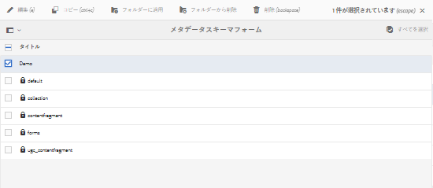
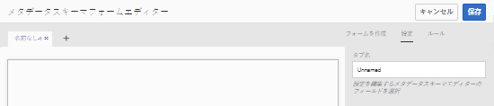
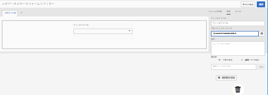
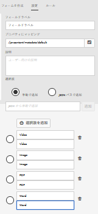
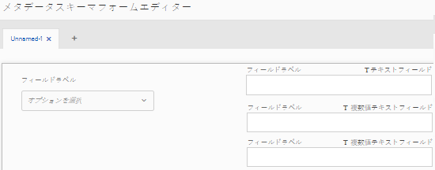
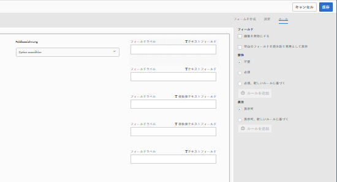
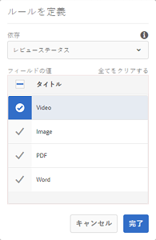
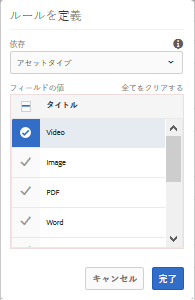
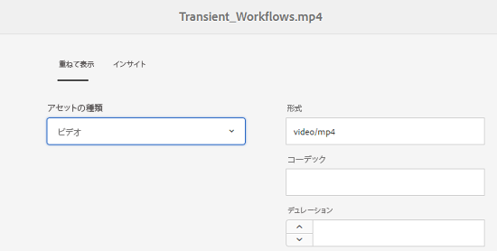
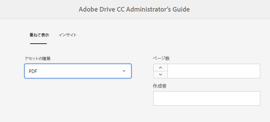

# カスケードメタデータ {#cascading-metadata}

アセットのメタデータ情報を取得するときに、ユーザーは様々なフィールドに情報を指定します。他のフィールドで選択されているオプションに応じて特定のメタデータフィールドやフィールド値を表示できます。こうした条件に応じたメタデータの表示は、カスケードメタデータと呼ばれます。つまり、特定のメタデータフィールドや値と、1 つ以上のフィールドまたはその値（あるいはその両方）との依存関係を作成できます。

メタデータスキーマを使用して、カスケードメタデータを表示するルールを定義します。例えば、メタデータスキーマにアセットタイプフィールドが含まれている場合は、ユーザーが選択したアセットタイプに基づいて、表示するフィールドの関連セットを定義できます。

次に、カスケードメタデータを定義できるいくつかの使用例を示します。

* ユーザーの場所が必要な場合に、ユーザーが選択した国および都道府県に基づいて、関連する都市名を表示します。
* ユーザーが選択した製品カテゴリに基づいて、関連するブランド名をリストに読み込みます。
* 別のフィールドに指定された値に基づいて、特定のフィールドの表示と非表示を切り替えます。例えば、ユーザーが別の住所への配送を希望した場合に、別の発送先住所フィールドを表示します。
* 別のフィールドに指定された値に基づいて、特定のフィールドを必須として指定します。
* 別のフィールドに指定された値に基づいて、特定のフィールドに表示されるオプションを変更します。
* 別のフィールドに指定された値に基づいて、特定のフィールドにデフォルトのメタデータ値を設定します。

## AEM でのカスケードメタデータの設定 {#configure-cascading-metadata-in-aem}

選択されたアセットタイプに基づいて、カスケードメタデータを表示するシナリオを検討します。いくつかの例を示します。

* ビデオの場合、形式やコーデック、期間など、適用可能なフィールドを表示します。
* Word 文書や PDF ドキュメントの場合は、ページ数や作成者などのフィールドを表示します。

選択したアセットタイプに関係なく、著作権情報を必須フィールドとして表示します。

1. AEM のロゴをタップまたはクリックし、**[!UICONTROL ツール]**／**[!UICONTROL アセット]**／**[!UICONTROL メタデータスキーマ]**&#x200B;に移動します。
1. **[!UICONTROL スキーマフォーム]**&#x200B;ページでスキーマフォームを選択し、ツールバーの「**[!UICONTROL 編集]**」をタップまたはクリックしてスキーマを編集します。

   

1. （オプション）メタデータスキーマエディターで、条件化する新しいフィールドを作成します。「**[!UICONTROL 設定]**」タブで、名前およびプロパティのパスを指定します。

   新しいタブを作成するには、「`+`」をタップまたはクリックしてタブを追加し、メタデータフィールドを追加します。

   

1. アセットタイプのドロップダウンフィールドを追加します。「**[!UICONTROL 設定]**」タブで、名前およびプロパティのパスを指定します。オプションの説明を追加します。

   

1. キーと値のペアは、フォームユーザーに提供されるオプションです。キーと値のペアは手動でも JSON ファイルからも指定できます。

   * 値を手動で指定するには、「**[!UICONTROL 手動で追加]**」を選択し、「**[!UICONTROL 選択肢を追加]**」をタップまたはクリックした後、オプションのテキストと値を指定します。例えば、ビデオ、PDF、Word、画像などのアセットタイプを指定します。

   * JSON ファイルから値を動的に取得するには、「**[!UICONTROL JSON パスで追加]**」を選択し、JSON ファイルのパスを指定します。AEM は、フォームがユーザーに提供されたときに、キーと値のペアをリアルタイムで取得します。

   両方のオプションは同時には使用できません。オプションを JSON ファイルから読み込んで手動で編集することはできません。

   

   >[!NOTE]
   >
   >JSON ファイルを追加すると、キーと値のペアはメタデータスキーマエディターには表示されませんが、公開済みの形式で使用できます。

   >[!NOTE]
   >
   >選択肢を追加するときにポップアップフィールドをクリックすると、インターフェイスが変形し、選択肢の削除アイコンが機能しなくなります。変更内容を保存するまで、ドロップダウンをクリックしないでください。この問題が発生した場合は、スキーマを保存してから再度開き、編集を続行します。

1. （オプション）他の必須フィールドを追加します。例えば、アセットタイプが「ビデオ」の場合、形式、コーデックおよび期間のフィールドがあります。

   同様に、他のアセットタイプの依存フィールドを追加します。例えば、PDF ファイルや Word ファイルなどのドキュメントアセットには、ページ数や作成者のフィールドを追加します。

   

1. アセットタイプフィールドと他のフィールドとの依存関係を作成するには、依存フィールドを選択して「**[!UICONTROL ルール]**」タブを開きます。

   

1. 「**[!UICONTROL 要件]**」から、「**[!UICONTROL 必須、新しいルールに基づく]**」オプションを選択します。
1. 「**[!UICONTROL ルールを追加]**」をタップまたはクリックし、「**[!UICONTROL アセットタイプ]**」フィールドを選択して依存関係を作成します。また、依存関係を作成するフィールド値も選択します。この場合は、「**[!UICONTROL ビデオ]**」を選択します。「**[!UICONTROL 完了]**」をタップまたはクリックして、変更内容を保存します。

   

   >[!NOTE]
   >
   >値があらかじめ手動で定義されているドロップダウンメニューは、ルールと一緒に使用できます。設定済みの JSON パスを含むドロップダウンメニューは、事前定義された値を使用して条件を適用するルールと一緒には使用できません。値が実行時に JSON から読み込まれる場合は、事前定義されたルールを適用することはできません。

1. 「**[!UICONTROL 視認性]**」の下で、「**[!UICONTROL 表示可、新しいルールに基づく]**」オプションを選択します。

1. 「**[!UICONTROL ルールを追加]**」をタップまたはクリックし、「**[!UICONTROL アセットタイプ]**」フィールドを選択して依存関係を作成します。また、依存関係を作成するフィールド値も選択します。この場合は、「**[!UICONTROL ビデオ]**」を選択します。「**[!UICONTROL 完了]**」をタップまたはクリックして、変更内容を保存します。

   

   >[!CAUTION]
   >
   >値をリセットするには、インターフェイス上の空白領域など値以外の任意の場所をクリックまたはタップします。値がリセットされた場合は、値を再度選択します。

   >[!NOTE]
   >
   >**[!UICONTROL 要件]**&#x200B;条件と&#x200B;**[!UICONTROL 視認性]**&#x200B;条件は互いに関係なく適用できます。

1. 同様に、「アセットタイプ」フィールドのビデオという値と、「コーデック」や「期間」などの他のフィールドとの依存関係を作成します。
1. 手順を繰り返して、「[!UICONTROL アセットタイプ]」フィールドのドキュメントアセット（PDF、Word）と、「[!UICONTROL ページ数]」や「[!UICONTROL 作成者]」などのフィールドとの依存関係を作成します。
1. 「**[!UICONTROL 保存]**」をクリックします。メタデータスキーマをフォルダーに適用します。

1. メタデータスキーマを適用したフォルダーに移動して、アセットのプロパティページを開きます。「アセットタイプ」フィールドでの選択に応じて、関連するカスケードメタデータのフィールドが表示されます。

   
   *図：ビデオアセットのカスケードメタデータ*

   
   *図：ドキュメントアセットのカスケードメタデータ*
