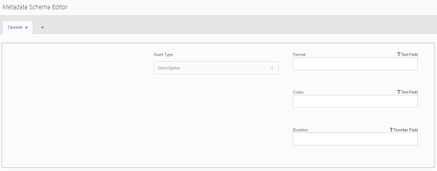

# カスケードメタデータ {#cascading-metadata}

アセットのメタデータ情報をキャプチャする際に、使用可能な様々なフィールドに情報を入力します。 他のフィールドで選択したオプションに応じて、特定のメタデータフィールドまたはフィールド値を表示できます。 このような条件付き表示のメタデータは、カスケードメタデータと呼ばれます。 つまり、特定のメタデータフィールド/値と、1 つ以上のフィールドおよびその値との依存関係を作成できます。

メタデータスキーマを使用して、カスケードメタデータの表示に関するルールを定義します。 例えば、メタデータスキーマにアセットタイプのフィールドが含まれている場合、ユーザーが選択したアセットのタイプに基づいて、表示されるフィールドの適切なセットを定義できます。

カスケードメタデータを定義できる使用例を次に示します。

* ユーザーの所在地が必要な場合は、ユーザーが選択した国および州に基づいて、関連する都市名を表示します。
* ユーザーが選択した製品カテゴリに基づいて、関連するブランド名をリストに読み込みます。
* 別のフィールドで指定された値に基づいて、特定のフィールドの表示/非表示を切り替えます。 例えば、ユーザーが別の住所で出荷を配信したい場合は、別の配送先住所フィールドを表示します。
* 別のフィールドに指定された値に基づいて、特定のフィールドを必須として指定します。
* 別のフィールドで指定された値に基づいて、特定のフィールドに表示されるオプションを変更します。
* 別のフィールドで指定された値に基づいて、特定のフィールドにデフォルトのメタデータ値を設定します。

## [!DNL Experience Manager] でのカスケードメタデータの設定  {#configure-cascading-metadata-in-aem}

選択したアセットのタイプに基づいてカスケードメタデータを表示するシナリオを考えてみましょう。 いくつかの例

* ビデオの場合は、形式、コーデック、期間など、適用可能なフィールドを表示します。
* Word 文書や PDF ドキュメントの場合は、ページ数や作成者などのフィールドを表示します。

選択したアセットタイプに関係なく、著作権情報を必須フィールドとして表示します。

1. [!DNL Experience Manager] のロゴをタップまたはクリックし、**[!UICONTROL ツール]**／**[!UICONTROL アセット]**／**[!UICONTROL メタデータスキーマ]**&#x200B;に移動します。
1. **[!UICONTROL スキーマフォーム]**&#x200B;ページでスキーマフォームを選択し、ツールバーの「**[!UICONTROL 編集]**」をタップまたはクリックしてスキーマを編集します。

   

1. （オプション）メタデータスキーマエディターで、条件を設定する新しいフィールドを作成します。 次の場所で名前とプロパティのパスを指定します。 **[!UICONTROL 設定]** タブをクリックします。

   新しいタブを作成するには、「`+`」をタップまたはクリックしてタブを追加し、メタデータフィールドを追加します。

   

1. アセットタイプにドロップダウンフィールドを追加します。 次の場所で名前とプロパティのパスを指定します。 **[!UICONTROL 設定]** タブをクリックします。 オプションで説明を追加します。

   

1. キーと値のペアは、フォームユーザーに提供されるオプションです。 キーと値のペアは、手動で指定することも、JSON ファイルから指定することもできます。

   * 値を手動で指定するには、 **[!UICONTROL 手動で追加]**&#x200B;次に、をタップまたはクリックします。 **[!UICONTROL 選択肢を追加]** オプションのテキストと値を指定します。 例えば、ビデオ、PDF、Word および画像の各アセットタイプを指定します。

   * JSON ファイルから値を動的に取得するには、「 **[!UICONTROL JSON パスを使用して追加]** JSON ファイルのパスを指定します。 [!DNL Experience Manager] は、フォームがユーザーに提供されたときに、キーと値のペアをリアルタイムで取得します。

   両方のオプションは相互に排他的です。 JSON ファイルからオプションを読み込んで手動で編集することはできません。

   

   >[!NOTE]
   >
   >JSON ファイルを追加すると、キーと値のペアはメタデータスキーマエディターには表示されませんが、公開済みの形式で使用できます。

   >[!NOTE]
   >
   >選択肢を追加するときにポップアップフィールドをクリックすると、インターフェイスが変形し、選択肢の削除アイコンが機能しなくなります。変更を保存するまで、ドロップダウンをクリックしないでください。 この問題が発生した場合は、スキーマを保存し、再度開いて編集を続行してください。

1. （オプション）その他の必須フィールドを追加します。 例えば、アセットタイプのビデオの形式、コーデック、デュレーションなどです。

   同様に、他のアセットタイプに依存フィールドを追加します。 例えば、PDF ファイルや Word ファイルなどのドキュメントアセットには、ページ数や作成者のフィールドを追加します。

   

1. アセットタイプフィールドと他のフィールドとの依存関係を作成するには、依存フィールドを選択して「**[!UICONTROL ルール]**」タブを開きます。

   

1. 「**[!UICONTROL 要件]**」から、「**[!UICONTROL 必須、新しいルールに基づく]**」オプションを選択します。
1. 「**[!UICONTROL ルールを追加]**」をタップまたはクリックし、「**[!UICONTROL アセットタイプ]**」フィールドを選択して依存関係を作成します。また、依存関係を作成するフィールド値も選択します。この場合は、「**[!UICONTROL Video]**」を選択します。「**[!UICONTROL 完了]**」をタップまたはクリックして、変更内容を保存します。

   

   >[!NOTE]
   >
   >手動で事前定義された値を含むドロップダウンは、ルールと共に使用できます。 JSON パスが設定されたドロップダウンメニューは、事前定義された値を使用して条件を適用するルールとは併用できません。 値が実行時に JSON から読み込まれる場合は、事前定義されたルールを適用することはできません。

1. 「**[!UICONTROL 視認性]**」の下で、「**[!UICONTROL 表示可、新しいルールに基づく]**」オプションを選択します。

1. 「**[!UICONTROL ルールを追加]**」をタップまたはクリックし、「**[!UICONTROL アセットタイプ]**」フィールドを選択して依存関係を作成します。また、依存関係を作成するフィールド値も選択します。この場合は、「**[!UICONTROL Video]**」を選択します。「**[!UICONTROL 完了]**」をタップまたはクリックして、変更内容を保存します。

   

   >[!CAUTION]
   >
   >値をリセットするには、インターフェイス上の空白領域など値以外の任意の場所をクリックまたはタップします。値がリセットされた場合は、値を再度選択します。

   >[!NOTE]
   >
   >**[!UICONTROL 要件]**&#x200B;条件と&#x200B;**[!UICONTROL 視認性]**&#x200B;条件は互いに関係なく適用できます。

1. 同様に、「アセットタイプ」フィールドのビデオという値と、「コーデック」や「期間」などの他のフィールドとの依存関係を作成します。
1. 手順を繰り返して、「[!UICONTROL アセットタイプ]」フィールドのドキュメントアセット（PDF、Word）と、「[!UICONTROL ページ数]」や「[!UICONTROL 作成者]」などのフィールドとの依存関係を作成します。
1. 「**[!UICONTROL 保存]**」をクリックします。メタデータスキーマをフォルダーに適用します。

1. メタデータスキーマを適用したフォルダーに移動して、アセットのプロパティページを開きます。「アセットの種類」フィールドでの選択に応じて、関連するカスケードメタデータのフィールドが表示されます。

   
   *図：ビデオアセットのカスケードメタデータ*

   
   *図：ドキュメントアセットのカスケードメタデータ*

**関連情報**

* [アセットを翻訳](translate-assets.md)
* [Assets HTTP API](mac-api-assets.md)
* [AEM Assets as a Cloud Service でサポートされているファイル形式](file-format-support.md)
* [アセットの検索](search-assets.md)
* [Connected Assets](use-assets-across-connected-assets-instances.md)
* [アセットレポート](asset-reports.md)
* [メタデータスキーマ](metadata-schemas.md)
* [アセットのダウンロード](download-assets-from-aem.md)
* [メタデータの管理](manage-metadata.md)
* [検索ファセット](search-facets.md)
* [コレクションの管理](manage-collections.md)
* [一括メタデータ読み込み](metadata-import-export.md)
