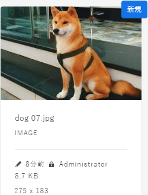
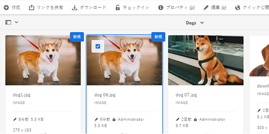

# [!DNL Experience Manager] DAM {#check-in-and-check-out-files-in-assets}のチェックインおよびチェックアウトファイル

[!DNL Adobe Experience Manager Assets] では、編集のためにアセットをチェックアウトし、変更終了後にアセットをチェックインすることができます。アセットをチェックアウトした後は、その人だけがアセットを編集、注釈、公開、移動、削除できるようになります。アセットのチェックアウトでアセットにロックがかかることになります。[!DNL Assets]に再度チェックインするまで、他のユーザーはアセットに対してこれらの操作を実行できません。 ただし、ロックされたアセットのメタデータは変更することができます。

アセットをチェックイン／チェックアウトするには、アセットへの書き込み権限が必要です。

この機能は、複数のユーザーが複数のチームにわたるワークフローの編集で共同作業をする際、ある作成者が変更した内容を他のユーザーが書き換えてしまう事態を防ぐのに役立ちます。

## アセットをチェックアウト{#checking-out-assets}

1. [!DNL Assets]ユーザーインターフェイスから、チェックアウトするアセットを選択します。 チェックアウトしたいアセットは複数選択することもできます。

1. ツールバーで、**[!UICONTROL チェックアウト]**&#x200B;をクリックします。 **[!UICONTROL Checkout]**&#x200B;オプションは、**[!UICONTROL Checkin]**に切り替わります。
チェックアウトしたアセットを他のユーザーが編集できるかを確認するには、別のユーザーとしてログインします。チェックアウトしたアセットのサムネールに、が表示されます。

   

   アセットを選択します。アセットを編集、注釈、公開または削除するためのオプションがツールバーに一切表示されないことを確認します。

   

   ロックされたアセットのメタデータを編集するには、**[!UICONTROL 表示のプロパティ]**&#x200B;をクリックします。

1. 「**[!UICONTROL 編集]**」をクリックして、アセットを編集モードで開きます。

1. アセットを編集して、変更内容を保存します。例えば、画像を切り抜いて保存します。アセットに注釈を付けたり公開したりすることもできます。

1. [!DNL Assets]インターフェイスから編集済みのアセットを選択し、ツールバーの&#x200B;**[!UICONTROL チェックイン]**&#x200B;をクリックします。 変更されたアセットは[!DNL Assets]にチェックインされ、他のユーザーが編集できます。

## 強制チェックイン{#forced-check-in}

管理者は他のユーザーがチェックアウトしたアセットをチェックインできます。

1. [!DNL Assets]に管理者としてログインします。
1. [!DNL Assets]ユーザーインターフェイスから、他のユーザーがチェックアウトした1つ以上のアセットを選択します。

   

1. ツールバーで、**[!UICONTROL 「ロックを解除]**」をクリックします。 アセットはチェックインされ、他のユーザーが編集できるようになります。

## ベストプラクティスと制限事項 {#tips-limitations}

* チェックアウトされたアセットファイルを含む&#x200B;*フォルダ*&#x200B;を削除できます。 フォルダーを削除する前に、デジタルアセットがユーザーによってチェックアウトされていないことを確認します。

>[!MORELIKETHIS]
>
>* [チェックインとチェックアウトの理解を深め [!DNL Experience Manager] る](https://experienceleague.adobe.com/docs/experience-manager-desktop-app/using/using.html?lang=en#how-app-works2)
>* [チェックインとチェックアウトについて理解するためのビデオチュートリアル [!DNL Assets]](https://experienceleague.adobe.com/docs/experience-manager-learn/assets/collaboration/check-in-and-check-out.html)

