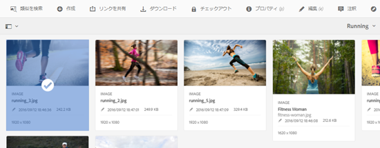
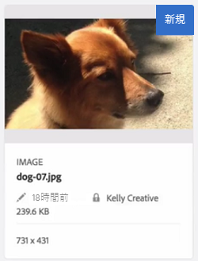
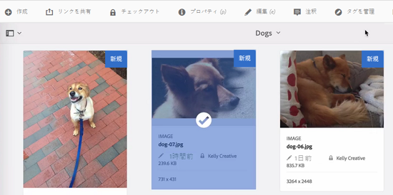
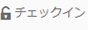
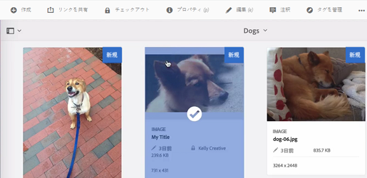

# アセット内ファイルのチェックイン、チェック-アウト {#check-in-and-check-out-files-in-assets}

Adobe Experience Manager (AEM) Assets では、編集のためにアセットをチェックアウトし、変更終了後にアセットをチェックインすることができます。アセットをチェックアウトした後は、その人だけがアセットを編集、注釈、公開、移動、削除できるようになります。アセットのチェックアウトでアセットにロックがかかることになります。アセットが AEM Assets に再度チェックインされるまで、他のユーザーはそのアセットではいかなる作業もおこなうことができません。ただし、ロックされたアセットのメタデータは変更することができます。

アセットをチェックイン／チェックアウトするには、アセットへの書き込み権限が必要です。

この機能は、複数のユーザーが複数のチームにわたるワークフローの編集で共同作業をする際、ある作成者が変更した内容を他のユーザーが書き換えてしまう事態を防ぐのに役立ちます。

## アセットのチェックアウト {#checking-out-assets}

1. Assets の UI でチェックアウトしたいアセットを選択します。チェックアウトしたいアセットは複数選択することもできます。

   

1. ツールバーの「**[!UICONTROL チェックアウト]**」アイコンをクリックまたはタップします。

   

   「**[!UICONTROL チェックアウト]**」アイコンが、鍵の開いた「**[!UICONTROL チェックイン]**」アイコンに変わることを確認します。

   

   チェックアウトしたアセットを他のユーザーが編集できるかを確認するには、別のユーザーとしてログインします。チェックアウトしたアセットのサムネールには鍵のアイコンが表示されます。

   

   アセットを選択します。アセットを編集、注釈、公開または削除するためのオプションがツールバーに一切表示されないことを確認します。

   

   ただし、「**[!UICONTROL プロパティを表示]**」アイコンをクリックまたはタップすれば、ロックされたアセットのメタデータを編集できます。

1. 編集アイコンをクリックまたはタップして、編集モードでアセットを開きます。

   

1. アセットを編集して、変更内容を保存します。例えば、画像を切り抜いて保存します。

   

   アセットに注釈を付けたり公開したりすることもできます。

1. Assets の UI で編集したアセットを選択し、ツールバーで「**[!UICONTROL チェックイン]**」アイコンをクリックまたはタップします。

   

   変更されたアセットは AEM Assets にチェックインされ、他のユーザーが編集できるようになります。

## 強制チェックイン {#forced-check-in}

管理者は他のユーザーがチェックアウトしたアセットをチェックインできます。

1. 管理者として AEM Assets にログインします。
1. Assets UI で他のユーザーにチェックアウトされているアセットを 1 つ以上選択します。

   

1. ツールバーの「**[!UICONTROL ロックを解除]**」アイコンをクリックまたはタップします。アセットはチェックインされ、他のユーザーが編集できるようになります。

   