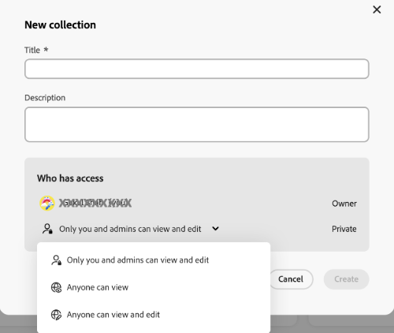
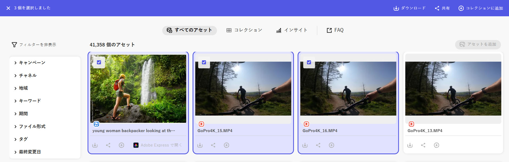
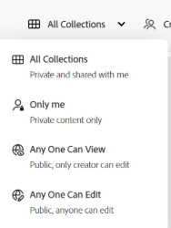
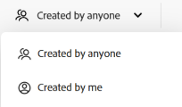
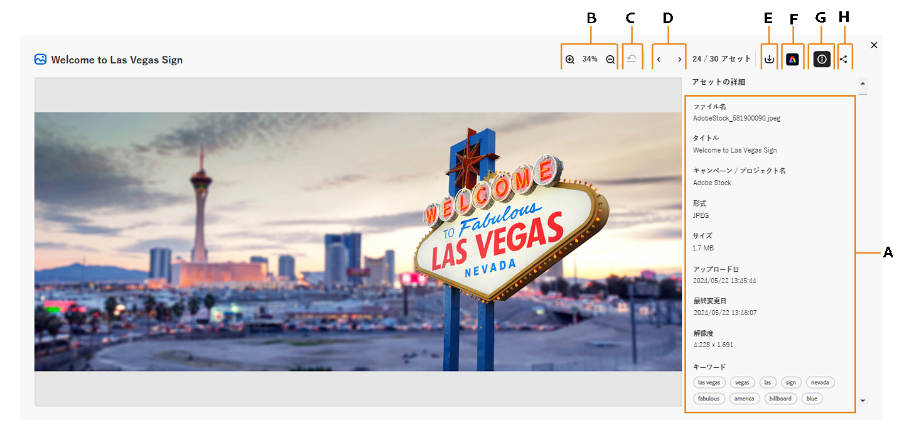
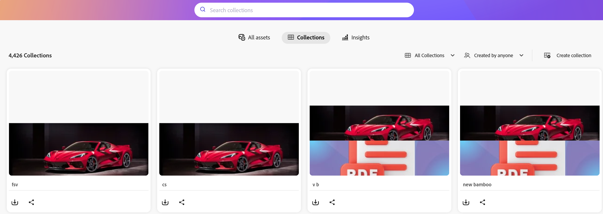
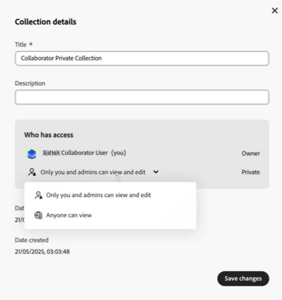

# [!DNL Content Hub] でのコレクションの管理 {#manage-collections}

<table>

    <tr>

        <td>

            <i>新規</i> <a href="/help/assets/dynamic-media/dm-prime-ultimate.md"><b>Dynamic Media Prime と Ultimate</b></a>

        </td>

        <td>

            <i>新規</i> <a href="/help/assets/assets-ultimate-overview.md"><b>AEM Assets Ultimate</b></a>

        </td>

        <td>

            <i>新規</i> <a href="/help/assets/integrate-aem-assets-edge-delivery-services.md"><b>AEM Assets と Edge Delivery Services の統合</b></a>

        </td>

        <td>

            <i>新規</i> <a href="/help/assets/aem-assets-view-ui-extensibility.md"><b>UI 拡張機能</b></a>

        </td>

          <td>

            <i>新規</i> <a href="/help/assets/dynamic-media/enable-dynamic-media-prime-and-ultimate.md"><b>Dynamic Media Prime と Ultimate の有効化</b></a>

        </td>

    </tr>

    <tr>

        <td>

            <a href="/help/assets/search-best-practices.md"><b>検索のベストプラクティス</b></a>

        </td>

        <td>

            <a href="/help/assets/metadata-best-practices.md"><b>メタデータのベストプラクティス</b></a>

        </td>

        <td>

            <a href="/help/assets/product-overview.md"><b>コンテンツハブ</b></a>

        </td>

        <td>

            <a href="/help/assets/dynamic-media-open-apis-overview.md"><b>OpenAPI 機能を備えた Dynamic Media</b></a>

        </td>

        <td>

            <a href="https://developer.adobe.com/experience-cloud/experience-manager-apis/"><b>AEM Assets 開発者向けドキュメント</b></a>

        </td>

    </tr>

</table>

<!--  -->

>[!AVAILABILITY]
>
>コンテンツハブガイドを PDF 形式で利用できるようになりました。ガイド全体をダウンロードし、Adobe Acrobat AI アシスタントを使用して質問に答えてください。
>
>[!BADGE コンテンツハブガイドの PDF]{type=Informative url="https://helpx.adobe.com/content/dam/help/en/experience-manager/aem-assets/content-hub.pdf"}

コレクションとは、ユーザー間で共有できる一連のアセットを指します。参照整合性を維持しながら、1 つのコレクションに異なる複数の場所のアセットを含めることができます。

[!DNL Content Hub] では、公開コレクションを作成できます。これらのコレクションは、資格を持つすべてのユーザーがアクセス可能で、複数のユーザーが効率的にコンテンツにアクセスして利用できる共有スペースが作成されます。コレクションは、リソースの共同使用を促進し、効率性と利便性を高めます。コレクションの参照ページ内では、次の操作を実行できます。

* **作成**：1 つ以上のコレクションを作成します。
* **表示**：アセットとそのプロパティを表示します。
* **共有**：アセットをリンクとして他のユーザーと共有します。
* **ダウンロード**：アセットをダウンロードします。
* **除去**：コレクションから特定のアセットを除去します。
* **削除**：コレクション全体を削除します。

これにより、ユーザーは [!DNL Content Hub] 内で使用可能な様々なアセットに簡単にアクセスして管理できます。

## 前提条件 {#prerequisites}

[Content Hub ユーザー](deploy-content-hub.md#onboard-content-hub-users)は、この記事で説明されているアクションを実行できます。

## コレクションの作成{#create-collections}

ガバナンスを管理しながら、[新しいコレクションを作成](#create-new-collection)するか、[既存のコレクションにアセットを追加](#add-assets-to-existing-collection)するかを選択できます。

### 新しいコレクションの作成{#create-new-collection}

コレクションの作成時にアクセスを制御するには、次の手順を実行します。

1. 「**[!DNL Collections]**」タブに移動し、「**[!UICONTROL コレクションを作成]**」をクリックします。新しいコレクションウィンドウが表示されます。

1. コレクションに「**[!UICONTROL タイトル]**」と「**[!UICONTROL 説明]**」を追加します。

   

1. **[!UICONTROL アクセスできるユーザー]**&#x200B;ドロップダウンで、アクセス制御のタイプを選択します。以下のオプションが利用できます。

   | アクセス方法 | アクセスタイプ | 説明 |
   |---|---|---|
   | **編集できるのは自分と管理者のみです** | プライベート | 作成者と管理者のみが、このコレクションを編集してアクセスできます。 |
   | **誰でも表示** | パブリック | すべてのユーザーがこのコレクションにアクセスできますが、編集できるのは作成者と管理者のみです。 |
   | **誰でも表示および編集できます** | パブリック | このコレクションは誰でも利用でき、制限なくフルアクセスと編集権限が付与されます。 |

   >[!NOTE]
   >
   > 管理者 [!DNL Content Hub]、「**[!UICONTROL アクセスできるユーザー]** ドロップダウンで使用可能なすべてのオプションを表示できますが、通常のユーザーの場合は、アクセスできるオプションを [ 指定して設定 ](configure-content-hub-ui-options.md) する必要があります。

1. 「**[!UICONTROL 作成]**」をクリックします。完了したら、[コレクションにアセットを追加](#add-assets-to-existing-collection)できます。

>[!VIDEO](https://video.tv.adobe.com/v/3463336)

<!--
>[!NOTE]
>
>Collections governance is a limited availability feature. You can get it enabled  by creating a support ticket. Once enabled, you need to [Configure Collections in Content Hub](configure-content-hub-ui-options.md#configure-collections-content-hub).-->

<!--To create a new collection, navigate to the **[!UICONTROL Collections]** tab and click **[!UICONTROL Create new collection]**. Enter the **[!UICONTROL Title]** and provide an optional **[!UICONTROL Description]** for the assets. Click **[!UICONTROL Create]**.
          
-->

### 既存のコレクションへのアセットの追加{#add-assets-to-existing-collection}

既存のコレクションにアセットを追加するには、コレクションに追加する必要があるアセットを選択します。「**[!UICONTROL コレクションに追加]**」をクリックします。コレクションを選択するプロンプトが表示されます。

アセットを追加する必要があるコレクションを選択します。また、検索バーを使用して既存のコレクションを検索することもできます。 アセットを追加するコレクションを選択し、「**[!UICONTROL コレクションに追加]**」をクリックします。

## コレクションの表示{#view-collections}

「**[!UICONTROL コレクション]**」タブに移動し、コレクション名を検索します。フィルターを使用すると、特定の条件を選択して検索結果を絞り込み、最も関連性の高いコレクションをすばやく見つけることができます。

コレクションで使用可能なアセットのリストを表示するには、コレクション名をクリックします。また、コレクション内でフィルターを適用して、アセットの結果を絞り込むこともできます。コレクション内で表示する必要があるアセットをクリックします。[!DNL Content Hub] には、アセットの詳細ビューが表示されます。[詳しくは、アセットの詳細を参照してください](asset-properties-content-hub.md)。

### コレクション表示のフィルタリング {#filter-collections-view}

Content Hub では、環境設定に基づいてオプションを絞り込み、コレクションビューをフィルタリングして、探しているものを正確に簡単に見つけることができます。[Content Hub 内のコレクションの設定](configure-content-hub-ui-options.md#configure-collections-content-hub)を確認します。

コレクションビューをフィルタリングするには、「**[!DNL Collections]**」タブに移動し、「コレクション」ドロップダウンに移動します。次のいずれかのオプションを選択します。

* **[!UICONTROL すべてのコレクション ]:** すべてのコレクション（非公開のコレクションや共有されているコレクションを含む）を表示および編集するには、このオプションを選択します。
* **[!UICONTROL 自分のみ]：**&#x200B;アクセス可能なコレクションを表示する場合は、このオプションを選択します。
* **[!UICONTROL すべてのユーザーが表示可能]：**&#x200B;このオプションでは、すべてのユーザーがアクセス可能で作成者のみが編集できるコレクションをフィルタリングできます。
* **[!UICONTROL すべてのユーザーが編集可能]：**&#x200B;すべてのユーザーがアクセス可能かつ編集可能なコレクションをフィルタリングする場合は、このオプションを選択します。

  

さらに、アクセス権限に基づいてコレクションビューをフィルタリングするには、「**[!DNL Collections]**」タブに移動し、次のいずれかのオプションに移動します。

* **[!UICONTROL 任意のユーザーが作成]：**&#x200B;このフィルターを使用すると、任意のユーザーが作成したコレクションを表示できます。

* **[!UICONTROL 自分で作成]:**&#x200B;このフィルターは、自分が作成したコレクションを表示するように制限します。

  

<!--

* **A**: Details and metadata of the asset 
* **B**: Zoom In or Zoom Out the asset 
* **C**: Reset Zoom view 
* **D**: View the previous or next asset 
* **E**: Download the asset 
* **F**: Open the asset in Adobe Express 
* **G**: Hide the metadata of the asset 
* **H**: Share the asset as a link 
-->

## コレクション内での使用可能なアセットのダウンロード{#download-assets-within-collection}

コレクション内で使用可能なアセットをダウンロードするには、「**[!UICONTROL コレクション]**」タブに移動します。\
コレクションカードの  アイコンをクリックします。

コレクションのすべてのアセットがダウンロードされます。

また、コレクションを開いて、アセットを個別にダウンロードすることもできます。ダウンロードする必要があるアセットを含むコレクションをクリックします。アセットを選択し、「**[!UICONTROL ダウンロード]**」をクリックします。

詳しくは、[ [!DNL Content Hub]](download-assets-content-hub.md) からアセットをダウンロードする方法を参照してください。

## コレクション内での使用可能なアセットの共有 {#share-assets-available-within-collection}

コレクション内で使用可能なアセットを共有することもできます。必ず [Content Hub で公開リンク共有を有効にする](configure-content-hub-ui-options.md#enable-public-link-sharing)ようにします。「**[!UICONTROL コレクション]**」タブに移動します。コレクションカードの  アイコンを選択します。共有リンクがコピーされます。コピーしたリンクを受信者と共有できます。詳しくは、[ [!DNL Content Hub]](share-assets-content-hub.md) でのアセットの共有を参照してください。

Content Hub コレクションには、カスタマイズ可能な共有権限や共同作業機能など、効果的なアセット管理を行うための包括的なガバナンスツールが用意されています。読み取り専用アクセスから完全な管理制御に至るまで、これらの設定はアセット配布に対する微調整のガバナンスをサポートします。 アセットを個別に、またはコレクションの一部として共有する場合、アクセス範囲は、ユーザーに割り当てられたコレクションの現在のアクセスレベルによって決定されます。 または、プライベートコレクションは共有できません。

## コレクションの詳細の編集 {#edit-details-of-collection}

コレクションの&#x200B;**[!UICONTROL タイトル]**&#x200B;と&#x200B;**[!UICONTROL 説明]**&#x200B;を編集するには、コレクション名をクリックし、 アイコンをクリックします。[!UICONTROL コレクションの詳細]画面が表示され、コレクションの&#x200B;**[!UICONTROL タイトル]**&#x200B;と&#x200B;**[!UICONTROL 説明]**&#x200B;を編集できます。「**[!UICONTROL 変更を保存]**」をクリックして、変更を確定します。 また、コレクションへのアクセス権は、設定に応じて、コレクションを編集ダイアログで更新できます。

## コレクションからのアセットの削除{#remove-assets-from-a-collection}

次のユーザーは、コレクションから 1 つまたは複数のアセットを削除できます。

* 管理者
* コレクションの所有者
* 編集権限を持つ管理者以外のユーザー

コレクションからアセットを削除するには、アセットを削除する必要があるコレクションをクリックし、アセットを選択して「**[!UICONTROL コレクションから削除]**」をクリックします。

アセットの削除を確認するプロンプトが表示されます。「**[!UICONTROL 削除]**」をクリックします。\
選択したアセットはコレクションから正常に削除されました。

## コレクションの削除{#delete-collection}

コレクションを削除できるのは、管理者と作成者のみです。 コレクションを削除するには、「**[!UICONTROL コレクション]**」タブに移動し、削除するコレクションをクリックします。 アイコンをクリックして、コレクションを削除します。

