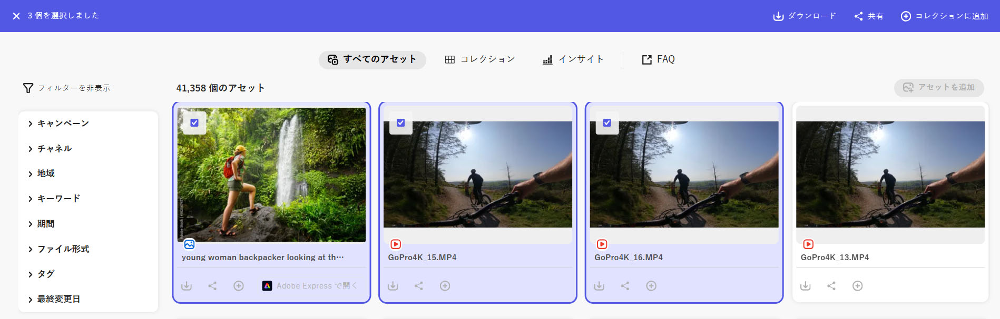
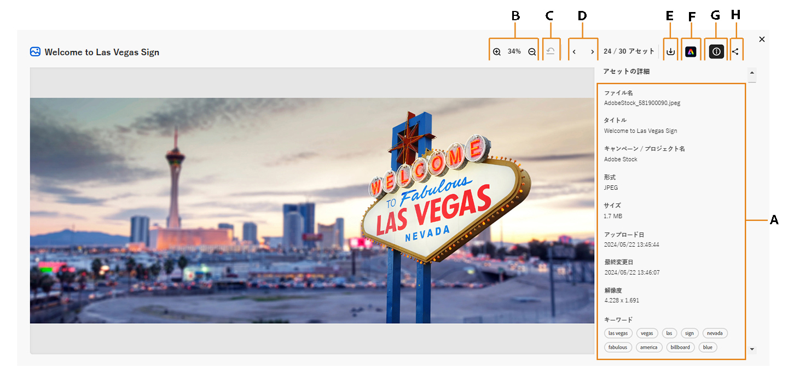
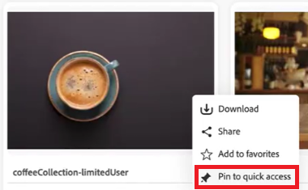
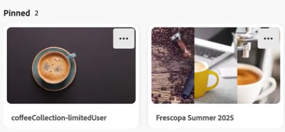
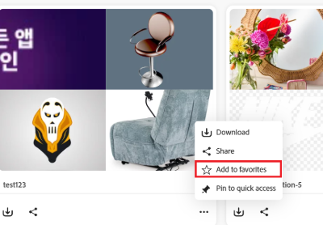

# [!DNL Content Hub] でのコレクションの管理 {#manage-collections}

コレクションとは、ユーザー間で共有できる一連のアセットを指します。 参照整合性を維持しながら、1 つのコレクションに異なる複数の場所のアセットを含めることができます。

[!DNL Content Hub] では、公開コレクションを作成できます。 これらのコレクションは、資格を持つすべてのユーザーがアクセス可能で、複数のユーザーが効率的にコンテンツにアクセスして利用できる共有スペースが作成されます。 コレクションは、リソースの共同使用を促進し、効率性と利便性を高めます。 コレクションの参照ページ内では、次の操作を実行できます。

* **作成**：1 つ以上のコレクションを作成します。
* **表示**：アセットとそのプロパティを表示します。
* **共有**：アセットをリンクとして他のユーザーと共有します。
* **ダウンロード**：アセットをダウンロードします。
* **除去**：コレクションから特定のアセットを除去します。
* **削除**：コレクション全体を削除します。
* **ピン留め/ピン解除**：コレクションをピン留めまたはピン留めを解除します。
* **お気に入り**: コレクションをお気に入りにマークします。

これにより、ユーザーは [!DNL Content Hub] 内で使用可能な様々なアセットに簡単にアクセスして管理できます。

>[!VIDEO](https://video.tv.adobe.com/v/3435687/?learn=on){transcript=true}

## 前提条件 {#prerequisites}

[Content Hub ユーザー](deploy-content-hub.md#onboard-content-hub-users)は、この記事で説明されているアクションを実行できます。

## コレクションの作成{#create-collections}

ガバナンスを管理しながら、[新しいコレクションを作成](#create-new-collection)するか、[既存のコレクションにアセットを追加](#add-assets-to-existing-collection)するかを選択できます。

### 新しいコレクションの作成{#create-new-collection}

コレクションの作成時にアクセスを制御するには、次の手順を実行します。

1. 「**[!DNL Collections]**」タブに移動し、「**[!UICONTROL コレクションを作成]**」をクリックします。 新しい「コレクション」ウィンドウが表示されます。

1. コレクションに「**[!UICONTROL タイトル]**」と「**[!UICONTROL 説明]**」を追加します。

   

1. **[!UICONTROL アクセスできるユーザー]**&#x200B;ドロップダウンで、アクセス制御のタイプを選択します。 以下のオプションが利用できます。

   | アクセス方法 | アクセスタイプ | 説明 |
   |---|---|---|
   | **自分と管理者のみが編集可能** | プライベート | このコレクションを編集およびコレクションにアクセスできるのは、作成者と管理者のみです。 |
   | **誰でも表示可能** | パブリック | すべてのユーザーがこのコレクションにアクセスできますが、編集できるのは作成者と管理者のみです。 |
   | **誰でも表示して編集可能** | パブリック | このコレクションは誰でも利用でき、制限なくフルアクセスと編集権限が付与されます。 |

   >[!NOTE]
   >
   > [!DNL Content Hub] 管理者は、**[!UICONTROL アクセスできるユーザー]**&#x200B;ドロップダウンで使用可能なすべてのオプションを表示できますが、通常のユーザーの場合は、アクセスできるオプションを[指定して設定](configure-content-hub-ui-options.md)する必要があります。

1. 「**[!UICONTROL 作成]**」をクリックします。 完了したら、[コレクションにアセットを追加](#add-assets-to-existing-collection)できます。

>[!VIDEO](https://video.tv.adobe.com/v/3463336)

<!--
>[!NOTE]
>
>Collections governance is a limited availability feature. You can get it enabled  by creating a support ticket. Once enabled, you need to [Configure Collections in Content Hub](configure-content-hub-ui-options.md#configure-collections-content-hub).
-->

<!--
To create a new collection, navigate to the **[!UICONTROL Collections]** tab and click **[!UICONTROL Create new collection]**. Enter the **[!UICONTROL Title]** and provide an optional **[!UICONTROL Description]** for the assets. Click **[!UICONTROL Create]**.
          
-->

### 既存のコレクションへのアセットの追加{#add-assets-to-existing-collection}

既存のコレクションにアセットを追加するには、コレクションに追加する必要があるアセットを選択します。 「**[!UICONTROL コレクションに追加]**」をクリックします。 コレクションを選択するプロンプトが表示されます。

アセットを追加する必要があるコレクションを選択します。 また、検索バーを使用して既存のコレクションを検索することもできます。  アセットを追加するコレクションを選択し、「**[!UICONTROL コレクションに追加]**」をクリックします。

## コレクションの表示{#view-collections}

「**[!UICONTROL コレクション]**」タブに移動し、コレクション名を検索します。 フィルターを使用すると、特定の条件を選択して検索結果を絞り込み、最も関連性の高いコレクションをすばやく見つけることができます。

コレクションで使用可能なアセットのリストを表示するには、コレクション名をクリックします。 また、コレクション内でフィルターを適用して、アセットの結果を絞り込むこともできます。 コレクション内で表示する必要があるアセットをクリックします。 [!DNL Content Hub] には、アセットの詳細ビューが表示されます。 [詳しくは、アセットの詳細を参照してください](asset-properties-content-hub.md)。

### コレクション表示のフィルタリング {#filter-collections-view}

Content Hub では、環境設定に基づいてオプションを絞り込み、コレクションビューをフィルタリングして、探しているものを正確に簡単に見つけることができます。 [Content Hub 内のコレクションの設定](configure-content-hub-ui-options.md#configure-collections-content-hub)を確認します。

コレクションビューをフィルタリングするには、「**[!DNL Collections]**」タブに移動し、「コレクション」ドロップダウンに移動します。 次のいずれかのオプションを選択します。

* **[!UICONTROL すべてのコレクション]：**&#x200B;非公開または共有されているすべてのコレクションを表示および編集するには、このオプションを選択します。
* **[!UICONTROL 自分のみ]：**&#x200B;アクセス可能なコレクションを表示する場合は、このオプションを選択します。
* **[!UICONTROL すべてのユーザーが表示可能]：**&#x200B;このオプションでは、すべてのユーザーがアクセス可能で作成者のみが編集できるコレクションをフィルタリングできます。
* **[!UICONTROL すべてのユーザーが編集可能]：**&#x200B;すべてのユーザーがアクセス可能かつ編集可能なコレクションをフィルタリングする場合は、このオプションを選択します。

  

さらに、アクセス権限に基づいてコレクションビューをフィルタリングするには、「**[!DNL Collections]**」タブに移動し、次のいずれかのオプションに移動します。

* **[!UICONTROL 任意のユーザーが作成]：**&#x200B;このフィルターを使用すると、任意のユーザーが作成したコレクションを表示できます。

* **[!UICONTROL 自分で作成]:**&#x200B;このフィルターは、自分が作成したコレクションを表示するように制限します。

  

<!--

* **A**: Details and metadata of the asset 
* **B**: Zoom In or Zoom Out the asset 
* **C**: Reset Zoom view 
* **D**: View the previous or next asset 
* **E**: Download the asset 
* **F**: Open the asset in Adobe Express 
* **G**: Hide the metadata of the asset 
* **H**: Share the asset as a link 
-->

## コレクション内での使用可能なアセットのダウンロード{#download-assets-within-collection}

コレクション内で使用可能なアセットをダウンロードするには、「**[!UICONTROL コレクション]**」タブに移動します。\
コレクションカードの  アイコンをクリックします。

コレクションのすべてのアセットがダウンロードされます。

また、コレクションを開いて、アセットを個別にダウンロードすることもできます。 ダウンロードする必要があるアセットを含むコレクションをクリックします。 アセットを選択し、「**[!UICONTROL ダウンロード]**」をクリックします。

詳しくは、[ [!DNL Content Hub]](download-assets-content-hub.md) からアセットをダウンロードする方法を参照してください。

## コレクション内での使用可能なアセットの共有 {#share-assets-available-within-collection}

コレクション内で使用可能なアセットを共有することもできます。 必ず [Content Hub で公開リンク共有を有効にする](configure-content-hub-ui-options.md#configure-collections-content-hub)ようにします。 「**[!UICONTROL コレクション]**」タブに移動します。 アセットカードの アイコンを選択します。 共有リンクがコピーされます。 コピーしたリンクを受信者と共有できます。 詳しくは、[ [!DNL Content Hub]](share-assets-content-hub.md) でのアセットの共有を参照してください。

Content Hub コレクションには、カスタマイズ可能な共有権限や共同作業機能など、効果的なアセット管理を行うための包括的なガバナンスツールが用意されています。 読み取り専用アクセスから完全な管理制御に至るまで、これらの設定はアセット配布に対する微調整のガバナンスをサポートします。 アセットを個別に、またはコレクションの一部として共有する場合、アクセス範囲は、ユーザーに割り当てられたコレクションの現在のアクセスレベルによって決定されます。 また、プライベートコレクションを共有することはできません。

## コレクションの詳細の編集 {#edit-details-of-collection}

コレクションの&#x200B;**[!UICONTROL タイトル]**&#x200B;と&#x200B;**[!UICONTROL 説明]**&#x200B;を編集するには、コレクション名をクリックし、 アイコンをクリックします。 [!UICONTROL コレクションの詳細]画面が表示され、コレクションの&#x200B;**[!UICONTROL タイトル]**&#x200B;と&#x200B;**[!UICONTROL 説明]**&#x200B;を編集できます。 「**[!UICONTROL 変更を保存]**」をクリックして変更を確定します。 さらに、コレクションへのアクセス権は、設定に応じて、コレクションを編集ダイアログで更新できます。

## コレクションからのアセットの削除{#remove-assets-from-a-collection}

次のユーザーは、コレクションから 1 つまたは複数のアセットを削除できます。

* 管理者
* コレクションの所有者
* 編集権限を持つ管理者以外のユーザー

コレクションからアセットを削除するには、アセットを削除する必要があるコレクションをクリックし、アセットを選択して「**[!UICONTROL コレクションから削除]**」をクリックします。

アセットの削除を確認するプロンプトが表示されます。 「**[!UICONTROL 削除]**」をクリックします。\
選択したアセットはコレクションから正常に削除されました。

## コレクションの削除{#delete-collection}

コレクションを削除できるのは、管理者と作成者のみです。 コレクションを削除するには、「**[!UICONTROL コレクション]**」タブに移動し、削除するコレクションをクリックします。  アイコンをクリックして、コレクションを削除します。

## コレクションをピン留めまたはピン留めを解除 {#pin-unpin-collection}

Content Hub管理者は、Content Hubでコレクションをピン留めして、すばやくアクセスできます。 ピン留めされたコレクションは、コレクションのホームページ上の専用の「ピン留め」セクションに表示され、重要なコレクションを手の届くところに保ちやすくなります。 クイックアクセスを行うには、次の手順を実行して、コレクションをピン留めまたはピン留めを解除できます。

1. ピン留めまたはピン留めを解除するコレクションを参照します。

1. **[!UICONTROL その他のアクション]** をクリックし、**[!UICONTROL ピンでクイックアクセス]**&#x200B;を選択します。 確認ボックスが表示されます。

   

1. 「**[!UICONTROL ピン]**」をクリックして確定します。 プライベートコレクションをピン留めすると、警告メッセージが表示されます。

   

   ピン留めされたコレクションが上部に表示され、すばやくアクセスできます。 または、コレクションのピン留めを解除するには、**[!UICONTROL その他のアクション]** をクリックし、**[!UICONTROL ピン留めを解除]**&#x200B;を選択します。

   

## コレクションをお気に入りにマーク {#favorite-collection}

Content Hubでは、コレクションをお気に入りとしてマークすることができ、コレクションの整理と取得が容易になります。 お気に入りのコレクションを追加すると、Content Hubのホームページの「お気に入り」タブからお気に入りのコレクションを簡単に入手できます。 さらに、お気に入りコレクション内のアセットを検索することもできます。 コレクションをお気に入りにマークするには、次の手順に従います。

1. お気に入りとしてマークするコレクションを参照します。

1. **[!UICONTROL その他のアクション]** をクリックし、**[!UICONTROL お気に入りに追加]**&#x200B;を選択して、コレクションをお気に入りにマークします。

   

   お気に入りとしてマークされたコレクションが、**[!UICONTROL お気に入り]** タブに表示されるようになりました。 または、**[!UICONTROL お気に入り]**&#x200B;からコレクションを削除することもできます。 これを行うには、**[!UICONTROL その他のアクション]** をクリックし、**[!UICONTROL お気に入りから削除]**&#x200B;を選択します。

   

## よくある質問 {#faqs-manage-collections-content-hub}

### AEM Assets Content Hubでは、コレクションとは何ですか？

AEM Assets Content Hubにおけるコレクションとは、ユーザー間で共有できるアセットのセットを指します。 コレクションには、参照元の整合性を維持しながら、異なる場所のアセットを含めることができます。 これにより、ユーザーがコンテンツに効率的にアクセスし、利用するための共有スペースを構築できます。

### AEM Assets Content Hubで新しいコレクションを作成するにはどうすればよいですか？

AEM Assets Content Hubで新しいコレクションを作成するには、「コレクション」タブに移動し、「**コレクションを作成**」をクリックします。 新しいコレクションウィンドウで、タイトルと説明を追加し、**アクセス可能なユーザー** ドロップダウンリストの下にあるアクセス制御タイプを選択して、**作成**&#x200B;をクリックします。 次に、アセットをコレクションに追加します。

### AEM Assets Content Hubでコレクションを作成する際に使用できるアクセス制御の種類を教えてください。

AEM Assets Content Hubには3つのアクセス制御タイプがあります。**プライベート** – 編集とアクセスは作成者と管理者のみ、**パブリック** – 表示のみ – 全員が表示できますが、編集できるのは作成者と管理者のみです。**パブリック** – 表示と編集 – 全員が制限なくコレクションにアクセスして編集できます。

### AEM Assets Content Hubのコレクションに対してアクションを実行できるのは誰ですか？

AEM Assets Content Hubでは、コレクションの作成、表示、共有、ダウンロード、削除、削除、ピン留め、お気に入りへのマークなどのアクションを実行できます。 管理者には、すべてのアクセスオプションの表示やコレクションの削除など、追加の権限があります。

### AEM Assets Content Hubの既存のコレクションにアセットを追加するにはどうすればよいですか？

AEM Assets Content Hubの既存のコレクションにアセットを追加するには、追加するアセットを選択し、**コレクションに追加**&#x200B;をクリックして、リストからコレクションを選択します。 検索バーを使用してコレクションを検索することもできます。 「**コレクションに追加**」をクリックして、アクションを確定します。

### AEM Assets Content Hubでは、コレクションをフィルタリングして検索できますか？

はい。AEM Assets Content Hubでは、コレクションを名前、アクセス権限、または作成者でフィルタリングして検索できます。 フィルターには、**すべてのコレクション**、**自分のみ**、**誰でも表示**&#x200B;できます、**誰でも編集できます**、**作成者**、作成者&#x200B;**自分が作成**&#x200B;などのオプションが含まれます。

### AEM Assets Content Hubのコレクションからアセットをダウンロードするにはどうすればよいですか？

AEM Assets Content Hubのコレクションからアセットをダウンロードするには、「**コレクション**」タブに移動し、コレクションカードのダウンロードアイコンをクリックしてすべてのアセットをダウンロードします。 コレクションを開いて個々のアセットを選択し、**ダウンロード**&#x200B;をクリックして個別にダウンロードすることもできます。

### AEM Assets Content Hubのコレクションからアセットを共有するにはどうすればよいですか？

Assetsは、AEM Assets Content Hubで公開リンク共有を有効にすることで共有できます。 アセットカードの共有アイコンを選択して共有リンクをコピーし、受信者に送信できます。 プライベートコレクションは共有できないことに注意してください。

### AEM Assets Content Hubのコレクションからアセットを削除できるのは誰ですか？

コレクションの所有者、管理者、または編集権限を持つ管理者以外のユーザーは、AEM Assets Content Hubのコレクションから1つまたは複数のアセットを削除できます。 削除するには、アセットを選択し、**コレクションから削除**&#x200B;をクリックして、削除を確認します。

### AEM Assets Content Hubからコレクションを削除できるのは誰で、どのように行われますか？

コレクションを削除できるのは、管理者とコレクションの作成者のみです。 削除するには、「コレクション」タブに移動し、コレクションを選択して、削除アイコンをクリックします。 AEM Assets Content Hubからコレクションが削除されます。

### AEM Assets Content Hubで管理者がコレクションに対して設定できるオプションは何ですか？

管理者は、AEM Assets Content Hubのコレクションに対して次のオプションを有効または無効にできます。

* **表示専用コレクション**&#x200B;切替スイッチを有効にすると、すべてのユーザーがアクセス可能ですが、作成者と管理者のみが編集できるコレクションを許可します。

* **公開コレクション**&#x200B;切替スイッチを有効にして、すべてのユーザーがアクセスおよび編集できるコレクションを許可します。 **コレクションのみを表示**&#x200B;および&#x200B;**公開コレクション**&#x200B;の切替スイッチが無効になっている場合、デフォルトでは、管理者以外のユーザーが非公開コレクションのみを作成できます。

**関連情報**

* [アセットを翻訳](/help/assets/translate-assets.md)
* [Assets HTTP API](/help/assets/mac-api-assets.md)
* [AEM Assets as a Cloud Service でサポートされているファイル形式](/help/assets/file-format-support.md)
* [アセットを検索](/help/assets/search-assets.md)
* [接続されたアセット](/help/assets/use-assets-across-connected-assets-instances.md)
* [アセットレポート](/help/assets/asset-reports.md)
* [メタデータスキーマ](/help/assets/metadata-schemas.md)
* [アセットをダウンロード](/help/assets/download-assets-from-aem.md)
* [メタデータを管理](/help/assets/manage-metadata.md)
* [Dynamic Media テンプレートの管理](/help/assets/dynamic-media/manage-dynamic-media-templates.md)
* [レポートの管理](/help/assets/manage-reports-assets-view.md)
* [検索ファセット](/help/assets/search-facets.md)
* [コレクションを管理](/help/assets/manage-collections.md)
* [メタデータの一括読み込み](/help/assets/metadata-import-export.md)
* [AEM および Dynamic Media へのアセットの公開](/help/assets/publish-assets-to-aem-and-dm.md)

