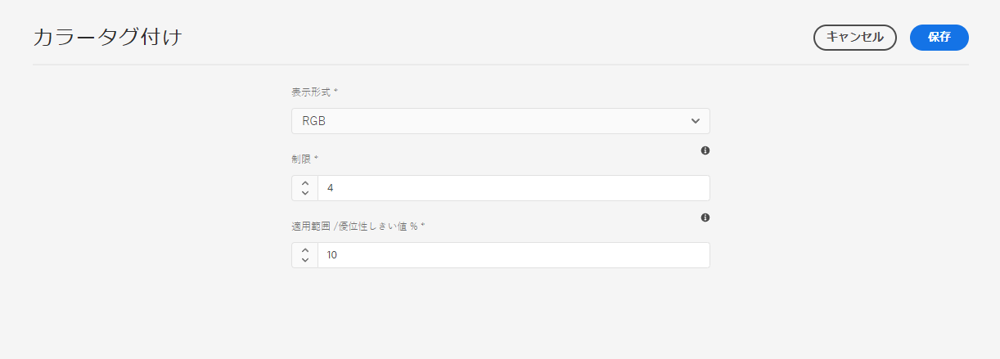
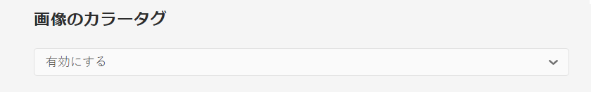
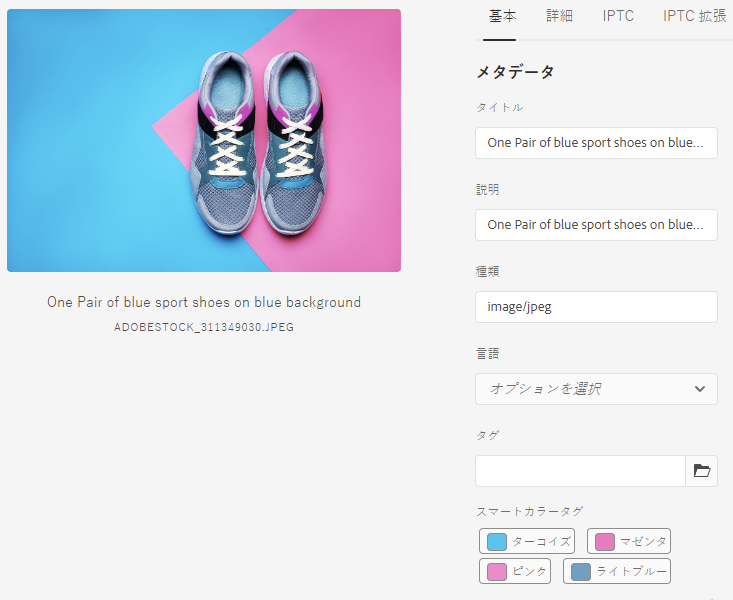
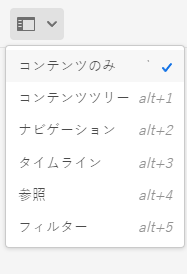
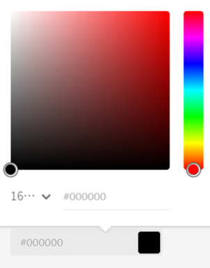

# 画像のカラータグ {#color-tag-images}

<table>
    <tr>
        <td>
            <i> 新規 </i>Dynamic Media Prime<a href="/help/assets/dynamic-media/dm-prime-ultimate.md"><b>Ultimate</b></a>
        </td>
        <td>
            <i> 新規 </i> <a href="/help/assets/assets-ultimate-overview.md"><b>AEM AssetsUltimate</b></a>
        </td>
        <td>
            <i> 新規 </i> <a href="/help/assets/integrate-aem-assets-edge-delivery-services.md"><b>AEM AssetsとEdge Delivery Servicesの統合 </b></a>
        </td>
        <td>
            <i> 新規 </i><a href="/help/assets/aem-assets-view-ui-extensibility.md"><b>UI 拡張機能 </b></a>
        </td>
          <td>
            <i>Dynamic Media Prime</i>Ultimateの新 <a href="/help/assets/dynamic-media/enable-dynamic-media-prime-and-ultimate.md"><b> 能 </b></a>
        </td>
    </tr>
    <tr>
        <td>
            <a href="/help/assets/search-best-practices.md"><b>検索のベストプラクティス</b></a>
        </td>
        <td>
            <a href="/help/assets/metadata-best-practices.md"><b>メタデータのベストプラクティス</b></a>
        </td>
        <td>
            <a href="/help/assets/product-overview.md"><b>コンテンツハブ</b></a>
        </td>
        <td>
            <a href="/help/assets/dynamic-media-open-apis-overview.md"><b>OpenAPI 機能を備えた Dynamic Media</b></a>
        </td>
        <td>
            <a href="https://developer.adobe.com/experience-cloud/experience-manager-apis/"><b>AEM Assets 開発者向けドキュメント</b></a>
        </td>
    </tr>
</table>

Adobe Experience Manager (AEM) Assets は、Adobe Sensei AI 機能を使用して画像内のカラーを識別し、取り込み時に自動的にタグとして適用します。これらのタグを使用すると、画像のカラー構成に基づいて検索エクスペリエンスを強化できます。

画像にタグ付けされるカラーの数を 1～40 の範囲内で設定し、後でそれらのカラーに基づいて画像を検索できます。Experience Manager Assets は、画像のカラーカバレッジに基づいてタグを適用します。また、カラータグの表示形式も設定できます。

次の図は、Experience Manager Assets で画像のカラータグ付けを設定および管理するために実行する一連のタスクを示しています。

## サポートされているファイル形式 {#supported-file-formats-color-tags}

| ファイル形式 | 拡張子 | MIME タイプ | 入力色空間 | サポートされるソースファイルの最大サイズ | サポートされるファイルの最大サイズ解像度 |
|---|---|---|---|---|---|
| JPEG | .jpg および.jpeg | image/jpeg | sRGB | 15 GB | 20000 × 20000 ピクセル |
| PNG | .png | image/png | sRGB | 15 GB | 20000 × 20000 ピクセル |
| TIFF | .tif および.tiff | image/tiff | sRGB | 4 GB（形式の仕様によって制限） | 20000 × 20000 ピクセル |
| PSD | .psd | image/vnd.adobe.photoshop | sRGB | 2 GB（形式の仕様によって制限） | 20000 × 20000 ピクセル |
| GIF | .gif | image/gif | sRGB | 15 GB | 20000 × 20000 ピクセル |
| BMP | .bmp | image/bmp | sRGB | 4 GB（形式の仕様によって制限） | 20000 × 20000 ピクセル |

## カラータグ付けプロパティの管理 {#manage-color-tagging-properties}

画像のカラータグ付けプロパティを管理するには：

1. **[!UICONTROL ツール／Assets／カラータグ付け]**&#x200B;に移動します。

   

1. カラータグの表示形式を&#x200B;**[!UICONTROL 表示形式]**&#x200B;フィールドに入力します。使用できるオプションには、カラー名、RGB、または 16 進数形式があります。

1. 画像にタグ付けするカラーの数を [**[!UICONTROL 制限]**] フィールドに入力します。画像のプロパティを表示すると、これらのカラーが表示されます。このフィールドでは、1～40 の数値を定義できます。このフィールドのカラーのデフォルト値は 10 です。

1. 検索結果にカラータグを含める最小カラーカバレッジの割合を、**[!UICONTROL カバレッジ／ドミナンスしきい値 %]** フィールドに入力します。たとえば、画像の赤のカラーのカバレッジが 10%で、このフィールドに 9%を定義した場合、赤のカラーの画像を検索するときにその画像が含まれます。ただし、画像の赤のカラーのカバレッジが 10％で、このフィールドに 11％を定義した場合、赤のカラーの画像を検索するときにその画像は含まれません。

   このフィールドには、5 から 100 までの任意の数を入力できます。デフォルト値は 11 です。

   >[!NOTE]
   >
   >アドビでは、このフィールドのデフォルト値に近い値を使用することをお勧めします。このフィールドに高い数値 (25 を超える値など) を設定すると、検索結果がほとんど返されない場合があります。同様に、低い数値（例えば、6 未満）を設定すると、返される検索結果が多すぎるので役に立たない場合があります。

1. 「**[!UICONTROL 保存]**」をクリックします。

   >[!VIDEO](https://video.tv.adobe.com/v/340108)

### カラータグ付けを無効にする {#disable-color-tagging}

画像のカラータグ付けは、デフォルトで有効になっています。カラータグ付けは、フォルダーレベルで無効にすることができます。すべての子フォルダーは、親フォルダーからカラータグ付けプロパティを継承します。

フォルダーレベルでカラータグ付けを無効にするには：

1. **[!UICONTROL Adobe Experience Manager／Assets／ファイル]**&#x200B;に移動します。

1. フォルダーを選択し、「**[!UICONTROL プロパティ]**」をクリックします。

1. 「**[!UICONTROL アセット処理]**」タブで、**[!UICONTROL 画像のカラータグ]**&#x200B;フォルダーに移動します。ドロップダウンリストから次のいずれかの値を選択します。

   * 継承 - フォルダーは親フォルダーから有効または無効のオプションを継承します。

   * 有効 - 選択したフォルダーのカラータグ付けを有効にします。

   * 無効 - 選択したフォルダーのカラータグ付けを無効にします。

   

## スマートカラータグコンポーネントを追加するためのメタデータスキーマの設定 {#configure-metadata-schema}

メタデータスキーマには、特定の情報を入力するための特定のフィールドがあります。また、メタデータフィールドをユーザーにわかりやすく表示するためのレイアウト情報も含まれています。メタデータプロパティには、タイトル、説明、MIME タイプ、タグなどがあります。既存のスキーマを変更したり、カスタムのメタデータスキーマを追加するには、[!UICONTROL メタデータスキーマフォーム]エディターを使用します。

>[!NOTE]
>
>スマートカラータグフィールドは、デフォルトのメタデータスキーマで使用できます。カスタマイズされたメタデータスキーマを使用している場合は、スキーマを設定して、スマートカラータグフィールドを追加します。

スマートカラータグコンポーネントをメタデータスキーマのフォームエディターに追加するには：

1. **[!UICONTROL ツール／Assets／メタデータスキーマ]**&#x200B;に移動します。

1. スキーマ名を選択し、「**[!UICONTROL 編集]**」をクリックします。

1. 「**[!UICONTROL フォームを作成]**」タブから&#x200B;**[!UICONTROL スマートカラータグ]**&#x200B;を&#x200B;**[!UICONTROL メタデータスキーマフォームエディター]**&#x200B;にドラッグします。

1. **[!UICONTROL メタデータスキーマフォームエディター]**&#x200B;で&#x200B;**[!UICONTROL スマートカラータグフィールド]**&#x200B;をクリックします。

1. 「**[!UICONTROL 設定]**」タブの&#x200B;**[!UICONTROL フィールドラベル]**&#x200B;フィールドに適切な値を入力します。

1. 「**[!UICONTROL 保存]**」をクリックします。

   >[!VIDEO](https://video.tv.adobe.com/v/340124)

## DAM 内にすでにある画像のカラータグ {#color-tags-existing-images}

DAM 内の既存の画像には、自動的にカラーがタグ付けされません。手動で [!UICONTROL アセットを再処理]して、カラータグを生成してください。

アセットリポジトリに既に存在するアセットの画像またはフォルダー（サブフォルダーを含む）にカラーをタグ付けするには、次の手順に従います。

1. [!DNL Adobe Experience Manager] ロゴを選択し、[!UICONTROL ナビゲーション]ページからアセットを選択します。

1. [!UICONTROL ファイル]を選択します。

1. Assets インターフェイスで、カラータグを適用するフォルダーに移動します。

1. フォルダー全体または特定の画像を選択します。

1.  「[!UICONTROL アセットの再処理]」アイコンを選択し、「[!UICONTROL 完全なプロセス]」オプションを選択します。

プロセスが完了したら、フォルダー内の任意の画像の[!UICONTROL プロパティ]ページに移動します。自動的に追加されたタグは「[!UICONTROL 基本]」タブの[!UICONTROL スマートカラータグ]セクションに表示されます。

## 画像のスマートカラータグの表示 {#view-color-tags}

画像のスマートカラータグを表示するには：

1. **[!UICONTROL Adobe Experience Manager／Assets／ファイル]**&#x200B;に移動します。

1. 適切なフォルダーをクリックし、画像を選択します。

1. 「**[!UICONTROL プロパティ]**」を選択し、**[!UICONTROL スマートカラータグ]**&#x200B;フィールドでタグを表示します。

   

   カラータグの上にマウスポインターを置くと、画像内のカラーの&#x200B;**[!UICONTROL カバレッジ／ドミナンスしきい値 %]** が表示されます。

## AEM Assets カラー述語の設定 {#configure-search-predicate}

画像の検索フィルターを設定できます。その後、特定のカラーに基づいて検索条件を設定し、結果をフィルタリングできます。

>[!NOTE]
>
>デフォルトの検索フォームを使用しない場合にのみ、AEM Assets のカラー述語を設定します。

検索フィルターを設定するには、Assets 管理者の検索レールを使用して Assets のカラー述語を作成します。

検索フィルターを設定するには：

1. **[!UICONTROL ツール／一般／検索フォーム]**&#x200B;に移動します。

1. 「**[!UICONTROL Assets 管理者の検索レール]**」を選択し、「**[!UICONTROL 編集]**」をクリックします。

1. **[!UICONTROL Assets のカラー述語]**&#x200B;を「**[!UICONTROL 述語を選択]**」タブから&#x200B;**[!UICONTROL 検索フォームエディター]**&#x200B;にドラッグします。

1. 「**[!UICONTROL 設定]**」タブの&#x200B;**[!UICONTROL フィールドラベル]**&#x200B;フィールドに適切な値を入力します。

1. 「**[!UICONTROL 完了]**」をクリックして、設定を保存します。

   >[!VIDEO](https://video.tv.adobe.com/v/340110)

## カラーに基づいた画像の検索 {#search-images-based-on-colors}

>[!VIDEO](https://video.tv.adobe.com/v/340761)

すべてのカラータグ付けプロパティを設定し、[Assets のカラー述語を設定](#search-images-based-on-colors)すると、カラーでフィルターして画像を検索できます。

カラーに基づいて画像を検索するには：

1. **[!UICONTROL Assets／ファイル]**&#x200B;に移動します。

1. ドロップダウンリストから「**[!UICONTROL フィルター]**」を選択します。
   

1. 「[AEM Assets のカラー述語](#configure-search-predicate)」を選択します。

1. カラーピッカーをドラッグして、適切なカラーを選択します。選択したカラーは、カラーピッカーの下にある読み取り専用フィールドに表示されます。カラーの表示形式として、RGB または 16 進数を選択できます。

   

   1 つのカラーの選択することにより、画像をフィルタリングできます。スマートカラータグの 1 つに選択されたカラーがあり、[カバレッジ／ドミナンスしきい値 %](#manage-color-tagging-settings) を超える画像が、右側のパネルに表示されます。

1. 検索バーの「 X 」をクリックして、フィルターをクリアします。

**関連情報**

* [アセットを翻訳](translate-assets.md)
* [Assets HTTP API](mac-api-assets.md)
* [AEM Assets as a Cloud Service でサポートされているファイル形式](file-format-support.md)
* [アセットを検索](search-assets.md)
* [接続されたアセット](use-assets-across-connected-assets-instances.md)
* [アセットレポート](asset-reports.md)
* [メタデータスキーマ](metadata-schemas.md)
* [アセットをダウンロード](download-assets-from-aem.md)
* [メタデータを管理](manage-metadata.md)
* [検索ファセット](search-facets.md)
* [コレクションを管理](manage-collections.md)
* [メタデータの一括読み込み](metadata-import-export.md)
* [AEM および Dynamic Media へのアセットの公開](/help/assets/publish-assets-to-aem-and-dm.md)
