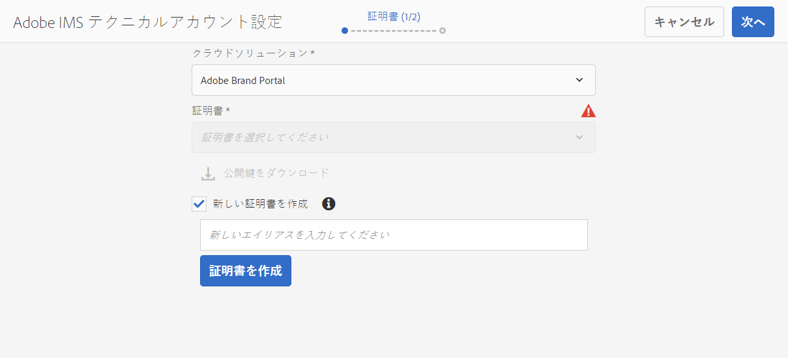
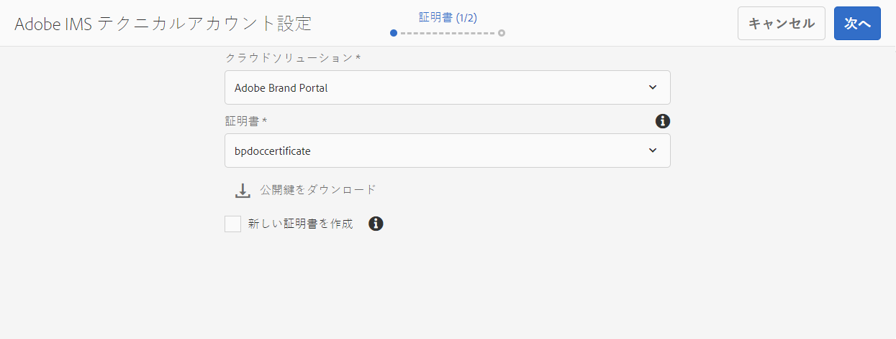
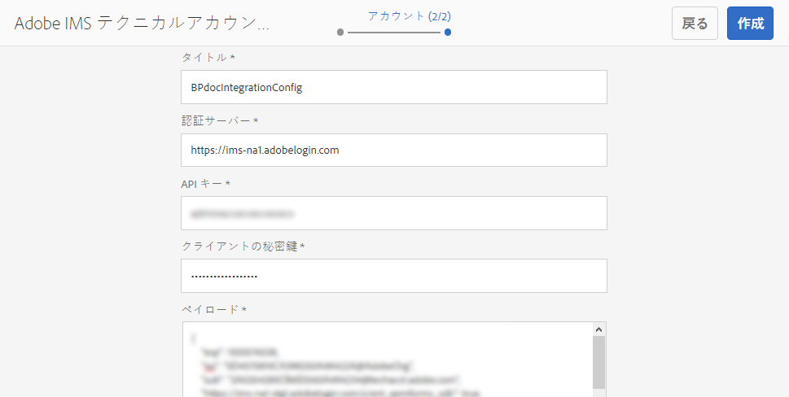
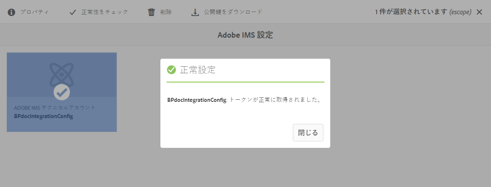
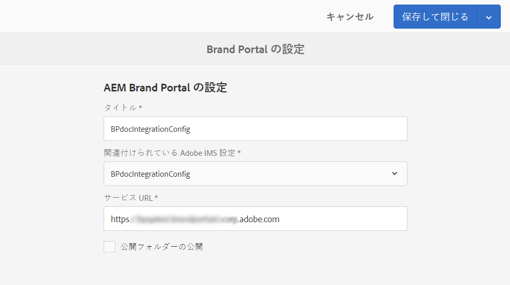
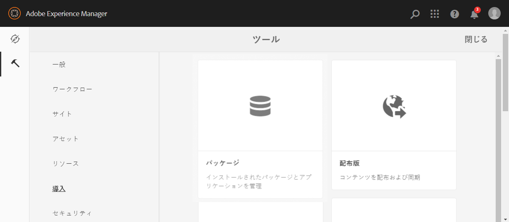
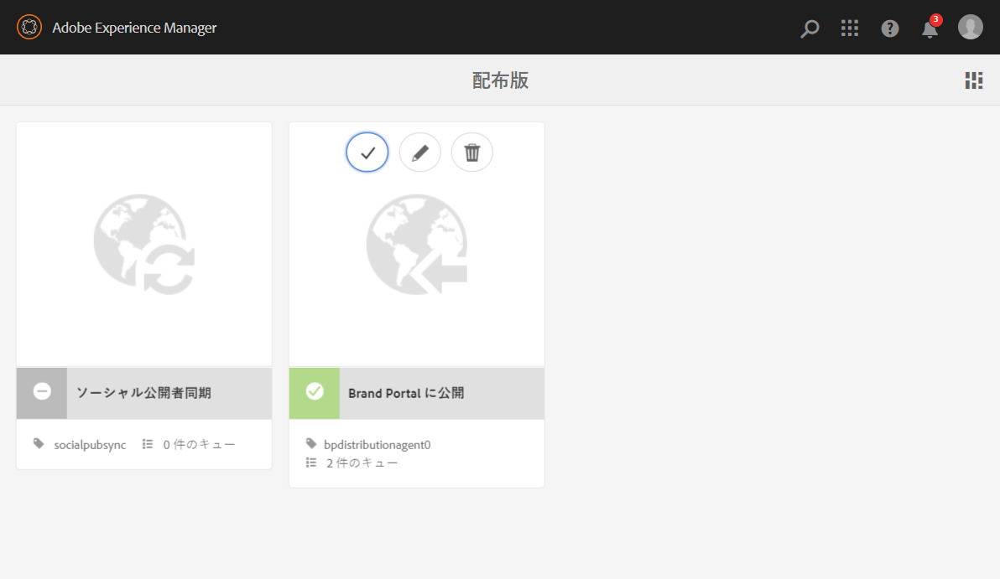
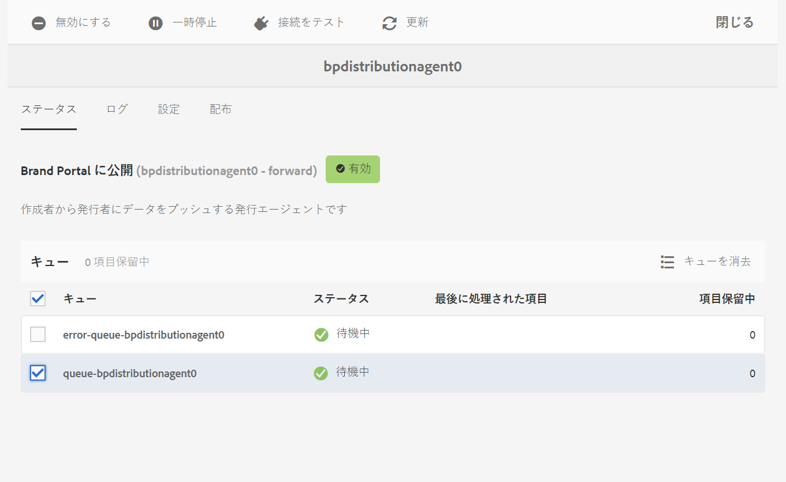
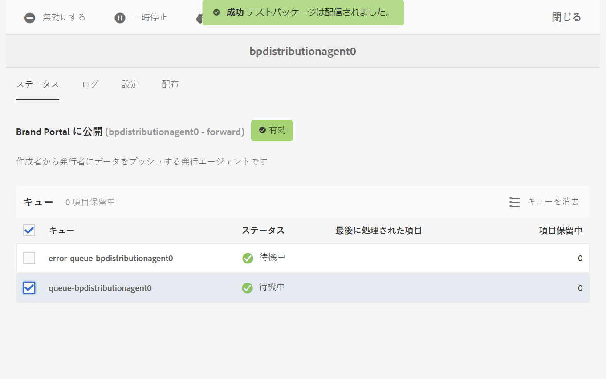
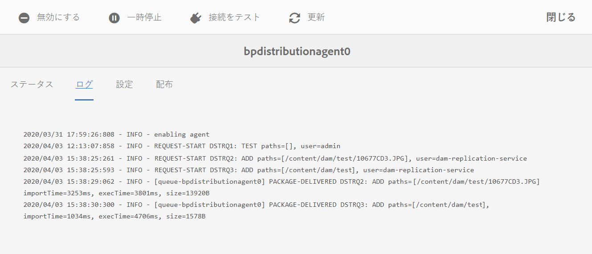

# Configure AEM Assets as a Cloud Service with Brand Portal {#configure-aem-assets-with-brand-portal}

Adobe Experience Managerアセットブランドポータルを設定すると、承認済みのブランドアセットをAdobe Experience ManagerアセットからCloud Serviceインスタンスとしてブランドポータルに発行し、ブランドポータルユーザーに配信できます。

**設定のワークフロー**

Cloud ServiceとしてのAEM Assetsは、Adobe開発者コンソールを介してBrand Portalで設定され、Brand Portalテナントの認証用にIMSトークンを調達します。 この機能を使用するには、AEM AssetsおよびAdobe開発者コンソールの両方の設定が必要です。

1. AEM Assetsで、AdobeIdentity Managementサービス(IMS)アカウントを作成し、公開鍵（証明書）を生成します。
1. Adobe 開発者コンソールで、Brand Portal テナント（組織）用のプロジェクトを作成します。
1. プロジェクトで、公開鍵を使用してAPIを設定し、サービスアカウント接続を作成します。
1. サービスアカウントの資格情報とJSON Web Token(JWT)ペイロード情報を取得します。
1. AEM Assetsで、サービスアカウント資格情報とJWTペイロードを使用してIMSアカウントを設定します。
1. AEM Assetsで、IMSアカウントとBrand Portalエンドポイント（組織URL）を使用してBrand Portalクラウドサービスを設定します。
1. AEM AssetsからBrand Portalにアセットを公開して、設定をテストします。

>[!NOTE]
>
>AEM Assetsインスタンスは、1人のBrand Portalテナントでのみ構成する必要があります。

## 前提条件 {#prerequisites}

AEM Assets と Brand Portal の連携を設定するには以下が必要です。

* Cloud ServiceインスタンスとしてのAEM Assetsの起動および実行
* Brand PortalテナントURL
* Brand PortalテナントのIMS組織に対するシステム管理者権限を持つユーザー

## 設定の作成 {#create-new-configuration}

指定したシーケンスで次の手順を実行して、ブランドポータルでAEM Assetsを設定します。

1. [公開証明書の取得](#public-certificate)
1. [サービスアカウント（JWT）接続の作成](#createnewintegration)
1. [IMS アカウントの設定](#create-ims-account-configuration)
1. [Cloud Service の設定](#configure-the-cloud-service)
1. [設定のテスト](#test-configuration)

### IMS 設定の作成 {#create-ims-configuration}

IMS設定は、Brand PortalテナントをAEM Assetsで認証します。

IMS 設定には、次の 2 つの手順が含まれます。

* [公開証明書の取得](#public-certificate)
* [IMS アカウントの設定](#create-ims-account-configuration)

### 公開証明書の取得 {#public-certificate}

公開証明書により、Adobe 開発者コンソールでプロファイルを認証できます。

1. AEM Assets にログインします。

1. From the **Tools** panel, navigate to **[!UICONTROL Security]** > **[!UICONTROL Adobe IMS Configurations]**.

1. Adobe IMS 設定ページで、「**[!UICONTROL 作成]**」をクリックします。It will redirect to the **[!UICONTROL Adobe IMS Technical Account Configuration]** page. デフォルトでは、「**証明書**」タブが開きます。

1. **[!UICONTROL Adobe Brand Portal]** クラウドソリューションを選択します。

1. 「 **[!UICONTROL 新しい証明書を]** 作成 **」チェックボックスをオンにし、公開鍵の** エイリアスを指定します。 エイリアスは、公開鍵の名前として機能します。

1. 「**[!UICONTROL 証明書を作成]**」をクリックします。Then, click **[!UICONTROL OK]** to generate the public key.

   

1. 「**[!UICONTROL 公開鍵をダウンロード]**」をクリックし、証明書（.crt）ファイルをローカルマシンに保存します。

   証明書ファイルは、後でBrand PortalテナントのAPIを設定し、Adobeデベロッパーコンソールでサービスアカウントの資格情報を生成するために使用されます。

   

1. 「**[!UICONTROL 次へ]**」をクリックします。

   「 **アカウント** 」タブで、AdobeIMSアカウントが作成されます。このアカウントには、Adobe開発者コンソールで生成されるサービスアカウント資格情報が必要です。 このページは開いたままにしておきます。

   新しいタブを開き、[Adobe 開発者コンソールでサービスアカウント（JWT）接続を作成](#createnewintegration)して、IMS アカウントを設定するための資格情報と JWT ペイロードを取得します。

### サービスアカウント（JWT）接続の作成 {#createnewintegration}

Adobeデベロッパーコンソールでは、プロジェクトとAPIはBrand Portalテナント（組織）レベルで設定されます。 APIを設定すると、サービスアカウント(JWT)接続が作成されます。 API を設定するには、キーペア（秘密鍵と公開鍵）を生成する方法と、公開鍵をアップロードする方法の 2 とおりがあります。Brand PortalでAEM Assetsを設定するには、AEM Assetsで公開証明書（公開鍵）を生成し、Adobeデベロッパーコンソールで公開鍵をアップロードして秘密鍵証明書を作成する必要があります。 この公開鍵は、選択したBrand PortalテナントのAPIを設定するために使用され、サービスアカウントの資格情報とJWTペイロードを生成します。 これらの資格情報は、AEM AssetsでIMSアカウントを設定するために必要です。 IMSアカウントを設定すると、AEM AssetsでBrand Portalクラウドサービスを設定できます。

サービスアカウント資格情報と JWT ペイロードを生成するには、次の手順を実行します。

1. IMS 組織（Brand Portal テナント）のシステム管理者権限で Adobe 開発者コンソールにログインします。デフォルトの URL は次のとおりです。 [https://www.adobe.com/go/devs_console_ui](https://www.adobe.com/go/devs_console_ui).

   >[!NOTE]
   >
   >右上隅にあるドロップダウン（組織）リストから正しいIMS組織（Brand Portalテナント）が選択されていることを確認します。

1. 「**[!UICONTROL 新規プロジェクトを作成]**」をクリックします。組織の空のプロジェクトが作成されます。

   「**[!UICONTROL プロジェクトを編集]**」をクリックして、「**[!UICONTROL プロジェクトタイトル]**」と「**[!UICONTROL 説明]**」を更新し、「**[!UICONTROL 保存]**」をクリックします。

1. In the **[!UICONTROL Project overview]** tab, click **[!UICONTROL Add API]**.

1. In the **[!UICONTROL Add an API window]**, select **[!UICONTROL AEM Brand Portal]** and click **[!UICONTROL Next]**.

   AEM Brand Portal サービスにアクセスできることを確認します。

1. In the **[!UICONTROL Configure API]** window, click **[!UICONTROL Upload your public key]**. 次に、「**[!UICONTROL ファイルを選択]**」をクリックし、[公開証明書の取得](#public-certificate)節でダウンロードした公開証明書（.crt ファイル）をアップロードします。

   「**[!UICONTROL 次へ]**」をクリックします。

   

1. 公開証明書を確認し、「**[!UICONTROL 次へ]**」をクリックします。

1. Select the default product profile **[!UICONTROL Assets Brand Portal]** and click **[!UICONTROL Save configured API]**.

   <!-- 
   In Brand Portal, a default profile is created for each organization. The Product Profiles are created in admin console for assigning users to groups (based on the roles and permissions). For configuration with Brand Portal, the OAuth token is created at organization level. Therefore, you must configure the default Product Profile for your organization. 
   -->

   

1. APIが設定されると、APIの概要ページにリダイレクトされます。 左側のナビゲーションツリーで「**[!UICONTROL 資格情報]**」の下の「**[!UICONTROL サービスアカウント（JWT）]**」をクリックします。

   >[!NOTE]
   >
   >秘密鍵証明書を表示し、JWTトークンの生成、秘密鍵証明書の詳細のコピー、クライアントシークレットの取得などの操作を実行できます。

1. 「**[!UICONTROL クライアント資格情報]**」タブから、**[!UICONTROL クライアント ID]** をコピーします。

   「**[!UICONTROL クライアント秘密鍵を取得]**」をクリックし、**[!UICONTROL クライアントの秘密鍵]**&#x200B;をコピーします。

   

1. 「**[!UICONTROL JWT を生成]**」タブに移動し、**[!UICONTROL JWT ペイロード]**&#x200B;をコピーします。

You can now use the client ID (API key), client secret, and JWT payload to [configure the IMS account](#create-ims-account-configuration) in AEM Assets.

<!--
1. Click **[!UICONTROL Create Integration]**.

1. Select **[!UICONTROL Access an API]**, and click **[!UICONTROL Continue]**.

   

1. Create a new integration page opens. 
   
   Select your organization from the drop-down list.

   In **[!UICONTROL Experience Cloud]**, Select **[!UICONTROL AEM Brand Portal]** and click **[!UICONTROL Continue]**. 

   If the Brand Portal option is disabled for you, ensure that you have selected correct organization from the drop-down box above the **[!UICONTROL Adobe Services]** option. If you do not know your organization, contact your administrator.

   

1. Specify a name and description for the integration. Click **[!UICONTROL Select a File from your computer]** and upload the `AEM-Adobe-IMS.crt` file downloaded in the [obtain public certificates](#public-certificate) section.

1. Select the profile of your organization. 

   Or, select the default profile **[!UICONTROL Assets Brand Portal]** and click **[!UICONTROL Create Integration]**. The integration is created.

1. Click **[!UICONTROL Continue to integration details]** to view the integration information. 

   Copy the **[!UICONTROL API Key]** 
   
   Click **[!UICONTROL Retrieve Client Secret]** and copy the Client Secret key.

   

1. Navigate to **[!UICONTROL JWT]** tab, and copy the **[!UICONTROL JWT payload]**.

   The API Key, Client Secret key, and JWT payload information will be used to create IMS account configuration.

-->

### IMS アカウントの設定 {#create-ims-account-configuration}

次の手順を実行したことを確認します。

* [公開証明書の取得](#public-certificate)
* [サービスアカウント（JWT）接続の作成](#createnewintegration)

次の手順を実行してIMSアカウントを設定します。

1. Open the IMS Configuration and navigate to the **[!UICONTROL Account]** tab. You kept the page open while [obtaining the public certificate](#public-certificate).

1. IMS アカウントの&#x200B;**[!UICONTROL タイトル]**&#x200B;を指定します。

   In the **[!UICONTROL Authorization Server]** field, specify the URL: [https://ims-na1.adobelogin.com/](https://ims-na1.adobelogin.com/)

   Specify client ID in the **[!UICONTROL API key]** field, **[!UICONTROL Client Secret]**, and **[!UICONTROL Payload]** (JWT payload) that you have copied while [creating the service account (JWT) connection](#createnewintegration).

   「**[!UICONTROL 作成]**」をクリックします。

   IMS アカウントが設定されます。

   

1. その IMS アカウント設定を選択し、「**[!UICONTROL ヘルスチェック]**」をクリックします。

   ダイアログボックスの「**[!UICONTROL チェック]**」をクリックします。正常に設定されると、*トークンが正常に取得されました*&#x200B;というメッセージが表示されます。

   

>[!CAUTION]
>
>IMS 設定は 1 つだけにする必要があります。
>
>IMS 設定がヘルスチェックに合格していることを確認します。設定がヘルスチェックに合格しない場合は無効です。削除して、新しい有効な設定を作成する必要があります。

### Cloud Service の設定{#configure-the-cloud-service}

Brand Portal Cloud Service を設定するには、次の手順を実行します。

1. AEM Assets にログインします。

1. **ツール**&#x200B;のパネルで、**[!UICONTROL Cloud Services]**／**[!UICONTROL AEM Brand Portal]** に移動します。

1. Brand Portal の設定ページで、「**[!UICONTROL 作成]**」をクリックします。

1. 設定の&#x200B;**[!UICONTROL タイトル]**&#x200B;を入力します。

   Select the IMS configuration that you created while [configuring the IMS account](#create-ims-account-configuration).

   In the **[!UICONTROL Service URL]** field, specify your Brand Portal tenant (organization) URL.

   

1. 「**[!UICONTROL 保存して閉じる]**」をクリックします。クラウド設定が作成されます。

   Cloud ServiceインスタンスとしてのAEM AssetsがBrand Portalテナントと共に構成されました。

### 設定のテスト{#test-configuration}

設定を検証するには、次の手順を実行します。

1. AEM Assets にログインします。

1. **ツール** パネルで、 **[!UICONTROL デプロイメント]** / **[!UICONTROL 配布に移動します]**。

   

   A Brand Portal distribution agent (**[!UICONTROL bpdistributionagent0]**) is created under **[!UICONTROL Publish to Brand Portal]**.

   

   >[!NOTE]
   >
   >デフォルトでは、Brand Portal テナント用に 1 つの配布エージェントが作成されます。

1. 「ブランドポータルに **[!UICONTROL 公開]** 」をクリックして、配布エージェントを開きます。

   「 **[!UICONTROL ステータス]** 」タブに配布キューが表示されます。

   配布エージェントには、次の 2 つのキューが含まれます。
   * **processing-queue**：Brand Portal へのアセット配布用。

   * **error-queue**：配布が失敗したアセット用。
   >[!NOTE]
   >
   >エラーを確認し、**error-queue** を定期的に消去することをお勧めします。

   

1. Cloud ServiceとしてのAEM AssetsとBrand Portalの間の接続を確認するには、「接続を **[!UICONTROL テスト]** 」アイコンをクリックします。

   

   A message appears at the bottom of the page that your *test package is successfully delivered*.

   >[!NOTE]
   >
   >配布エージェントを無効にしないでください。無効にすると、（実行中のキュー内の）アセットの配布が失敗する可能性があります。

次の操作が可能になりました。

* [AEM Assets から Brand Portal へのアセットの公開](publish-to-brand-portal.md)
* [AEM Assets から Brand Portal へのフォルダーの公開](publish-to-brand-portal.md#publish-folders-to-brand-portal)
* [AEM Assets から Brand Portal へのコレクションの公開](publish-to-brand-portal.md#publish-collections-to-brand-portal)

* [Brand Portal へのプリセット、スキーマ、ファセットの公開](https://docs.adobe.com/content/help/ja-JP/experience-manager-brand-portal/using/publish/publish-schema-search-facets-presets.html)
* [Brand Portal へのタグの公開](https://docs.adobe.com/content/help/ja-JP/experience-manager-brand-portal/using/publish/brand-portal-publish-tags.html)

See [Brand Portal documentation](https://docs.adobe.com/content/help/ja-JP/experience-manager-brand-portal/using/home.html) for more information.

## 配布ログ {#distribution-logs}

配布エージェントのログで、アセット発行ワークフローを監視できます。

例えば、AEM Assets から Brand Portal にアセットを発行し、設定を検証したとします。

1. [設定のテスト](#test-configuration)節で示した手順（1～4）に従い、配布エージェントページに移動します。

1. 「 **[!UICONTROL ログ]** 」をクリックして、処理ログとエラーログを表示します。

   

配布エージェントは次のログを生成します。

* 情報：これは、配布エージェントの設定が成功した場合にトリガーされる、システム生成ログです。
* DSTRQ1（リクエスト 1）：テスト接続時にトリガーされます。

アセットの公開時に、次の要求および応答ログが生成されます。

**配布エージェントの要求**：
* DSTRQ2（リクエスト 2）：アセットの公開リクエストがトリガーされます。
* DSTRQ3 （リクエスト3）:システムは、（アセットが存在する）AEM Assetsフォルダーの発行と、Brand Portal内のフォルダーの複製を行うための別の要求をトリガーします。

**配布エージェントの応答**：
* queue-bpdistributionagent0（DSTRQ2）：アセットが Brand Portal に公開されます。
* queue-bpdistributionagent0(DSTRQ3):システムは、（アセットを含む）AEM AssetsフォルダーをBrand Portalに複製します。

上記の例では、追加のリクエストと応答がトリガーされます。 アセットが初めて公開されたので、Brand Portalで親フォルダー(追加パス)が見つからなかったため、アセットが公開されるBrand Portalで同じ名前の親フォルダーを作成する追加の要求がトリガーされました。

>[!NOTE]
>
>親フォルダーがBrand Portalに存在しない場合や、AEM Assetsで変更された場合に備えて、追加のリクエストが生成されます。

<!--

## Additional information {#additional-information}

Go to `/system/console/slingmetrics` for statistics related to the distributed content:

1. **Counter metrics**
   * sling: `mac_sync_request_failure`
   * sling: `mac_sync_request_received`
   * sling: `mac_sync_request_success`

1. **Time metrics**
   * sling: `mac_sync_distribution_duration`
   * sling: `mac_sync_enqueue_package_duration`
   * sling: `mac_sync_setup_request_duration`

-->

<!--
   Comment Type: draft

   <li> </li>
   -->

<!--
   Comment Type: draft

   <li>Step text</li>
   -->
