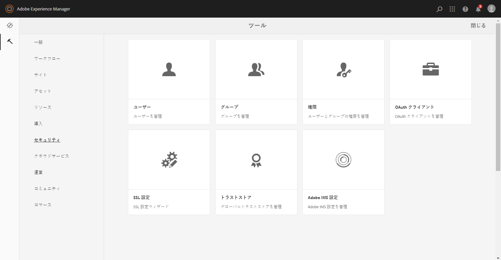

# AEM Assets と Brand Portal の連携の設定 {#configure-aem-assets-with-brand-portal}

Adobe Experience Manager(AEM)Assetsは、Adobe Developer Consoleを介してBrand Portalで設定され、Brand Portalテナントの認証用にIMSトークンを取得します。

**設定の仕組み**

AEM AssetsクラウドインスタンスをBrand Portalテナント（組織）と共に設定するプロセスは、AEM AssetsクラウドインスタンスとAdobe Developer Consoleの両方の設定を必要とする複数の手順で構成します。

1. AEM Assetsクラウドインスタンスで、IMSアカウントを作成し、公開証明書（公開鍵）を生成します。
1. Adobe Developer Consoleで、Brand Portalテナント（組織）用のプロジェクトを作成します。
1. プロジェクトで、公開鍵を使用してAPIを設定し、サービスアカウント(JWT)接続を作成します。
1. サービスアカウントの資格情報とJWTペイロード情報を取得します。
1. AEM Assetsクラウドインスタンスで、サービスアカウントの資格情報とJWTペイロードを使用してIMSアカウントを設定します。
1. AEM Assetsクラウドインスタンスで、IMSアカウントとブランドポータルエンドポイント（組織URL）を使用してBrand Portalクラウドサービスを設定します。
1. AEM AssetsクラウドインスタンスからBrand Portalにアセットを公開して、設定をテストします。

>[!NOTE]
>>Brand Portalテナントは、1つのAEM Assetsクラウドインスタンスでのみ設定する必要があります。
>>複数のAEM Assetsクラウドインスタンスを使用してBrand Portalテナントを設定しない。
>

## 前提条件 {#prerequisites}

AEM Assets と Brand Portal の連携を設定するには以下が必要です。

* AEM Assets クラウドインスタンスの起動および実行
* Brand Portal テナント URL
* Brand Portal テナントの IMS 組織に対するシステム管理者権限を持つユーザー

**詳しいクエリについては、カスタマーケアにお問い合わせ** ください。

## 設定の作成 {#create-new-configuration}

指定した順序で次の手順を実行し、AEM Assetsクラウドインスタンスをブランドポータルに設定します。

1. [公開証明書の取得](#public-certificate)
1. [サービスアカウント(JWT)接続の作成](#createnewintegration)
1. [IMSアカウントの設定](#create-ims-account-configuration)
1. [Cloud Service の設定](#configure-the-cloud-service)
1. [設定のテスト](#test-configuration)

### IMS 設定の作成 {#create-ims-configuration}

IMS 設定は、AEM Assets オーサーインスタンスを使用して Brand Portal テナントを認証します。

IMS 設定には、次の 2 つの手順が含まれます。

* [公開証明書の取得](#public-certificate)
* [IMSアカウントの設定](#create-ims-account-configuration)

### 公開証明書の取得 {#public-certificate}

公開証明書を使用すると、Adobe Developer Consoleでプロファイルを認証できます。

1. AEM Assetsクラウドインスタンスにログインします。

1. **ツール**パネルより、**[!UICONTROL セキュリティ]**／**[!UICONTROL Adobe IMS 設定]**&#x200B;に移動します。

   

1. Adobe IMS設定ページで、「 **[!UICONTROL 作成]**」をクリックします。

1. 「 **[!UICONTROL Adobe IMSテクニカルアカウント設定]** 」ページにリダイレクトされます。 By default, the **Certificate** tab opens.

   クラウドソリューションの **[!UICONTROL Adobe Brand Portalを選択します]**。

1. 「**[!UICONTROL 新しい証明書を作成]**」チェックボックスをチェックし、証明書の&#x200B;**エイリアス**&#x200B;を指定します。ここで入力したエイリアスが、ダイアログ名として表示されます。

1. 「**[!UICONTROL 証明書を作成]**」をクリックします。次に、ダイアログボックスで **[!UICONTROL 「OK]** 」をクリックして、公開証明書を生成します。

   

1. Click **[!UICONTROL Download Public Key]** and save the certificate (.crt) file on your machine.

   この証明書ファイルは、Brand PortalテナントのAPIを設定し、Adobe Developer Consoleでサービスアカウントの資格情報を生成するための追加の手順で使用されます。

   

1. 「**[!UICONTROL 次へ]**」をクリックします。

   「 **アカウント** 」タブでAdobe IMSアカウントを作成しますが、作成するにはAdobe Developer Consoleで生成されるサービスアカウント資格情報が必要です。 このページは開いたままにしておきます。

   新しいタブを開き、Adobe Developer Consoleでサービスアカウント(JWT)接続を  作成して、IMSアカウントを設定するための秘密鍵証明書とJWTペイロードを取得します。

### サービスアカウント(JWT)接続の作成 {#createnewintegration}

Adobe Developer Consoleでは、プロジェクトとAPIは組織（Brand Portalテナント）レベルで設定されます。 APIを設定すると、Adobe Developer Consoleでサービスアカウント(JWT)接続が作成されます。 キーペア（秘密鍵と公開鍵）を生成するか、公開鍵をアップロードして、APIを設定する方法は2つあります。 Brand PortalでAEM Assetsクラウドインスタンスを設定するには、AEM Assetsクラウドインスタンスで公開証明書（公開鍵）を生成し、公開鍵をアップロードしてAdobe Developer Consoleで秘密鍵証明書を作成する必要があります。 この公開鍵は、選択したブランドポータル組織のAPIを設定するために使用され、サービスアカウントの資格情報とJWTペイロードを生成します。 これらの資格情報は、AEM AssetsクラウドインスタンスでIMSアカウントを設定する際にさらに使用されます。 IMSアカウントを設定すると、AEM AssetsクラウドインスタンスでBrand Portalクラウドサービスを設定できます。

次の手順を実行して、サービスアカウント資格情報とJWTペイロードを生成します。

1. IMS組織（Brand Portalテナント）のシステム管理者権限でAdobe Developer Consoleにログインします。 デフォルトのURLは

   [https://www.adobe.com/go/devs_console_ui](https://www.adobe.com/go/devs_console_ui)

   >[!NOTE]
   >
   >右上隅にあるドロップダウン(組織リスト)から正しいIMS組織（Brand Portalテナント）が選択されていることを確認します。

1. Click **[!UICONTROL Create new project]**. 組織用に空のプロジェクトが作成されます。

   「 **[!UICONTROL プロジェクトの編集]** 」をクリックして、 **[!UICONTROL プロジェクトタイトル]** と **[!UICONTROL 説明を更新し、「保存と]******&#x200B;保存」をクリックします。

   

1. 「プロジェクトの概要」タブで、「 **[!UICONTROL 追加API]**」をクリックします。

   

1. API追加ウィンドウで、「 **[!UICONTROL AEM Brand Portal]** 」を選択し、「 **[!UICONTROL 次へ]**」をクリックします。

   AEM Brand Portalサービスにアクセスできることを確認します。

1. APIを設定ウィンドウで、「公開鍵を **[!UICONTROL アップロード]**」をクリックします。 次に、「ファイルを **[!UICONTROL 選択]** 」をクリックし、「公開証明書を [取得](#public-certificate) 」セクションでダウンロードした公開証明書（.crtファイル）をアップロードします。

   「**[!UICONTROL 次へ]**」をクリックします。

   

1. 公開証明書を確認し、「 **[!UICONTROL 次へ]**」をクリックします。

1. Brand Portalでは、組織ごとにデフォルトのプロファイルが作成されます。 製品プロファイルは、（ロールと権限に基づいて）グループにユーザーを割り当てるために、管理コンソールで作成されます。 Brand Portalを使用した設定の場合、OAuthトークンは組織レベルで作成されます。 したがって、組織のデフォルトの製品プロファイルを設定する必要があります。

   デフォルトの製品プロファイル **[!UICONTROL アセットのブランドポータル]**&#x200B;を選択します。

   

1. APIが設定されている場合、APIの概要にリダイレクトされます。 左側のナビゲーションの「 **[!UICONTROL 資格情報]**」で、「 **[!UICONTROL サービスアカウント(JWT)」をクリックし]**&#x200B;ます。

   >[!NOTE]
   >
   >必要に応じて、秘密鍵証明書を表示し、その他の操作（JWTトークンの生成、秘密鍵証明書の詳細のコピー、クライアントシークレットの取得など）を実行できます。

1. 「 **[!UICONTROL Client Credentials]** 」タブで、 **[!UICONTROL クライアントIDをコピーします]**。

   Click **[!UICONTROL Retrieve Client Secret]** and copy the **[!UICONTROL client secret]**.

   

1. Navigate to the **[!UICONTROL Generate JWT]** tab and copy the **[!UICONTROL JWT Payload]**.

クライアントID（APIキー）、クライアントシークレットおよびJWTペイロードを使用して、AEM AssetsクラウドインスタンスでIMSアカウント [を](#create-ims-account-configuration) 設定できるようになりました。

<!--
1. Click **[!UICONTROL Create Integration]**.

1. Select **[!UICONTROL Access an API]**, and click **[!UICONTROL Continue]**.

   

1. Create a new integration page opens. 
   
   Select your organization from the drop-down list.

   In **[!UICONTROL Experience Cloud]**, Select **[!UICONTROL AEM Brand Portal]** and click **[!UICONTROL Continue]**. 

   If the Brand Portal option is disabled for you, ensure that you have selected correct organization from the drop-down box above the **[!UICONTROL Adobe Services]** option. If you do not know your organization, contact your administrator.

   

1. Specify a name and description for the integration. Click **[!UICONTROL Select a File from your computer]** and upload the `AEM-Adobe-IMS.crt` file downloaded in the [obtain public certificates](#public-certificate) section.

1. Select the profile of your organization. 

   Or, select the default profile **[!UICONTROL Assets Brand Portal]** and click **[!UICONTROL Create Integration]**. The integration is created.

1. Click **[!UICONTROL Continue to integration details]** to view the integration information. 

   Copy the **[!UICONTROL API Key]** 
   
   Click **[!UICONTROL Retrieve Client Secret]** and copy the Client Secret key.

   

1. Navigate to **[!UICONTROL JWT]** tab, and copy the **[!UICONTROL JWT payload]**.

   The API Key, Client Secret key, and JWT payload information will be used to create IMS account configuration.

-->

### IMSアカウントの設定 {#create-ims-account-configuration}

次の手順を実行したことを確認します。

* [公開証明書の取得](#public-certificate)
* [サービスアカウント(JWT)接続の作成](#createnewintegration)

次の手順を実行して、公開証明書を [取得して作成したIMSアカウントを設定します](#public-certificate)。

1. IMS設定を開き、「 **[!UICONTROL アカウント]** 」タブに移動します。 公開証明書の [取得中も、ページを開いたままでした](#public-certificate)。

1. IMS アカウントの&#x200B;**[!UICONTROL タイトル]**&#x200B;を指定します。

   「**[!UICONTROL 認証サーバー]**」に次の URL を入力します。[https://ims-na1.adobelogin.com/](https://ims-na1.adobelogin.com/)

   サービスアカウント(JWT)接続の [作成中にコピーしたAPIキー、クライアントシークレット、およびJWTペイロードにクライアントIDを貼り付け](#createnewintegration)ます。

   「**[!UICONTROL 作成]**」をクリックします。

   IMSアカウントが設定されている。

   

1. Select the IMS account configuration and click **[!UICONTROL Check Health]**.

   ダイアログボックスで **[!UICONTROL 「チェック]** 」をクリックします。 設定が成功すると、 *トークンが正常に取得されたことを示すメッセージが表示されます*。

   

>[!CAUTION]
>
>IMS 設定は 1 つだけにする必要があります。複数の IMS 設定を作成しないでください。
>
>IMS 設定がヘルスチェックに合格していることを確認します。設定がヘルスチェックに合格しない場合は無効です。削除して、新しい有効な設定を作成する必要があります。

### Cloud Service の設定{#configure-the-cloud-service}

次の手順を実行して、ブランドポータルクラウドサービスを設定します。

1. AEM Assetsクラウドインスタンスにログインします。

1. **ツール**パネルで、**[!UICONTROL Cloud Services]**／**[!UICONTROL AEM Brand Portal]** に移動します。

1. Brand Portal Configurationsページで、「 **[!UICONTROL 作成]**」をクリックします。

1. 設定の&#x200B;**[!UICONTROL タイトル]**&#x200B;を入力します。

   IMSアカウントの [設定時に作成したIMS設定を選択します](#create-ims-account-configuration)。

   In the **[!UICONTROL Service URL]**, enter your Brand Portal tenant (organization URL).

   

1. 「**[!UICONTROL 保存して閉じる]**」をクリックします。クラウド設定が作成されます。AEM Assets クラウドインスタンスが Brand Portal テナントで設定されました。

### 設定のテスト{#test-configuration}

次の手順を実行して設定を検証します。

1. AEM Assetsクラウドインスタンスにログインします。

1. **ツール**パネルで、**[!UICONTROL デプロイメント]**／**[!UICONTROL 配布]**&#x200B;に移動します。

   

1. 配布ページでは、「ブランドポータルに `bpdistributionagent0` 公開 ****」用にBrand Portal配布エージェントが作成されていることを確認できます。

   「**[!UICONTROL Brand Portal に公開]**」をクリックします。

   

   >[!NOTE]
   >
   >デフォルトでは、Brand Portal テナント用に 1 つの配布エージェントが作成されます。

1. 配布エージェントページの「 **[!UICONTROL ステータス]** 」タブには、配布キューが表示されます。

   配布エージェントには、次の 2 つのキューが含まれます。
   * **processing-queue**：Brand Portal へのアセット配布用。

   * **error-queue**：配布が失敗したアセット用。
   >[!NOTE]
   >
   >エラーを確認し、**error-queue** を定期的に消去することをお勧めします。

   

1. AEM Assets と Brand Portal の間の接続を検証するには、「**[!UICONTROL 接続をテスト]**」をクリックします。

   

   テストパッケージが正常に配信されたことを示すメッセージがページの下部に表示されます。

   >[!NOTE]
   >
   >配布エージェントを無効にしないでください。無効にすると、（実行中のキュー内の）アセットの配布が失敗する可能性があります。

AEM Assets クラウドインスタンスが Brand Portal で正常に設定され、次の操作が可能になりました。

* [AEM Assets から Brand Portal へのアセットの公開](publish-to-brand-portal.md)
* [AEM Assets から Brand Portal へのフォルダーの公開](publish-to-brand-portal.md#publish-folders-to-brand-portal)
* [AEM Assets から Brand Portal へのコレクションの公開](publish-to-brand-portal.md#publish-collections-to-brand-portal)

上記に加えて、AEM Assets のメタデータスキーマ、画像プリセット、検索ファセット、タグを Brand Portal に公開することもできます。

* [Brand Portal へのプリセット、スキーマ、ファセットの公開](https://docs.adobe.com/content/help/ja-JP/experience-manager-brand-portal/using/publish/publish-schema-search-facets-presets.html)
* [Brand Portal へのタグの公開](https://docs.adobe.com/content/help/ja-JP/experience-manager-brand-portal/using/publish/brand-portal-publish-tags.html)

詳しくは、[Brand Portal ドキュメント](https://docs.adobe.com/content/help/ja-JP/experience-manager-brand-portal/using/home.html)を参照してください。

## 配布ログ {#distribution-logs}

ログを確認して、配布エージェントが実行するアクションの詳細情報を確認できます。

例えば、AEM AssetsからBrand Portalにアセットを発行して設定を検証したとします。

1. Follow the steps (from 1 to 4) as shown in **[!UICONTROL Test Connection]** and navigate to the distribution agent page.

1. 「**[!UICONTROL ログ]**」をクリックして、配布ログを表示します。処理ログとエラーログは、ここで確認できます。

   

配布エージェントは次のログを生成します。

* 情報：これは、構成が正常に完了したときにトリガーされるシステムが生成するログで、配布エージェントを有効にします。
* DSTRQ1（リクエスト 1）：テスト接続時にトリガーされます。

アセットの公開時に、次の要求および応答ログが生成されます。

**配布エージェントの要求**：
* DSTRQ2（リクエスト 2）：アセットの発行要求がトリガーされます。
* DSTRQ3（リクエスト 3）：アセットが存在するフォルダーの公開と、Brand Portal でのフォルダーの複製をおこなう別の要求がトリガーされます。

**配布エージェントの応答**：
* queue-bpdistributionagent0（DSTRQ2）：アセットが Brand Portal に公開されます。
* queue-bpdistributionagent0（DSTRQ3）：システムは、Brand Portal 内のアセットを含むフォルダーを複製します。

上記の例では、追加の要求と応答がトリガーされます。アセットが初めて発行されたので、Brand Portal で親フォルダ（追加パス）が見つからなかったため、アセットが発行された Brand Portal で同じ名前の親フォルダを作成する追加の要求をトリガーします。

>[!NOTE]
>
>親フォルダーが Brand Portal に存在しない場合（上記の例）、または親フォルダーが AEM Assets で変更された場合に、追加のリクエストが生成されます。

<!--

## Additional information {#additional-information}

Go to `/system/console/slingmetrics` for statistics related to the distributed content:

1. **Counter metrics**
   * sling: `mac_sync_request_failure`
   * sling: `mac_sync_request_received`
   * sling: `mac_sync_request_success`

1. **Time metrics**
   * sling: `mac_sync_distribution_duration`
   * sling: `mac_sync_enqueue_package_duration`
   * sling: `mac_sync_setup_request_duration`

-->

<!--
   Comment Type: draft

   <li> </li>
   -->

<!--
   Comment Type: draft

   <li>Step text</li>
   -->
